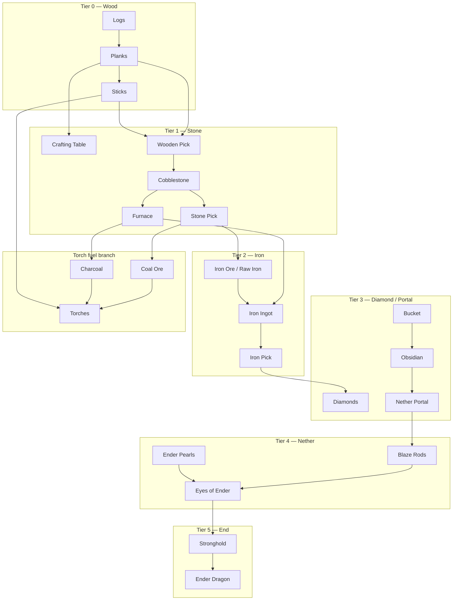

# RFC: Vanilla autonomous progression (PlayerMob survival → endgame)

## RFC Identity

| Field | Value |
| --- | --- |
| **Project root** | `d:\Apps\Minecraft Port\Projects\SPMScavenger-1.21.1-Fabric` |
| **Host platform** | Social Player Mobs (`playermob`) v0.86.0 — reference `Projects/references/SocialPlayerMobs-v0.86.0/` |
| **Target progression** | **Vanilla Minecraft 1.21.1** survival (not a third-party tech mod) |
| **Scope** | Autonomous progression architecture plus narrowly authorized repairs to existing survival executors |
| **Mode** | `WORKING_FROM_PLAN` — Shelter Commitment Resume Repair (`SCR-1`) authorized |
| **Status** | `RESEARCHING`; `SCR-1 IMPLEMENTED / STATIC VERIFIED / RUNTIME PENDING` as a prerequisite before Opinion Task 42B |
| **User constraint** | The RFC was originally design-only; on 2026-08-11 the user explicitly authorized only `SCR-1`, its focused build/tests, and the occupied-bed/closed-door runtime test |
| **Related** | `RFC-TOOL-TIER-UPGRADES.md`, `RFC-FURNACE-SMELTING.md`; stubs `progression/ProgressGoal.java`, `progression/TaskLifecycle.java` |
| **Owners** | User (product); architecture TBD |
| **Last update** | 2026-08-11 |
| **Gate** | MRFC-1 |

### Naming note

“Interactive Player Mobs” in the user brief maps to **Social Player Mobs** (`games.brennan.playermob`). No separate “Interactive Player Mobs” mod exists in this workspace (`CONFIRMED` — reference tree is `SocialPlayerMobs-v0.86.0`).

---

## Executive Summary

Vanilla survival progression is a **recipe- and gate-driven dependency graph**, not a linear script. Social Player Mobs already provides **combat, scavenging, foraging, container looting, equipment evaluation, and social behaviour** in ordinary worlds. It does **not** provide autonomous mining, crafting, smelting, structure navigation, dimension progression, or boss fights (`CONFIRMED` — `PlayerMobEntity#registerGoals`, `ForagePolicy` issue #5 deferral, no craft/smelting goals in SPM source).

**SPM Scavenger** (`spmscavenger`) is the correct integration surface: a PolyForm-safe compatibility addon that attaches goals on `ENTITY_LOAD` without compiling against SPM (`CONFIRMED` — `SpmScavenger.java`, `PlayerMobs.java`).

**Recommended architecture (D-VP-001, aligns with D-TTU-017):**

```text
ProgressGoal (user/config target)
  → RequirementResolver (backward chain from live RecipeManager + tool gates)
  → WorkDemandPolicy (pure, unit-testable “what is missing?”)
  → Existing executors (Gather / Craft / Smelt / Place / Combat / …)
  → TaskLifecycle (RUNNING | SUCCESS | FAILURE | BLOCKED | INTERRUPTED | RETRY)
```

**Do not** ship one giant scripted sequence or a full GOAP/HTN planner in generation one (`CONSENSUS` — `RFC-TOOL-TIER-UPGRADES.md` D-TTU-017). Recursive prerequisite resolution is implemented as **bounded backward chaining** over a finite node catalog, not open-ended search.

**Practical endgame ceiling (honest):** autonomous **torch + stone/iron tool loop** is **PARTIAL / achievable** with current RFC children. Autonomous **Nether → Blaze → Eyes → Stronghold → Dragon** is **NOT PRACTICAL** without major new systems (structure discovery, portal construction, boss arenas, 36-slot logistics). Label per-phase feasibility below.

---

## Collaboration Protocol

- Planning trigger authorizes this RFC only — not implementation, Minecraft launch, commit, or push.
- Evidence labels: `CONFIRMED` / `INFERRED` / `UNVERIFIED` per Gate AV-1.
- Implementation claims require build or runtime proof; this document is design-only.

---

## Topic: Vanilla progression dependency graph

### Evidence basis (`CONFIRMED`)

Progression edges are derived from **Minecraft 1.21.1 packaged data**, not item-name guessing:

| Mechanism | Source |
| --- | --- |
| Crafting recipes | `RecipeType.CRAFTING` via `RecipeManager` |
| Smelting / blasting | `RecipeType.SMELTING`, `BLASTING` |
| Tool harvest levels | `TieredItem` / block `requiresCorrectToolForDrops()` |
| Dimension gates | Portal blocks, `DimensionType`, boss entity registrations |
| Advancements | `data/minecraft/advancement/**` (ordering hints, not AI oracle) |

### Tier 0 — Spawn affordances (no station)

| Node | Requires | Unlocks |
| --- | --- | --- |
| Logs | Punch / axe | Planks |
| Planks | Logs | Sticks, crafting table (2×2) |
| Sticks | Planks | Tools (with table), torches (with fuel) |
| Fuel (coal **or** charcoal) | Coal ore **or** furnace+log | Torches |
| Torches | Fuel + sticks | Light, hostile control (`PlaceTorchGoal`) |

### Tier 1 — Surface stone age

| Node | Requires | Unlocks |
| --- | --- | --- |
| Crafting table | 4 planks | 3×3 crafts |
| Wooden pickaxe | Table + planks + sticks | Cobble from stone |
| Cobblestone | Stone mining | Stone tools, furnace |
| Stone pickaxe | Table + cobble + sticks | Coal ore, iron ore (drops raw) |
| Furnace | 8 cobble (table) | Smelting |
| Charcoal | Furnace + 2× surplus logs | Torch fuel without coal ore |

**Scavenger today:** Tier 0–1 **mostly implemented** (`CODE_CONFIRMED` — `ScavengerCrafting`, `GatherResourcesGoal`, `CraftTorchesGoal`, `SmeltAtFurnaceGoal`, `ToolTierPolicy` stone cap).

### Tier 2 — Iron age

| Node | Requires | Unlocks |
| --- | --- | --- |
| Iron ore / raw iron | Stone pick + mining | Smelt input |
| Iron ingot | Furnace + fuel | Iron tools, bucket, shield, flint+steel |
| Iron pickaxe | Table + ingots + sticks | Diamond ore, gold ore, lapis, redstone |
| Bucket | Table + iron | Water placement, lava pickup |
| Shield | Table + iron + planks | Ranged mitigation (SPM `BlockArrowsGoal` exists) |

**Scavenger today:** Smelt path `CODE_CONFIRMED`; iron **craft/gather** `PLANNING` (`RFC-TOOL-TIER-UPGRADES` Phase 2).

### Tier 3 — Diamond / overworld power

| Node | Requires | Unlocks |
| --- | --- | --- |
| Diamonds | Iron pick + deep mining (Y≈-59) | Diamond tools, enchanting table |
| Enchanting table | Diamonds + obsidian + book | Gear scaling |
| Obsidian | Water + lava contact | Nether portal frame |
| Nether portal | 10+ obsidian + flint&steel | Nether dimension |

**Scavenger today:** **Absent** — no branch mining, no lava/water casting, no enchanting interaction.

### Tier 4 — Nether

| Node | Requires | Unlocks |
| --- | --- | --- |
| Nether access | Portal | Nether resources |
| Netherrack / digging | Any pick | Mobility |
| Blaze rods | Fortress + blaze combat | Brewing, eyes of ender |
| Ender pearls | Piglin barter **or** endermen farm | Eye crafting |
| Eyes of ender | Pearls + blaze powder | Stronghold triangulation |

**SPM today:** Combat primitives exist; **no fortress navigation, bartering, or eye throwing** (`CONFIRMED` gaps).

### Tier 5 — End (practical survival endgame)

| Node | Requires | Unlocks |
| --- | --- | --- |
| Stronghold | Eyes of ender + structure discovery | End portal frame |
| End portal | 12 eyes placed | The End |
| Ender dragon | Ranged + melee + crystal denial | Dragon egg, gateway |

**SPM today:** `EndCrystalCombatGoal` is PvP-style crystal PvP, not dragon fight AI (`CONFIRMED` — combat goal scope).

### Consolidated dependency graph (high level)



### Coal vs charcoal branch (`CONFIRMED` product behaviour)

In coal-rich overworld, mobs **skip furnace for torches** and mine coal directly (`RFC-FURNACE-SMELTING.md` scenario parity). Furnace is the **fallback** when `coal == 0 && charcoal == 0` and torch stock is below target.

---

## Topic: Autonomous prerequisite planning

### Design pattern (not a monolithic script)

```text
ProgressGoal (config / survival profile)
    ↓
RequirementResolver.resolve(goal, backpack, worldFacts)
    ↓
Missing leaf OR satisfied?
    ├─ satisfied → SUCCESS (re-evaluate parent)
    └─ missing   → WorkDemand (typed) → map to executor goal
            ↓
        Executor runs until TaskLifecycle terminal
            ↓
        Invalidate demand cache; resume parent
```

### Feasibility constraint on `RequirementResolver` (`CODE_CONFIRMED`, Agent_Claude, snapshot 17:50)

**Backward chaining from a live `RecipeManager` cannot be built as written.** 1.21.1's
`RecipeManager` exposes only **input-driven** lookups — `getRecipeFor`, `getRecipesFor`,
`getAllRecipesFor(type)`, `byKey`. There is **no reverse index by output**. Asking "what makes an
`IRON_PICKAXE`?" therefore means iterating `getRecipes()` and matching
`getResultItem(registryAccess())` — O(all recipes), 5,000–20,000+ in a modded pack, per query, per
mob, recursively.

That is viable only as a **built index**, not a live query:

- `RecipeManager extends SimpleJsonResourceReloadListener`, so build `Map<Item, List<RecipeHolder<?>>>`
  once per recipe reload and share **one immutable copy** across all mobs;
- recursive resolution additionally needs **cycle detection** (`iron_ingot → iron_block → 9 iron_ingot`),
  a **depth bound**, and **memoisation**, or a modded pack overflows the stack or explodes
  combinatorially.

This affects **phase 0a**, which lists `RequirementResolver` as a `FULL` deliverable. The index is
part of that deliverable, not an implementation detail discovered later.

Full derivation and the options table live in `RFC-FURNACE-SMELTING.md` **D-FSM-010**; this is a
pointer, not a second copy.

### Overlap warning — two demand records are being specified in parallel

`WorkDemand` here and `MaterialDemand` in `RFC-FURNACE-SMELTING.md` D-FSM-010 are converging on the
same concept from opposite ends, and neither RFC currently references the other's record. Before
either ships, decide whether they are one type or two with a stated boundary. D-FSM-010 already
locked three constraints that apply to any such record and should not be re-derived here:

1. the material key must carry **tags**, not just items (recipe ingredients are `Ingredient`);
2. urgency must **derive** from the demand class, not sit beside it as an independent field;
3. deficit is **computed per evaluation, never stored** — a latched deficit is demand outliving its cause.

### Example — backward chain

**Goal:** `IRON_PICKAXE` (`ProgressGoal` stub)

```text
IRON_PICKAXE
  requires: 3× iron ingot, 2× stick, crafting table
IRON_INGOT ×3
  requires: smelt(raw_iron|iron_ore), furnace, fuel
RAW_IRON
  requires: mine iron_ore (stone pick), OR loot container
STONE_PICK
  requires: cobble ×3, sticks, table
COBBLE
  requires: mine stone (wood pick)
...
```

**Goal:** `TORCH_STOCK` (current scavenger default)

```text
TORCH_STOCK (count ≥ torchStockTarget)
  requires: coal|charcoal + sticks
CHARCOAL (only if no coal)
  requires: furnace + 2 surplus logs (+ table to craft furnace)
STICKS
  requires: planks
...
```

### WorkDemand types (generation one catalog)

| Demand | Executor | SPM reuse |
| --- | --- | --- |
| `GATHER_BLOCK` | `GatherResourcesGoal` | Extend block sets |
| `CRAFT_STEP` | `CraftTorchesGoal` / craft executor | `ScavengerCrafting.Step` |
| `SMELT_BATCH` | `SmeltAtFurnaceGoal` | `FurnacePolicy` |
| `PLACE_BLOCK` | `PlaceTorchGoal`, table/furnace placement | Existing |
| `LOOT_CONTAINER` | — | **SPM `RaidContainersGoal`** |
| `PICKUP_FLOOR` | — | **SPM `CollectFloorItemsGoal`** |
| `EAT` | — | **SPM `EatFoodGoal`** |
| `FIGHT` | — | **SPM `WeaponAwareAttackGoal`** |
| `MINE_VEIN` | *new* | Partial overlap with gather |
| `STRUCTURE_SEEK` | *new* | None |
| `USE_STATION` | *new* | None (brewing, enchant, villager) |

### TaskLifecycle semantics (D-VP-001)

| State | Meaning | Planner action |
| --- | --- | --- |
| `RUNNING` | Executor active | Wait |
| `SUCCESS` | Step complete | Pop stack; re-resolve parent |
| `FAILURE` | Hard impossibility (recipe missing, griefing off) | `BLOCKED` parent; surface reason |
| `BLOCKED` | Missing world affordance (no tree, no ore exposed) | Try alternate source (loot, explore) or defer |
| `INTERRUPTED` | Combat, flee, fire, player order | Save ticket; SPM goals preempt |
| `RETRY` | Transient (path fail, chest locked) | Backoff + re-queue same demand |

**Interruption:** SPM priorities 0–2 (fire, flee, combat) preempt scavenger 2–4 (`CONFIRMED` — `SpmScavenger.java` comments). Planner must persist `FurnaceJobSavedData`-style tickets for resumable work (`CODE_CONFIRMED` pattern exists).

**No omniscience:** Structure locations (stronghold, fortress) come from **exploration + eyes** or configured anchors — not global `/locate` unless cheat profile enabled.

### Planner scope boundary (`CONSENSUS`)

| Approach | Verdict |
| --- | --- |
| Fixed `nextStep()` per subsystem (today) | `PROVEN` for torch chain |
| `WorkDemandPolicy` + finite node catalog | **Preferred gen-1** |
| Full GOAP/HTN | **Deferred** — cost > benefit for vanilla-only |

---

## Topic: Existing PlayerMob capabilities

### Social Player Mobs v0.86.0 (`CONFIRMED` from source)

| Capability | Maturity | Path |
| --- | --- | --- |
| Melee / bow / crossbow / modded guns | Production | `WeaponAwareAttackGoal` |
| Shield vs arrows | Production | `BlockArrowsGoal` |
| TNT / end-crystal PvP | Production | `TntCombatGoal`, `EndCrystalCombatGoal` |
| Eat when hurt | Production | `EatFoodGoal`, `ForagePolicy` |
| Hunt animals | Production | `HuntForFoodGoal` |
| Harvest crops (no replant) | Partial | `HarvestCropsGoal` |
| Loot chests / armor stands | Production | `RaidContainersGoal`, `RaidArmorStandsGoal` |
| Floor pickup + gear upgrade | Production | `CollectFloorItemsGoal`, `EquipmentEvaluator` |
| 8-slot backpack | Constraint | `PlayerMobEntity` `INVENTORY_SIZE = 8` |
| Doors | Production | `PlayerMobDoorGoal` |
| Player orders | Production | `CommandedActionGoal` |
| Stay / follow / social | Production | `StayNearGoal`, `FollowLovedOneGoal` |
| Reincarnation (player death) | Production | `PlayerReincarnation` — **not mob self-respawn** |
| Train-only dig/craft/march | N/A in ordinary world | `TrainRecoveryGoal` planks only |

### SPM Scavenger addon (`CODE_CONFIRMED`)

| Capability | Maturity | Path |
| --- | --- | --- |
| Gather logs / coal / cobble | Production | `GatherResourcesGoal` |
| Craft torch chain + wood/stone tools | Production | `CraftTorchesGoal`, `ScavengerCrafting` |
| Place torches | Production | `PlaceTorchGoal` |
| Smelt charcoal + iron | Production (iron craft pending) | `SmeltAtFurnaceGoal`, `FurnacePolicy` |
| Shelter / sleep | Production | `SeekShelterGoal` |
| Campfire idle | Production | `CampfireGoal` |
| Exploration | Production | `ExploringGoal`, `TrackedLocalWanderGoal` |
| Tool tier policy (stone cap) | Production | `ToolTierPolicy` |
| Progress stubs | Stub only | `ProgressGoal`, `TaskLifecycle` |

### Coverage vs vanilla tiers

| Tier | SPM alone | + Scavenger |
| --- | --- | --- |
| 0 Wood / torches | Loot only | **Gather + craft** |
| 1 Stone | Loot only | **Gather + craft** |
| 2 Iron | Loot ingots | **Smelt**; craft `PLANNING` |
| 3 Diamond+ | Loot valuables | **Not started** |
| 4–5 Nether/End | Combat only | **Not started** |

---

## Topic: Shelter commitment lifecycle — SCR-1

**Status:** `IMPLEMENTED / STATIC VERIFIED / RUNTIME PENDING`

### Defect and behavioral prediction

`RUNTIME_CONFIRMED` symptom: at night a PlayerMob repeatedly opened and closed the same house door
while trying to shelter. `CODE_CONFIRMED` cause: SPM's priority-1 `DoorOperationGoal` owns
`MOVE + LOOK` and preempts Scavenger's priority-2 `SeekShelterGoal` (`MOVE`); the old
`SeekShelterGoal.stop()` released its bed claim, erased `standPos`/`bedPos`, reset its 400-tick
budget, and stopped navigation. A tidy PlayerMob then reached SPM's 20-tick fallback close without
crossing, after which shelter selected the same interior again. Minecraft 1.21.1's compiled
`GoalSelector` confirms that the higher-priority replacement calls the old holder's `stop()` before
starting.

| Layer | Result |
| --- | --- |
| Intended behavior | Door use temporarily suspends travel; the same valid shelter remains the objective |
| Implemented mechanism before SCR-1 | Goal execution, navigation path, shelter destination, claim, and attempt budget all shared one disposable lifecycle |
| Predicted repair behavior | Door operation kills only the old `Path`; commitment and bounded claim survive; after the door releases `MOVE`, a fresh path resumes toward the same destination |
| Failure/weirdness to prevent | Door flapping, claim churn, budget reset, immortal interrupted shelter trips, stale resume after authority or world changes |
| Confidence | `CODE_CONFIRMED`; repaired physical traversal remains `UNVERIFIED` until the approved runtime scenario |

### Goal interaction

| Goal/activity | Priority/flags | SCR-1 meaning | Commitment result |
| --- | --- | --- | --- |
| `DoorOperationGoal` / finite social reflex | 1, `MOVE + LOOK` | benign protected sub-action | suspend; retain destination/claim/budgets |
| `PlayerMobDoorGoal` | 1, flagless | helper for the same door episode | suspend/no authority change |
| combat, flee, fire/train recovery | 0–2, includes `MOVE` | mandatory safety/combat authority | cancel |
| command / stay authority | 1–2, includes `MOVE` | player authority | cancel |
| unknown active goal | unknown | fail-safe compatibility | cancel rather than assume benign |
| `SeekShelterGoal` | 2, `MOVE` | executor | resume with a new path; never preserve the old `Path` |

### Alternatives and decision

| Option | Benefit | Failure mode | Decision |
| --- | --- | --- | --- |
| Teach `stop()` `if doorOperation then keep state` | smallest diff | SPM-class guess in a lifecycle callback; repeats for every future benign preemption | rejected |
| Change priorities or remove `MOVE` from door operation | avoids this preemption | changes SPM-wide deliberate door behavior and can make movement fight the door animation | rejected |
| **Commitment independent from Goal/navigation execution; reconcile through the existing scheduler observer** | general suspend/cancel split; one observer scan; fresh path on resume; bounded ownership | requires explicit commitment state and observer wiring | **LOCKED — user 2026-08-11** |

`ShelterCommitment` owns destination, optional bed, claimant, start time, active approach ticks,
path failures, resume attempts, arrival state, and suspension state. The 400 active-approach limit
is preserved across suspensions; a 600-tick pre-arrival wall-clock/claim lifetime and bounded path
failures prevent an immortal mission. Unload/death releases the bed claim. Destination validity,
permission, ticking state, excessive displacement, dawn, config, combat/safety, and commands are
rechecked before resumption.

### Implementation evidence — 2026-08-11

- `SeekShelterGoal.stop()` stops navigation and suspends only; explicit validity/authority paths
  own cancellation.
- The existing `ExplorationActivityGoal` observation result is passed to shelter reconciliation;
  there is no second scheduler scan and `MoveHolderClassifier` remains the sole host taxonomy.
- `DoorOperationGoal` is pinned as `SOCIAL_REFLEX`; player commands, stay anchors, combat/safety,
  and unknown active goals cancel. Every resume requests a new path.
- Bed claims survive suspension, canonicalize foot/head to one head-block key, and are cancelled on
  entity unload/death. Budgets are never reset by `stop()`.
- 13 focused shelter tests pass. Full `gradlew.bat clean build` passes 639 tests, zero failures,
  errors, or skips. Packaged artifact: `build/libs/spmscavenger-1.9.4.jar`, SHA-256
  `B15F6504C5A1BA8A2CFB432B8A60AD6240428B098369BA7193C0A7453227C14E`.
- Post-GREEN MAIBS found and repaired a self-invalidation path: an arrived non-bed shelter now
  classifies as `REST`, while an approach still classifies as `MANDATORY_SAFETY`.
- Three relevant absence probes: no `GoalSelector#getAvailableGoals()` scan inside shelter; no
  second class-name taxonomy; no navigation `Path` field retained by `ShelterCommitment`.
- Runtime test kit exists at `test-datapacks/shelter-commitment/`; physical traversal is still
  `UNVERIFIED`, so Task 42B remains blocked until SCR-1A/B pass in Minecraft.
- The approved runtime launch could not start: this project's `run/mods` and `run/saves` are empty,
  no installed SPM/Scavenger instance is present under `D:/Minecraft/Instances`, and the pinned SPM
  source fixture fails configuration at `build.gradle.kts:153` because its Windows repository URI
  is `file://D:\\.../repo`. No Minecraft process was launched. Repairing the read-only reference
  build or supplying an SPM 0.86.0 runtime JAR/test world is required before SCR-1A/B can execute.

### SCR-1 task and acceptance

| Field | Contract |
| --- | --- |
| Owner | Agent_Codex |
| Scope | `ShelterCommitment`, `SeekShelterGoal`, existing observer wiring, claim lifecycle, focused tests, runtime datapack, documentation |
| Must happen | occupied bed + valid covered interior + closed wooden door: one shelter commitment survives door preemption, replans, crosses, and completes shelter; free-bed claim survives the same interruption and reaches sleep |
| Must not happen | old `Path` survives; door interruption resets budgets/releases a valid claim; dawn/combat/command/broken destination resumes stale shelter; failed repaths retry forever; a second scheduler scan is added |
| Static tests | suspend/resume budget preservation; claim ownership; cancel matrix; dawn/destination/failure bounds; observer integration contract; disabled/legacy parity |
| Runtime | `test-datapacks/shelter-commitment/`; approved occupied-bed/closed-door and free-bed variants; logs/readout + visual evidence required |
| Gate | pre-implementation `BEHAVIORALLY_PLAUSIBLE`; final MAIBS remains blocked until runtime traversal passes |

### Predicted weird behaviors

- A door operation can make the readout briefly show two door-related lines: `RUNTIME_QUESTION`,
  presentation-only and outside SCR-1 unless it conceals the shelter outcome.
- A physically unreachable interior can consume the bounded failure budget and be temporarily
  rejected: `ACCEPTABLE_STEPPING_STONE`, preferable to an immortal mission.
- Several mobs may share a generic covered room, but a free bed remains exclusive through its
  bounded claim: intended; duplicate bed ownership is an `ARCHITECTURE_DEFECT`.

**Pre-implementation MAIBS:** `PASS — BEHAVIORALLY_PLAUSIBLE` for the locked design. The old
implementation remains `FAIL — ARCHITECTURE_DEFECT` until code and the approved runtime scenario
prove the transition.

---

## Topic: Missing AI behaviors

| # | Behavior | Needed for | Feasibility | Integration method |
| --- | --- | --- | --- | --- |
| M1 | Branch / vein mining | Iron, diamonds | **PARTIAL** | Extend `GatherResourcesGoal` + `MiningPolicy`; scan downward strips |
| M2 | Lava/water obsidian cast | Nether portal | **REQUIRES MIXIN** or block-place goal | Custom `FluidInteractionGoal`; `mobGriefing` |
| M3 | Underground shelter | Mining safety | **PARTIAL** | Reuse `SeekShelterGoal` patterns |
| M4 | Inventory overflow strategy | 8-slot limit | **PARTIAL** | Drop chest / junk policy; SPM loot caps |
| M5 | Death recovery | Resume progression | **PARTIAL** | Loot own death drops (`CollectFloorItemsGoal` + filter) |
| M6 | Enchanting / anvil | Gear scaling | **REQUIRES API** | `UseStationCapability` + GUI fake-player use |
| M7 | Villager trade | Pearls, tools | **NOT PRACTICAL** gen-1 | No villager API in SPM; emulate via loot |
| M8 | Brewing | Fire resist, strength | **REQUIRES MIXIN** | Station capability + recipe resolver |
| M9 | Nether portal use | Dimension travel | **PARTIAL** | Path to frame + `CommandedUse`-style block use |
| M10 | Fortress / stronghold navigation | Eyes, blaze | **NOT PRACTICAL** gen-1 | Structure discovery + 3D dungeon pathing |
| M11 | Blaze / ghast ranged patterns | Nether combat | **PARTIAL** | Extend SPM combat; reuse `SeekAmmoGoal` |
| M12 | Ender dragon fight | Endgame boss | **NOT PRACTICAL** gen-1 | Crystal + perch AI unlike PvP crystal goal |
| M13 | Eye of ender throwing | Stronghold | **PARTIAL** | Item-use goal; follow eye trajectory |
| M14 | Crop replant | Sustainable food | **PARTIAL** | Extend `HarvestCropsGoal` or parallel goal |
| M15 | Breed animals | Food pipeline | **REQUIRES API** | Use item on entity |
| M16 | Boat / mount vehicles | Water travel | **PARTIAL** | `VehicleCapability` wrapping mount goals |
| M17 | Recipe-backed planner | All crafts | **PARTIAL** | `RecipeCapability` over `RecipeManager` |
| M18 | Persistent work stack | Resume | **PARTIAL** | Saved data per mob (`FurnaceJobSavedData` pattern) |

---

## Topic: Capability interfaces (addon mod)

Generation-one interfaces live in **`spmscavenger`** (compatibility addon), not SPM source (PolyForm Shield).

```java
/** Resolves crafting/smelting inputs from live registries — no hardcoded id lists. */
public interface RecipeCapability {
    Optional<ResolvedRecipe> resolve(RecipeContext ctx);
}

/** Insert fuel/input, wait, extract — furnace, smoker, blast furnace. */
public interface ProcessingRecipeCapability extends RecipeCapability {
    TaskLifecycle runBatch(ServerLevel level, Mob mob, Container backpack, ProcessingPlan plan);
}

/** Right-click block/entity use (brewing stand, lever, button, villager). */
public interface InteractableCapability {
    boolean canInteract(BlockState state, BlockEntity be);
    TaskLifecycle interact(ServerLevel level, Mob mob, BlockPos pos);
}

/** Equip threshold from EquipmentEvaluator + tier targets. */
public interface ToolCapability {
    boolean canHarvest(BlockState state, ItemStack tool);
    ToolTier targetTier(ProgressGoal goal);
}
```

**Integration preference ladder** (SPM Gate SPM-0):

1. Vanilla behaviour / item use lifecycle (no new code)
2. Datapack tags (`required: false`) for gatherable ores, station blocks
3. Public API on addon (`RecipeCapability` services)
4. Compatibility addon goals (current pattern)
5. Mixins on **vanilla** block entities / menus (not SPM)
6. SPM source change — **blocked by licence** unless author contributes

Datapacks alone are **insufficient** for machine operation, vein mining, and dimension bosses — they can only extend gather tags and test presets.

---

## Topic: Phased implementation plan

Phases are **dependency-ordered**. Each phase lists runtime tests that must pass before the next (`UNVERIFIED` until launched).

### Phase 0 — Foundation (stubs → planner shell)

| Task | Deliverable | Feasibility |
| --- | --- | --- |
| 0a | `RequirementResolver` + `WorkDemand` records (pure Java) | **FULL** |
| 0b | Wire `TaskLifecycle` through existing goals | **FULL** |
| 0c | `WorkDemandPolicy` selects among torch/stone/iron demands | **FULL** |
| 0d | Unit tests: backward chain for `TORCH_STOCK`, `STONE_PICKAXE`, `IRON_PICKAXE` | **FULL** |

**Tests:** U-VP-0a–c (JUnit, no Minecraft launch).

### Phase 1 — “First hour” survival (extends current scavenger)

**Target:** Reliable autonomous torch + wood + stone tools in ordinary overworld.

| Task | Status |
| --- | --- |
| Stone gather/craft | `IMPLEMENTED` (`RFC-TOOL-TIER-UPGRADES` P1) |
| Furnace + charcoal | `IMPLEMENTED` (`RFC-FURNACE-SMELTING`) |
| Iron craft + iron ore gather | `PLANNING` (P2) |
| `need_charcoal` runtime datapack | **Missing** — add under `test-datapacks/` |

**Runtime matrix:**

| ID | Must happen | Must not |
| --- | --- | --- |
| VP-1a | Forest: table → stone pick → torches via **coal** | Idle with logs |
| VP-1b | No-coal preset: furnace → charcoal → torches | Burn craft reserves |
| VP-1c | Interrupt combat → resume smelt ticket | Duplicate ingots |

**End of phase practical ceiling:** Stone tools + torch stock (`CONFIRMED` achievable).

### Phase 2 — Iron age

| Task | Deliverable |
| --- | --- |
| 2a | `GatherProtection` iron ores + deepslate |
| 2b | `MAKE_IRON_*` in `ScavengerCrafting` |
| 2c | `ToolTierPolicy` iron cap (config) |
| 2d | Branch mining heuristic (exposed → shallow strip) |
| 2e | Planner nodes: `IRON_PICKAXE`, `IRON_AXE`, `BUCKET` |

**Feasibility:** **PARTIAL** — 8-slot backpack pressures ingot + tool + fuel coexistence.

**Tests:** VP-2a iron smelt + craft; VP-2b death-drop recovery.

### Phase 3 — Diamond + overworld power

| Task | Feasibility |
| --- | --- |
| Deep mining (Y-level policy) | **PARTIAL** |
| Iron pick gate for diamond ore | **FULL** (policy) |
| Enchanting table use | **REQUIRES MIXIN** |
| Obsidian cast + portal frame | **REQUIRES MIXIN** |

**Tests:** VP-3a first diamond; VP-3a portal frame placed (flat test world).

**Ceiling:** Overworld iron/diamond gear without enchanting — **PARTIAL**.

### Phase 4 — Nether entry

| Task | Feasibility |
| --- | --- |
| Portal traversal | **PARTIAL** |
| Fortress blaze farm | **NOT PRACTICAL** autonomous |
| Piglin barter | **NOT PRACTICAL** |

**Ceiling:** Enter Nether, loot chests, fight opportunistically — **PARTIAL**.

### Phase 5 — Endgame (dragon)

| Task | Feasibility |
| --- | --- |
| Eye throwing + stronghold | **NOT PRACTICAL** without structure AI |
| Dragon fight | **NOT PRACTICAL** gen-1 |

**Honest endgame label for full RFC:** **PARTIAL** at iron; **NOT PRACTICAL** for dragon without multi-year scope.

---

## Topic: Validation and test datapacks

Per `docs/agent-workflows/RUNTIME_TEST_DATAPACK.md`:

| Pack | Namespace | Purpose |
| --- | --- | --- |
| `test-datapacks/phase1-tool-tier/` | `spm_phase1` | Stone + coal path (`EXISTS`) |
| `test-datapacks/shelter-commitment/` | `spm_shelter` | SCR-1 occupied-bed/closed-door and free-bed claim-resume runtime gate (`READY; RUNTIME PENDING`) |
| `test-datapacks/phase2-furnace/` | `spm_phase2` | Charcoal + iron smelt (`PLANNED` — not in repo) |
| `test-datapacks/phase-vp-iron/` | `spm_vp3` | Iron loop presets (`PROPOSED`) |
| `test-datapacks/phase-vp-nether/` | `spm_vp4` | Portal + fortress fixtures (`PROPOSED`, cheat anchors) |

Each scenario row: **Must happen / Must not** + backpack inspect function.

---

## Topic: Deferred and unverified

| Item | Reason |
| --- | --- |
| Full GOAP/HTN planner | Disproportionate (`D-TTU-017`) |
| Villager trading economy | No SPM hook; high dialogue state |
| Autonomous dragon | Boss-scale AI |
| 36-slot player inventory parity | Host design constraint |
| Cross-mod tech mods (Create, TACZ, etc.) | Out of scope — use `social-player-mobs-integration` skill per mod |
| `DescribableGoal` readout | PolyForm compile concern — product decision |
| Runtime VP-1–VP-5 | **UNVERIFIED** — no approved `runClient` in this mission |

---

## Topic: Decisions

### D-VP-001: Planner shape

**Status:** `CONSENSUS`  
**Accepted:** Bounded backward chaining + `WorkDemandPolicy` + existing executors + `TaskLifecycle`.  
**Rejected:** Monolithic script; full GOAP/HTN in gen-1.  
**Evidence:** `RFC-TOOL-TIER-UPGRADES` D-TTU-017; `TaskLifecycle.java` stub.

### D-VP-002: Integration surface

**Status:** `LOCKED`  
**Accepted:** Extend **`spmscavenger`** addon; reflect SPM entity; reuse SPM goals for loot/combat/eat.  
**Rejected:** Forking SPM; hardcoded item id lists.

### D-VP-003: Practical endgame claim

**Status:** `LOCKED`  
**Accepted:** Marketing/docs may claim **“first-hour vanilla survival”** when Phase 1–2 runtime passes.  
**Rejected:** Claiming dragon kill autonomy without Phase 5 evidence.

---

## Contribution

| Agent | Date | Change |
| --- | --- | --- |
| Agent_Codex | 2026-08-11 | Implemented `SCR-1`: persistent bounded shelter commitment, suspend/cancel taxonomy through the shared observer, fresh-path resume, stay/authority invalidation, canonical bed claims, unload/death cleanup, 13 focused tests, 639-test clean build, runtime datapack, and post-GREEN MAIBS. Runtime remains pending before Task 42B |
| Agent_Cursor | 2026-08-08 | Initial RFC from SPM v0.86.0 source audit + scavenger codebase; user requested design-only (no mod) |

---

## Appendix A — SPM goal priority map (reference)

See `PlayerMobEntity.java:755-884` — scavenger goals intentionally sit at **2–4** alongside SPM chores at **3**.

## Appendix B — `ProgressGoal` stub mapping

| Enum | Vanilla node |
| --- | --- |
| `TORCH_STOCK` | Torch count ≥ target |
| `WOODEN_PICKAXE` | Tier 1 mining |
| `STONE_PICKAXE` | Tier 1 complete |
| `IRON_PICKAXE` | Tier 2 entry |
| `IRON_AXE` | Tier 2 wood speed |
| `DIAMOND_PICKAXE` | Tier 3 entry |
| `FURNACE_ITEM` | Smelt station |

Future enums (`NETHER_PORTAL`, `EYE_OF_ENDER_STOCK`, `DRAGON_DEFEATED`) deferred to Phase 4–5 RFC amendment.
