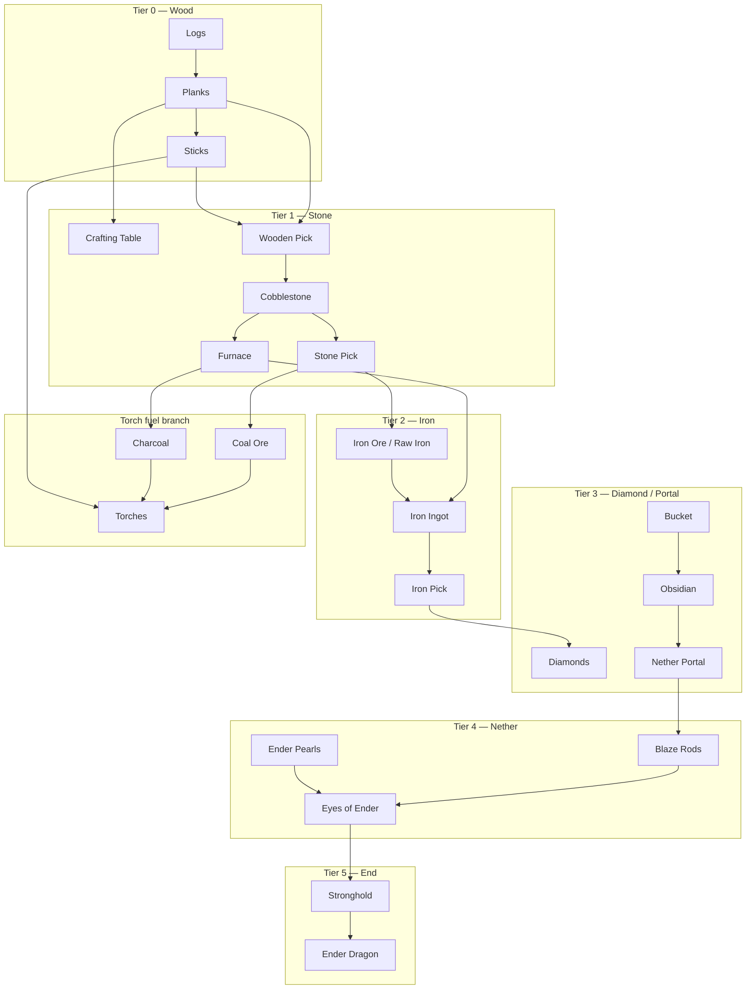

# RFC: Vanilla autonomous progression (PlayerMob survival → endgame)

## RFC Identity

| Field | Value |
| --- | --- |
| **Project root** | `d:\Apps\Minecraft Port\Projects\SPMScavenger-1.21.1-Fabric` |
| **Host platform** | Social Player Mobs (`playermob`) v0.86.0 — reference `Projects/references/SocialPlayerMobs-v0.86.0/` |
| **Target progression** | **Vanilla Minecraft 1.21.1** survival (not a third-party tech mod) |
| **Scope** | Autonomous progression architecture plus narrowly authorized repairs to existing survival executors |
| **Mode** | `WORKING_FROM_PLAN` — `SCR-2R5` implemented and statically accepted; runtime confirmation remains separate |
| **Status** | `RESEARCHING`; `SCR-1 RUNTIME_CONFIRMED`; `SCR-2R4 SUPERSEDED IN PART BY SCR-2R5`; `SCR-2R5 IMPLEMENTED / STATIC ACCEPT / RUNTIME UNVERIFIED`; `SCR-3 DEFERRED` |
| **User constraint** | The RFC was originally design-only; the user has now separately authorized `SCR-1` and `SCR-2` implementation. Minecraft launches, commits, pushes, and `SCR-3` remain separately gated |
| **Related** | `RFC-TOOL-TIER-UPGRADES.md`; `RFC-FURNACE-SMELTING.md`; `RFC-ACTION-TRANSITIONS.md`; stubs `progression/ProgressGoal.java`, `progression/TaskLifecycle.java` |
| **Owners** | User (product); architecture TBD |
| **Last update** | 2026-08-19 (Unified Progression Authority proposal integrated from V2-DEF-002/003 evidence — User + `Agent_Codex`) |
| **Nearest frontier** | Independent peer review **D-VP-PR-001…009**, especially the single-consumer-truth boundary and `MANDATORY_PENDING` authority seam; then authorize or reject **VP-UPA-0** contract extraction. **GTH-1** and **RT-MI-TS1** remain parallel frontiers |
| **Gate** | MRFC-1 |

### Naming note

“Interactive Player Mobs” in the user brief maps to **Social Player Mobs** (`games.brennan.playermob`). No separate “Interactive Player Mobs” mod exists in this workspace (`CONFIRMED` — reference tree is `SocialPlayerMobs-v0.86.0`).

---

## Executive Summary

Vanilla survival progression is a **recipe- and gate-driven dependency graph**, not a linear script. Social Player Mobs already provides **combat, scavenging, foraging, container looting, equipment evaluation, and social behaviour** in ordinary worlds. It does **not** provide autonomous mining, crafting, smelting, structure navigation, dimension progression, or boss fights (`CONFIRMED` — `PlayerMobEntity#registerGoals`, `ForagePolicy` issue #5 deferral, no craft/smelting goals in SPM source).

**SPM Scavenger** (`spmscavenger`) is the correct integration surface: a PolyForm-safe compatibility addon that attaches goals on `ENTITY_LOAD` without compiling against SPM (`CONFIRMED` — `SpmScavenger.java`, `PlayerMobs.java`).

**Recommended generation-one foundation (D-VP-001, aligns with D-TTU-017):**

```text
ProgressGoal (user/config target)
  → RequirementResolver (backward chain from live RecipeManager + tool gates)
  → ProgressionNeed (one consumer interpretation; requirement states + active frontier)
  → Route providers (Gather / Craft / Smelt / Trade / Loot / …)
  → ProgressionRouteArbitrator (objective eligibility first; optional Opinion ranking second)
  → ProgressionIntent + ActivityAuthority
  → Existing executors
  → TaskLifecycle (RUNNING | SUCCESS | FAILURE | BLOCKED | INTERRUPTED | RETRY)
  → re-resolve the consumer
```

**Do not** ship one giant scripted sequence or a full GOAP/HTN planner in generation one (`CONSENSUS` — `RFC-TOOL-TIER-UPGRADES.md` D-TTU-017). Recursive prerequisite resolution is implemented as **bounded backward chaining** over a finite node catalog, not open-ended search.

The added middle is not an Opinion feature and not an Action-Transitions feature. Progression owns
requirement truth, objective route eligibility, commitment, and mandatory-pending authority. Opinion
may rank only already-legal alternatives. Executors own physical feasibility and execution; the
existing action-transition system remains a consumer of selected intent rather than the source of it.

**Practical endgame ceiling (honest):** autonomous **torch + stone/iron tool loop** is **PARTIAL / achievable** with current RFC children. Autonomous **Nether → Blaze → Eyes → Stronghold → Dragon** is **NOT PRACTICAL** without major new systems (structure discovery, portal construction, boss arenas, 36-slot logistics). Label per-phase feasibility below.

---

## Collaboration Protocol

- Planning trigger authorizes this RFC only — not implementation, Minecraft launch, commit, or push.
- Evidence labels: `CONFIRMED` / `INFERRED` / `UNVERIFIED` per Gate AV-1.
- Implementation claims require build or runtime proof; this document is design-only.

---

## Topic: Vanilla progression dependency graph

### Evidence basis (`CONFIRMED`)

Progression edges are derived from **Minecraft 1.21.1 packaged data**, not item-name guessing:

| Mechanism | Source |
| --- | --- |
| Crafting recipes | `RecipeType.CRAFTING` via `RecipeManager` |
| Smelting / blasting | `RecipeType.SMELTING`, `BLASTING` |
| Tool harvest levels | `TieredItem` / block `requiresCorrectToolForDrops()` |
| Dimension gates | Portal blocks, `DimensionType`, boss entity registrations |
| Advancements | `data/minecraft/advancement/**` (ordering hints, not AI oracle) |

### Tier 0 — Spawn affordances (no station)

| Node | Requires | Unlocks |
| --- | --- | --- |
| Logs | Punch / axe | Planks |
| Planks | Logs | Sticks, crafting table (2×2) |
| Sticks | Planks | Tools (with table), torches (with fuel) |
| Fuel (coal **or** charcoal) | Coal ore **or** furnace+log | Torches |
| Torches | Fuel + sticks | Light, hostile control (`PlaceTorchGoal`) |

### Tier 1 — Surface stone age

| Node | Requires | Unlocks |
| --- | --- | --- |
| Crafting table | 4 planks | 3×3 crafts |
| Wooden pickaxe | Table + planks + sticks | Cobble from stone |
| Cobblestone | Stone mining | Stone tools, furnace |
| Stone pickaxe | Table + cobble + sticks | Coal ore, iron ore (drops raw) |
| Furnace | 8 cobble (table) | Smelting |
| Charcoal | Furnace + 2× surplus logs | Torch fuel without coal ore |

**Scavenger today:** Tier 0–1 **mostly implemented** (`CODE_CONFIRMED` — `ScavengerCrafting`, `GatherResourcesGoal`, `CraftTorchesGoal`, `SmeltAtFurnaceGoal`, `ToolTierPolicy` stone cap).

### Tier 2 — Iron age

| Node | Requires | Unlocks |
| --- | --- | --- |
| Iron ore / raw iron | Stone pick + mining | Smelt input |
| Iron ingot | Furnace + fuel | Iron tools, bucket, shield, flint+steel |
| Iron pickaxe | Table + ingots + sticks | Diamond ore, gold ore, lapis, redstone |
| Bucket | Table + iron | Water placement, lava pickup |
| Shield | Table + iron + planks | Ranged mitigation (SPM `BlockArrowsGoal` exists) |

**Scavenger today:** Smelt + iron craft/gather **IMPLEMENTED** (`CODE_CONFIRMED`); controlled descent,
tunnel search, and wealth gather policy **IMPLEMENTED** static (`MiningDirector`, `MiningProject`,
`GatherIntentPolicy`, `ResourceWealthPolicy`); **advanced site selection**, `MiningMemory`, and
runtime falsification remain **PARTIAL** — see [Mining intelligence backlog](#topic-mining-intelligence--deferred-and-partial-backlog).

### Tier 3 — Diamond / overworld power

| Node | Requires | Unlocks |
| --- | --- | --- |
| Diamonds | Iron pick + deep mining (Y≈-59) | Diamond tools, enchanting table |
| Enchanting table | Diamonds + obsidian + book | Gear scaling |
| Obsidian | Water + lava contact | Nether portal frame |
| Nether portal | 10+ obsidian + flint&steel | Nether dimension |

**Scavenger today:** Diamond craft + Y-gated gather consumer **IMPLEMENTED** static; no clairvoyant ore
seek; sustained branch mine **NOT PRACTICAL** gen-1. Enchanting, obsidian cast, portal — still absent.

### Tier 4 — Nether

| Node | Requires | Unlocks |
| --- | --- | --- |
| Nether access | Portal | Nether resources |
| Netherrack / digging | Any pick | Mobility |
| Blaze rods | Fortress + blaze combat | Brewing, eyes of ender |
| Ender pearls | Piglin barter **or** endermen farm | Eye crafting |
| Eyes of ender | Pearls + blaze powder | Stronghold triangulation |

**SPM today:** Combat primitives exist; **no fortress navigation, bartering, or eye throwing** (`CONFIRMED` gaps).

### Tier 5 — End (practical survival endgame)

| Node | Requires | Unlocks |
| --- | --- | --- |
| Stronghold | Eyes of ender + structure discovery | End portal frame |
| End portal | 12 eyes placed | The End |
| Ender dragon | Ranged + melee + crystal denial | Dragon egg, gateway |

**SPM today:** `EndCrystalCombatGoal` is PvP-style crystal PvP, not dragon fight AI (`CONFIRMED` — combat goal scope).

### Consolidated dependency graph (high level)



### Coal vs charcoal branch (`CONFIRMED` product behaviour)

In coal-rich overworld, mobs **skip furnace for torches** and mine coal directly (`RFC-FURNACE-SMELTING.md` scenario parity). Furnace is the **fallback** when `coal == 0 && charcoal == 0` and torch stock is below target.

---

## Topic: Autonomous prerequisite planning

### Design pattern (not a monolithic script)

```text
ProgressGoal (config / survival profile)
    ↓
RequirementResolver.resolve(goal, backpack, worldFacts)
    ↓
Missing leaf OR satisfied?
    ├─ satisfied → SUCCESS (re-evaluate parent)
    └─ missing   → WorkDemand (typed) → map to executor goal
            ↓
        Executor runs until TaskLifecycle terminal
            ↓
        Invalidate demand cache; resume parent
```

### Feasibility constraint on `RequirementResolver` (`CODE_CONFIRMED`, Agent_Claude, snapshot 17:50)

**Backward chaining from a live `RecipeManager` cannot be built as written.** 1.21.1's
`RecipeManager` exposes only **input-driven** lookups — `getRecipeFor`, `getRecipesFor`,
`getAllRecipesFor(type)`, `byKey`. There is **no reverse index by output**. Asking "what makes an
`IRON_PICKAXE`?" therefore means iterating `getRecipes()` and matching
`getResultItem(registryAccess())` — O(all recipes), 5,000–20,000+ in a modded pack, per query, per
mob, recursively.

That is viable only as a **built index**, not a live query:

- `RecipeManager extends SimpleJsonResourceReloadListener`, so build `Map<Item, List<RecipeHolder<?>>>`
  once per recipe reload and share **one immutable copy** across all mobs;
- recursive resolution additionally needs **cycle detection** (`iron_ingot → iron_block → 9 iron_ingot`),
  a **depth bound**, and **memoisation**, or a modded pack overflows the stack or explodes
  combinatorially.

This affects **phase 0a**, which lists `RequirementResolver` as a `FULL` deliverable. The index is
part of that deliverable, not an implementation detail discovered later.

Full derivation and the options table live in `RFC-FURNACE-SMELTING.md` **D-FSM-010**; this is a
pointer, not a second copy.

### Overlap warning — two demand records are being specified in parallel

`WorkDemand` here and `MaterialDemand` in `RFC-FURNACE-SMELTING.md` D-FSM-010 are converging on the
same concept from opposite ends, and neither RFC currently references the other's record. Before
either ships, decide whether they are one type or two with a stated boundary. D-FSM-010 already
locked three constraints that apply to any such record and should not be re-derived here:

1. the material key must carry **tags**, not just items (recipe ingredients are `Ingredient`);
2. urgency must **derive** from the demand class, not sit beside it as an independent field;
3. deficit is **computed per evaluation, never stored** — a latched deficit is demand outliving its cause.

### Example — backward chain

**Goal:** `IRON_PICKAXE` (`ProgressGoal` stub)

```text
IRON_PICKAXE
  requires: 3× iron ingot, 2× stick, crafting table
IRON_INGOT ×3
  requires: smelt(raw_iron|iron_ore), furnace, fuel
RAW_IRON
  requires: mine iron_ore (stone pick), OR loot container
STONE_PICK
  requires: cobble ×3, sticks, table
COBBLE
  requires: mine stone (wood pick)
...
```

**Goal:** `TORCH_STOCK` (current scavenger default)

```text
TORCH_STOCK (count ≥ torchStockTarget)
  requires: coal|charcoal + sticks
CHARCOAL (only if no coal)
  requires: furnace + 2 surplus logs (+ table to craft furnace)
STICKS
  requires: planks
...
```

### WorkDemand types (generation one catalog)

| Demand | Executor | SPM reuse |
| --- | --- | --- |
| `GATHER_BLOCK` | `GatherResourcesGoal` | Extend block sets |
| `CRAFT_STEP` | `CraftTorchesGoal` / craft executor | `ScavengerCrafting.Step` |
| `SMELT_BATCH` | `SmeltAtFurnaceGoal` | `FurnacePolicy` |
| `PLACE_BLOCK` | `PlaceTorchGoal`, table/furnace placement | Existing |
| `LOOT_CONTAINER` | — | **SPM `RaidContainersGoal`** |
| `PICKUP_FLOOR` | — | **SPM `CollectFloorItemsGoal`** |
| `EAT` | — | **SPM `EatFoodGoal`** |
| `FIGHT` | — | **SPM `WeaponAwareAttackGoal`** |
| `MINE_VEIN` | *new* | Partial overlap with gather |
| `STRUCTURE_SEEK` | *new* | None |
| `USE_STATION` | *new* | None (brewing, enchant, villager) |

### TaskLifecycle semantics (D-VP-001)

| State | Meaning | Planner action |
| --- | --- | --- |
| `RUNNING` | Executor active | Wait |
| `SUCCESS` | Step complete | Pop stack; re-resolve parent |
| `FAILURE` | Hard impossibility (recipe missing, griefing off) | `BLOCKED` parent; surface reason |
| `BLOCKED` | Missing world affordance (no tree, no ore exposed) | Try alternate source (loot, explore) or defer |
| `INTERRUPTED` | Combat, flee, fire, player order | Save ticket; SPM goals preempt |
| `RETRY` | Transient (path fail, chest locked) | Backoff + re-queue same demand |

**Interruption:** SPM priorities 0–2 (fire, flee, combat) preempt scavenger 2–4 (`CONFIRMED` — `SpmScavenger.java` comments). Planner must persist `FurnaceJobSavedData`-style tickets for resumable work (`CODE_CONFIRMED` pattern exists).

**No omniscience:** Structure locations (stronghold, fortress) come from **exploration + eyes** or configured anchors — not global `/locate` unless cheat profile enabled.

### Planner scope boundary (`CONSENSUS`)

| Approach | Verdict |
| --- | --- |
| Fixed `nextStep()` per subsystem (today) | `PROVEN` for torch chain |
| `WorkDemandPolicy` + finite node catalog | **Preferred gen-1** |
| Full GOAP/HTN | **Deferred** — cost > benefit for vanilla-only |

### Future extension — cross-strategy route choice (`PROPOSED`, `Agent_ChatGPT`, 2026-08-17)

D-VP-001 is sufficient while a requirement has **one** obvious acquisition path. It is **insufficient**
once multiple **legal** strategies can satisfy the same `ProgressionNeed` (mine→smelt→craft vs trade
vs loot vs remembered site). See [Topic: Unified Progression Authority](#topic-unified-progression-authority--shared-requirement-truth-route-arbitration-and-activity-authority).

---

## Topic: Unified Progression Authority — Shared Requirement Truth, Route Arbitration, and Activity Authority

**Status:** `PROPOSED` — expanded architecture pressure-test; **not** implementation authorization

**Authors:** `Agent_ChatGPT` (route-choice seed, 2026-08-17); User + `Agent_Codex` (unified authority refinement, 2026-08-19)

**Peer gate:** MRFC-1; MAIBS-1 applies before any route arbitrator ships

### Observable defects that make this a current architecture track (`RUNTIME_CONFIRMED`)

This topic is the missing middle of D-VP-001, not a second planner beside it.

| Defect | What the player observed | Architectural cause | Evidence |
| --- | --- | --- | --- |
| **V2-DEF-003** | Mob with the sticks required for an iron pickaxe and no iron kept gathering irrelevant logs; raw-iron exhaustion never published; ten funded trades existed but no trade plan opened | `ScavengerCrafting` and `GatherIntentPolicy` independently interpreted the same consumer and disagreed | `docs/porting/KNOWN_DEFECTS.md`; local shared-frontier repair landed, runtime repair remains `UNVERIFIED` |
| **V2-DEF-002** | Unresolved iron-pickaxe demand existed, but before any executor admitted, Opinion selected EXPLORE and the mob walked about 150 blocks away from village/trade evidence | Active-goal observation sees mandatory execution but cannot represent **mandatory work pending route resolution** | `docs/porting/KNOWN_DEFECTS.md` step-7B trace, 2026-08-18 |

Current implementation is genuinely a skeleton at this boundary:

- `CODE_CONFIRMED`: `progression/ProgressGoal.java` is an outcome enum and
  `progression/TaskLifecycle.java` is the terminal/continuation vocabulary.
- `CODE_CONFIRMED`: `WorkDemandPolicy` currently owns furnace-output arbitration; its
  `MaterialDemand` is route-specific, not a complete consumer requirement model.
- `CODE_CONFIRMED`: `TradeDemandRegistrar` is intentionally a two-route compatibility bridge:
  `EXISTING_WORK` wins while feasible and TRADE wins only after bounded infeasibility evidence.
- `NOT FOUND` probe 1: no `RequirementResolver` declaration under `src/main/java`.
- `NOT FOUND` probe 2: no production `ProgressionNeed`, `ProgressionIntent`, or
  `ProgressionRouteArbitrator` declaration/call under `src/main/java`.
- `NOT FOUND` probe 3: no universal `ActivityAuthority` or `MANDATORY_PENDING` state under
  `src/main/java`; `DiscretionaryEligibility` reasons from active `ActivityClass` observations.

### Deduplication and ownership

| Candidate | Classification | Resolution |
| --- | --- | --- |
| Shared consumer interpretation | `REFINEMENT` of D-VP-001 and the overlap warning | Promote here; do not create another demand RFC |
| Cross-strategy route arbitrator | `REFINEMENT` of D-VP-PR-002 | Preserve one arbitrator; broaden beyond mine-vs-trade |
| Opinion route ranking | `REFINEMENT` of D-VP-PR-001/003 | Keep advisory and post-legality |
| Activity authority over progression + Opinion | `NEW`, evidenced by V2-DEF-002 | Define semantic tiers here; reuse existing SPM/Scavenger admission seams during implementation |
| Executor-local recipe/demand interpretation | `CONFLICT` with V2-DEF-003 | Reject as authoritative truth; executors derive only physical execution facts |
| Action-Transitions ownership | `ALTERNATIVE`, rejected | Transitions may enact selected intent; they do not own consumer truth or route choice |

### Unified architecture (`PROPOSED`)

```text
WORLD / INVENTORY / CONFIG
          |
          v
     ProgressGoal
          |
          v
 RequirementResolver
          |
          v
   ProgressionNeed                 <- SINGLE CONSUMER TRUTH
          |
          v
 Route providers
   Gather | Craft | Smelt | Trade | Loot | future adapters
          |
          v
 RouteCandidates
   objective legality / feasibility / cost / evidence
          |
          v
 ProgressionRouteArbitrator
   objective dominance first; optional Opinion ranking second
          |
          v
 ProgressionIntent + RouteCommitment
          |
          v
 ActivityAuthority
   EMERGENCY / PLAYER_AUTHORITY / COMBAT / MANDATORY / DISCRETIONARY
          |
          v
 Existing executor -> TaskLifecycle -> re-resolve consumer
```

These names are conceptual until contract review. This proposal does **not** authorize a giant new
goal, per-tick world planner, or replacement of SPM's GoalSelector priorities.

### Single consumer truth — `RequirementResolver` and `ProgressionNeed`

**Hard rule (`D-VP-PR-005`, proposed): a consumer's requirements are interpreted exactly once.**

```text
ProgressionNeed
  consumerKey = spmscavenger:iron_pickaxe_upgrade
  goal        = IRON_PICKAXE
  requirements
    STICK x2       held=3 deficit=0 SATISFIED
    IRON_INGOT x3  held=0 deficit=3 MISSING
  frontier = IRON_INGOT x3
  demandClass = PROGRESSION
  utility = derived objective priority
```

Gather does not know the iron-pickaxe recipe. Craft, Smelt, and Trade do not independently derive
the consumer. Each receives the same `consumerKey` and frontier, then answers only its route-local
question.

V2-H static integration evidence distinguishes three related but non-interchangeable identities:

| Identity | Example | Owner |
| --- | --- | --- |
| Consumer objective | acquire iron-pickaxe capability | resolver / consumer |
| Canonical frontier | iron ingot ×3 | requirement graph |
| Route representation | buy iron pickaxe ×1 | Trade provider projection |

Trade may project `IRON_INGOT ×3` to `IRON_PICKAXE ×1` while preserving the consumer key. Projection
does not rewrite source need, feasibility evidence, or completion truth.

Conceptual records:

```text
ProgressionNeed {
  ProgressGoal goal
  ResourceLocation consumerKey
  List<RequirementState> requirements
  Requirement frontier
  DemandClass demandClass
  int derivedUtility
}

RequirementState {
  IngredientKey ingredient
  int requiredQuantity
  int heldQuantity
  int deficit                    // derived per evaluation; never persisted
  RequirementStatus status
  RequirementRepresentation representation
}
```

`D-FSM-010` remains authoritative: build the recipe output index once per reload, preserve
tag/ingredient semantics, bound cycles/depth, and derive deficits live.

### Route providers — expertise, not independent brains

For `consumer=iron_pickaxe_upgrade`, `frontier=IRON_INGOT ×3`:

| Provider | Candidate | Example status/evidence |
| --- | --- | --- |
| Gather | expose/mine raw iron | `PROBING` until a bounded legitimate scan resolves |
| Smelt | raw iron → iron ingot | `BLOCKED_TRANSIENT` while input is absent |
| Craft | iron ingot + sticks → pickaxe | endpoint, not currently executable |
| Trade | projected iron-pickaxe output | `FEASIBLE` only with bounded live quote + funding evidence |
| Loot | known container/source | absent until legitimately observed |

Providers accept one need snapshot, emit bounded candidates/provenance, and own no cross-provider
winner. They revalidate physical facts at admission/commit. Optional mod providers disappear cleanly
when absent; they must not expose optional/client implementation types through common contracts.

### Explicit route status and knowledge evidence

Boolean feasibility is rejected:

| Status | Meaning | Arbitrator treatment |
| --- | --- | --- |
| `FEASIBLE` | bounded evidence supports admission and executor hard blockers | legal candidate |
| `PROBING` | bounded evidence acquisition is active or was interrupted without conclusion | protect/resume bounded probe; not failure |
| `BLOCKED_TRANSIENT` | route exists but a transient condition blocks admission | backoff/tolerance |
| `INFEASIBLE` | named bounded probe or hard rule disproved this route for its current scope | alternative may take ownership |
| `UNKNOWN` | insufficient evidence and no active probe owns discovery | schedule evidence work or defer honestly |

**Absence of an executor is not route-infeasibility evidence.** Combat-interrupted `PROBING` does
not become `INFEASIBLE`; “no exposed iron within radius 20 at tick N” does not mean “no iron exists.”

| Context | Discovery | Validity | Owner | Cost | Refresh/invalidation | Persistent? |
| --- | --- | --- | --- | --- | --- | --- |
| Gather evidence | bounded loaded/ticking geometry scan | radius, dimension, tick, exposure/path assumptions | Gather provider | scan + path probes | expiry, terrain/chunk change; interruption stays `PROBING` | no gen-1 |
| Trade evidence | observed live villager offer | villager, offer signature, tick, customer/stock | Trade provider | bounded entity/offer inspection | unload, price/use/customer change | no gen-1 |
| Recipe graph | reload-built immutable output index | current resource generation | RequirementResolver | reload build + bounded lookup | resource reload | shared immutable |
| Commitment | consumer + route + start + progress | terminal/invalidation/expiry | arbitrator | O(1) evaluation | explicit release/replace | transient gen-1 |

Any long-lived implementation separately satisfies RET-1: key, bound, production eviction, and
death/unload/dimension/server-stop behavior.

### Arbitrator, objective dominance, and route commitment

Selection stages:

1. Hard legality: config, griefing, tool, spend, safety, and API gates.
2. Evidence state: feasible vs probing/transient/infeasible/unknown.
3. Existing commitment: retain bounded work unless a meaningful release occurs.
4. Objective dominance: compare defined fact vectors, not unrelated scores.
5. Optional Opinion: rank only genuine legal trade-offs among survivors.

Do **not** compare `TradeEvaluation.utility=73` with `WorkDemandPolicy.derivedUtility=100`. Candidate
facts may include travel burden, hazard band, irreversible consumption, uncertainty, work units,
and completion evidence, but every axis needs defined semantics.

```text
RouteCommitment {
  consumerKey
  routeId
  startedAtTick
  progressEvidence
  boundedTolerance / expiry
}
```

Minor score changes cannot steal ownership. Release occurs on `SUCCESS`, scoped `INFEASIBLE`,
transient block beyond tolerance, consumer invalidation, higher authority, or expiry. `INTERRUPTED`
preserves semantic intent but discards disposable path and commit-instant transaction state.

Strongest objection: commitment can fossilize a poor route. The answer is explicit invalidation,
bounded reevaluation checkpoints, and progress evidence—not per-tick route theft. Exact timeouts are
`UNVERIFIED` product/performance decisions.

### ActivityAuthority — distinguish idle from mandatory pending

This is a semantic layer over existing GoalSelector/admission seams, not necessarily one new global
class. Exact precedence must reconcile with stock SPM priorities and SCR-2R5 before lock.

```text
EMERGENCY          environmental escape / immediate safety
PLAYER_AUTHORITY   explicit player command
COMBAT             mandatory combat authority
MANDATORY          active OR pending progression/survival work
DISCRETIONARY      Opinion-selected explore/rest/social
```

The required new state is **`MANDATORY_PENDING`**: a valid `ProgressionNeed` exists and route
resolution, probing, or transient admission is in progress although no executor owns MOVE/LOOK.
While pending, discretionary displacement is refused. This directly addresses V2-DEF-002.

It must not become a permanent veto. Mandatory authority releases when the consumer is satisfied or
invalid, all bounded providers currently report infeasible and no evidence task is scheduled, or
policy explicitly defers/backoffs the need. Higher authority may suspend/cancel it by contract.
If every route is `UNKNOWN`, the system must own bounded evidence work or defer and permit
discretionary activity; “unknown forever” cannot freeze the mob.

### Executors become narrower

Executors receive `ProgressionIntent` and answer “can I physically execute this now?” Gather owns
scan/path/mine and scoped evidence; Trade owns quote/funding/walk/revalidation/atomic transaction;
Craft/Smelt own physical commits. None independently reinterprets the full consumer or chooses the
cross-route winner.

### Alternatives and recommendation

| Option | Shape | Advantages | Failure mode / trade-off | Verdict |
| --- | --- | --- | --- | --- |
| **A — unified need + providers + arbitrator + authority** | proposed track | one consumer truth; explicit epistemics; general competition; addresses both observed defect classes | highest contract work; premature abstraction risk | **Recommended**, staged narrowly |
| **B — local pairwise repairs** | retain V2-C asymmetry; add one Opinion blocker; more shared helpers | lowest immediate cost | each route pair creates another winner and interpretation; drift returns | compatibility bridge only |
| **C — full GOAP/HTN** | generic world-state search | expressive | disproportionate cost/debug/performance; conflicts with D-VP-001 | rejected gen-1 |

Switch from A to B if a contract spike cannot express Gather + Trade without wrappers that merely
rename today's special cases, or measurement shows disproportionate arbitration cost. Consider a
richer planner only after multiple progression graphs prove bounded backward chaining insufficient.

### Performance and compatibility budget (`UNVERIFIED` estimates)

- Resolve on inventory/config/world evidence changes or bounded cadence; not every tick per mob.
- Share immutable recipe indexes per reload; never scan all recipes per mob.
- Bound provider candidates and probes; evaluate 1/10/50/100 mobs, with several hundred as stress.
- Preserve existing executors through adapters until equivalent scenario gates pass.
- Optional providers fail closed; vanilla routes continue when an integration is absent.

### Behavioral Prediction (MAIBS-1, pre-implementation)

| Layer | Result |
| --- | --- |
| Intended | one consumer truth; bounded route probing/commitment; interruption recovery; re-resolve after change |
| Implemented today | separate policies plus active-goal discretionary observation; V2-DEF-003 locally repaired, V2-DEF-002 open |
| Predicted | no irrelevant log gathering for satisfied sticks and no long discretionary departure during bounded mandatory admission gap; exploration resumes after honest all-route deferral |
| Confidence | architecture `PROPOSED`; defects `RUNTIME_CONFIRMED`; repair behavior `UNVERIFIED` |

Temporal prediction: `T0` resolves iron frontier and publishes mandatory pending; `T+10` starts a
bounded Gather probe and/or reads bounded Trade evidence; `T+60` retains the probe despite minor
Opinion drift; `T+200` switches once only if scoped Gather infeasibility and Trade feasibility are
established; by `T+1200`, success clears authority or a bounded no-progress tolerance defers it.

| Authority | Can interrupt? | Retained state | Observable result |
| --- | --- | --- | --- |
| fire/flee/safety | yes | semantic consumer per contract; discard path | escape, then re-resolve |
| player command | yes | explicit suspend/cancel | command wins |
| combat | yes | intent if still valid; fresh path afterward | fight, then bounded resume |
| selected progression | owns route | bounded commitment | no cross-route tick thrash |
| Opinion discretionary | not while mandatory active/pending | request may expire | no 150-block admission-gap departure |

Predicted weird behaviors:

1. `ARCHITECTURE_DEFECT`: all providers stay `UNKNOWN` with no evidence owner; mandatory pending
   freezes the mob. Falsifier: no-route fixture through `T+1200`.
2. `ARCHITECTURE_DEFECT`: stale quote/terrain fails to invalidate commitment, causing repeated
   executor refusal. Falsifier: remove the target mid-route and observe one bounded re-resolve.
3. `RUNTIME_QUESTION`: 50+ mobs synchronize probes and spike scan/path cost. Falsifier:
   staggered 1/10/50/100-mob cadence and tick-cost trace.
4. `ACCEPTABLE_STEPPING_STONE`: coarse objective facts retain a slower safe route; bounded progress
   is preferred over pretending unlike costs are comparable.

MAIBS-1: **`UNVERIFIED — DESIGN PLAUSIBLE; AUTHORITY/RELEASE CONTRACT NEEDS PEER REVIEW`**.

### Finding — Opinion already learns progression activities (`CONFIRMED`)

Opinion does **not** own progression authority, but the existing pipeline already learns preferences
for progression-shaped work:

| Layer | Evidence |
| --- | --- |
| `ActivityKind` ontology | `OVERLAND_EXPLORATION`, `CAVE_EXPLORATION`, `CONTROLLED_DESCENT`, `TUNNEL_SEARCH`, `RESOURCE_GATHERING`, `REST`, `SOCIALIZING`, `MIMICRY` — `experience/ActivityKind.java` |
| Mining → kind mapping | `ExperienceEmitters.activityFor(MiningProjectMode)` maps `CONTROLLED_DESCENT` / `TUNNEL_SEARCH` / `CAVE_EXPLORATION` / default → `RESOURCE_GATHERING` — `experience/ExperienceEmitters.java:321-326` |
| Personality interpretation | `PersonalityModel.positiveSensitivity` — cave ← curiosity+adventurousness+riskTolerance; descent/tunnel ← persistence+materialism; gather ← materialism — `opinion/PersonalityModel.java:59-67` |
| Discretionary director boundary | `PersonalityModel` javadoc: *"owns no scheduler or action authority"* — same file:11-12 |

**Missing seam (read-back):** learned `ActivityOpinionMemory` preference is consumed today for
**discretionary** director scoring (`ActivityUtilityScorer`, `DiscretionaryActivityDirector`), not
when progression must choose among multiple **feasible acquisition routes** for the same consumer.

```text
Progression activity happens
        ↓
Experience / terminal evidence
        ↓
Opinion learns: "I like/dislike tunnel search / cave exploration / gathering"
        ↓
MISSING (today):
use those preferences when progression has multiple legitimate strategies
```

### Gap in D-VP-001 — no general route-choice layer (`INFERRED` from current code shape)

Today's stack:

```text
ProgressGoal → RequirementResolver → WorkDemandPolicy → executor → TaskLifecycle
```

works when the resolver exposes essentially **one** leaf executor per missing node. It breaks down at:

| Need | Competing legal routes |
| --- | --- |
| Iron pickaxe | mine→smelt→craft; villager trade; container loot; (future modded sources) |
| Diamonds | cave exploration; controlled descent→tunnel; remembered exposed/deep site |

**Warning sign already shipped:** `TradeDemandRegistrar` is a special-purpose route selector
(EXISTING_WORK vs TRADE). Its source explicitly forbids comparing `TradeEvaluation#utility()` against
`WorkDemandPolicy#derivedUtility` — *"73 trade utility against 100 smelt utility is not a comparison"*
— and TRADE wins only when the existing route is **infeasible**, never when it is merely less
attractive (`village/trade/TradeDemandRegistrar.java:14-34`, gate 7 at `:108-111`).

If vanilla progression later adds independent `MiningRoutePolicy`, `LootRoutePolicy`,
`StructureRoutePolicy`, etc., each with its own winner logic, the repo recreates the parallel-AI
architecture this RFC family has been avoiding.

### Proposed future architecture (`PROPOSED`)

```text
ProgressGoal
        ↓
RequirementResolver
        ↓
ProgressionNeed                    ← consumer-owned: "what outcome must happen?"
        ↓
Route providers (mine / craft / smelt / trade / loot / explore / …)
        ↓
bounded ProgressionRouteCandidates
        ↓
objective feasibility + legality filter
        ↓
ProgressionRouteArbitrator
        ├── objective route facts (vector, not one fake number)
        └── optional Opinion preference (rank only)
        ↓
ProgressionIntent                  ← owns bounded attempt until terminal / invalidation
        ↓
execution-time admission / revalidation
        ↓
existing executor
        ↓
TaskLifecycle
        ↓
re-resolve requirement
```

**Authority split (non-negotiable proposal):**

| Layer | Owns |
| --- | --- |
| Progression | Necessity, legality, feasible candidate set, `ProgressionIntent` commitment |
| Opinion | Subjective **ranking among already-feasible** routes — never permission |

> Progression: *"We ARE obtaining an iron pickaxe."*  
> Opinion: *"Of the legal ways to obtain it, I'd rather trade than tunnel."*  
> **Not:** *"I hate mining, so we're not getting the pickaxe."*

This extends the existing Opinion rule — *preference affects choice, not permission*
(`ActivityUtilityScorer` javadoc; `DiscretionaryScoringInput` / `DiscretionaryDirectorState`
*candidacy, not permission*) rather than inventing a second philosophy.

### Candidate contract — preference cannot suppress progression (`PROPOSED`)

| Case | Expected |
| --- | --- |
| Mine feasible + trade feasible | Opinion **may** rank (once a real cross-strategy model exists) |
| Mine feasible + trade infeasible | Mine regardless of Opinion |
| Mine infeasible + trade feasible | Trade regardless of Opinion |
| Only tunnel feasible; mob dislikes tunnels | Tunnel anyway |
| No feasible routes | `BLOCKED` for objective reason — never "doesn't feel like it" |

Shelter, player command, combat, and mandatory safety authorities still preempt; Opinion cannot
preserve progression work through those gates (same pattern as `SHELTER_HOLD` / SCR-2R5).

### Route commitment — no per-tick preference steering (`PROPOSED`)

Once `ProgressionIntent` selects a route (e.g. `CAVE_EXPLORATION` for an iron-pick consumer), that
attempt owns a **bounded commitment** until `SUCCESS` | `FAILURE` | `BLOCKED` | `RETRY` boundary |
objective invalidation (preferred trade disappears, site flooded, tool broke). A mood tick or +1
preference change must **not** flip route every 20 ticks.

Matches existing Opinion distinction: *request is not authority; adoption is not continuation*
(`DiscretionaryDirectorState` stale-preference guards).

### Objective dominance before subjective choice (`PROPOSED`)

Do **not** implement:

```text
miningScore = 100; tradeScore = 73; opinionBonus = +20  →  pick mining
```

Safer staged model:

1. **Hard legality** — remove illegal routes  
2. **Feasibility** — remove objectively infeasible / `UNKNOWN` routes  
3. **Objective dominance** — eliminate clearly worse routes using defined facts (not blended units)  
4. **Subjective choice** — Opinion ranks genuine tradeoffs among survivors  

Objective fact vector (examples): travel burden, work burden, hazard band, uncertainty, resource
consumption, known completion evidence. If route A is no worse than B on every axis and better on
at least one, B loses before Opinion enters. Short-but-dangerous cave vs long-but-safe tunnel is the
intended Opinion use case.

### D-VP-MI-014 supersession (`PROPOSED`)

Standalone CAVER / TUNNELER weight presets would create a **second** subjective authority beside
`ActivityOpinionMemory` and `PersonalityModel`. Example conflict:

```text
MiningPersonality = CAVER     → prefer caves
OpinionMemory[TUNNEL_SEARCH]    → loves tunnels
PersonalityModel              → high persistence + materialism
MiningDirector                → ???
```

**Proposal:** mark **D-VP-MI-014** `SUPERSEDED — DO NOT IMPLEMENT AS PARALLEL POLICY`. MiningDirector
keeps project lifecycle ownership; it may receive **bounded advisory preference** when multiple mining
routes are objectively legal. Opinion remains the single subjective-learning source.

### Trading needs an `ActivityKind`, not discretionary `PROGRESSION` (`PROPOSED`)

Do **not** add `PROGRESSION` to the discretionary director. Progression stays outside discretionary
authority; mining already demonstrates the pattern (`CONTROLLED_DESCENT` is progression-owned work with
an Opinion kind).

Progression villager trading is **work**, not `SOCIALIZING` (V2 lesson — `D-VR-054` locks
`ActivityClass.VILLAGE_TRADE` for scheduler taxonomy). For learned trade-vs-mine preference, add a
future subjective identity such as `ActivityKind.VILLAGE_TRADING` or `TRADING` — **learning only**,
not discretionary director admission. Coordinate with `RFC-VILLAGE-RAID-AUTONOMOUS-PROGRESSION.md`
(`onTradeEpisode` / experience emission slice).

### Scenario parity — required before lock (`UNVERIFIED`)

| ID | Scenario | Must happen | Must not happen |
| --- | --- | --- | --- |
| VP-PR-S1 | Mine + trade both feasible | Both remain legal; preference may eventually distinguish | Fake utility comparison (100 vs 73) |
| VP-PR-S2 | Preferred trade disappears mid-walk | Attempt invalidates; re-resolve; mining still available | Oscillate route every tick |
| VP-PR-S3 | Mob dislikes only feasible mining method | Progression still proceeds | Demand suppressed as "preference" |
| VP-PR-S4 | Shelter / player order / combat | Higher authority preempts | Opinion preserves progression through preempt |
| VP-PR-S5 | Repeated controlled-descent success | Cave/descent/tunnel preference strengthens appropriately | Fabricated dislike without causal evidence |
| VP-PR-S6 | Tunnel interrupted by player command | No fabricated negative learning | — |
| VP-PR-S7 | Hazard-caused cave failure | Causal failure may affect cave preference per existing rules | Blame unrelated activity |
| VP-PR-S8 | Opinion disabled / neutral | Routing matches legacy neutral policy | Silent behavior change |
| VP-PR-S9 | WEALTH wants diamonds; progression needs iron | Separate consumers; wealth cannot hijack iron need | Cross-consumer route theft |
| VP-PR-S10 | Two mobs, same need | May choose different feasible methods | Different legality per mob |
| VP-UPA-S1 | Iron-pick consumer; sticks satisfied; iron absent | One frontier = iron; providers may project route-local representations | Logs/cobble remain mandatory through generic stock rules |
| VP-UPA-S2 | Need exists; providers are still probing | `MANDATORY_PENDING` blocks a new discretionary expedition | Active-goal gap reads as idle |
| VP-UPA-S3 | Every bounded route is infeasible or explicitly deferred | Mandatory authority releases/backoffs; discretionary work resumes | Permanent frozen mob |
| VP-UPA-S4 | Gather probe interrupted by combat | Status remains `PROBING`/interrupted; fresh path after combat | Interruption becomes global infeasibility |
| VP-UPA-S5 | Trade quote disappears mid-walk | Commitment invalidates once; alternate route re-resolves | Stale retry loop or per-tick flip |
| VP-UPA-S6 | Inventory satisfies frontier during another activity | Consumer re-resolves and releases authority | Stale demand keeps scheduler ownership |
| VP-UPA-S7 | Two feasible non-dominated routes; Opinion disabled | Deterministic neutral objective/tie policy | Progression depends on Opinion being enabled |
| VP-UPA-S8 | Optional route-provider mod absent | Provider is omitted; vanilla routes continue | Common classloading/startup failure |

### Proposed decisions (not locked)

| ID | Proposal | Status |
| --- | --- | --- |
| **D-VP-PR-001** | Progression retains necessity/permission; Opinion may only **rank** multiple feasible routes for the same `ProgressionNeed` | `PROPOSED` |
| **D-VP-PR-002** | One bounded `ProgressionRouteArbitrator`; do not let mine/trade/loot policies each become independent route selectors | `PROPOSED` — needs MiningDirector + V2 lifecycle pressure-test |
| **D-VP-PR-003** | Supersede standalone D-VP-MI-014 CAVER/TUNNELER presets; use Opinion `ActivityKind` + `PersonalityModel` pipeline | `PROPOSED` |
| **D-VP-PR-004** | Preserve V2-C `EXISTING_WORK > TRADE` asymmetry until a real cross-strategy route model exists; Opinion cannot bypass it prematurely | `PROPOSED` — aligns with shipped `TradeDemandRegistrar` gate 7 |
| **D-VP-PR-005** | `RequirementResolver` is the single authoritative interpreter of a consumer; providers/executors consume `ProgressionNeed` and may not independently reinterpret it | `PROPOSED` — V2-DEF-003 evidence |
| **D-VP-PR-006** | A selected route owns bounded `RouteCommitment`; minor scores cannot steal it; release requires named terminal/invalidation/tolerance evidence | `PROPOSED` |
| **D-VP-PR-007** | Feasibility is multi-state; absence of executor admission is not infeasibility evidence | `PROPOSED` — generalizes `RouteExhaustionEvidence` |
| **D-VP-PR-008** | Activity authority distinguishes `MANDATORY_PENDING` from idle and blocks discretion only while bounded resolution/evidence work remains owned | `PROPOSED` — V2-DEF-002 evidence |
| **D-VP-PR-009** | Consumer objective, canonical frontier, and route representation remain distinct while carrying one stable `consumerKey` | `PROPOSED` — V2-H projection evidence |

### Proposed implementation tracks (not authorized)

| Task | Objective | Dependencies | Must happen | Must not happen | Status |
| --- | --- | --- | --- | --- | --- |
| **VP-UPA-0** | Extract pure need/status/evidence contracts and adapt two real providers (Gather + Trade) without scheduler mutation | independent review; D-VP-PR-005/007/009 | V2-DEF-003 fixture yields one iron frontier and route-local representations | production goal change or second consumer interpreter | `PROPOSED; NOT AUTHORIZED` |
| **VP-UPA-1** | Pure arbitrator + bounded commitment state machine | VP-UPA-0; D-VP-PR-001/002/006 | retain probe; switch once on scoped infeasibility | unrelated utility blend or per-tick oscillation | `BLOCKED ON VP-UPA-0` |
| **VP-UPA-2** | Reconcile `MANDATORY_PENDING` with observation/admission and SCR-2R5 authority | VP-UPA-1; D-VP-PR-008 | block displacement during bounded pending work; release on honest deferral | permanent veto, priority rewrite, Opinion permission | `BLOCKED ON PEER REVIEW` |
| **VP-UPA-3** | Opinion read-back among non-dominated feasible routes | VP-UPA-1 + activity evidence mapping | preference changes choice only among legal survivors | disliked sole route suppressed | `DEFERRED` |

**Strongest open objection:** D-VP-PR-002 may be premature before `RequirementResolver` v1 exists;
route arbitration without a stable `ProgressionNeed` type risks designing around today's
`MaterialDemand`/`WorkDemand` overlap (see overlap warning in [Autonomous prerequisite planning](#topic-autonomous-prerequisite-planning)).

---

## Topic: Existing PlayerMob capabilities

### Social Player Mobs v0.86.0 (`CONFIRMED` from source)

| Capability | Maturity | Path |
| --- | --- | --- |
| Melee / bow / crossbow / modded guns | Production | `WeaponAwareAttackGoal` |
| Shield vs arrows | Production | `BlockArrowsGoal` |
| TNT / end-crystal PvP | Production | `TntCombatGoal`, `EndCrystalCombatGoal` |
| Eat when hurt | Production | `EatFoodGoal`, `ForagePolicy` |
| Hunt animals | Production | `HuntForFoodGoal` |
| Harvest crops (no replant) | Partial | `HarvestCropsGoal` |
| Loot chests / armor stands | Production | `RaidContainersGoal`, `RaidArmorStandsGoal` |
| Floor pickup + gear upgrade | Production | `CollectFloorItemsGoal`, `EquipmentEvaluator` |
| 8-slot backpack | Constraint | `PlayerMobEntity` `INVENTORY_SIZE = 8` |
| Doors | Production | `PlayerMobDoorGoal` |
| Player orders | Production | `CommandedActionGoal` |
| Stay / follow / social | Production | `StayNearGoal`, `FollowLovedOneGoal` |
| Reincarnation (player death) | Production | `PlayerReincarnation` — **not mob self-respawn** |
| Train-only dig/craft/march | N/A in ordinary world | `TrainRecoveryGoal` planks only |

### SPM Scavenger addon (`CODE_CONFIRMED`)

| Capability | Maturity | Path |
| --- | --- | --- |
| Gather logs / coal / cobble | Production | `GatherResourcesGoal` |
| Craft torch chain + wood/stone tools | Production | `CraftTorchesGoal`, `ScavengerCrafting` |
| Place torches | Production | `PlaceTorchGoal` |
| Smelt charcoal + iron | Production (iron craft pending) | `SmeltAtFurnaceGoal`, `FurnacePolicy` |
| Shelter / sleep | Production | `SeekShelterGoal` |
| Campfire idle | Production | `CampfireGoal` |
| Exploration | Production | `ExploringGoal`, `TrackedLocalWanderGoal` |
| Tool tier policy (stone cap) | Production | `ToolTierPolicy` |
| Progress stubs | Stub only | `ProgressGoal`, `TaskLifecycle` |

### Coverage vs vanilla tiers

| Tier | SPM alone | + Scavenger |
| --- | --- | --- |
| 0 Wood / torches | Loot only | **Gather + craft** |
| 1 Stone | Loot only | **Gather + craft** |
| 2 Iron | Loot ingots | **Smelt**; craft `PLANNING` |
| 3 Diamond+ | Loot valuables | **Not started** |
| 4–5 Nether/End | Combat only | **Not started** |

---

## Topic: Shelter commitment lifecycle — SCR-1

**Status:** `IMPLEMENTED / STATIC VERIFIED / RUNTIME PENDING`

### Defect and behavioral prediction

`RUNTIME_CONFIRMED` symptom: at night a PlayerMob repeatedly opened and closed the same house door
while trying to shelter. `CODE_CONFIRMED` cause: SPM's priority-1 `DoorOperationGoal` owns
`MOVE + LOOK` and preempts Scavenger's priority-2 `SeekShelterGoal` (`MOVE`); the old
`SeekShelterGoal.stop()` released its bed claim, erased `standPos`/`bedPos`, reset its 400-tick
budget, and stopped navigation. A tidy PlayerMob then reached SPM's 20-tick fallback close without
crossing, after which shelter selected the same interior again. Minecraft 1.21.1's compiled
`GoalSelector` confirms that the higher-priority replacement calls the old holder's `stop()` before
starting.

| Layer | Result |
| --- | --- |
| Intended behavior | Door use temporarily suspends travel; the same valid shelter remains the objective |
| Implemented mechanism before SCR-1 | Goal execution, navigation path, shelter destination, claim, and attempt budget all shared one disposable lifecycle |
| Predicted repair behavior | Door operation kills only the old `Path`; commitment and bounded claim survive; after the door releases `MOVE`, a fresh path resumes toward the same destination |
| Failure/weirdness to prevent | Door flapping, claim churn, budget reset, immortal interrupted shelter trips, stale resume after authority or world changes |
| Confidence | `CODE_CONFIRMED`; repaired physical traversal remains `UNVERIFIED` until the approved runtime scenario |

### Goal interaction

| Goal/activity | Priority/flags | SCR-1 meaning | Commitment result |
| --- | --- | --- | --- |
| `DoorOperationGoal` / finite social reflex | 1, `MOVE + LOOK` | benign protected sub-action | suspend; retain destination/claim/budgets |
| `PlayerMobDoorGoal` | 1, flagless | helper for the same door episode | suspend/no authority change |
| combat, flee, fire/train recovery | 0–2, includes `MOVE` | mandatory safety/combat authority | cancel |
| command / stay authority | 1–2, includes `MOVE` | player authority | cancel |
| unknown active goal | unknown | fail-safe compatibility | cancel rather than assume benign |
| `SeekShelterGoal` | 2, `MOVE` | executor | resume with a new path; never preserve the old `Path` |

### Alternatives and decision

| Option | Benefit | Failure mode | Decision |
| --- | --- | --- | --- |
| Teach `stop()` `if doorOperation then keep state` | smallest diff | SPM-class guess in a lifecycle callback; repeats for every future benign preemption | rejected |
| Change priorities or remove `MOVE` from door operation | avoids this preemption | changes SPM-wide deliberate door behavior and can make movement fight the door animation | rejected |
| **Commitment independent from Goal/navigation execution; reconcile through the existing scheduler observer** | general suspend/cancel split; one observer scan; fresh path on resume; bounded ownership | requires explicit commitment state and observer wiring | **LOCKED — user 2026-08-11** |

`ShelterCommitment` owns destination, optional bed, claimant, start time, active approach ticks,
path failures, resume attempts, arrival state, and suspension state. The 400 active-approach limit
is preserved across suspensions; a 600-tick pre-arrival wall-clock/claim lifetime and bounded path
failures prevent an immortal mission. Unload/death releases the bed claim. Destination validity,
permission, ticking state, excessive displacement, dawn, config, combat/safety, and commands are
rechecked before resumption.

### Implementation evidence — 2026-08-11

- `SeekShelterGoal.stop()` stops navigation and suspends only; explicit validity/authority paths
  own cancellation.
- The existing `ExplorationActivityGoal` observation result is passed to shelter reconciliation;
  there is no second scheduler scan and `MoveHolderClassifier` remains the sole host taxonomy.
- `DoorOperationGoal` is pinned as `SOCIAL_REFLEX`; player commands, stay anchors, combat/safety,
  and unknown active goals cancel. Every resume requests a new path.
- Bed claims survive suspension, canonicalize foot/head to one head-block key, and are cancelled on
  entity unload/death. Budgets are never reset by `stop()`.
- 13 focused shelter tests pass. Full `gradlew.bat clean build` passes 639 tests, zero failures,
  errors, or skips. Packaged artifact: `build/libs/spmscavenger-1.9.4.jar`, SHA-256
  `B15F6504C5A1BA8A2CFB432B8A60AD6240428B098369BA7193C0A7453227C14E`.
- Post-GREEN MAIBS found and repaired a self-invalidation path: an arrived non-bed shelter now
  classifies as `REST`, while an approach still classifies as `MANDATORY_SAFETY`.
- Three relevant absence probes: no `GoalSelector#getAvailableGoals()` scan inside shelter; no
  second class-name taxonomy; no navigation `Path` field retained by `ShelterCommitment`.
- Runtime test kit exists at `test-datapacks/shelter-commitment/`; physical traversal is still
  `UNVERIFIED`, so Task 42B remains blocked until SCR-1A/B pass in Minecraft.
- The approved runtime launch could not start: this project's `run/mods` and `run/saves` are empty,
  no installed SPM/Scavenger instance is present under `D:/Minecraft/Instances`, and the pinned SPM
  source fixture fails configuration at `build.gradle.kts:153` because its Windows repository URI
  is `file://D:\\.../repo`. No Minecraft process was launched. Repairing the read-only reference
  build or supplying an SPM 0.86.0 runtime JAR/test world is required before SCR-1A/B can execute.

### SCR-1 task and acceptance

| Field | Contract |
| --- | --- |
| Owner | Agent_Codex |
| Scope | `ShelterCommitment`, `SeekShelterGoal`, existing observer wiring, claim lifecycle, focused tests, runtime datapack, documentation |
| Must happen | occupied bed + valid covered interior + closed wooden door: one shelter commitment survives door preemption, replans, crosses, and completes shelter; free-bed claim survives the same interruption and reaches sleep |
| Must not happen | old `Path` survives; door interruption resets budgets/releases a valid claim; dawn/combat/command/broken destination resumes stale shelter; failed repaths retry forever; a second scheduler scan is added |
| Static tests | suspend/resume budget preservation; claim ownership; cancel matrix; dawn/destination/failure bounds; observer integration contract; disabled/legacy parity |
| Runtime | `test-datapacks/shelter-commitment/`; approved occupied-bed/closed-door and free-bed variants; logs/readout + visual evidence required |
| Gate | pre-implementation `BEHAVIORALLY_PLAUSIBLE`; final MAIBS remains blocked until runtime traversal passes |

### Predicted weird behaviors

- A door operation can make the readout briefly show two door-related lines: `RUNTIME_QUESTION`,
  presentation-only and outside SCR-1 unless it conceals the shelter outcome.
- A physically unreachable interior can consume the bounded failure budget and be temporarily
  rejected: `ACCEPTABLE_STEPPING_STONE`, preferable to an immortal mission.
- Several mobs may share a generic covered room, but a free bed remains exclusive through its
  bounded claim: intended; duplicate bed ownership is an `ARCHITECTURE_DEFECT`.

**Pre-implementation MAIBS:** `PASS — BEHAVIORALLY_PLAUSIBLE` for the locked design. The old
implementation remains `FAIL — ARCHITECTURE_DEFECT` until code and the approved runtime scenario
prove the transition.

### SCR-2 — Shelter Interior & Capacity Intelligence

**Status:** `IMPLEMENTED / STATIC VERIFIED / RUNTIME PENDING`

**Authorization:** user, 2026-08-11

**Dependency:** SCR-1 commitment/resume lifecycle (`RUNTIME_CONFIRMED` by user)

#### Evidence and defect

`RUNTIME_CONFIRMED`: some PlayerMobs shelter outside classic one-bed village houses even though
reachable interior standing space exists. `CODE_CONFIRMED`: the default radius-16 scan evaluates
up to `(33 × 33 × 9) = 9,801` positions; a generic candidate needs only no sky plus immediate
standability. Final arithmetic sees usable bed, immediately adjacent solid blocks, block light,
and distance. It does not classify room-scale enclosure, reserve generic standing capacity, or
ask navigation until after one geometric winner is selected.

Three absence probes: no interior/room classifier in source or tests; no generic shelter-standing
reservation outside the bed claim map; no candidate-level `createPath`/`Path.canReach` probe in the
search phase. SCR-3 shelter/home memory is also absent, but intentionally remains deferred.

#### Behavioral Prediction (MAIBS-1)

| Layer | Result |
| --- | --- |
| Intended behavior | Prefer reachable indoor room capacity; distribute multiple mobs across free standing areas; use porches only after better capacity is exhausted |
| Current mechanism | One global arithmetic score over every covered/standable position; path requested only after selection; only beds are claimed |
| Predicted SCR-2 behavior | Cheap safe/ticking candidates enter a spatially diverse shortlist; semantic tier dominates quality/distance; at most four ranked positions receive path probes; one commitment-owned spacing reservation is acquired before adoption |
| Failure/weirdness prevented | porch beating room center, shortlist filled by adjacent porch cells, several mobs choosing one square, unreachable winner hiding reachable fallback, old commitment releasing a newer reservation |
| Confidence | current defect `CODE + RUNTIME_CONFIRMED`; proposed mechanics `GAME_MECHANICS_INFERRED`; final physical behavior remains `UNVERIFIED` until runtime |

Coordinate scenario: mob `(0,64,0)`, closed door around `(5,64,0)`, occupied bed around
`(8,64,0)`, porch `(4,64,1)`, interior `(7,64,1)`. The old model can award the porch an immediate
wall plus ceiling while the room center sees only its ceiling. SCR-2 must classify the room from
bounded horizontal boundaries/roof continuity, path through the door, reserve the interior site,
and then reuse SCR-1 when the door operation interrupts `MOVE`.

Temporal prediction:

```text
T0 dusk scan (staggered)
→ cheap covered/standable/safe/entity-ticking filter
→ spatially diverse bounded shortlist
→ semantic classify/rank
→ <=4 path probes
→ conditional reservation + ShelterCommitment
T+10..60 door operation may suspend; reservation and commitment survive
T+60..200 fresh path resumes; arrival retains reservation while resting
T+1200 reservation remains condition-bound/periodically refreshed, or is physically removed on
           dawn/cancel/unload/death/expiry; later mobs use remaining capacity or another shelter
```

#### Locked architecture

1. Keep `SeekShelterGoal`; add no competing Goal or scheduler authority.
2. Hard filters: covered, standable, non-hazardous for the mob, and server entity-ticking.
3. Shortlist: bounded and spatially bucketed; do not take the first/top adjacent score cluster.
4. Semantic tiers are lexicographic, never additive:
   `USABLE_BED > INTERIOR_ROOM > DEEPLY_COVERED > PORCH_OVERHANG > EXPOSED`.
5. Within one tier rank enclosure evidence/roof continuity/light, then distance and stable
   coordinates. An arithmetic quality value cannot move a candidate across tiers.
6. Probe at most four candidates with the mapped vanilla navigation API; a null/partial path is not
   admissible. Path objects remain disposable and are not stored in `ShelterCommitment`.
7. A generic spacing reservation is part of SCR-2. The registry is keyed by owner UUID (not minted
   ID), while each immutable reservation records commitment ID, dimension-aware site, spacing,
   and expiry. Release/refresh requires matching commitment ID so stale attempts cannot affect a
   newer reservation.
8. One reservation per mob; short suspension retains it; arrival holds it through the shelter
   session; cancellation/dawn/unload/death/server stop releases it; production expiry is physically
   swept. Bed claims remain distinct but the bed commitment also reserves surrounding capacity.
9. `SCR-3 Known Shelter Memory` is explicitly deferred. Selection/path start/door entry teach
   nothing. Future memory may learn only after successful valid interior/bed arrival.

#### Alternatives

| Option | Benefit | Failure mode | Decision |
| --- | --- | --- | --- |
| Add an `INTERIOR` numeric bonus to `ShelterScore` | smallest diff | enough other arithmetic can make a porch win again; violates semantic priority | rejected |
| Flood-fill/structure recognition | strongest topology model | unbounded block work, door/window/modded-building complexity, poor many-mob scaling | rejected |
| **Bounded geometry evidence + lexicographic tier + four path probes + reservations** | loader/mod agnostic, deterministic, bounded, preserves existing Goal lifecycle | approximate classifier needs adversarial runtime tuning | **LOCKED — user** |

#### Predicted Weird Behaviors

- A very large hall whose walls lie beyond the fixed boundary depth may rank as deeply covered
  rather than interior: `ACCEPTABLE_STEPPING_STONE`; it still beats porch when roof continuity is
  strong, and runtime determines whether the probe depth needs tuning.
- An oversized spacing radius can under-use a tiny house; an undersized radius can produce visual
  crowding: `RUNTIME_QUESTION`, falsified by 1/4/10-mob capacity scenarios.
- Four unreachable high-tier candidates can exhaust the path budget before a reachable porch:
  `ACCEPTABLE_STEPPING_STONE` only if bounded and followed by rescan/backoff; an infinite retry is
  an `ARCHITECTURE_DEFECT`.
- A non-sheltering villager/entity can physically occupy an otherwise unreserved position:
  `RUNTIME_QUESTION`; final-candidate occupancy must be checked within the four-probe budget.

#### Implemented mechanism and evidence

`SeekShelterGoal` now gathers only covered, standable, mob-safe, entity-ticking candidates. The
pure `ShelterSelectionPolicy` retains both enclosed-looking and open room-center representatives
per 2×2×2 spatial bucket, distributes a maximum of 24 generic and four bed candidates across four
distance bands, then classifies at most 28 candidates by boundaries within five blocks and five
roof samples. Tier is compared before quality and distance. Navigation admits at most four paths,
requires `Path.canReach()`, and rejects any path node outside entity-ticking simulation.

`ShelterReservationRegistry` stores one dimension-aware, spacing-aware reservation per owner UUID;
the reservation records the commitment UUID as a conditional token. It is refreshed only by the
matching live commitment and physically removed on expiry, cancel, unload, death, or server stop.
An occupancy AABB rejects a cell another living entity is already using. Bed claims remain
separate and are now acquired conditionally rather than overwriting another live claimant.

Post-implementation MAIBS found one defect before handoff: four unreachable top-ranked positions
would consume every path probe on every later scan. `ShelterCandidateRejections` now remembers at
most 16 failed positions for 80 ticks, sweeps once per shelter scan, and lets later scans advance to
reachable fallback candidates without making the path budget unbounded. It deliberately does not
remember semantic shelter quality and is not SCR-3 home memory.

Static evidence after SCR-2R: 24 focused `Shelter*Test` tests pass; the full 652-test suite and `clean build`
pass with zero failures, errors, or skips. Final remapped artifact:
`build/libs/spmscavenger-1.9.4.jar`, SHA-256
`4347449A866D88695E01E2A867C4467F1DB68A04C68B4DB034888740809C3552`; it contains all SCR-2
classes and excludes the temporary datapack. Minecraft was not launched, so interior recognition
and multi-mob physical distribution remain `UNVERIFIED`.

#### SCR-2 task and gates

| Field | Contract |
| --- | --- |
| Owner | Agent_Codex |
| Scope | pure geometry/ranking/shortlist policy, bounded path admission, commitment-owned generic reservations, SCR-1 integration, tests/datapack/docs |
| Must happen | occupied-bed village house: PlayerMobs enter distinct reachable interior spaces up to physical capacity; additional mobs choose another interior then porch fallback |
| Must not happen | porch outranks an admissible interior; adjacent cells fill the shortlist; more than four path probes per scan; two live commitments own overlapping reserved space; stale commitment releases newer reservation; path or memory persists outside SCR-1/SCR-2 bounds |
| Static gates | tier dominance; shortlist diversity/cap; path-probe cap/fallback; spacing/dimension/expiry/conditional-release; interruption retention; unload/death/server-stop cleanup; no new Goal |
| Runtime | extend `test-datapacks/shelter-commitment/` with one-, four-, and over-capacity occupied-bed village-house scenarios; separate launch approval still required |
| Gate | `CODE/UNIT/BUILD/MAIBS_STATIC PASS`; `VERIFIED` still requires runtime geometry and multi-mob distribution evidence |

**Frontier before:** SCR-1 fixed door commitment but outdoor/eave selection and generic capacity
remained defective. **Action:** implemented and statically verified the bounded
classifier/ranker/path/reservation pipeline. **Frontier after:** run SCR-2A/B/C with separate
Minecraft-launch approval; keep SCR-3 blocked until those runtime geometry/capacity gates pass.

### SCR-2R — Doorway Depth and Exact Arrival Repair

**Status:** `IMPLEMENTED / STATIC VERIFIED / RUNTIME RECHECK PENDING`

**Evidence:** `RUNTIME_CONFIRMED` by user after SCR-2: a PlayerMob opens the door, crosses into the
house, stops immediately inside the doorway, then closes the door. Door closure itself is normal
SPM door-operation behavior; treating the circulation cell as the completed shelter is not.

#### Behavioral Prediction

| Layer | Result |
| --- | --- |
| Intended behavior | Enter the usable room and settle away from its doorway when deeper capacity exists |
| Implemented mechanism before SCR-2R | Door-adjacent and room-center cells can share the same `INTERIOR_ROOM` evidence, so distance favors the doorway; `ARRIVED_SQR = 4` also accepts completion up to two blocks from the selected cell |
| Predicted repair | Bounded doorway-clearance evidence ranks deeper cells first, an immediately adjacent door cell cannot receive interior tier, and non-bed arrival requires the mob's actual block position to equal the reserved site |
| Failure/weirdness | Tiny rooms may only offer a doorway-adjacent fallback; another entity occupying the reserved cell can cause bounded repath/abandon rather than false arrival |
| Confidence | Cause `CODE + RUNTIME_CONFIRMED`; repaired physical outcome remains `UNVERIFIED` until the user reruns the house scenario |

Coordinate trace: closed door `(4,64,0)`, threshold cell `(5,64,0)`, deeper room cells
`(7..8,64,0)`. Before repair, both can have four bounded horizontal boundaries plus continuous
roof; distance chooses `(5,64,0)`. Even if `(7,64,0)` wins, the old squared arrival threshold `4`
can declare success from `(5,64,0)`. The repair must eliminate both routes to doorstep completion.

Alternatives: tightening arrival alone prevents early completion but still deliberately selects
the doorway cell; hard-excluding every position near a door can make small valid houses unusable.
The selected design combines exact-cell arrival with bounded door-depth ranking and downgrades only
cells immediately adjacent to a door. It adds no structure recognition, new Goal, or memory.

**Must happen:** when deeper reachable interior capacity exists, the reserved destination and final
mob block are deeper than the inside threshold. **Must not happen:** adjacency to a door is accepted
as `INTERIOR_ROOM`, a mob one or two blocks from its reservation is marked arrived, or door-depth
logic changes GoalSelector authority/SCR-1 commitment ownership.

Implementation evidence: `Evidence` now includes bounded `doorClearance`; generic candidates one
block from a door are capped at `PORCH_OVERHANG`, and same-tier ranking compares clearance before
enclosure/light/distance. `SeekShelterGoal` no longer contains `ARRIVED_SQR`; non-bed arrival uses
exact reserved-block equality. Twenty-four focused shelter tests, all 652 tests, and `clean build`
pass. Static MAIBS: `PASS — BEHAVIORALLY_PLAUSIBLE`; runtime remains `UNVERIFIED` for the repair.

### SCR-2R2 — Structural Shelter Satisfaction & Return

**Status:** `LOCKED / IMPLEMENTING`

**Authorization:** user, 2026-08-11

#### Runtime evidence and peer review

`RUNTIME_CONFIRMED`: mobs can choose trees/roof panels while a house exists, generic shelter often
fails to enter that house unless a bed is the target, and an inside mob may reopen the door and
leave under another shelter cycle. Source confirms three coupled causes: generic path admission
uses tolerance `0` while beds use `1`; `sleepInBeds=true` disables the only already-covered early
return; and `ARRIVED` is irreversible even after a moving helper physically displaces the mob.

The user peer review locks: logs remain valid structural wall material; leaves provide cover but
never structural-wall evidence; a boundary requires feet-and-head continuity; a safe interior may
upgrade only to a bed whose path stays protected; door seeds share the existing 28-candidate
budget; admission tolerance is `1` while settlement remains exact; no SCR-3 memory.

Three negative probes before implementation: no current-interior adoption/latch; no leaf-versus-
structural cover classification; no door-associated shortlist quota.

#### Behavioral Prediction (MAIBS-1)

| Layer | Result |
| --- | --- |
| Intended behavior | House interior beats foliage/eaves; a mob already safely inside stays; short social displacement returns to the same nightly reservation |
| Implemented mechanism before R2 | sky blockage is roof evidence; one obstruction at feet **or** head is a wall; global search still runs indoors with beds enabled; generic path admission is exact; `ARRIVED` survives displacement |
| Predicted R2 behavior | full-height non-leaf boundaries and structural roof evidence produce interior tier; foliage/eaves remain fallback; current interior is satisfied before remote generic travel; protected local bed paths may upgrade; displaced arrival enters `RETURNING` and replans to the same anchor |
| Failure/weirdness | tiny houses may have only porch-tier capacity; leaf-built decorative shelters are fallback; temporarily blocked return paths consume the existing bounded mission budget |
| Confidence | old behavior `CODE + RUNTIME_CONFIRMED`; repaired behavior `GAME_MECHANICS_INFERRED` until runtime |

Temporal trace:

```text
T0 outside: 28-slot shortlist (general + <=4 door-associated)
→ structural interior > natural deep cover > foliage/eave fallback
→ <=4 paths, admission tolerance 1
→ exact reserved-cell arrival

T0 already inside: classify current position
→ same-protected-route bed available? upgrade
→ otherwise adopt current position; no exterior generic search

T+60 FriendlyGreet moves mob away
→ ARRIVED condition becomes false
→ RETURNING, same commitment/reservation, disposable fresh path
→ exact anchor → ARRIVED again

T+1200 no repeated global search or doorway churn while nightly shelter remains valid
```

Goal interaction: `SeekShelterGoal` remains priority 2/MOVE. Priority-1
`DoorOperationGoal` is stationary finite suspension; priority-1 `FriendlyGreetGoal` owns MOVE+LOOK
and can displace, so post-interruption physical anchor validation is mandatory. Combat/safety/
commands retain their existing authority and cancellation semantics.

#### Locked decisions and task

1. Logs/full blocks count when both feet and head rays meet a continuous wall; leaves never count
   as structural boundary. Nearby leaf canopy may provide fallback cover.
2. Semantic evidence records structural roof versus foliage cover. Foliage-only cover cannot reach
   `INTERIOR_ROOM` or `DEEPLY_COVERED`; structural walls/roof remain loader- and block-ID agnostic.
3. `STRUCTURAL_INTERIOR` at the mob's current position is satisfaction/hysteresis: try only a
   bounded bed upgrade whose admitted path remains protected, otherwise adopt current position
   before remote generic candidates.
4. Bed-route protection inspects the already-created bounded path; it never scans for a house/site
   or forces chunks. A route that materially enters exposed space is not an upgrade.
5. At most four door-associated candidates reserve slots inside the existing total semantic cap
   of 28. `MAX_PATH_PROBES=4` remains unchanged.
6. Every candidate uses admission tolerance `1`; generic completion still requires exact block
   equality.
7. `ShelterCommitment.State` gains `RETURNING`. `ARRIVED` means current physical satisfaction, not
   historical success. Moving benign interruptions return to the same reservation; hard authority
   retains cancel semantics.
8. Shelter rest claims correlate to the actual shelter commitment ID. Return pauses/invalidates
   the arrived condition without creating duplicate learning; exact re-arrival reopens/continues
   condition-bound rest through an explicit coordinator seam.
9. SCR-3 Known Shelter Memory remains deferred.

Alternatives rejected: blanket leaf/log blacklist breaks log cabins; a numeric tree penalty can
still be overwhelmed; freezing arrived mobs blocks legitimate social behavior; adding extra door
candidates beyond 28 violates the agreed semantic budget; using bed reachability alone recreates
cross-street nighttime migration.

**Must happen:** house interior outranks reachable tree/eave fallback; an already-interior mob does
not voluntarily leave for generic shelter; a local protected bed can upgrade; social displacement
returns to the same reservation; generic standing admission through the door matches bed
admission. **Must not happen:** logs are excluded, foliage becomes room walls, an exposed bed route
pulls a safe mob outside, semantic candidates exceed 28, path probes exceed four, or historical
arrival remains true while the mob is away.

**Frontier before:** runtime falsified structural classification, generic admission parity, and
arrival condition semantics. **Action:** user locked and authorized SCR-2R2. **Frontier after:**
implementation and static validation are complete; runtime launch remains separately gated.

#### SCR-2R2 implementation evidence — Agent_Codex

**Date/session:** 2026-08-11
**Contribution type:** IMPLEMENTATION / VALIDATION

- `ShelterSelectionPolicy.Evidence` now separates structural roof and foliage roof evidence;
  foliage-only sites cannot reach room/deep-cover tiers. Door-associated candidates use at most
  four slots in the unchanged 28-candidate cap.
- `SeekShelterGoal` requires feet-and-head structural boundaries, accepts full collision walls
  including logs, excludes leaves from wall evidence, keeps at most eight discovered doors, and
  uses tolerance `1` for all admission paths while retaining exact standing settlement.
- A valid current interior is adopted before remote generic shelter. Bed upgrades from that state
  are admitted only when their bounded path has at most two non-structurally-covered nodes.
- `ShelterCommitment` adds condition-bound `RETURNING` with a separate 400-active/600-wall-clock/
  three-path-failure return budget. The correlated shelter rest claim becomes live-but-suspended
  while displaced and resumes under the same claim/commitment IDs at exact re-arrival.
- Post-implementation review found two additional loops before handoff: calling the coordinator on
  every arrived tick could reopen a timed-out rest episode, and an arrived fallback never searched
  for a house upgrade. The first is prevented by opening/resuming only on an ARRIVED transition;
  the second uses a 200-tick bounded scan that atomically replaces only with a strictly higher tier.
  Failed replacement retains the current commitment and reservation.
- Focused shelter/rest tests pass. Full suite: **660 tests, 0 failures, 0 errors, 0 skipped**.
  `gradlew clean build` passes. Runtime physical behavior is `UNVERIFIED` because Minecraft was not
  launched.

**MAIBS post-implementation verdict:** `BEHAVIORALLY_PLAUSIBLE` / static PASS. Tree/eave fallback
remains legal when no better site is reachable; safe interior cannot voluntarily downgrade;
benign displacement returns; combat/order cancellation wins; all scans, path probes, return
attempts, reservations, and retained door evidence remain bounded. The least-verified claim is
vanilla navigation crossing real village door/roof geometry under the new tolerance and structural
heuristics; falsification requires the SCR-2R2 runtime matrix.

### SCR-2R3 — Interior Capture and Door Operation Arbitration

**Status:** `IMPLEMENTED / STATIC VERIFIED`
**Agent:** Agent_Codex
**Contribution type:** RESEARCH / DESIGN / IMPLEMENTATION

Runtime feedback after SCR-2R2 reports repeated `Using door` with no door response and mobs leaving
after physically entering a house. Pinned SPM v0.86.0 source at `4b80b5e849` confirms that
`PlayerMobDoorGoal.canUse()` checks only `isHoldingDoorsClosed()`, while `start()` calls
`beginDoorOperation()` and its private `armDoorOperation()` silently refuses when another operation
is active. A new OPEN attempt can therefore appear to start while a pending CLOSE owns the entity;
the request is discarded, the close completes, and the flagless passage Goal waits at a closed
door. Both SPM door goals report `Using door`, so the readout cannot distinguish the phases.

Scavenger also checks current-interior satisfaction only during `search()`. An ACTIVE commitment to
a tree/eave may physically cross a valid room and continue back outside toward its old destination.
Finally, `classify()` currently converts any door-adjacent covered cell to `PORCH_OVERHANG` before
structural evidence is considered. In a one-room village house, every usable interior cell may be
door-adjacent, defeating the current-interior latch.

Three negative probes: no `isOperatingDoor()` guard in SPM `PlayerMobDoorGoal.canUse()`; no
mid-route current-position interior capture in `SeekShelterGoal.tick()`; no separation between
semantic interior classification and door-depth settlement quality in `ShelterSelectionPolicy`.
The available project `run/logs/latest.log` is from Scavenger 1.9.2 and contains no door diagnostic,
so the new runtime report is user evidence but the exact frequency remains unmeasured.

#### Behavioral Prediction (MAIBS-1)

| Layer | Result |
| --- | --- |
| Intended behavior | Door requests never lie about starting; entering a structurally better room captures it instead of completing a worse exterior trip |
| Current mechanism | busy door request is dropped; door-adjacent room may be demoted to porch; existing commitment ignores better shelter crossed en route |
| Predicted repair | optional host Mixin refuses the flagless passage Goal while SPM is already operating a door; structural tier ignores door distance but ranking still prefers depth; lower-tier ACTIVE/RETURNING travel atomically adopts the current interior and stops |
| Weirdness | tiny rooms may settle near the door when no deeper cell exists (`ACCEPTABLE`); several mobs may still close between passages (`RUNTIME_QUESTION`); an invalid current reservation can make capture retain the old trip (`BOUNDED_FALLBACK`) |
| Confidence | causes `CODE_CONFIRMED`; physical repair `GAME_MECHANICS_INFERRED` until runtime |

Temporal trace: `T0 CLOSE busy → OPEN canUse=false → operation finishes → next evaluation arms OPEN`
instead of losing it. `T+10 lower-tier travel enters structural room → current evidence outranks
commitment → reserve/replace atomically → exact ARRIVED → navigation stops`. `T+200/T+1200 the
current interior remains latched; only protected bed or explicit higher authority can move it.

Options: (A) patch SPM source directly—rejected by the stock-host/licence boundary; (B) optional
`@Pseudo` addon Mixin guarding only the pinned public methods—selected, absent/changed host falls
back without startup failure; (C) build a second door controller/shared registry—deferred because
SPM owns door identity/action and the addon lacks a proven durable passage-intent contract.

**Must happen:** a busy CLOSE prevents a false OPEN start; after it clears, normal SPM door logic may
retry; a lower-tier shelter trip that enters a structural room captures that current cell; tiny
door-adjacent structural interiors remain interiors. **Must not happen:** Scavenger directly opens
doors, copies SPM code, adds a second door Goal, makes SPM mandatory, lets door distance erase real
room structure, or leaves an old exterior reservation alive after successful capture.

**Scope:** SCR-2R3 plus the narrow optional SPM busy guard. Shared multi-mob door passage holding is
separately deferred pending a host/upstream door-operation request contract. SCR-3 memory remains
out of scope.

#### Implementation evidence — Agent_Codex

`ShelterSelectionPolicy` now classifies structural enclosure before treating door depth as a
within-tier ranking dimension. `SeekShelterGoal` checks lower-tier travel every ten ticks and uses
the existing atomic `tryAdopt()` transaction to capture its current structural interior. The new
common-side `PlayerMobDoorGoalBusyMixin` is `@Pseudo`, `require=0`, reads host busy/recovery state,
and never toggles a door. Full suite: 663/663 passing; `clean build` and packaged-Mixin inspection
pass. Static MAIBS: `BEHAVIORALLY_PLAUSIBLE`. Runtime: `UNVERIFIED`.

### SCR-2R4 — Arrived shelter night authority

**Status:** `IMPLEMENTED / STATIC VERIFIED / RUNTIME REPAIR PENDING`
**Agent:** Agent_Codex
**Contribution type:** RUNTIME REVIEW / DESIGN / IMPLEMENTATION

User runtime observation split the behavior cleanly: tree shelter retains `Seek shelter`, while a
house user reaches ARRIVED, invokes SPM's close-behind action, becomes `Idle`, wanders out, and seeks
again. This falsifies the earlier assumption that persistent commitment state automatically implies
persistent GoalSelector authority.

**Decision:** publish an ephemeral UUID-keyed night hold only at exact physical ARRIVED. While that
hold exists, an optional `@Pseudo` Mixin makes SPM's `DoorOperationGoal` scheduler wrapper yield;
SPM's entity-side `tickDoorOperation()` continues the physical look/swing/open-or-close action.
Approach has no hold, so required door opening still preempts movement normally. Displacement,
cancel/dawn/combat/command, unload/death, and server stop release the hold.

Post-build MAIBS found and repaired one semantic transfer bug: an ARRIVED lower-tier fallback that
adopted an upgrade could carry its hold into the replacement approach and suppress a legitimately
needed door operation. Successful replacement now releases the old hold after reservation commits;
failed adoption preserves it, and the new destination reacquires only on exact arrival.

**Rejected:** make shelter uninterruptible (breaks safety/commands); suppress idle/wander instead
(masks the ownership defect and can churn); reimplement door action in Scavenger (duplicate owner).

**MAIBS prediction:** house arrival → acquire hold → close request arms → entity performs door
action without taking MOVE from shelter → exact anchor remains occupied → `Seek shelter` continues
until dawn. Combat/command still makes `baseAuthorityAllows` false and cancels/releases before those
goals own movement. Least-verified claim: optional host injection and the physical close animation in
the user's full modpack remain runtime `UNVERIFIED`.

**Implementation evidence:** UUID authority opens only through `markArrived()` and releases through
RETURNING/cancel/unload/death/server-stop paths. `DoorOperationShelterHoldMixin` intercepts only the
host scheduler wrapper's `canUse`/`canContinueToUse`; it contains no navigation or door mutation.
Focused contracts and all 667 tests pass; `clean build` and remapped-JAR inspection pass. Artifact
SHA-256: `0DF060DD6E1733A06ECB2DC172CBBF7F1C230954D612E883255D0D0BD3ED1E9D`.

### SCR-2R5 — Shelter authority envelope

**Status:** `IMPLEMENTED / STATIC ACCEPT / RUNTIME UNVERIFIED`
**Agent:** Agent_Codex
**Contribution type:** `BRAINSTORM / REVIEW / MAIBS_STATIC`

#### Observable problem and source correction

The house-near-tree report raises a real generalization question, but `GatherResourcesGoal` is not
the initiating preemptor in the current scheduler. `SeekShelterGoal` is priority 2 and owns `MOVE`;
gather/craft/smelt are priority 3 and own `MOVE + LOOK`. Minecraft 1.21.1
`WrappedGoal#canBeReplacedBy` allows replacement only by a strictly higher-priority number, so a
running shelter goal prevents those chores. If Gather becomes visible after arrival, shelter first
lost or invalidated its authority and Gather merely claimed the free slot.

There is nevertheless a separate `CODE_CONFIRMED` semantic defect: `MoveHolderClassifier` converts
an arrived `SeekShelterGoal` from `MANDATORY_SAFETY` to `REST`, while
`DiscretionaryEligibility` does not block `REST`. `ActivityObservationService` already has the
independent rest predicate supplied by the correlated shelter `RestSessionClaim`; scheduler
authority does not need to be weakened to report affective rest.

Three negative probes (`NOT FOUND`): no `ShelterNightAuthority` admission check in gather/craft/
smelt; no shelter-specific mandatory block in the Opinion package; no central shelter activity
admission policy outside the narrow door-operation Mixin. The current `latest.log` confirms
`playermob 0.86.0` and `spmscavenger 1.9.4` loaded, but contains no `Seek shelter`, `Gather
resources`, `Using door`, ARRIVED, or shelter-authority diagnostic lines. The exact Gather sequence
therefore remains `RUNTIME_REPORTED / TRACE_UNVERIFIED`.

#### Locked authority model

```text
IMMEDIATE PHYSICAL SURVIVAL / SELF-DEFENCE
                    ↓
EXPLICIT PLAYER AUTHORITY
                    ↓
ARRIVED NIGHT SHELTER HOLD
                    ↓
PROGRESSION / WORK
                    ↓
DISCRETIONARY OPINION
```

`REST` and `SHELTER_HOLD` are different semantic authorities:

- discretionary campfire REST may voluntarily yield when Opinion selects Explore;
- arrived nighttime shelter remains mandatory scheduler authority until dawn, invalidation, an
  emergency, or a player command;
- the observer may still report `resting=true` through the shelter rest claim, without classifying
  the executor as discretionary `REST`.

`MoveHolderClassifier` therefore reports an arrived `SeekShelterGoal` as the new blocking
`ActivityClass.SHELTER_HOLD`; approach remains `MANDATORY_SAFETY`. `SHELTER_HOLD` is a scheduler
occupant and blocks discretionary eligibility, but is deliberately not `ActivityClass.REST`.
`Observation.resting()` remains independently true through the correlated rest claim. This is the
locked D-GAO-043 separation between **what the mob is doing** and **whether that activity is
providing rest**.

Do not implement legality as `ActivityClass` alone. SPM's `SOCIAL_REFLEX` class contains both
`SkepticalWatchGoal`, which stops and looks without travelling, and `FriendlyGreetGoal`, which owns
`MOVE + LOOK` and may approach a friend or fetch a gift outside. The policy must consider semantic
authority plus actual displacement/required flags.

#### Candidate designs

| Option | Benefit | Failure mode / cost | Verdict |
| --- | --- | --- | --- |
| Priority-only after SCR-2R4 | No new hooks; lower-priority work is already excluded while shelter genuinely runs | Does not fix `REST` authority semantics; known priority-1 social movement can still preempt; gives no explicit suppression reason | Rejected as incomplete |
| Scatter `ShelterNightAuthority.holds()` through every Goal | Small individual edits | Brittle, duplicates policy, misses future/host goals, and invites inconsistent `canUse` vs `canContinueToUse` behavior | Rejected |
| **Pure `ShelterDisplacementPolicy` + one shared addon admission guard + narrow optional SPM hooks for proven displacing host goals** | Central semantics, testable, preserves optional-host boundary, avoids a global scheduler patch | Must maintain the pinned host-goal map; unknown new high-priority host goals still fail safe and require review | **Recommended** |
| Global `GoalSelector` interception or dynamically uninterruptible shelter | Broadest enforcement | Selector has no safe owner contract; risks blocking fire/powder-snow recovery, combat, or commands; invasive loader compatibility surface | Rejected unless targeted hooks prove insufficient |

The locked physical policy is separate from `ActivityClass`. A centralized
`ShelterActivityEnvelope` classifies an ephemeral candidate/existing occupant into immutable facts,
then a pure `ShelterInterruptionPolicy` returns an execution effect. Mixins and addon Goal guards
only delegate to that policy; they do not contain independent shelter rules. The policy needs four
effects, because a temporary helper that preserves the commitment is not the same lifecycle as an
emergency or command that cancels it:

| Activity/mechanism | Shelter effect |
| --- | --- |
| fire, suffocation, drowning, powder-snow escape; attributable active combat/flee | `OVERRIDE_AND_CANCEL_OR_REVALIDATE` |
| explicit player command / stay authority | `OVERRIDE_AND_CANCEL` |
| carried-food `EatFoodGoal` (`LOOK` only), cosmetic gaze, flagless defence/readout, stationary wary watch | `ALLOW_IN_PLACE` |
| finite required helper that temporarily owns a conflicting flag but must preserve shelter | `SUSPEND_AND_RESUME` |
| moving greeting/fetch, follow, loot, crops, gather, craft, smelt, mining, torch trip, explore, wander | `BLOCK_WHILE_SHELTERED` |
| SPM door operation after exact arrival | entity-side physical operation may finish; scheduler `MOVE` wrapper yields as in SCR-2R4 |

This distinction is locked: `ALLOW_IN_PLACE` does not surrender shelter; `SUSPEND_AND_RESUME`
keeps the same bounded commitment/reservation and creates a fresh disposable path afterward;
`OVERRIDE_AND_CANCEL` releases autonomous shelter authority; `BLOCK_WHILE_SHELTERED` denies the
candidate. No result changes Goal priorities.

`mob.getTarget() != null` is not sufficient evidence for the first row. SPM's
`HuntForFoodGoal` is a target-selector goal that assigns a passive animal while hungry, after which
the ordinary priority-2 attack executor performs the hunt. Current `SeekShelterGoal` cancels for
every non-null target, so a safe indoor mob can currently classify “hunt a cow” as combat and leave
the house. Target provenance must therefore be separated at least into:

- `IMMEDIATE_SELF_DEFENCE`: recently hurt / active attacker — override;
- `HOSTILE_THREAT`: threat confirmed through a bounded, compatibility-aware predicate — override;
- `PROACTIVE_AGGRESSION`: hated target merely noticed — remain sheltered by default;
- `FOOD_HUNT`: passive animal target — blocked while arrived unless a separately designed
  starvation emergency threshold explicitly authorizes it;
- `DEFEND_LOVED_ONE`: product decision; recommended default is override only for a nearby active
  attacker, not a distant chase outside the shelter site.

**Locked gen-1 target rule:** immediate self-defence, a nearby attributable active threat, and an
explicit player combat order may override. Proactive hunt/aggression may not. `UNKNOWN` target
provenance fails safe for night shelter: it does not authorize voluntary displacement merely from
`mob.getTarget() != null`; an independently confirmed immediate survival condition can still
override. `DEFEND_LOVED_ONE` overrides only when the defended entity and active attacker are within
the bounded nearby-threat envelope. Provenance must be derived from source/observable authority,
not guessed solely from target entity class.

#### Enforcement surface and scope guard

- Reuse the existing `ActivityObservationService` scheduler scan; do not add a competing scan.
- Scavenger-owned displacing Goals consult one shared envelope from both admission and continuation
  seams. The rule is centralized even though the call sites are necessarily distributed.
- Optional SPM hooks are narrow and evidence-led. The pinned priority map makes priority-1 moving
  `FriendlyGreetGoal` the first voluntary-travel hook; stationary `SkepticalWatchGoal` remains
  allowed. Lower-priority work appearing after arrival is treated as evidence that the hold was
  already lost, not as proof it preempted priority-2 shelter.
- Do not pre-emptively add Mixins for every host Goal. Add a bounded invariant/diagnostic for an
  unexpected displacing owner during `SHELTER_HOLD`, then widen the pinned hook surface only from
  code/runtime evidence.
- Upgrade the hold registry from bare UUID membership to a bounded immutable snapshot containing
  mob id, commitment id, anchor, and arrival tick. Release/refresh must be commitment-correlated so
  an old lifecycle cannot release a newer hold. Existing death, unload, dimension-change, server
  stop, dawn, and invalidation cleanup remain mandatory under RET-1.

The universal fallback should use observable threat evidence (recent attacker, hostile marker where
valid, distance/line-of-sight) and an optional pinned SPM reaction/source seam. It must not copy SPM
target lists or assume all non-null targets are danger. This target-provenance repair is part of
SCR-2R5, not an Opinion preference.

“Indoor crafting” is deliberately not granted to the current `CraftTorchesGoal`: that executor can
navigate to/place a crafting table and is not proven anchor-bounded. A future indoor activity must
prove its entire route remains within the reserved shelter site before it is admitted.

#### Behavioral prediction (MAIBS-1)

| Layer | Result |
| --- | --- |
| Intended | Once physically settled, a mob stays sheltered until dawn unless survival, combat, or player authority legitimately overrides it |
| Proposed mechanism | Preserve mandatory shelter classification; derive rest independently; reject new displacing chores/social trips during the arrived hold; retain existing commitment return semantics |
| Predicted observable behavior | House near trees: `Seek shelter` remains the movement owner and no wood trip starts. Carried food/look behaviour can occur in place. At dawn the hold releases and ordinary work may start |
| Failure/weirdness | over-broad class gate blocks harmless actions (`ARCHITECTURE_DEFECT`); emergency cannot preempt (`ARCHITECTURE_DEFECT`); a new unknown priority-1 host goal escapes the pinned hooks (`RUNTIME_QUESTION`); score shown for an illegal activity looks causal (`PRESENTATION_DEFECT`) |
| Confidence | Scheduler and taxonomy defect `CODE_CONFIRMED`; exact observed Gather handoff and repaired physical behaviour `UNVERIFIED` |

Temporal trace: `T0 exact arrival → mandatory hold`; `T+10 Gather sees nearby log but admission is
denied`; `T+60 Opinion may update affect but receives no discretionary authority`; `T+200 carried
food or harmless look may run without leaving`; `T+1200 hold still owns the night`; dawn or a valid
override releases/cancels it exactly once and work becomes eligible again.

#### Required scenarios and acceptance

- house near tree: Gather must not start or pull the mob outside;
- nearby chest/drop/crop/friend: loot, harvest, and moving greeting/follow must not displace an
  arrived hold;
- food already carried: eating may run because it owns `LOOK` only;
- fire/powder snow/suffocation/combat: emergency authority must still take control;
- hungry passive-animal target: shelter must not be cancelled merely because SPM populated
  `mob.getTarget()`; carried food remains usable in place;
- explicit player command: shelter releases rather than fighting the user;
- benign door close: physical close completes without yielding the night to Idle/work;
- dawn: the hold releases and previously blocked work may start normally;
- Opinion strongly prefers Explore: no voluntary shelter yield is issued; future inspector reports
  `suppressed: mandatory night shelter`, not a fabricated selected activity.
- stationary `SkepticalWatchGoal` may look without surrendering shelter; moving
  `FriendlyGreetGoal` is blocked while the hold exists;
- a temporary resumable helper preserves the same commitment/failure budget, while an explicit
  player command cancels rather than creating a suspend/reclaim loop;
- an unexpected/unknown displacing host Goal is surfaced by the invariant and cannot silently turn
  a hold into Idle.

**Must happen:** mandatory shelter and affective rest are observed simultaneously as independent
predicates, and arrived shelter blocks every new displacing non-authority activity. **Must not
happen:** Opinion, boredom, nearby resources, social travel, or an activity's numeric utility grants
permission to leave; emergency or player authority is blocked; policy is copied into a growing set
of unrelated Goals; or a global GoalSelector Mixin is added without evidence that narrower hooks
cannot enforce the pinned host surface.

**Performance budget:** no new world scan or path probe. The pure guard is O(1) at existing
`canUse`/`canContinueToUse` seams; the current 10-tick observer remains the single scheduler scan.
At 100+ mobs, only runtime counters/heap sampling can confirm the actual overhead and retention
bound.

#### Implementation and validation evidence

Implemented the locked two-layer contract without changing priorities or adding a scheduler/world
scan. `SHELTER_HOLD` now blocks Opinion while the correlated claim independently reports rest.
`ShelterActivityEnvelope` guards Scavenger-owned displacement and the pinned optional SPM travel/
combat surface. `ShelterThreatPolicy` preserves passive/unknown targets and recognizes recent
self-defence, nearby visible vanilla enemies, and explicit SPM attack orders. The loaded-mob hold
registry now stores commitment-correlated immutable snapshots with `SETTLED`/`RETURNING` phase and
production cleanup.

Post-GREEN MAIBS found a cross-layer defect: retaining the hold during `RETURNING` initially caused
the R4 door Mixin to suppress the finite door wrapper needed for re-entry. The final implementation
uses `holds()` for the night work envelope but `isSettled()` for door-wrapper suppression. Thus
RETURNING blocks work while allowing the helper required to reach the same anchor.

Focused tests, all 676 tests, and `clean build` pass. The remapped JAR contains the policy, hold,
threat, and optional host Mixin classes, contains no SPM classes, and has SHA-256
`53475CCC0B2025012572492C07443E6609C070BFA61A52F284D499DA6C01BF48`. Static MAIBS is
`PASS — BEHAVIORALLY_PLAUSIBLE`; physical nighttime behavior, optional-Mixin application, modded
hostile recognition, and RET-1 heap trend remain runtime `UNVERIFIED`.

**Frontier before:** SCR-2R4 was statically accepted but the full legal envelope around an arrived
hold was implicit and Opinion still observed that hold as discretionary REST. **Brainstorm and
peer-review contribution:** corrected the root-cause model, separated semantic activity from
physical displacement, added condition-aware target provenance and explicit suspend-vs-cancel
lifecycle effects, compared enforcement designs, and locked the authority/displacement matrix plus
MAIBS scenarios. **Frontier after:** SCR-2R5 and D-GAO-043 are implemented and statically accepted.
The next shelter frontier is an approved runtime falsification of the occupied-bed/house-near-tree,
passive-hunt, interruption/return, danger, and command scenarios. SCR-3 shelter memory remains
deferred.

#### Runtime follow-up — Shelter Commitment Authority Continuity

**Status:** `IMPLEMENTED / STATIC ACCEPT / RUNTIME UNVERIFIED`

The reported Gather/Seek switching exposed a lifecycle boundary left outside SCR-2R5: the shared
envelope began at `ARRIVED`, while a path-probed, reserved shelter approach was already authoritative
work. The corrected registry now follows the commitment through `APPROACHING → SETTLED` and
`SETTLED → RETURNING → SETTLED`; only explicit cancellation removes it. This is not a priority
change and not a Gather-specific veto. It prevents every voluntary displacing executor from
claiming a transient approach/suspension gap while preserving door helpers through the existing
`isSettled()` distinction.

MAIBS prediction: `T0 Gather running`; dusk shelter scan adopts a reachable house and publishes
`APPROACHING`; Gather continuation fails; `T+door` finite door ownership suspends navigation but
does not remove the commitment/envelope; helper ends and SeekShelter recomputes a path; exact
arrival publishes `SETTLED`; no Gather/Seek oscillation occurs. Genuine invalidity or bounded path
failure cancels authority and permits normal work again. Runtime falsification remains required
with a hash-matched artifact because the triggering session's loaded JAR could not be recovered.
Focused tests and the full 677-test clean build pass; artifact SHA-256 is
`913C2F65192E8EF9937BBD7A93452ECE3F149584192B151612D0B33323892F38`.

#### Runtime follow-up — SPM Door Passage Episode Repair

**Status:** `IMPLEMENTING / RUNTIME REPORTED / SOURCE CONFIRMED`

The current source already closes the pre-arrival work gap by publishing `APPROACHING` authority
after successful path admission and reservation. A separate runtime report remains: `Using door`
repeats even while the latched door is open, and some passages close before the mob crosses.

Pinned SPM v0.86.0 source at revision `4b80b5e849ccabd69e7c9c2f44dc25f7233c7796` confirms:

- `PlayerMobDoorGoal.canUse()` delegates to vanilla and does not reject an already-open latched
  door;
- `start()` always requests deliberate OPEN;
- `tick()` spends the 20-tick crossing timer while the entity's 10-tick deliberate operation has
  stopped navigation;
- `stop()` requests CLOSE for every closer, including timeout before inherited `passed=true`;
- `DoorObstruction.setOpen(..., true)` is idempotent, so a repeated OPEN episode can animate and
  display `Using door` while physically doing nothing.

Options considered:

| Option | Benefit | Risk/cost | Decision |
| --- | --- | --- | --- |
| Replace SPM's complete door Goal/state machine | Full explicit ownership | Large host fork surface, duplicates vanilla path-door detection, fragile across SPM updates | Rejected |
| Increase close timeout only | Small patch | Still admits already-open no-op episodes and still closes un-crossed doors | Rejected |
| **Narrow optional lifecycle Mixin** | Preserves vanilla detection and SPM animation while repairing admission/timer/terminal semantics | Private host fields/accessors are pinned to SPM 0.86.0; optional fallback needs package/runtime checks | Selected |

Locked behavior:

1. After vanilla `canUse()` latches a door, an already-open door does not start another OPEN
   episode; navigation simply continues.
2. The crossing budget does not decrease while `PlayerMobEntity.isOperatingDoor()` is true.
3. A closer schedules CLOSE only after vanilla's inherited `passed` state proves actual passage.
   Timeout before passage leaves the door open for navigation/repath recovery.
4. The same door encounter cannot immediately re-admit after completion; it clears after the mob
   moves more than 2.5 horizontal blocks from the door center. A different door remains eligible.

Behavioral prediction: closed path door → one OPENING window → budget-preserving CROSSING → actual
plane crossing → at most one CLOSING window → DONE. On bounded failure: ABORT without close, so the
next physical state is an open traversable door rather than close/reopen oscillation. Double doors
remain two door positions/episodes; externally closed doors and modded door implementations require
runtime falsification.

**Must happen:** a closer receives the full crossing budget after the deliberate opening pause and
closes only after crossing. **Must not happen:** an already-open latched door creates a no-op
`Using door` animation, timeout closes a door in front of the mob, the addon operates doors itself,
or absence/change of SPM crashes startup.

**Implementation evidence:** the optional host Mixin now correlates a physical doorway episode, rejects
already-open no-op OPEN admissions, pauses the host tick during `isOperatingDoor()`, mirrors
vanilla's door-plane crossing calculation, cancels close-before-pass, and prevents close-behind
from immediately reclassifying the same physical door encounter as fresh. Review rejected exact
`Path` object identity because replanning is disposable navigation state. The fixed-size identity
is now mob UUID + door position + initial approach side + wrapping generation; separation beyond
2.5 horizontal blocks or a different door admits a new generation, while an incomplete encounter
has at most two OPEN attempts. Pure policy and Mixin contracts plus the full 681-test suite pass;
`clean build` and remapped bytecode/package inspection pass. Artifact SHA-256:
`DB403E27F418303E3D800495C055477D32E02FC50828AA1848C5731ABE9187CF`. Runtime remains unverified.

`DB403E27F418303E3D800495C055477D32E02FC50828AA1848C5731ABE9187CF`. Runtime remains unverified.

---

## Topic: GTH-1 — Bounded Natural Tree Harvest (TreeDetector → TreeHarvest)

**Author:** User (product design, 2026-08-13); evidence capture Agent_Cursor

**Status:** `PROPOSED / DISCUSSION` — **no implementation authorization**

### Observable problem (`CONFIRMED` — code + Still Life context)

Current wood acquisition is **tree acquisition** (prove one log looks like a vanilla trunk) followed by
**vertical column felling** only:

```text
find candidate log
        ↓
GatherProtection.isGatherableLog(pos)   // per-log trunk tests
        ↓
walk to base log
        ↓
break
        ↓
continueFelling → target.above() only
        ↓
stop at MAX_FELL_LOGS (= 12) or column end
```

For Still Life–style trees with sideways roots, branches, and a wide canopy, the mob can:

- approve the **central column** at acquisition time;
- harvest only the vertical stack above the first broken log;
- **ignore** lateral trunk/roots/branches that are part of the same natural tree.

**Code evidence (`CONFIRMED`):**

| Mechanism | Location | Limit |
| --- | --- | --- |
| Vertical-only continuation | `GatherResourcesGoal#continueFelling` — `target = target.above()` | no lateral/connected logs |
| 12-log cap | `MAX_FELL_LOGS = 12` + `FellingPolicy.mayTakeNextLog` | too small for large natural components |
| Per-log trunk test | `GatherProtection.isGatherableLog` — column walk, canopy, horizontal-wall reject | re-validates **each** candidate as isolated trunk |
| Horizontal ≥3 logs ⇒ wall | `isHorizontalLogWall` / `MIN_HORIZONTAL_WALL_RUN = 3` | rejects realistic branch/root runs |
| Base-only scan | `GatherApproachPolicy.isInitialTreeLog` in `findTarget` | correct for column model; insufficient for component harvest |

**Parallel to shelter (`INFERRED`, same product principle):** SCR-2+ recognizes a **bounded shelter
object** once, then operates inside it. GTH-1 applies the same pattern to trees: recognize a
**bounded natural tree component** once, then harvest inside it — not re-ask "is this individual log
a vanilla trunk?" for every block.

### Proposed architecture

```text
GatherResourcesGoal: "I need logs."
        ↓
TreeDetector
   ├── Is this a natural tree?          (claim-time, once)
   └── Bounded connected #minecraft:logs component
        ↓
TreeHarvest (work object)
   ├── discover connected logs (bounded BFS/DFS)
   ├── approach reachable member
   ├── break
   ├── choose next connected member
   ├── reposition when needed
   └── complete when component exhausted / interrupted
```

**Responsibility split:**

| Layer | Owns |
| --- | --- |
| `TreeDetector` | Natural-tree anchor; bounded log-component discovery; build-boundary stop |
| `TreeHarvest` | Progressive execution over the claimed component |
| `GatherResourcesGoal` | Demand ("need logs"), executor handoff, hard interrupts (combat, config, unload) |
| `GatherProtection` (refactored) | **Claim-time** "may I treat this as a natural tree?" — **not** per-log trunk re-test mid-harvest |

### Bounded component rules (`PROPOSED`)

Do **not** unlimited flood-fill all `#minecraft:logs` — touching trees and log houses can merge.

```text
1. Find candidate #minecraft:logs (existing gather scan)
2. Establish natural-tree anchor
     - natural ground/root relationship
     - foliage/canopy evidence
     - no strong build evidence
3. From anchor: bounded BFS/DFS through #minecraft:logs
4. Include connected log while ALL hold:
     - within max horizontal radius from anchor
     - within max vertical span
     - within max log count
     - structurally connected to claimed tree
     - no strong player-build boundary crossed
5. TreeHarvest progressively breaks reachable members of that set
```

**Example Still Life scale (`PROPOSED` tuning targets — not locked):**

```text
TreeHarvest
  logs discovered: 47
  root radius: 6
  height: 15
```

PlayerMob sequence: root → root → trunk → branch → branch → … until component exhausted.

### GatherProtection changes (`PROPOSED`)

| Current rule | GTH-1 direction |
| --- | --- |
| Horizontal logs ≥ 3 ⇒ reject **at candidate time** | **Remove as top-level per-log test** after tree claim; horizontal runs are legal **inside** a claimed natural tree |
| Per-log `isGatherableLog` during scan | Replace with `TreeDetector.mayClaimNaturalTree(seed)` + component membership |
| `hasBuiltNearby` at each log | Evaluate at **claim boundary**; stop BFS when crossing strong build evidence |

**Retain fail-toward-refusing posture:** unknown/non-natural blocks still count as built at claim
boundaries. A mob that declines a ambiguous structure is acceptable; eating a log cabin is not.

**Strongest objection:** relaxing horizontal-wall rejection without a solid claim-time anchor risks
log cabins that touch forest edges. Mitigation: anchor requires rooted + canopy + isolation; BFS stops
at build boundary; component must not bridge through planks/stone into a house.

### Worldgen / mod agnosticism (`INFERRED`)

Tag-driven (`#minecraft:logs`, `#minecraft:leaves`) geometry — no Still Life mod IDs. Still Life today,
another datapack tomorrow: intelligence adapts to **shape**, not mod identity.

### Alternatives

| Option | Benefit | Failure mode | Verdict |
| --- | --- | --- | --- |
| Keep vertical column + raise `MAX_FELL_LOGS` | Tiny diff | Still ignores branches/roots; wrong geometry model | **Rejected** |
| Unlimited connected-log flood fill | Simple | tree─tree─log-house mega-component | **Rejected** |
| Per-log `isGatherableLog` forever | Strong house safety | Still Life wide trees fail acquisition | **Rejected** |
| **Bounded component claim + progressive harvest** | Matches shelter pattern; mod-agnostic; harvests whole believable tree | Requires new types + migration of protection tests | **Recommended** |

### Must happen

- Still Life wide tree: mob harvests roots/branches connected to approved anchor, not only central column.
- Log cabin / player wall: **not** claimed as natural tree when build boundary or anchor tests fail.
- Touching forest log house: BFS does not consume house interior logs across plank/stone boundary.
- Mid-harvest: no re-call of per-log trunk/canopy test that fails after base is air (preserve atomic-session lesson from DECISIONS 2026-08-08).
- Hard interrupts (combat, `mobGriefing`, disable gather) still stop `TreeHarvest` immediately.

### Must not happen

- Unlimited connected `#minecraft:logs` scan across chunks.
- Horizontal-branch rejection **after** a valid tree component is already claimed.
- `GatherResourcesGoal` embedding full BFS/topology logic — belongs in `TreeDetector` / `TreeHarvest`.
- Breaking 12 logs and abandoning a 47-log legitimate natural component.

### MAIBS pre-implementation prediction (`CODE_CONFIRMED` design slice)

| Minute | Before (current) | After (GTH-1) |
| --- | --- | --- |
| 0–1 | Mob finds base log of Still Life tree; protection passes | Same — seed log found |
| 1–2 | Breaks vertical column (~12 max); ignores lateral roots | Claims component (~47 logs); approaches nearest reachable member |
| 2–5 | Walks away with partial wood; trunk shell remains | Progresses through roots/trunk/branches until bounded set exhausted or inventory satisfied |
| Failure | N/A | Adjacent log house: claim fails or BFS stops at build boundary — **no house grief** |

**Confidence:** geometry/policy `INFERRED`; runtime `UNVERIFIED`.

### Dependencies

| Prerequisite | Status |
| --- | --- |
| `GatherProtection` trunk heuristics | `IMPLEMENTED` — to refactor, not delete blindly |
| `FellingPolicy` atomic approved session | `IMPLEMENTED` — preserve hard/soft interrupt split |
| `GatherApproachPolicy` base-only scan | `IMPLEMENTED` — becomes seed selection only |
| Still Life compatibility note (Opinion RFC) | static tag check only — GTH-1 is gather geometry |

### Open research (before lock)

1. Exact bounds: max radius, vertical span, log count (config vs constants).
2. Claim anchor algorithm: lowest log on growing ground vs centroid vs user seed.
3. Next-log selection heuristic: nearest reachable, bottom-up preference, or stability tie-break.
4. Migration: deprecate `continueFelling` vs wrap as single-column degenerate `TreeHarvest`.
5. Test fixtures: vanilla oak, wide Still Life sample, log cabin touching forest, two touching trees.

**Implementation authorization:** none.

---

## Topic: Mining intelligence — layered architecture

**Status:** `CONSENSUS` skeleton (`D-VP-MI-001`, absorbed from former MI RFC)

Mining is not a separate goal stack. Progression names deficit; policy chooses legitimate targets;
one physical dig executor breaks blocks.

```text
ProgressGoal / ResourceWealthPolicy     ← WHAT & HOW MUCH (need vs wealth)
        ↓
MiningDirector                       ← site selection, project start/stop
        ↓
MiningProject (session)              ← mode, budget, anchors, vein frontier
        ↓
GatherIntentPolicy + GatherTargetPolicy  ← legitimate next break target
        ↓
GatherResourcesGoal (DigAction)      ← ONE physical excavation + drop keep
        ↓
TaskLifecycle (RUNNING…INTERRUPTED)
```

| Component | Role | Separate Goal? |
| --- | --- | --- |
| `MiningDirector` | Chooses cave vs tunnel vs return; raises explore pressure | **No** — pure policy |
| `MiningProject` | Session: mode, budget, `origin`, `lastSafeAnchor` | **No** — `SavedData` / mob slice |
| `MiningMemory` | Bounded cave/ore/hazard recollections | **No** — policy store (**DEFERRED**) |
| `GatherResourcesGoal` | Break loop, protection, drops | **Yes** — existing executor |
| `ExploringGoal` | Travel when director requests opportunity | **Yes** — unchanged |

**Rejected gen-1:** `ExploreForDiamondsGoal`, `DiamondVeinGoal`, clairvoyant ore scan (`D-VP-MI-008`),
Baritone-style `ActionAwareNavigation`, sustained branch mine at Y≈−59.

---

## Topic: MiningDirector and advanced site selection

**Status:** `PARTIAL` — basic modes (`CONTROLLED_DESCENT`, `TUNNEL_SEARCH`, cave handoff) ship in code;
**advanced site selection** (memory-driven return, ranked cave choice, portfolio-aware detours) is
**DEFERRED**.

**Do not make `ExploreForDiamondsGoal`.** Progression names diamond deficit; the director names
expedition mode; explore moves; gather digs.

```text
Progression: need diamond
  ↓
MiningDirector: need mining opportunity
  ↓
Exploration pressure rises (ExploringGoal hook)
  ↓
Cave / sighting appears → MiningProject.start(mode)
```

### Advanced site selection decision tree (`PROPOSED` — not fully wired)

```text
Diamond / deepslate demand active?
  ├─ Known legitimate MEMORY target worth detour? → TARGETED_RETURN
  ├─ Known promising cave (MiningMemory)? → CAVE_EXPLORATION
  ├─ Already underground in useful terrain? → LOCAL_SEARCH / VEIN / TUNNEL
  └─ Else → explore for opportunity → then project
```

**Gen-1 today:** natural descent exhaustion → `CONTROLLED_DESCENT`; band reached → `TUNNEL_SEARCH`
creates **exposure** (not ore targets); gather consumes exposed ore; cave breakthrough → `CAVE_FOUND`
handoff. **Missing:** `MiningMemory` queues, `TARGETED_RETURN` utility gate, ranked cave comparator
(MI-6E), extended `CaveContextSnapshot` classifier (MI-6G).

### Cave-first depth strategy (`CONSENSUS`)

Human-optimal play is **cave-first**, then bounded descent — not dig-through-dirt to Y=−1.

| Strategy | Human practice | Mob design |
| --- | --- | --- |
| Dig straight down / through dirt to Y=−1 | Avoided — lava, gravel, wrong band | **REJECT** gen-1 |
| Find cave / ravine | Primary — exposed ores, less digging | **PREFERRED** |
| Staircase / shaft | When no cave — controlled descent + torches | **BOUNDED** (`CONTROLLED_DESCENT`) |
| Branch mine at Y≈−59 | Endgame efficiency after depth | **NOT PRACTICAL** gen-1 |

| Ore | Typical band (1.21) |
| --- | --- |
| Coal | Surface → Y 0–256 |
| Iron | Y −64 → 72 (peaks ~16) |
| Diamond | Y −64 → 16 (**peak ≈ −59**) |

```text
Need deep ore (diamond / deepslate iron)?
  │
  ├─ Legitimate target (VISIBLE / MEMORY / LOOT)? ──YES──► mine (GatherResourcesGoal)
  ├─ Known promising cave (MiningMemory)? ──YES──► CAVE_EXPLORATION  [DEFERRED]
  ├─ In cave/ravine? ──YES──► explore branches + opportunistic ore
  ├─ Y > prospectMaxY? ──YES──► explore bias downward
  ├─ NaturalDescentStatus?
  │     AVAILABLE / SEARCHING     → cave seek
  │     TEMPORARILY_BLOCKED       → reposition; do not start descent
  │     EXHAUSTED                 → CONTROLLED_DESCENT if still blocking
  ├─ In target band, caves dry, demand blocking? ──YES──► TUNNEL_SEARCH (budgeted)
  └─ Budget exhausted / no safe step? ──► SEARCH_BUDGET_EXHAUSTED
```

**Unblock advanced site selection:** ship `MiningMemory` (MI-15) + `TARGETED_RETURN` utility gate
(MI-17) + MI-6E ranked cave comparator; runtime RT-MI-TS1 pass.

---

## Topic: Mining intelligence — deferred and partial backlog

**Author:** absorbed from former `RFC-MINING-INTELLIGENCE-AND-WEALTH-SYSTEM.md` (2026-08-14)

### Partial — shipped with known gaps

| Item | What ships | Gap | Blocks VP claim |
| --- | --- | --- | --- |
| Iron / diamond gather | Exposure-in-range + Y gate + wealth policy | No dedicated ore seek | Reliable ore in flat biomes |
| Deep reach | MI-5/6/7/14 stack static | No sustained branch mine | Phase 3 "reliable diamond" |
| Site selection | Band + descent + tunnel modes | No memory-driven return / ranked caves | Smart expedition reuse |
| `RequirementResolver` v1 | Stubs | Not wired to `WorkDemandPolicy` | Full backward-chaining planner |
| Torch-gated shaft lighting | `PlaceTorchGoal` exists | Not tied to mine shaft | Long underground without coal bias |
| Hazards + durability | Lava/water stop dig | Preemptive swap / full interrupt resume | Long mining sessions |
| `CaveContextSnapshot` | Partial `classify` | MI-6G extended fields deferred | "Cave under house" edge cases |
| F-2 progression-demand split | `CONSENSUS` | Not fully wired | Clean NEED vs band signal |
| Runtime loop | 387+ unit/chain tests | **RT-MI-TS1** not run | Any behavioural `CONFIRMED` claim |

### Deferred — explicit gen-1 non-goals

#### MiningMemory (`PROPOSED` — MI-15)

Bounded coarse store — **must not** store every mined block.

```text
MiningMemory
├── caveEntrances: Queue<BlockPos>              (cap N)
├── exploredBranchRegions: Set<region-id>       (cap N)
├── deadEnds: Queue<region-id>
├── oreSightings: Queue<OreSighting>
├── hazardLocations: Queue<Hazard>
├── lastMiningOrigin: BlockPos
├── lastSafeAnchor: BlockPos
└── knownReturnRoute: Deque<BlockPos> optional coarse
```

`OreSighting` in MEMORY may justify `TARGETED_RETURN` only when `utility(detour) > cost`.

#### Resource portfolio (`DEFERRED` — D-VP-MI-022)

Evaluate resources **relative to pack composition**, not in isolation. Portfolio imbalance shifts
marginal utility without new goals. Example: 32 iron, 0 coal → coal marginal value rises.

#### Scarcity pressure (`DEFERRED` — D-VP-MI-023)

Bounded `lastAcquired(category)` + `recentAcquisitionRate`. Haven't seen iron in a long time → take
more when finally found. No ML.

#### Consumption velocity reserves (`DEFERRED` — D-VP-MI-024)

`expectedDemand = recentConsumptionRate × planningHorizon`. High torch use → coal reserve rises.
Promising extension; not early wealth rollout.

#### Greed trait — SPM hook (`DEFERRED` — D-VP-MI-019)

Config `greed ∈ [0,1]` ships; SPM disposition→greed map **deferred** — trait API `NOT FOUND` in
SPM v0.86.0 (three probes). Greed modifies **wealth only**, never blocking progression minimums.

#### Mining personalities (`SUPERSEDED` — D-VP-MI-014 → D-VP-PR-003)

**Do not implement** standalone CAVER / TUNNELER weight presets. Opinion already learns
`CAVE_EXPLORATION`, `CONTROLLED_DESCENT`, `TUNNEL_SEARCH`, and `RESOURCE_GATHERING` via
`ExperienceEmitters` + `PersonalityModel`. A parallel preset system would fight learned preference.
See [Topic: Unified Progression Authority](#topic-unified-progression-authority--shared-requirement-truth-route-arbitration-and-activity-authority).

#### MI-6E ranked cave comparator (`DEFERRED`)

Replace flat +15 cave bonus with ranked dimensions; prep for ore-utility detours (MI-17).

#### Action-aware pathmaking (`DEFERRED`)

Walk/jump/break/place edge navigation — not Baritone gen-1.

#### Modpack ore capability SPI (`DEFERRED` — D-VP-MI-005)

Per-mod adapters after second consumer proves the interface.

#### Project resumption semantics (`OPEN`)

Combat interrupts tunnel → survive → **remember** unfinished project → return → resume is better than
retire-and-forget. Must not fake resumption: stored record nothing can resume is a blocker, not
memory. Build capability first, then change retirement rule.

### NOT PRACTICAL — align with Phase 4–5 ceilings

| Item | VP phase |
| --- | --- |
| Branch mining at Y=−59 | 3+ |
| Nether ancient debris | 4 |
| Autonomous fortress blaze farm | 4 |
| Stronghold / eye automation | 5 |
| Ender dragon fight | 5 |

### Rejected permanently

| Item | Decision |
| --- | --- |
| Clairvoyant ore scan | D-VP-MI-008 |
| `wealthRawIron` push config | D-VP-MI-004 — hoard without consumer |
| `ExploreForDiamondsGoal` | Director + explore hook instead |

### Runtime validation backlog

| ID | Pack / probe | Status |
| --- | --- | --- |
| RT-MI-TS1 | `phase3-mining-tunnel` — descent → tunnel → exposure → gather → resume | Spec ready; launch not authorized |
| RT-MI-TS1a | `HANDOFF_TUNNEL_SEARCH` consumed; mob digs at Y≤16 | `UNVERIFIED` |
| RT-MI-TS1b | Side-wall diamond exposed by cut gathered by existing gather | `UNVERIFIED` |
| RT-MI-TS1c | After gather, same tunnel project + heading resume | `UNVERIFIED` |
| RT-MI-TS1d | Cave breakthrough → `CAVE_FOUND` handoff | `UNVERIFIED` |
| VP-1a–c | Phase 1 torch/stone matrix | `UNVERIFIED` |
| VP-2a–b | Iron smelt + death recovery | `UNVERIFIED` |
| VP-3a | First diamond / portal frame | `UNVERIFIED` |

**Open design question:** `CraftTorchesGoal` yields under `CONTROLLED_DESCENT` — torch supply is a
descent prerequisite; mob that runs dry mid-staircase cannot craft until descent ends. Not a
deadlock, but unresolved product choice.

---

## Topic: Smelting — station capability and fuel expendability (`Agent_Claude` + User)

**Status:** `IMPLEMENTED` (static) — 895 tests, 2 negative controls
**Origin:** User runtime observation during VR-T1, 2026-08-14. A screenshot, not a log line.

**Neither defect was caused by the village work.** VR-T1 simply put a human in front of a PlayerMob
long enough to watch what it was doing, and it was doing two wrong things in a subsystem that had
been shipped and green for weeks. That is worth recording on its own: *watching* found in one session
what the unit suite had not found at all, because both defects are individually well-formed code that
does the wrong thing.

---

### FS-R1 — station capability mismatch (`RUNTIME_CONFIRMED`)

Observed: a mob at a **blast furnace** with an **oak log** in the input slot and a fuel item in the
fuel slot, and nothing happening. Ever.

Three locally reasonable decisions composed into it:

```text
FurnacePolicy      plans against RecipeType.SMELTING          (log -> charcoal)
FurnaceStations    isFurnaceState = FURNACE | BLAST_FURNACE | SMOKER
SmeltAtFurnaceGoal guards with `be instanceof AbstractFurnaceBlockEntity`
```

Every one of them agrees a blast furnace is a furnace. **None of them asks whether it can cook a
log** — and it cannot; blasting recipes are ores and metals. The mob inserted its input and its fuel
into a machine that would never consume either, stranding both and holding the job ticket open.

`AbstractFurnaceBlockEntity` is exactly the wrong granularity for the pre-insert guard: it is the
common supertype of all three machines, so the `instanceof` was **guaranteed to pass for precisely
the case that fails**. A guard that cannot fail where it matters is decoration.

**Fix — ask the station, do not classify it.** The obvious repair is a three-way map
(`FurnaceBlockEntity → SMELTING`, `BlastFurnaceBlockEntity → BLASTING`, `SmokerBlockEntity →
SMOKING`). That enumerates vanilla's own binding and is wrong for every modded furnace, which would
then be either refused (capability lost) or accepted and left holding the input — the same defect
with extra steps.

In 1.21.1 `AbstractFurnaceBlockEntity` has no `recipeType` field; the type is a constructor argument
captured inside `quickCheck`, a `RecipeManager.CachedCheck` bound to exactly that type. So an
accessor mixin reading `quickCheck` and asking it for a recipe **is** asking the station what it can
cook — correct for subclasses and modded recipe types alike, with nothing to enumerate.

| Layer | Change |
| --- | --- |
| `FurnaceRecipeCheckAccessor` | accessor only, no injection, registered in the mixin config |
| `FurnaceCapability.canCook` | fails closed: unavailable accessor or a throwing station → refuse |
| `FurnaceStations.findUsable` / `isUsableAt` | take the planned input; capability-blind overloads `@Deprecated` |
| `SmeltAtFurnaceGoal` | revalidates **before** the input leaves the backpack, closes the ticket and drops the cached station on mismatch |

**Fail closed on purpose:** refusing a usable station costs one smelting job; accepting an unusable
one strands the mob's input and fuel inside a block it must then be told to abandon.

**Deliberate deferral, now explicit rather than accidental:** a blast furnace is still never used
for iron ore, because `FurnacePolicy` only looks up `SMELTING` recipes. That was already true — it
just used to fail by stranding items instead of by declining. Planning against the *station's*
recipe type (so blasting is used when it is faster) is a real capability and is deferred, not lost.

---

### FS-R2 — burnable is not expendable (`RUNTIME_CONFIRMED`)

Observed: a **wooden pickaxe in the fuel slot**, with logs in the backpack.

Nothing was miscalculated. Vanilla marks wooden tools as furnace fuel; `chooseFuel` asked
`AbstractFurnaceBlockEntity.isFuel`; the ranking is *non-log first, then the smallest burn time that
suffices*. A wooden pickaxe is a non-log fuel with just enough burn for a 200-tick smelt, so it
sorted to the front and beat the logs standing next to it.

**The policy was answering the wrong question.** `isFuel` says *will this combust* — a fact about the
item. *May the mob spend it* is a fact about the mob's situation, and no layer was asking it:

```text
vanilla says burnable
        |
        v
may I sacrifice this?     <-- did not exist
        |
  +-----+------+
PROTECTED   EXPENDABLE
```

This is the same shape as an invariant this project has already paid for: **preference does not
create permission**. Fuel value may *rank* items that are already legally expendable; it must never
*make* an item expendable by being attractive.

**The predicate is derived, not enumerated.** Protection is `ItemStack.isDamageableItem()`, not a
list of tool classes — a tool is a thing with durability. That covers every pickaxe, axe, shovel,
hoe, sword, bow, crossbow, shield, fishing rod, flint-and-steel, elytra and armour piece, **and every
modded one**, with no list to maintain and nothing to forget. Planks, sticks, logs, boats, crafting
tables and saplings are not damageable and stay expendable — protecting everything would be its own
failure.

Beside it, not instead of it: `#spmscavenger:never_fuel`, a `required: false` tag so a datapack can
protect something durability cannot see. Held main-hand/off-hand stacks are also refused, for a
different reason that stays separately reportable (`isInUse`). Craft-chain quantity reserves are
**not** duplicated — they already live in `chooseFuel`'s log reserve (SPM-2).

---

### Verification

895 tests, 0 failures. Two negative controls, each restoring the original defect:

| Control | Fails with |
| --- | --- |
| remove the pre-insert capability check | `mustHappen_theInsertPathChecksCapabilityFirst` |
| remove the expendability gate | `mustHappen_theRankingPicksALogOverThePickaxe` — *"chose 1 minecraft:wooden_pickaxe"* |

The second control reproduces the screenshot exactly, which is the strongest form of this evidence
available without a runtime session.

**A defect the control found in my own test.** Run in isolation, `FuelExpendabilityTest` threw
`NoClassDefFoundError`: a `static final ItemStack` field initialises before `@BeforeAll` bootstraps
Minecraft. It had been passing only because another test class happened to bootstrap first — a
latent order dependence that the full suite could never surface. Fixed with a method instead of a
field. **Running a negative control in isolation is a stronger check than running it in the suite**,
and it is now the habit.

**Still `STATIC_CONFIRMED`.** Whether a blast furnace refuses an oak log needs a live `RecipeManager`;
the structural tests prove no path commits an input on `instanceof` alone, not that the runtime
answer is right. A VR-T-class runtime scenario should watch one full charcoal job complete at a plain
furnace with the pickaxe untouched.

---

## Topic: Missing AI behaviors

| # | Behavior | Needed for | Feasibility | Integration method |
| --- | --- | --- | --- | --- |
| M1 | Branch / vein mining | Iron, diamonds | **PARTIAL** | `TUNNEL_SEARCH` + gather vein-follow; **advanced site selection** + `MiningMemory` deferred; sustained branch mine **NOT PRACTICAL** |
| M1b | **Bounded natural tree harvest** | Still Life / wide trees, full trunk yield | **PROPOSED** | **GTH-1** — `TreeDetector` + `TreeHarvest`; replaces vertical-only `continueFelling` |
| M2 | Lava/water obsidian cast | Nether portal | **REQUIRES MIXIN** or block-place goal | Custom `FluidInteractionGoal`; `mobGriefing` |
| M3 | Underground shelter | Mining safety | **PARTIAL** | Reuse `SeekShelterGoal` patterns |
| M4 | Inventory overflow strategy | 8-slot limit | **PARTIAL** | Drop chest / junk policy; SPM loot caps |
| M5 | Death recovery | Resume progression | **PARTIAL** | Loot own death drops (`CollectFloorItemsGoal` + filter) |
| M6 | Enchanting / anvil | Gear scaling | **REQUIRES API** | `UseStationCapability` + GUI fake-player use |
| M7 | Villager trade | Pearls, tools | **NOT PRACTICAL** gen-1 | No villager API in SPM; emulate via loot |
| M8 | Brewing | Fire resist, strength | **REQUIRES MIXIN** | Station capability + recipe resolver |
| M9 | Nether portal use | Dimension travel | **PARTIAL** | Path to frame + `CommandedUse`-style block use |
| M10 | Fortress / stronghold navigation | Eyes, blaze | **NOT PRACTICAL** gen-1 | Structure discovery + 3D dungeon pathing |
| M11 | Blaze / ghast ranged patterns | Nether combat | **PARTIAL** | Extend SPM combat; reuse `SeekAmmoGoal` |
| M12 | Ender dragon fight | Endgame boss | **NOT PRACTICAL** gen-1 | Crystal + perch AI unlike PvP crystal goal |
| M13 | Eye of ender throwing | Stronghold | **PARTIAL** | Item-use goal; follow eye trajectory |
| M14 | Crop replant | Sustainable food | **PARTIAL** | Extend `HarvestCropsGoal` or parallel goal |
| M15 | Breed animals | Food pipeline | **REQUIRES API** | Use item on entity |
| M16 | Boat / mount vehicles | Water travel | **PARTIAL** | `VehicleCapability` wrapping mount goals |
| M17 | Recipe-backed planner | All crafts | **PARTIAL** | `RecipeCapability` over `RecipeManager` |
| M18 | Persistent work stack | Resume | **PARTIAL** | Saved data per mob (`FurnaceJobSavedData` pattern) |

---

## Topic: Capability interfaces (addon mod)

Generation-one interfaces live in **`spmscavenger`** (compatibility addon), not SPM source (PolyForm Shield).

```java
/** Resolves crafting/smelting inputs from live registries — no hardcoded id lists. */
public interface RecipeCapability {
    Optional<ResolvedRecipe> resolve(RecipeContext ctx);
}

/** Insert fuel/input, wait, extract — furnace, smoker, blast furnace. */
public interface ProcessingRecipeCapability extends RecipeCapability {
    TaskLifecycle runBatch(ServerLevel level, Mob mob, Container backpack, ProcessingPlan plan);
}

/** Right-click block/entity use (brewing stand, lever, button, villager). */
public interface InteractableCapability {
    boolean canInteract(BlockState state, BlockEntity be);
    TaskLifecycle interact(ServerLevel level, Mob mob, BlockPos pos);
}

/** Equip threshold from EquipmentEvaluator + tier targets. */
public interface ToolCapability {
    boolean canHarvest(BlockState state, ItemStack tool);
    ToolTier targetTier(ProgressGoal goal);
}
```

**Integration preference ladder** (SPM Gate SPM-0):

1. Vanilla behaviour / item use lifecycle (no new code)
2. Datapack tags (`required: false`) for gatherable ores, station blocks
3. Public API on addon (`RecipeCapability` services)
4. Compatibility addon goals (current pattern)
5. Mixins on **vanilla** block entities / menus (not SPM)
6. SPM source change — **blocked by licence** unless author contributes

Datapacks alone are **insufficient** for machine operation, vein mining, and dimension bosses — they can only extend gather tags and test presets.

---

## Topic: Phased implementation plan

Phases are **dependency-ordered**. Each phase lists runtime tests that must pass before the next (`UNVERIFIED` until launched).

### Phase 0 — Foundation (stubs → planner shell)

| Task | Deliverable | Feasibility |
| --- | --- | --- |
| 0a | `RequirementResolver` + `WorkDemand` records (pure Java) | **FULL** |
| 0b | Wire `TaskLifecycle` through existing goals | **FULL** |
| 0c | `WorkDemandPolicy` selects among torch/stone/iron demands | **FULL** |
| 0d | Unit tests: backward chain for `TORCH_STOCK`, `STONE_PICKAXE`, `IRON_PICKAXE` | **FULL** |

**Tests:** U-VP-0a–c (JUnit, no Minecraft launch).

### Phase 1 — “First hour” survival (extends current scavenger)

**Target:** Reliable autonomous torch + wood + stone tools in ordinary overworld.

| Task | Status |
| --- | --- |
| Stone gather/craft | `IMPLEMENTED` (`RFC-TOOL-TIER-UPGRADES` P1) |
| Furnace + charcoal | `IMPLEMENTED` (`RFC-FURNACE-SMELTING`) |
| Iron craft + iron ore gather | `IMPLEMENTED` static (`TT-2c`, `MAKE_IRON_*`); runtime `UNVERIFIED` |
| `need_charcoal` runtime datapack | **Missing** — add under `test-datapacks/` |
| Controlled descent + tunnel search | `IMPLEMENTED` static (`MI-7`, `MI-TS`); **RT-MI-TS1** runtime pending |

**Runtime matrix:**

| ID | Must happen | Must not |
| --- | --- | --- |
| VP-1a | Forest: table → stone pick → torches via **coal** | Idle with logs |
| VP-1b | No-coal preset: furnace → charcoal → torches | Burn craft reserves |
| VP-1c | Interrupt combat → resume smelt ticket | Duplicate ingots |

**End of phase practical ceiling:** Stone tools + torch stock (`CONFIRMED` achievable).

### Phase 2 — Iron age

| Task | Deliverable | Status |
| --- | --- | --- |
| 2a | `GatherProtection` iron ores + deepslate | `IMPLEMENTED` |
| 2b | `MAKE_IRON_*` in `ScavengerCrafting` | `IMPLEMENTED` |
| 2c | `ToolTierPolicy` iron cap (config) | `IMPLEMENTED` |
| 2d | Shallow strip / tunnel exposure (not sustained branch mine) | **PARTIAL** — MI-TS creates exposure; branch Y=−59 **NOT PRACTICAL** |
| 2e | Planner nodes: `IRON_PICKAXE`, `IRON_AXE`, `BUCKET` | **PARTIAL** — craft steps exist; full `RequirementResolver` deferred |

**Feasibility:** **PARTIAL** — 8-slot backpack pressures ingot + tool + fuel coexistence.

**Tests:** VP-2a iron smelt + craft; VP-2b death-drop recovery.

### Phase 3 — Diamond + overworld power

| Task | Feasibility | Child RFC notes |
| --- | --- | --- |
| Deep mining (Y-level policy) | **PARTIAL** | MI-5/6/7/14 implemented static; runtime `UNVERIFIED` |
| Iron pick gate for diamond ore | **FULL** (policy) | `GatherProtection` + tool tier |
| Diamond gather consumer | **PARTIAL** | Exposure-in-range only (MI-13a, Y gate) |
| Controlled descent + cave handoff | **PARTIAL** | MI-6F/14C2-R2; MI-6G snapshot deferred |
| Enchanting table use | **REQUIRES MIXIN** | — |
| Obsidian cast + portal frame | **REQUIRES MIXIN** | — |

**Tests:** VP-3a first diamond; VP-3a portal frame placed (flat test world).

**Ceiling:** Overworld iron/diamond gear without enchanting — **PARTIAL**.

### Phase 4 — Nether entry

| Task | Feasibility |
| --- | --- |
| Portal traversal | **PARTIAL** |
| Fortress blaze farm | **NOT PRACTICAL** autonomous |
| Piglin barter | **NOT PRACTICAL** |

**Ceiling:** Enter Nether, loot chests, fight opportunistically — **PARTIAL**.

### Phase 5 — Endgame (dragon)

| Task | Feasibility |
| --- | --- |
| Eye throwing + stronghold | **NOT PRACTICAL** without structure AI |
| Dragon fight | **NOT PRACTICAL** gen-1 |

**Honest endgame label for full RFC:** **PARTIAL** at iron; **NOT PRACTICAL** for dragon without multi-year scope.

---

## Topic: Validation and test datapacks

Per `docs/agent-workflows/RUNTIME_TEST_DATAPACK.md`:

| Pack | Namespace | Purpose |
| --- | --- | --- |
| `test-datapacks/phase1-tool-tier/` | `spm_phase1` | Stone + coal path (`EXISTS`) |
| `test-datapacks/shelter-commitment/` | `spm_shelter` | SCR-1 occupied-bed/closed-door and free-bed claim-resume runtime gate (`READY; RUNTIME PENDING`) |
| `test-datapacks/phase2-furnace/` | `spm_phase2` | Charcoal + iron smelt (`PLANNED` — not in repo) |
| `test-datapacks/phase3-mining-tunnel/` | `spm_phase3` | RT-MI-TS1 tunnel→exposure→gather (`SPEC READY`; launch pending) |
| `test-datapacks/phase-vp-nether/` | `spm_vp4` | Portal + fortress fixtures (`PROPOSED`, cheat anchors) |

Each scenario row: **Must happen / Must not** + backpack inspect function.

---

## Topic: Deferred and unverified

Mining deferred/partial items (advanced site selection, `MiningMemory`, portfolio, scarcity, greed
SPM hook, project resumption, etc.) are documented in
[Mining intelligence backlog](#topic-mining-intelligence--deferred-and-partial-backlog).

| Item | Reason |
| --- | --- |
| Full GOAP/HTN planner | Disproportionate (`D-TTU-017`) |
| Villager trading economy | No SPM hook; high dialogue state |
| Autonomous dragon | Boss-scale AI |
| 36-slot player inventory parity | Host design constraint |
| Cross-mod tech mods (Create, TACZ, etc.) | Out of scope — use `social-player-mobs-integration` skill per mod |
| `DescribableGoal` readout | PolyForm compile concern — product decision |
| Runtime VP-1–VP-5 | **UNVERIFIED** — no approved `runClient` in this mission |
| **RT-MI-TS1** tunnel→exposure→gather | Spec ready (`phase3-mining-tunnel`); launch not authorized |
| Branch mining at Y=−59 | **NOT PRACTICAL** gen-1 (MI RFC) — griefing/product |
| Mining personalities (CAVER/TUNNELER presets) | **SUPERSEDED** — D-VP-PR-003; use Opinion pipeline |
| Portfolio / scarcity memory | **DEFERRED** gen-1 (D-VP-MI-022/023) |
| SPM disposition → greed trait | **DEFERRED** — trait API `NOT FOUND` in SPM v0.86.0 |
| Modpack ore capability SPI | **DEFERRED** (D-MIW-005) until second mod consumer |
| `RequirementResolver` v1 full wiring | **PARTIAL** — stubs only; blocks Phase 0a planner claim |
| `MiningMemory` (MI-15) | **DEFERRED** with cave package |
| Project resumption semantics | **OPEN** — reload mid-project |
| Full `MiningProject` interruption recovery | Design present; gate unchecked |

---

## Topic: Decisions

### D-VP-001: Planner shape

**Status:** `CONSENSUS`  
**Accepted:** Bounded backward chaining + `WorkDemandPolicy` + existing executors + `TaskLifecycle`.  
**Rejected:** Monolithic script; full GOAP/HTN in gen-1.  
**Evidence:** `RFC-TOOL-TIER-UPGRADES` D-TTU-017; `TaskLifecycle.java` stub.  
**Future extension (`PROPOSED`, D-VP-PR-002):** when multiple acquisition routes can satisfy the same
`ProgressionNeed`, insert `ProgressionRouteArbitrator` between resolver output and executor
admission — see [Unified Progression Authority](#topic-unified-progression-authority--shared-requirement-truth-route-arbitration-and-activity-authority). Does not
reopen gen-1 consensus; gen-1 may ship with single-route resolution plus V2-C trade asymmetry only.

### D-VP-002: Integration surface

**Status:** `LOCKED`  
**Accepted:** Extend **`spmscavenger`** addon; reflect SPM entity; reuse SPM goals for loot/combat/eat.  
**Rejected:** Forking SPM; hardcoded item id lists.

### D-VP-003: Practical endgame claim

**Status:** `LOCKED`  
**Accepted:** Marketing/docs may claim **“first-hour vanilla survival”** when Phase 1–2 runtime passes.  
**Rejected:** Claiming dragon kill autonomy without Phase 5 evidence.

### D-VP-004: Natural tree intelligence (`PROPOSED`)

**Status:** `PROPOSED`  
**Direction:** Recognize a **bounded natural tree component** once at claim time (`TreeDetector`), then
harvest progressively (`TreeHarvest`). Per-log vertical-trunk validation is not re-run for every
member; horizontal log runs are legal inside a claimed tree. Unlimited connected-log flood fill is
rejected.  
**Evidence:** `GatherResourcesGoal#continueFelling`, `GatherProtection.isHorizontalLogWall`,
`MAX_FELL_LOGS = 12`; user Still Life geometry report 2026-08-13.

### D-VP-MI-001: Mining inside gather (`CONSENSUS`)

Physical dig stays in `GatherResourcesGoal`; director/project are policy only.

### D-VP-MI-004: Config-first wealth (`CONSENSUS`)

Config `greed` / `wealthLevel`; **reject** `wealthRawIron` push — hoard without consumer.

### D-VP-MI-006: Cave-first mining (`CONSENSUS`)

Not dig-to-Y=−1; cave → bounded descent → budgeted tunnel.

### D-VP-MI-008: Legitimate discovery (`CONSENSUS`)

No clairvoyant ore targeting; exposure required before gather candidate.

### D-VP-MI-014: Mining personalities (`SUPERSEDED` — D-VP-PR-003)

**Was:** CAVER / TUNNELER weight presets.  
**Now:** Do not implement as a parallel policy. Use existing `ActivityKind` mining identities +
`OpinionMemory` + `PersonalityModel` for subjective variation; route choice via proposed
`ProgressionRouteArbitrator` (D-VP-PR-001/002).

### D-VP-PR-001: Progression necessity vs Opinion ranking (`PROPOSED`)

Opinion may rank multiple **feasible** routes for the same `ProgressionNeed`; it may never suppress
a satisfiable required demand. Preference affects choice, not permission.

### D-VP-PR-002: Single route arbitrator (`PROPOSED`)

One bounded `ProgressionRouteArbitrator` for cross-strategy choice. Reject independent per-subsystem
route winners (mine policy vs trade registrar vs loot policy each owning "best route").

### D-VP-PR-003: Supersede D-VP-MI-014 presets (`PROPOSED`)

Opinion is the sole subjective-learning source for mining-route style; MiningDirector keeps
lifecycle ownership.

### D-VP-PR-004: Preserve V2-C trade asymmetry until cross-strategy model (`PROPOSED`)

`TradeDemandRegistrar` EXISTING_WORK > TRADE gate 7 remains until D-VP-PR-002 defines defined units
for genuine mine-vs-trade preference. Opinion cannot bypass prematurely.

### D-VP-PR-005: Single consumer interpretation (`PROPOSED`)

`RequirementResolver` owns canonical consumer requirements and the active frontier. Route providers
and executors receive that truth and may derive route-local physical facts, but may not independently
reinterpret the recipe/objective. V2-DEF-003 is the falsifying counterexample.

### D-VP-PR-006: Bounded route commitment (`PROPOSED`)

A selected route retains ownership across minor score/preference changes. Release requires a named
terminal, invalidation, bounded transient tolerance, higher authority, or expiry condition.

### D-VP-PR-007: Multi-state feasibility and scoped evidence (`PROPOSED`)

Use `FEASIBLE`, `PROBING`, `BLOCKED_TRANSIENT`, `INFEASIBLE`, and `UNKNOWN`. No executor admission
this tick and interrupted evidence acquisition are not route-infeasibility proof.

### D-VP-PR-008: Mandatory-pending activity authority (`PROPOSED`)

A valid need with bounded route resolution/probing owns `MANDATORY_PENDING` authority even before an
executor becomes active. It blocks new discretionary displacement but must release on satisfaction,
invalidation, or honest all-route deferral; it cannot become a permanent idle veto.

### D-VP-PR-009: Preserve objective/frontier/route-representation identity (`PROPOSED`)

The consumer objective, canonical missing frontier, and route-specific representation may differ,
but retain one stable `consumerKey`. A trade projection does not rewrite source demand or completion
truth.

### D-VP-MI-019: Greed trait (`CONSENSUS` config / `DEFERRED` SPM hook)

Wealth params only; SPM disposition map deferred.

### D-VP-MI-022 / D-VP-MI-023 / D-VP-MI-024: Portfolio, scarcity, consumption velocity (`DEFERRED`)

After NEED/WEALTH split proves useful in runtime.

---

## Contribution

| Agent | Date | Change |
| --- | --- | --- |
| User + Agent_Codex | 2026-08-19 | **Unified Progression Authority refinement.** Routed the design into this Vanilla RFC rather than Opinion or Action-Transitions. Used V2-DEF-003 (`RUNTIME_CONFIRMED` duplicate consumer interpretation) and V2-DEF-002 (`RUNTIME_CONFIRMED` active-goal admission gap) as the architecture drivers. Expanded the existing route-choice stable topic with single `ProgressionNeed` truth, provider-local representations, five-state feasibility, scoped evidence, objective-first arbitration, bounded commitment, `MANDATORY_PENDING` authority, narrower executors, alternatives, performance/compatibility budget, MAIBS prediction, VP-UPA-S1…S8, D-VP-PR-005…009, and staged tasks VP-UPA-0…3. **Frontier before:** D-VP-PR-001…004 needed review but did not cover consumer truth or pending authority. **Frontier after:** independent review of D-VP-PR-001…009, then authorization decision for VP-UPA-0. No Java edit, build, runtime launch, commit, or push. |
| Agent_ChatGPT | 2026-08-17 | **Progression route-choice + Opinion read-back.** Source-audited: `ActivityKind` mining ontology, `ExperienceEmitters` mode mapping, `PersonalityModel` trait interpretation, `TradeDemandRegistrar` no-blended-units warning. Proposed `ProgressionRouteArbitrator` seam, D-VP-PR-001…004, supersede D-VP-MI-014 presets, future `ActivityKind` for trading (learning only), VP-PR-S1…S10 scenario matrix. **Not locked; no implementation/build/runtime.** |
| Agent_Claude + User | 2026-08-14 | **FS-R1 / FS-R2 — two smelting defects found by watching, not by testing.** User runtime observation (screenshot) during VR-T1. **FS-R1:** `FurnacePolicy` plans `RecipeType.SMELTING`, `FurnaceStations` accepted furnace/blast furnace/smoker interchangeably, and the pre-insert guard was `instanceof AbstractFurnaceBlockEntity` — the common supertype, so it was guaranteed to pass for exactly the machines that fail. A log went into a blast furnace and sat there. Fixed by asking the station itself: an accessor on `quickCheck` (`RecipeManager.CachedCheck`, which captures the station's own recipe type) rather than a three-way class map that would be wrong for every modded furnace; fails closed; revalidated before the input leaves the backpack. **FS-R2:** a wooden pickaxe was chosen as fuel because vanilla marks wooden tools burnable and the ranking prefers the smallest sufficient non-log burn. Added an expendability layer ahead of ranking — **burnable is not expendable**, the same shape as *preference does not create permission* — derived from `isDamageableItem()` rather than a tool list, with a `required:false` tag beside it. **895 tests, 0 failures; 2 negative controls fire**, the second reproducing the screenshot verbatim. Neither defect came from the village work; VR-T1 merely provided the observation. |
| Agent_Cursor | 2026-08-14 | **Mining intelligence absorbed into united RFC.** Replaced child-RFC cross-link with substantive topics: layered architecture, **MiningDirector + advanced site selection** (decision tree, cave-first strategy), deferred/partial backlog (`MiningMemory`, portfolio, scarcity, greed SPM hook, personalities, project resumption, RT-MI-TS1), D-VP-MI-* decisions. Tier 2–3 status reconciled. Former `RFC-MINING-INTELLIGENCE-AND-WEALTH-SYSTEM.md` superseded for planning. **No implementation authorization.** |
| Agent_Cursor | 2026-08-13 | **GTH-1 proposed (user design).** Captured bounded natural tree harvest architecture: `TreeDetector` claim + `TreeHarvest` progressive execution; shelter-parallel "recognize object once"; refactor `GatherProtection` to claim-time only; remove horizontal≥3 as top-level per-log reject; bounded BFS not unlimited flood fill; code evidence from `continueFelling`/`MAX_FELL_LOGS`/`isHorizontalLogWall`; MAIBS table; D-VP-004; M1b row. **No implementation authorization.** No Java edit, build, runtime launch, commit, push, or PR |
| Agent_Codex | 2026-08-12 | Replaced fragile SPM door `Path`-object encounter identity with fixed-size physical identity (mob UUID, door position, initial approach side, wrapping generation), 2.5-block separation reset, and two-attempt bound. Added replan/separation/side/generation tests; 681 tests and clean build pass; artifact `DB403E...7CF`; runtime remains unverified. No Minecraft launch, commit, push, or PR |
| Agent_Codex | 2026-08-12 | Implemented the SPM Door Passage Episode Repair: reject already-open/no-op OPEN, pause crossing budget during deliberate operation, close only after observed passage, and correlate same door/path completion to prevent immediate reopen. All 680 tests and clean build pass; artifact `253B5E...C221`; runtime remains unverified. No Minecraft launch, commit, push, or PR |
| Agent_Codex | 2026-08-11 | Runtime report exposed a pre-arrival authority gap after SCR-2R5; implemented Shelter Commitment Authority Continuity so a path-probed/reserved commitment owns the voluntary-travel envelope through APPROACHING, SETTLED, and RETURNING. Gather/Craft/Smelt cannot seize finite interruption gaps; door helpers remain available outside SETTLED. All 677 tests and clean build pass; artifact `913C2F...F38`; runtime remains unverified. No Minecraft launch, commit, push, or PR |
| Agent_Codex | 2026-08-11 | Implemented `SCR-2R5` + D-GAO-043 semantic seam: mandatory `SHELTER_HOLD`, independent affective rest, centralized displacement envelope, conservative target provenance, commitment-correlated SETTLED/RETURNING authority, and optional pinned host travel/combat guards. Post-GREEN MAIBS found and repaired RETURNING suppressing its required door wrapper. All 676 tests and clean build pass; runtime remains unverified. No Minecraft launch, commit, push, or PR |
| Agent_Codex | 2026-08-11 | Locked `SCR-2R5` after user peer review: `SHELTER_HOLD` is mandatory observational authority, affective rest stays independent, and a centralized four-effect physical interruption policy distinguishes in-place, suspend/resume, override/cancel, and block. Locked conservative target provenance, bounded correlated hold snapshots, staged optional-host hooks, unchanged priorities, and implementation gates. No Java edit, test/build, runtime launch, commit, push, or PR |
| Agent_Codex | 2026-08-11 | Proposed `SCR-2R5` shelter authority envelope: confirmed Gather is a downstream claimant rather than a valid p3 preemptor, found arrived shelter's `REST` taxonomy leak into Opinion eligibility, rejected class-only/global-selector enforcement, and defined a displacement-aware guard, alternatives, MAIBS matrix, and acceptance gates. No Java edits, tests/build, runtime launch, commit, push, or PR |
| Agent_Codex | 2026-08-11 | Runtime feedback falsified post-arrival authority persistence; implemented `SCR-2R4` exact-arrival night authority and optional scheduler-only door wrapper yield, with lifecycle cleanup, tests, docs, and static MAIBS; repaired runtime pending |
| Agent_Codex | 2026-08-11 | Implemented `SCR-2R3`: structural identity independent of door depth, 10-tick bounded mid-route interior capture, optional stock-SPM busy/recovery door admission guard, 663-test clean build, package inspection, and static MAIBS; shared multi-mob passage hold deferred pending host contract |
| Agent_Codex | 2026-08-11 | Implemented `SCR-2R2`: structural-vs-foliage shelter semantics, current-interior hysteresis, protected bed upgrades, bounded door seeds, condition-bound `RETURNING`, correlated suspended rest claims, strictly-higher fallback upgrades, 660-test clean build, and post-GREEN MAIBS; runtime pending |
| Agent_Codex | 2026-08-11 | Runtime feedback falsified SCR-2 doorstep completion; implemented `SCR-2R` door-depth ranking, then-current door-adjacent tier cap, exact reserved-cell arrival, regression tests, 652-test clean build, and updated MAIBS/docs; SCR-2R3 later superseded only the tier cap |
| Agent_Codex | 2026-08-11 | Implemented `SCR-2`: bounded diverse shortlist, lexicographic interior tiers, four entity-ticking path probes, commitment-owned spacing reservations, physical occupancy admission, bounded failed-candidate backoff, expanded runtime datapack, and post-implementation MAIBS; later superseded in part by SCR-2R |
| Agent_Codex | 2026-08-11 | Implemented `SCR-1`: persistent bounded shelter commitment, suspend/cancel taxonomy through the shared observer, fresh-path resume, stay/authority invalidation, canonical bed claims, unload/death cleanup, 13 focused tests, 639-test clean build, runtime datapack, and post-GREEN MAIBS. Runtime remains pending before Task 42B |
| Agent_Cursor | 2026-08-08 | Initial RFC from SPM v0.86.0 source audit + scavenger codebase; user requested design-only (no mod) |

---

## Appendix A — SPM goal priority map (reference)

See `PlayerMobEntity.java:755-884` — scavenger goals intentionally sit at **2–4** alongside SPM chores at **3**.

## Appendix B — `ProgressGoal` stub mapping

| Enum | Vanilla node |
| --- | --- |
| `TORCH_STOCK` | Torch count ≥ target |
| `WOODEN_PICKAXE` | Tier 1 mining |
| `STONE_PICKAXE` | Tier 1 complete |
| `IRON_PICKAXE` | Tier 2 entry |
| `IRON_AXE` | Tier 2 wood speed |
| `DIAMOND_PICKAXE` | Tier 3 entry |
| `FURNACE_ITEM` | Smelt station |

Future enums (`NETHER_PORTAL`, `EYE_OF_ENDER_STOCK`, `DRAGON_DEFEATED`) deferred to Phase 4–5 RFC amendment.
