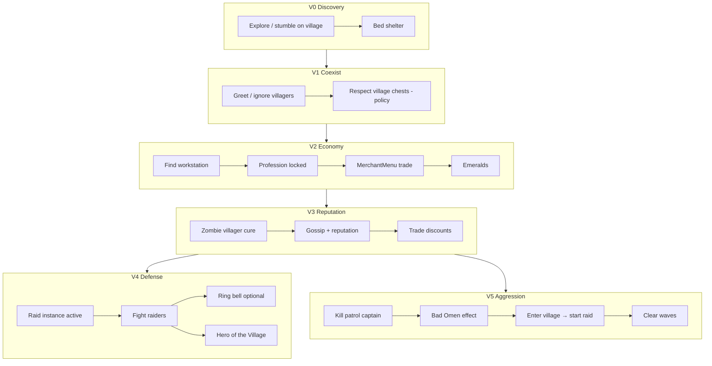

# RFC: Village & Raid autonomous progression (PlayerMob parity)

## RFC Identity

| Field | Value |
| --- | --- |
| **Project root** | `d:\Apps\Minecraft Port\Projects\SPMScavenger-1.21.1-Fabric` |
| **Host platform** | Social Player Mobs (`playermob`) v0.86.0 |
| **Target system** | **Vanilla Minecraft 1.21.1** — Village / Villager economy + **Raid** event (not SPM “raiding chests”) |
| **Reference AI** | **Mineflayer** (bot stack: pathfinder, inventory, plugins) + **human player** interaction parity |
| **Mode** | `WORKING_FROM_PLAN` — **V1 authorized and implemented** (User, 2026-08-14). V2+ remains design-only |
| **Status** | `RESEARCHING` — **V1 `IMPLEMENTED`** (V1-R1); V2+ design-only; no VR-T* runtime |
| **Nearest frontier** | **V1 perception driver** (cadence + mob-count budget), then **V4 Place-opinion bridge** design (D-VR-025/026); VR-T1 runtime |
| **Last update** | 2026-08-14 (Opinion↔Village boundary — User + Agent_Cursor; D-VR-025/026) |
| **Related** | `RFC-VANILLA-AUTONOMOUS-PROGRESSION.md`, `RFC-TOOL-TIER-UPGRADES.md`, `RFC-FURNACE-SMELTING.md`, `docs/wiki/Opinion-System.md` |
| **Gate** | MRFC-1, SPM-1 … SPM-5 |
| **Peer review** | `Agent_Cursor` · `Agent_ChatGPT` · `Agent_Claude` |

### Critical terminology (`CONFIRMED`)

| Term in SPM | Meaning | Village/Raid relevance |
| --- | --- | --- |
| `RaidContainersGoal` | **Loot player/village chests** | Antagonistic to villagers; not raid-event defense |
| `Raider` (vanilla) | Pillager faction mobs | SPM mixin makes them **hunt PlayerMobs** like players |
| `RaiderTargetsPlayerMobMixin` | Illagers target `PlayerMobEntity` | PlayerMob is **raid victim**, not vanilla raid initiator |
| Village companion spawn | `WorldGenRegionMixin` | Social spawn flavour; **not** economic integration |

---

## Executive Summary

**Player-interaction parity with a human player for village/raid content is `PARTIAL` at best today and `NOT PRACTICAL` for full economic + raid-initiation parity without substantial new systems.**

Social Player Mobs (`CONFIRMED` — source audit v0.86.0):

- **Can** fight illagers when engaged; use bows, shields, TNT, crystals; flee; eat; loot containers; greet villagers; sleep in beds; open doors; use commanded fake-player item use.
- **Cannot** autonomously trade with villagers, manage reputation/gossip, operate `MerchantMenu`, acquire `Bad Omen`, trigger or lead raid defense as a first-class citizen, ring bells tactically, cure zombie villagers, assign workstations, or interpret village POI graphs.
- **Actively conflicts** with “good villager citizen” play: `RaidContainersGoal` loots village chests at priority 3 (`CONFIRMED` — `PlayerMobEntity#registerGoals`).

**Mineflayer comparison:** Mineflayer achieves **scripted** parity for trading, pathing, and combat via plugins (`mineflayer-villager`, `mineflayer-pathfinder`). SPM achieves **reactive** combat and **scavenging** without a planner. Neither equals a human’s full menu/GUI literacy out of the box.

**Recommended integration:** Extend **`spmscavenger`** with a **`VillageInteractionDirector`** (see Topic below) that orchestrates perception, demand, personality, and task memory into executor goals — **without** turning `PlayerMobEntity` into a villager. Trading uses **`VillagerTradeAdapter`** (server-side, no fake GUI). Datapacks: **tags + test fixtures only**.

**Practical endgame for this RFC:** Autonomous **village ally** — defend during raids, trade via demand evaluation, bell alarm, population support, restock awareness — is **PARTIAL** feasible. Autonomous **full Hero-of-the-Village economy** (all professions, discounted hero trades, raid farming) is **NOT PRACTICAL** gen-1 without raid-credit bridges (`UNVERIFIED` for `Raid.addHero(Entity)` path).

---

## Topic: Reference parity — SPM vs Mineflayer vs human player

Comparison under **equivalent scenarios** (behaviour, not feature names).

### Scenario A — Discover village while exploring

| Behaviour | Human | Mineflayer | SPM today | Feasibility to extend |
| --- | --- | --- | --- | --- |
| Path into village | Yes | `pathfinder` goals | `WaterAvoidingRandomStrollGoal` / Scavenger `ExploringGoal` | **FULL** |
| Recognize village without `/locate` | Visual + structures | Chunk scan / POI plugin | No POI model | **PARTIAL** (cluster beds/workstations) |
| Avoid trampling crops | Sometimes | Configurable | `HarvestCropsGoal` breaks crops | **FULL** (disable harvest near village) |

### Scenario B — Trade with librarian for enchanted book

| Behaviour | Human | Mineflayer | SPM today | Feasibility |
| --- | --- | --- | --- | --- |
| Right-click villager | Opens `MerchantMenu` | `villager.trade()` plugin | `FriendlyGreetGoal` only (crouch/gift) | **REQUIRES MIXIN** + menu bot |
| Evaluate trade offer | GUI + knowledge | Scripted offer index | None | **PARTIAL** (offer scoring policy) |
| Pay emeralds + items | Click slots | Plugin | 8-slot backpack | **PARTIAL** (inventory limit) |
| Refresh trades | Break/replace workstation | Plugin | None | **REQUIRES API** (workstation access) |

### Scenario C — Raid defense (village under attack)

| Behaviour | Human | Mineflayer | SPM today | Feasibility |
| --- | --- | --- | --- | --- |
| Illagers target you | Yes | Yes | **Yes** (`RaiderTargetsPlayerMobMixin`) | **FULL** (already) |
| Fight wave mobs | Yes | `pvp` / equip | `WeaponAwareAttackGoal` | **FULL** |
| Protect villagers | Intentional | Scripted priorities | No ally filter; may hit villager | **PARTIAL** (target category + disposition) |
| Ring bell | Yes | Block activate | No autonomous bell use | **PARTIAL** (`InteractableCapability`) |
| Hide in house | Yes | Path to shelter | `SeekShelterGoal` (bed scoring) | **PARTIAL** |
| Win raid → Hero | Yes | If present as Player | **No** — not `Player` class | **REQUIRES MIXIN** (effect + raid Omen) |

### Scenario D — Start raid (kill captain → Bad Omen → enter village)

| Behaviour | Human | Mineflayer | SPM today | Feasibility |
| --- | --- | --- | --- | --- |
| Kill patrol captain | Combat | Combat | Combat works | **FULL** |
| Receive Bad Omen | Player effect | Effect API | **NOT FOUND** in SPM | **REQUIRES MIXIN** |
| Trigger raid on entry | Vanilla `Raid` system | Plugin | **UNVERIFIED** — likely **no** | **REQUIRES MIXIN** |
| Farm raid loot | Yes | Scripted | Can fight; no wave orchestration | **PARTIAL** |

### Scenario E — TACZ-style firearms (pattern example, not village target)

| Behaviour | Human | Mineflayer | SPM today | Feasibility |
| --- | --- | --- | --- | --- |
| Recognize mod gun | Item knowledge | Plugin registry | `ModdedRangedWeapons` config | **FULL** (config tags) |
| Reload via item use | Yes | `bot.activateItem()` | `ModdedRangedAttackGoal` + fake player | **FULL** (proven pattern) |
| Avoid allies | Yes | Friendly-fire filter | `DispositionResolver` + loved ones | **PARTIAL** |
| Seek ammo | Yes | `bot.collectBlock` | `SeekAmmoGoal` | **FULL** |

**Parity verdict:** SPM **matches or exceeds** Mineflayer for **reactive combat + modded item use lifecycle**. SPM **lags** Mineflayer for **trading, raid orchestration, and menu-driven progression**. Full human parity is **NOT PRACTICAL** without a dedicated trade adapter subsystem (not a client GUI).

---

## Topic: Human-player parity vs villager lifecycle (`D-VR-004`)

**Author:** `Agent_ChatGPT`  
**Status:** `LOCKED`

### What we want

```text
PlayerMob
    interacts with
         ↓
 Vanilla Village System
         ↓
Villagers / Golems / Bells / POIs / Raids
```

…like **Steve** would — **player-interaction parity**, not copying villager internal AI.

### What we explicitly reject

```text
PlayerMob
  → acquire profession
  → claim workstation
  → sleep like villager
  → gossip like villager
```

That is **entity-lifecycle parity** (becoming a villager). Out of scope.

### In-scope human-like capabilities

A PlayerMob can potentially (`INFERRED` product goal; implementation per phase):

| Capability | Notes |
| --- | --- |
| Discover a village | `VillageMemory` / `VillagePerception` |
| Trade | `VillagerTradeAdapter` + `TradeWithVillagerGoal` |
| Bring supplies | Gift / drop / trade inputs |
| Ring bells | `RingVillageBellGoal` — **FULL** (`BellBlock.ring(Entity, …)`) |
| Help villagers breed | Player actions (food + beds), not villager `canBreed()` calls |
| Move villagers | Boat/minecart push — **PARTIAL**; no lead AI gen-1 |
| Build/repair infrastructure | Scavenger place + future build goals — **PARTIAL** |
| Defend village | Composed raid support (bell + combat) |
| Trigger/avoid raids | **REQUIRES MIXIN** for Omen; avoid via utility policy |
| Benefit from trades | Demand-driven acquisition |
| Seek particular professions | `KnownVillager` registry |
| Cause restock (indirectly) | Workstation reachability assistance |
| Cure zombie villagers | `CureVillagerGoal` + adapter |
| Loot abandoned resources | SPM loot with `StorageOwnership` gate |
| Establish base nearby | `KnownVillage` affinity + shelter |
| Return later | Persistent `VillageMemory` |

---

## Topic: VillageInteractionDirector (`Agent_ChatGPT`)

**Author:** `Agent_ChatGPT`  
**Status:** `CONSENSUS` — preferred orchestration layer; supersedes ad-hoc village goals.

Central coordinator in **`spmscavenger`**. **No Brain migration.** Does not replace SPM `GoalSelector`; feeds it.

### Architecture

```text
  [Gates — Village / SPM / Shelter / Trade policy / Navigation]
                 VillagePerception  →  facts + legal candidates
                        │
       ┌────────────────┼────────────────┐
       ▼                ▼                ▼
 KnownVillagers    KnownVillage      ActiveRaid
       │                │                │
       └────────────────┼────────────────┘
                        ▼
              VillageInteractionDirector
              (factual utility among VALID options)
                        │
        ┌───────────────┼────────────────┐
        ▼               ▼                ▼
   WorkDemand      TaskMemory      VillageDayNightContext
   (trade need)    (interrupt)     (read-only)
        │               │                │
        └───────────────┼────────────────┘
                        ▼
         Opinion layer (soft rank only — D-VR-025)
         Place @ anchor + personality + affect + Activity/Entity prefs
                        ▼
                   Utility choice
                        │
   ┌──────────┬─────────┼─────────┬───────────┐
   ▼          ▼         ▼         ▼           ▼
 Trade      Farm      Social    Village      Raid
 Goal       Goal       Goal     Support      Support
   │          │         │         │           │
   └──────────┴─────────┼─────────┴───────────┘
                        ▼
                 SPM GoalSelector (priorities)
                        ▼
           Navigation / interaction executors
```

**Authority rule (`CONFIRMED` — `docs/wiki/Opinion-System.md`):** *Preference affects choice. Preference
does not create permission.* Opinion ranks **already-legal** village candidates; it cannot declare a
settlement valid, override raid/shelter mandates, or invent trade permission.

### Memory models (not `VillagerBrain`)

**`KnownVillage`** — settlement graph, not vanilla village object clone:

```text
KnownVillage
├── anchor / approximate center
├── bell positions
├── beds seen
├── workstations seen
├── known villagers (→ KnownVillager)
├── known containers (+ StorageOwnership)
├── crop areas
├── current danger / raid link
├── last visit tick
└── (no affinity in V1 — factual tier only; see Opinion↔Village topic)
```

**V1 code (`CONFIRMED`):** `KnownVillage` ships anchor, tier, observation quality only — explicitly **no**
villagers, offers, or affinity (`KnownVillage.java` class javadoc). `MobVillageMemory.designateHome()`
is the factual **HOME_VILLAGE** designation (`MobVillageMemory.java` L87–105).

**`KnownVillager`** — profession hunting registry:

```text
KnownVillager
├── UUID
├── profession + level
├── lastKnownPos
├── lastSeenTick
├── interestingOffers (cached snapshot)
└── restockBlocked? (workstation reach heuristic)
```

**Detection (`INFERRED`):** Several villagers + beds + bell/workstations → settlement; optionally consult vanilla POI via addon (`PARTIAL`). No `/locate` unless cheat profile.

### Mineflayer layering (copy abstraction, not implementation)

| Mineflayer | PlayerMob |
| --- | --- |
| API action → packets | `Task` → `Goal` → entity navigation |
| `openVillager()` / `trade()` | `VillagerTradeAdapter.performTrade()` |
| `find` / `pathfinder` | `VillagePerception` + SPM navigation |
| Compose jobs | `VillageInteractionDirector` utility choice |

**Do not** turn `PlayerMobEntity` into a fake networked player.

### Mixin scope (minimal)

| Needs mixin / bridge | Does not need mixin |
| --- | --- |
| Villager trade/reputation customer bridge | Bell ring |
| Raid trigger eligibility (Bad Omen) | Crop harvest/replant |
| Raid reward/credit (`heroesOfTheVillage`) | Door walk |
| Zombie-villager conversion attribution | Village memory |
| Advancement/stat parity (optional) | Inventory, social greet |

---

## Topic: Advanced village site selection & home anchoring (`Agent_Cursor`)

**Author:** `Agent_Cursor` (brainstorm continuation, 2026-08-14)  
**Status:** `PROPOSED` — extends V1 `KnownVillage` + V4 persistent relationship; **not** vanilla `/locate` cheat.

Parallels mining **advanced site selection** (`RFC-VANILLA-AUTONOMOUS-PROGRESSION.md` — `MiningDirector`
chooses cave vs tunnel vs return). Here the director chooses **which settlement** and **which in-village
anchor** to act on.

### Problem (observable)

A PlayerMob that stumbles into three bed clusters has no principled way to pick a **home village**,
a **trade run target**, or a **raid-defend priority** without hardcoding nearest chunk. Humans pick by
safety, remembered traders, distance, and prior outcomes — not Euclidean distance alone.

### Settlement tiers (`PROPOSED`)

```text
PASSING_THROUGH   — seen once; no repeat utility
TRADING_POST      — known useful villager(s); commute acceptable
HOME_VILLAGE      — defend + storage ally profile; highest interrupt priority
AVOID             — looted chests, hit villagers, golem hostility signals
```

Tier promotion/demotion is **utility-driven**, not a quest flag.

### Village site score — factual vs opinion split (`REVISED` — User + Agent_Cursor, 2026-08-14)

D-VR-009 locked the **tier vocabulary** and home designation. V4 utility-driven promotion must **not**
conflate village facts with personal preference — Opinion already owns the latter.

**Layer 1 — Village director (facts + legality only):**

```text
FactualVillageUtility =
    tradeNeedFit(MaterialDemand, knownOffers?)   // can this village satisfy a deficit?
  + safetyFacts(recentRaidAtAnchor)              // is it dangerous right now?
  + homeTierWeight(SettlementTier)               // HOME_VILLAGE factual designation
  - travelCost(pathDistance)
  - legalityPenalty(AVOID tier, blocked trade)
```

**Layer 2 — Opinion (soft rank among legal candidates):**

```text
OpinionVillageBias =
    PlaceOpinionRouteRanker.destinationBias(placeMemory, anchor.x, anchor.z)
  + personality.sociability * populatedSettlementFit(villagerDensity)
  + personality.adventurousness * noveltyFit(firstSeenRecency)
  + personality.curiosity * unexploredSettlementBonus
  - affect.stress * familiarPlaceBonus(lastSeenTick)   // stressed → prefer known anchor
  + EntityOpinionMemory for favourite traders (V2+, optional)
```

**Combined ranking (V4+):**

```text
foreach candidate in legalDestinations:
  if !VillagePerception.isValid(candidate): continue   // not a village / not visible
  if !TradePolicy.canExecute(candidate, offer): continue
  if ShelterAuthority.mustHold(): continue              // mandatory systems first
  score = FactualVillageUtility + OpinionVillageBias     // bias is tie-breaker scale (≤15 route)
pick max score
```

**Example (User):**

| System | Output |
| --- | --- |
| Village | A, B, C are **valid** trading destinations; C is **HOME_VILLAGE** (factual) |
| Opinion | "I like A more"; "bad experiences at B"; sociable → prefers populated; stressed → prefers familiar |
| Director | Chooses among **valid** options after gates; Opinion does not make B illegal |

**Must not happen:** negative Place opinion at village B **blocks** trade when `MaterialDemand` is
blocking and B is the only legal source. Opinion may prefer A when both are legal.

### In-village anchor selection (micro site selection)

Once a village is chosen, pick **which POI** to path to:

| Intent | Anchor candidates | Ranking |
| --- | --- | --- |
| Alarm | Known bells | Nearest reachable + line-of-sight to raiders |
| Trade | `KnownVillager` with restock | Offer utility − walk cost |
| Farm support | Crop clusters | Deficit-driven (`CropDemand`) |
| Raid hide (`EVACUATE`) | Shelter cells (SCR-2R5) | Interior tier + not villager-owned bed |
| Post-raid recovery | Safe retreat point from `RaidTask` | Last known interior during victory |

**Rejected:** flood-fill entire village POI graph gen-1; `/locate village`; chunk-global offer cache.

### Detection (`SUPERSEDED` — V1 shipped)

**Historical:** pre-V1 brainstorm proposed a bed-cluster heuristic. **D-VR-019 `LOCKED`:** detection is
`VillagePerception` bounded POI query reproducing vanilla raid-centre derivation (`VillagePerception.java`,
`VillageAnchorPolicy.java`). **`CODE_CONFIRMED`:** `KnownVillage`, `MobVillageMemory`, `SettlementTier`
ship in `com.noobk.spmscavenger.village`.

### Unblock

V1 **`IMPLEMENTED`** — detection + tier enum + home designation. **V4** ships factual utility scoring +
**Place-opinion bridge** at anchor (D-VR-025/026). V5 consumes `HOME_VILLAGE` for raid interrupt.

---

## Topic: Opinion ↔ Village boundary (`User` + `Agent_Cursor`)

**Author:** User (architecture); `Agent_Cursor` (RFC capture, 2026-08-14)  
**Status:** `CONSENSUS` — aligns with shipped Opinion central rule (`docs/wiki/Opinion-System.md`).

### Division of labour

| Question | Owner | Opinion may not |
| --- | --- | --- |
| Is this actually a village? | `VillagePerception` | Invent settlements |
| Is this POI visible / loaded? | `VillagePerception` | Clairvoyant POI |
| Is this my home? | `MobVillageMemory` / `SettlementTier` | Override `HOME_VILLAGE` designation |
| Is a raid occurring? | `Raid` / `level.getRaidAt` | Ignore active raid |
| Can I legally trade this offer? | `TradeEvaluationPolicy` / `WorkDemandPolicy` | Create affordance |
| Must I seek shelter? | Shelter authority (`SHELTER_HOLD`) | Rank REST above mandatory hold |
| Must I obey a player order? | SPM command goals | — |
| Can I path there safely? | Navigation / executor admission | Skip hard blockers |
| **Which legal village do I prefer?** | **Opinion** (soft) + Director (pick) | — |

Opinion comes **after** those gates.

### What Opinion may influence (V4+ discretionary village time)

- Which **legal** village to visit for trade
- Which **legal** trader to prefer among several
- Whether to spend discretionary time **socializing** in a village (`SOCIAL` + `FriendlyGreetGoal`)
- Whether to **revisit** a pleasant settlement (Place preference at anchor)
- Whether to **explore** a newly discovered settlement (`adventurousness` / `curiosity`)
- How strongly to prefer **familiar vs novel** settlements (`stress` + Place memory)
- Soft weight when **adopting** a home (factual designation remains `designateHome()`; Opinion does not
  auto-promote tier without product rule)

### Investigation — should villages become Opinion subjects?

**Question:** Does `KnownVillage` fit under existing **Place** opinion, or justify a new **SETTLEMENT**
subject type?

| Need | Place @ `KnownVillage.anchor` chunk | Dedicated SETTLEMENT subject |
| --- | --- | --- |
| "I like village A" / bad experience at B | **Yes** — `PlaceOpinionMemory` keyed by `ChunkPos` (`PlaceOpinionMemory.java`) | Duplicate preference store |
| Soft route bias to village | **Yes** — `PlaceOpinionRouteRanker` (`MAX_ROUTE_BIAS = 15`, GAO-5B) | Overkill |
| HOME_VILLAGE / TRADING_POST tier | **No** — factual `MobVillageMemory` | Wrong layer |
| Trader profession / offer memory | **No** — V2 `KnownVillager` + Entity opinion optional | Could blur subjects |
| Raid history at anchor | **No** — village factual record | Either works; keep factual |
| Sociability → populated settlements | **Yes** — personality × density heuristic in director bias | New subject unnecessary |

**Decision (`D-VR-026` `PROPOSED`):** **Do not add SETTLEMENT gen-1.** Map each `KnownVillage` to
`PlaceOpinionRouteRanker.destinationBias(placeMemory, anchor.getX(), anchor.getZ())`. Emit terminal
place learning at village outcomes via `PlaceOpinionService` pattern (raid defend success/failure,
pleasant trade, villager AOE accident — parallel `ExperienceEmitters` mining terminals).

**Evidence threshold to reopen SETTLEMENT:** Place at anchor chunk cannot express a settlement-specific
preference that (a) cannot live in `KnownVillage`/`KnownVillager` facts and (b) cannot use Entity
opinion for named traders — **after** V2/V4 ship and runtime proves the gap.

### Authority stack (village slice)

```text
world safety / combat threat
        ↓
player command
        ↓
nighttime SHELTER_HOLD / raid mandatory defend (profile-dependent)
        ↓
trade legality + navigation admission
        ↓
VillageInteractionDirector factual utility
        ↓
Opinion Place/Entity/Activity bias (≤ route tie-breaker magnitude)
        ↓
idle fallback
```

**Cross-link:** GAO-10 discretionary `SOCIAL` is the correct executor for "browse village socially" —
Opinion picks **who** to greet; Village supplies **where** the settlement is.

---

## Topic: Cross-system reuse — shelter, mining interrupt, activity admission (`Agent_Cursor`)

**Author:** `Agent_Cursor` (brainstorm continuation, 2026-08-14)  
**Status:** `CONSENSUS` direction — reuse shipped Scavenger primitives; **no** parallel raid mega-state.

### Shipped primitives to reuse (`CODE_CONFIRMED`)

| Primitive | Location | Village/raid use |
| --- | --- | --- |
| `TaskLifecycle` + interrupt snapshot | `progression/TaskLifecycle.java`, `MiningProject` | `RaidTask.previousTask` resume after victory |
| `MiningProjectEnd.COMBAT` | `MiningProjectEnd.java` | Precedent for raid → `INTERRUPTED` → resume iron demand |
| `ShelterCommitment` / SCR-2R5 | `SeekShelterGoal`, shelter RFC in Vanilla | `EVACUATE` profile hide during wave; not new `HideInHouseGoal` |
| `ShelterActivityEnvelope` | `FriendlyGreetShelterHoldMixin` | Already suppresses `RaidContainersGoal` during shelter hold |
| `WorkDemandPolicy` | `WorkDemandPolicy.java` | Trade evaluation input (`D-VR-007`); diamond/iron chain cross-RFC |
| `ActivityAdmission` pattern | Opinion RFC / `ActivityAdmissions` | Raid defense as **high-priority voluntary activity** with yield rules |
| `PlaceOpinionRouteRanker` | `PlaceOpinionRouteRanker.java` | Soft bias toward liked village anchors (D-VR-026) |
| `PlaceOpinionService` | `PlaceOpinionService.java` | Terminal learning from village outcomes at anchor chunk |
| `PersonalityModel` + `AffectiveState` | Opinion package | Sociability/adventurousness/stress biases in V4 site rank |

### Raid interrupt admission (`PROPOSED` — D-VR-010)

Borrow MI-14 **lease + resume** semantics without copying mining geometry:

```text
Acquire iron (TaskLifecycle.RUNNING)
  → getRaidAt(homeVillageAnchor) != null
  → snapshot previousTask + demand ticket
  → RaidTask.state = ACTIVE_WAVE
  → DEFEND / SUPPORT / EVACUATE via utility (existing raid topic)
  → raid ends SUCCESS
  → revalidate MaterialDemand
  → resume previousTask if still valid
```

**Must not happen:** raid ends → mob immediately loots village chest (`RaidContainersGoal`) before
re-checking `StorageOwnership` + ally profile.

### `RaidContainersGoal` ally gate (`CONFIRMED` need — D-VR-012)

`PlayerMobEntity#registerGoals` adds `RaidContainersGoal` at priority **3** (`CONFIRMED` —
`PlayerMobEntity.java` L835). Scavenger already mixin-blocks it during shelter hold
(`FriendlyGreetShelterHoldMixin` L20–22). **Gen-1 ally play** still needs a **predicate** on the goal
or a scavenger-side admission: `VILLAGE_ALLY` + container tagged `VILLAGE_PUBLIC` / unknown ownership
→ refuse. Full storage RFC remains deferred; **minimum predicate is V3 blocker**.

### Raider hostility side effect (`CONFIRMED`)

`RaiderTargetsPlayerMobMixin` adds `NearestAttackableTargetGoal` for `PlayerMobEntity` at priority **2**
on all `Raider` subclasses — **including Witch** (`RaiderTargetsPlayerMobMixin.java` L37–39). Village
defense planning must assume witches hunt PlayerMobs on sight during raids, not only pillagers.

### Shelter ↔ raid combat coupling (`CONFIRMED` — B-VR-21)

`ShelterThreatPolicy` (`ShelterThreatPolicy.java`) classifies `mob.getTarget() instanceof Enemy` with
nearby active threat as `NEARBY_HOSTILE`, which **overrides** shelter hold (`overridesShelter` → true).
Vanilla `Raider` subclasses implement `Enemy` (`INFERRED` — standard Monster hierarchy). **Effect:**
coward `EVACUATE` profile hiding in SCR-2R5 interior is **automatically ejected** when a raider
acquires the mob as target (`RaiderTargetsPlayerMobMixin` makes this likely during waves).

**Must happen:** coward profile reaches interior before first raider aggro.  
**Must not happen:** mob oscillates door ↔ bed every tick because threat classification flaps without
hysteresis — consider raid-wave grace window (`PROPOSED`).

**Design note:** Do **not** fork a parallel threat policy for raids gen-1; extend `ShelterThreatPolicy`
only if raider-specific hysteresis is required (D-VR-016).

### Iron golem neutrality (`CONFIRMED` design rationale)

PlayerMob avoids `Enemy` marker so golems do not auto-attack (`RaiderTargetsPlayerMobMixin` L24–26).
Golem anger still applies if mob hits villager — **friendly fire during raid AOE is a reputation risk**
(brainstorm catalogue L910); target filter must prefer `Raider` over `Villager` (`VR-7`).

---

## Topic: Day/night director arbitration (`Agent_Cursor`)

**Author:** `Agent_Cursor` (user-requested topic, 2026-08-14)  
**Status:** `PROPOSED` — extends `VillageInteractionDirector` + cross-system shelter/raid topics; **no** new night mega-goal.

### Problem (observable)

Village play is **time-gated** in ways the director must reconcile:

| Clock | Vanilla / SPM behaviour | Village RFC demand |
| --- | --- | --- |
| **Dusk → dawn** | `SeekShelterGoal` runs from tick **11500** (`DUSK`), not `isNight()` (`SeekShelterGoal.java` L249–271) | Mob paths home / village interior before dark |
| **Villager work hours** | Trades + workstation restock require villager awake and reachable | `TradeWithVillagerGoal` may fail at night |
| **Active `Raid`** | `level.getRaidAt(anchor)` independent of sun position | DEFEND / bell / EVACUATE can start at dusk |
| **Coward EVACUATE** | SCR-2R5 shelter hold | Conflicts with DEFEND unless profile + arbitration say otherwise |
| **Mandatory combat** | `ShelterInterruptionPolicy` → `OVERRIDE_AND_CANCEL` for `MANDATORY_COMBAT` | Raider aggro already ejects shelter (B-VR-21) |

Without a single arbitration contract, predictable failures include: mob beds through a home-village raid;
abandons shelter at dusk to path to a distant trader; or rings bell at dawn while villagers still sleep.

### Architectural rule (hard)

**Do not** add a parallel `NightDirector` or duplicate `SeekShelterGoal` scheduling inside village code.

`VillageInteractionDirector` publishes **time-aware admission** and **activity class** for village/raid
executors; existing shelter and SPM goals remain executors.

```text
World clock + dimension rules
        ↓
VillageDayNightContext (read-only)
        ↓
VillageInteractionDirector.arbitrate(...)
        ↓
ActivityAdmission per intent (trade / raid / shelter commute / farm)
        ↓
ShelterInterruptionPolicy + TaskLifecycle (existing)
        ↓
SPM GoalSelector executors
```

### `VillageDayNightContext` (`PROPOSED` — pure, impure-probe-free)

Bounded read-only facts — **no** goal mutation during observation (Compatibility Contract #12):

| Field | Source |
| --- | --- |
| `shelterWindowActive` | `SeekShelterGoal.shelterTime(level)` semantics — dusk 11500 → dawn 23000 |
| `villagerWorkWindow` | `!level.isDay()` defer trade; optional stricter “villagers sleeping” heuristic |
| `raidActiveAtHome` | `getRaidAt(homeVillageAnchor) != null` |
| `raidActiveNearby` | `getRaidAt(mob.blockPosition())` |
| `shelterHoldActive` | `ShelterNightAuthority` / `ShelterActivityEnvelope` |
| `profile` | `VillageScenarioProfile` (ALLY / COWARD / …) |

Fixed-time dimensions (Nether/End): shelter window **false** — director must not schedule village night
commute there (`CONFIRMED` — `SeekShelterGoal` L257–258).

### Priority matrix (`PROPOSED` — gen-1)

Higher row wins when intents conflict. Reuse `ShelterInterruptionPolicy` for shelter hold vs displacement;
this matrix is **director-level** intent selection before goals start.

| Priority | Condition | Winning intent | Notes |
| --- | --- | --- | --- |
| 1 | `MANDATORY_COMBAT` / player attack order | Combat (SPM P2) | Already overrides shelter |
| 2 | `raidActiveAtHome` + `HOME_VILLAGE` + `DEFEND` utility | Raid DEFEND / SUPPORT | D-VR-010 interrupt snapshot |
| 3 | `raidActiveAtHome` + `COWARD` profile | EVACUATE (SCR-2R5) | Not DEFEND; may still lose hold to aggro (B-VR-21) |
| 4 | `shelterWindowActive` + no home raid + no mandatory combat | Night shelter / commute to village anchor | Defer discretionary trade |
| 5 | `villagerWorkWindow` + trade demand urgent | Trade run (day) | Defer “browse” trades |
| 6 | `shelterWindowActive` + `raidActiveNearby` (not home) | Profile-dependent: TRADER flees; ALLY may assist | B-VR-14 product boundary |
| 7 | Default discretionary | Farm / social / explore per utility | |

**Must happen:** raid at **home** during dusk → mob does **not** enter new bed sleep until raid resolved or
EVACUATE profile explicitly chosen (raid intent preempts shelter **adoption**).  
**Must not happen:** mob sleeps through wave 1 at home village bell while raiders kill villagers.

**Must happen:** trade for emeralds deferred until day when villager asleep and no raid interrupt.  
**Must not happen:** infinite “wait for morning” if raid lasts multiple nights — raid hold persists (D-VR-010).

### Integration with existing systems (`CODE_CONFIRMED` seams)

| System | Arbitration hook |
| --- | --- |
| `SeekShelterGoal` | Shelter window already uses dusk, not `isNight()` — align `VillageDayNightContext` with same constants or shared helper |
| `ShelterInterruptionPolicy` | `MANDATORY_COMBAT` → `OVERRIDE_AND_CANCEL` — raid defense should classify as mandatory combat when `RaidTask` active at home |
| `TaskLifecycle` / `RaidTask` | Night does not clear `INTERRUPTED` mining/trade tickets (D-VR-010) |
| `RingVillageBellGoal` | Allowed during raid regardless of shelter window; **blocked** during voluntary bed sleep |
| Restock deferral (trade topic) | “night → defer” becomes director admission `BLOCKED` with reason `VILLAGER_SLEEPING` |

### Coward vs defender at dusk (`MAIBS pre-mortem`)

| Minute | DEFEND profile | COWARD profile |
| --- | --- | --- |
| 0–1 | Dusk; raid horn; paths bell or edge | Paths SCR-2R5 interior |
| 1–3 | Fights raiders; shelter hold cancelled via combat | In bed / interior |
| 3–5 | If low health: eat, not sleep | Raider aggro → ejected from shelter (B-VR-21) |
| 5+ | Raid ends → may sleep if still shelter window | Re-hide or flee village |

**Strongest objection:** classifying raid DEFEND as `MANDATORY_COMBAT` may over-preempt **Opinion**
discretionary REST at night — village director must own **village-scoped** raid admission, not global
combat reclassification.

**Viable alternative:** raid-at-home sets `VillageRaidAuthority` hold (mirror `ShelterNightAuthority`)
that blocks new shelter adoption but does not cancel in-progress eating/healing.

### Phased delivery

| Phase | Scope |
| --- | --- |
| **V1** | `VillageDayNightContext` read model + inspector field; no new goals |
| **V2** | Trade admission respects `villagerWorkWindow` |
| **V5** | Full matrix rows 1–4 + raid-vs-shelter preempt; VR-T5 dusk-raid scenario |

### Open product decisions

- **Nearby raid, not home** (matrix row 6): does `VILLAGE_ALLY` commute to defend a `TRADING_POST` tier village at night?
- **Multi-night raid:** sleep deprivation is human-realistic — allow bed only `BETWEEN_WAVES` if raid state permits?

---

## Topic: Vanilla API mapping verification (`Agent_Cursor`)

**Author:** `Agent_Cursor` (brainstorm continuation 2, 2026-08-14)  
**Status:** `CONFIRMED` — pinned 1.21.1 Mojmap via project Loom cache  
**Evidence:** `.gradle/loom-cache/source_mappings/1425f5a1b73d8da53d978a43e065a7bbd26518ca.tiny`

| RFC / colloquial name | Mojmap symbol | Signature | Implementation note |
| --- | --- | --- | --- |
| `BellBlock.ring` | **`BellBlock.attemptToRing`** | `(Entity, Level, BlockPos, Direction) → boolean` | Entity initiator **not** `Player`-typed; use block interaction executor |
| `Raid.addHero` | **`Raid.addHeroOfTheVillage`** | `(Entity) → void` | Heroes stored in `heroesOfTheVillage` set — **may** accept `PlayerMobEntity`; reward path still `UNVERIFIED` |
| Trade UI | **`MerchantMenu`** | player-gated inventory | `VillagerTradeAdapter` must bypass menu (`D-VR-005`) |
| Bad Omen | **`BadOmenMobEffect`** + `Raid.absorbRaidOmen(ServerPlayer)` | player-centric | PlayerMob bridge required (`D-VR-002`) |

**NOT FOUND** (3 probes each, Scavenger `src` + SPM `src`): `BadOmen`, `HeroOfTheVillage`, `MerchantMenu`.

**Unblock:** D-VR-008 can move from CONSENSUS → **LOCK RECOMMENDED** with `attemptToRing` naming;
D-VR-002 evidence upgraded from `INFERRED` to **mapping CONFIRMED** for hero *registration* only
(effect/discount path still runtime `UNVERIFIED`).

---

## Topic: Vanilla player-gate audit — where the `Player` type actually blocks us (`Agent_Claude`)

**Author:** `Agent_Claude` (brainstorm continuation 3, 2026-08-14)
**Status:** `CODE_CONFIRMED` — bytecode read from the pinned 1.21.1 Mojmap-named merged jar
**Evidence:** `.gradle/loom-cache/minecraftMaven/net/minecraft/minecraft-merged-1425f5a1b7/1.21.1-loom.mappings.1_21_1.layered+hash.2198-v2/…jar`, via `javap -p -c`

### Why this audit exists

The RFC repeatedly reasons from **API names and signatures** — "`absorbRaidOmen(ServerPlayer)` is
player-centric → REQUIRES MIXIN". A signature is where a gate is *declared*; it is not necessarily
where the gate *is*, nor how wide it is. Three of the four village subsystems turn out to be gated in
a **different place and at a different width** than the RFC assumed, and the difference is worth
several phases of work.

Method bodies were read, not signatures. Each claim cites its opcode offset.

| Subsystem | RFC assumption | What the bytecode says | Verdict |
| --- | --- | --- | --- |
| Hero of the Village | `REQUIRES MIXIN` — "award effect on raid win" (VR-11) | **One `EntityType` comparison** in `Raider#die`; the award loop accepts any `LivingEntity` | **Much cheaper** |
| Villager reputation | `REQUIRES API` — "map PlayerMob UUID" (VR-4) | Gossip write path is **already entity-agnostic** and running today | **Already native** |
| Village detection | Hand-rolled cluster heuristic (D-VR-009) | Vanilla defines it as a **POI tag query**, and the raid system uses that definition | **Mirror it** |
| Raid initiation | `REQUIRES MIXIN` (VR-9/VR-10) | `ServerPlayer` all the way down, including entity-level omen state | **Confirmed hard** |

---

### F1 — Hero of the Village: a single type comparison, not a reward reimplementation

`Raider#die(DamageSource)` (offsets 39–58):

```java
Entity killer = source.getEntity();
Raid raid = this.getCurrentRaid();
if (raid != null) {
    if (this.isPatrolLeader()) raid.removeLeader(this.getWave());
    if (killer != null && killer.getType() == EntityType.PLAYER) {   // <-- the ONLY gate
        raid.addHeroOfTheVillage(killer);
    }
}
```

`Raid#addHeroOfTheVillage(Entity)` (offsets 0–14) is a bare `heroesOfTheVillage.add(entity.getUUID())`.
The victory award loop in `Raid#tick` (offsets 617–742) then does:

```java
for (UUID uuid : heroesOfTheVillage) {
    Entity e = level.getEntity(uuid);                            // getEntity, NOT getPlayerByUUID (656)
    if (e instanceof LivingEntity hero && !e.isSpectator()) {    // LivingEntity, NOT Player       (663)
        hero.addEffect(new MobEffectInstance(
                MobEffects.HERO_OF_THE_VILLAGE, 48000, raidOmenLevel - 1, …));                  // (684–710)
        if (hero instanceof ServerPlayer p) {                    // player-only AFTER the award   (713)
            p.awardStat(Stats.RAID_WIN);
            CriteriaTriggers.RAID_WIN.trigger(p);
        }
    }
}
```

**Consequence.** Everything downstream of that type check — UUID storage, `setDirty()` persistence,
the 48000-tick duration, the amplifier derived from `raidOmenLevel`, spectator exclusion, and the
effect application itself — **already works for a `PlayerMobEntity`**. Only `awardStat` and the
advancement are player-only, and both are meaningless for a mob.

So VR-11 is not "reimplement the hero reward". It is: widen one comparison in `Raider#die` so a
`PlayerMobEntity` killer also reaches `addHeroOfTheVillage`. A `@Redirect` on that single
`getType()` / `if_acmpne` pair — or an `@Inject` at `TAIL` that calls `addHeroOfTheVillage` when our
own predicate matches — is the whole feature.

**Why this is an unusually good mixin target:** it is a public override on a vanilla class the addon
*already* mixes into for raider hostility; the gate is a **single comparison against a registry
constant** rather than a control-flow shape; and failure degrades to *vanilla behaviour* — no hero
credit — rather than to a broken raid.

**Objection (mine, unresolved).** `HERO_OF_THE_VILLAGE`'s actual *benefit* is the trade discount,
applied by `Villager#updateSpecialPrices(Player)` — **player-typed**. The mob therefore receives a
genuine, persistent, visible effect instance that vanilla will never convert into cheaper trades.
That is acceptable here **only** because D-VR-005 already owns the trade path: `VillagerTradeAdapter`
can read the mob's own `HERO_OF_THE_VILLAGE` amplifier and apply the discount arithmetic itself. Had
we chosen a fake-GUI trade design, this effect would have been purely decorative. Recording that as a
non-obvious dependency: **F1's gameplay value is contingent on D-VR-005 holding.**

---

### F2 — Villager reputation is already entity-agnostic, and already running

`Villager#onReputationEventFrom(ReputationEventType, Entity)` (offsets 0–116) — every branch keys on
`entity.getUUID()` with **no** `Player` check:

| Event | Gossip written |
| --- | --- |
| `ZOMBIE_VILLAGER_CURED` | `MAJOR_POSITIVE +20`, `MINOR_POSITIVE +25` |
| `TRADE` | `TRADING +2` |
| `VILLAGER_HURT` | `MINOR_NEGATIVE +25` |
| `VILLAGER_KILLED` | `MAJOR_NEGATIVE +25` |

Dispatch is equally ungated. `Villager#setLastHurtByMob(LivingEntity)` (offsets 21–50):

```java
level.onReputationEvent(ReputationEventType.VILLAGER_HURT, attacker, this);  // unconditional   (26)
if (this.isAlive() && attacker instanceof Player) {
    level.broadcastEntityEvent(this, (byte) 13);      // angry particles — COSMETIC ONLY     (36–50)
}
```

The **only** `instanceof Player` in the entire `Villager` class is that particle broadcast.
`Villager#die` → `tellWitnessesThatIWasMurdered(Entity)` is likewise ungated, spreading
`VILLAGER_KILLED` to every nearby `ReputationEventHandler` witness.

**Consequence — this is present-tense, not future-tense.** A PlayerMob that clips a villager with an
AOE **today, with zero addon code**, already writes `MINOR_NEGATIVE 25` into that villager's gossip
under the mob's own UUID, and already tells the witnesses. B-VR-13 "witness resentment on villager
AOE" is therefore **not a feature to build** — it is an **existing consequence to measure and
expose**.

This also reclassifies VR-4. The *write* path needs nothing at all. The *read* path,
`Villager#getPlayerReputation(Player)`, is a `Player`-typed convenience wrapper over the UUID-keyed
`GossipContainer` — so what V3/V4 needs is a **`gossips` field accessor**, not a "reputation bridge".
Accessor mixins are the cheapest and most update-stable class of mixin available.

**Open question (evidence needed before V3).** Does anything *consume* that reputation for a
non-player? Golem aggression and trade discount are the two consumers, and both are expected to be
player-typed. If both are, the mob accrues a real reputation the world never acts on — accurate
bookkeeping with no gameplay consequence until our own systems read it. That is still worth having
(it is the honest input for `KnownVillage` affinity, B-VR-25), but it must not be *described* as
"villagers remember you" until a consumer exists.

---

### F3 — Vanilla already defines "village", and the raid system uses that definition

`Raids#createOrExtendRaid` (offsets 44–65) determines the raid's village and centre as:

```java
PoiManager.getInRange(
        holder -> holder.is(PoiTypeTags.VILLAGE),     // a TAG                            (offset 51)
        pos, 64, PoiManager.Occupancy.IS_OCCUPIED)    // claimed ⇒ actually inhabited     (57–62)
    .toList()                                         // → centroid → raid centre
```

`data/minecraft/tags/point_of_interest_type/village.json`, read from the same jar:

```json
{ "values": ["#minecraft:acquirable_job_site", "minecraft:home", "minecraft:meeting"] }
```

Every workstation, plus beds, plus the bell — exactly the RFC's intended signal set, already expressed
as a **datapack-extensible tag** rather than a block list.

**Under Gate SPM-0's ladder**, the RFC's proposed heuristic ("≥2 villagers + ≥3 beds OR bell +
workstation within radius R, merge clusters by anchor distance") sits near the bottom: it enumerates
what a tag already expresses. `PoiTypeTags.VILLAGE` + `IS_OCCUPIED` is **level 3–4** — it mirrors the
consuming system's own predicate, and any datapack or mod registering a village-ish POI becomes a
village to our mob for free.

**The correctness argument is stronger than the elegance one.** D-VR-010's entire interrupt trigger is
`getRaidAt(homeVillageAnchor) != null`, and `Raids#getNearbyRaid` compares
`raid.getCenter().distSqr(pos)` against a radius. If `KnownVillage.anchor` is a hand-rolled bed
centroid while the raid centre is a POI centroid, the two disagree by an unbounded amount in any
village with an off-centre bed cluster — and **D-VR-010 silently never fires**. Not a crash, not a log
line: the mob keeps mining while its home village burns, which is precisely the failure D-VR-010
exists to prevent. Deriving our anchor from the same query makes the two agree **by construction**.

Cost drops too: `PoiManager` is a sectioned spatial index exposing `getCountInRange` and
`findClosestWithType`, so V1 perception becomes an indexed lookup rather than a block scan.

**Objection I must raise against my own finding — fake-intelligence risk.** `PoiManager` extends
`SectionStorage` and will happily read **persisted POI sections for chunks that are not loaded**.
Queried naively, the mob gains knowledge of villages it has never been near — exactly the omniscience
the Brainstorm skill forbids, and *worse* than the cluster heuristic it replaces, because the cluster
heuristic could only ever see loaded blocks. The query **must** be bounded to loaded / simulation-
distance chunks, and discovery must still require the mob to have been present. `PoiManager` supplies
the **predicate and the anchor**; it must not supply the **discovery**. This is a must-not-happen test,
not a design note.

---

### F4 — Raid initiation: confirmed hard, and hard at the entity level

The RFC is right about V6 initiation, and the reason is deeper than one signature:

| Symbol | Type | Access |
| --- | --- | --- |
| `Raids#createOrExtendRaid(ServerPlayer, BlockPos)` | `ServerPlayer` | `public` |
| `Raids#getOrCreateRaid(ServerLevel, BlockPos)` | player-free | **`private`** |
| `Raid#absorbRaidOmen(ServerPlayer)` | `ServerPlayer` | `public` |
| `ServerPlayer#setRaidOmenPosition` / `getRaidOmenPosition` / `clearRaidOmenPosition` | — | declared on **`ServerPlayer`**, not `Entity` |

1.21's omen rework is **two-stage** — `BadOmenMobEffect` → (on entering a village) `RaidOmenMobEffect`
→ raid — and the intermediate state lives in fields **on `ServerPlayer` itself**. A PlayerMob has
nowhere to hold it. V6 initiation therefore needs an accessor onto the private `getOrCreateRaid` plus
our own omen state, or a broader `ServerPlayer`-shaped shim. Both are `MIXIN_FRAGILE`; neither is
V1–V5 work.

**This is the one place the RFC understated the difficulty** — and it is worth stating plainly that the
two ends of raid parity have **opposite** difficulty from what the phase ordering assumes: *winning*
credit is nearly free, *starting* a raid is the hardest thing in this RFC.

---

### MAIBS-1 — behavioural prediction for the F3 anchor change

Ordinary village, bell at the south edge, bed cluster to the north; mob's home anchor set on arrival.

| Minute | Hand-rolled bed centroid (D-VR-009 as written) | POI-tag anchor (F3) |
| --- | --- | --- |
| 0–2 | Anchor lands in the bed cluster, ~30 blocks north of the bell | Anchor lands on the POI centroid, within metres of the raid centre |
| 3 | Raid spawns; `Raid.getCenter()` is the POI centroid | Same centre |
| 3–4 | `getRaidAt(homeAnchor)` — **may return null**; mob keeps mining, no log, no error | Returns the raid; D-VR-010 snapshot fires |
| 4–8 | Villagers die; mob arrives only if a raider happens to path to it and aggro fires | Mob paths to bell / engages |
| 8+ | Post-mortem indistinguishable from "raid interrupt not implemented" | Interrupt/resume observable |

**Must happen:** `KnownVillage.anchor` and `Raid.getCenter()` for the same settlement agree within the
`getNearbyRaid` radius.
**Must not happen:** the mob knows about a village whose chunks it has never had loaded.

---

## Topic: V1-R1 — memory lifecycle, settlement identity, anchor evidence (`Agent_Claude` + User)

**Status:** `IMPLEMENTED` (static) — 852 tests, 3 negative controls
**Origin:** User review of V1, 2026-08-14. One blocker, two redesigns. All three confirmed in code
before repair.

---

### P0 — generic unload deleted persistent memory (**BLOCKER**)

`SpmScavenger` called `VillageMemorySavedData.get(world).forget(mob.getUUID())` from
`ServerEntityEvents.ENTITY_UNLOAD`, and `forget` removes the mob's entry from persisted `SavedData`.
Fabric defines `ENTITY_UNLOAD` as **any** entity leaving a server world — a chunk unloading, a player
walking away. Not death.

So the lifecycle contract was backwards: a PlayerMob could remember villages through NBT and have
the record erased by wandering out of range, before the memory ever had a chance to matter.

**Root cause worth recording.** The call was written by copying the shape of its neighbours —
`SocialAdmissionSeam.release`, `OpinionExperienceRegistry.parkOnUnload` — without checking their
semantics. Those release **runtime** state, which genuinely should die on unload. This is persisted
`SavedData`. The rule now written into the class:

> **Generic unload parks or releases runtime state. Only permanent removal deletes semantic memory.**

**The test was part of the defect.** `VillagePerceptionContractTest` asserted *exactly two* `forget`
call sites — unload and death — so the structural test **enforced** the bug it was meant to guard.
A structural test locks in a wrong invariant exactly as firmly as a right one. The assertion now
encodes the semantics (*only permanent removal deletes*), not the shape that happened to be in the
file when it was written. This generalises beyond this repo and is a candidate for Reflection.

**RET-1 still has to hold without that call site.** Death alone cannot reach a mob removed without a
death event (discarded, killed while unloaded, removed by another mod). Two load-time bounds close
it, both with production callers:

| Bound | Value | Rationale |
| --- | --- | --- |
| `MEMORY_TTL_TICKS` | 30 in-game days | long enough to outlive the absence unload causes — the whole point of the repair — short enough that a vanished mob does not persist forever |
| `MAX_TRACKED_MOBS` | 256 per dimension | hard ceiling, stalest evicted first |

Pruned at `SERVER_STARTED`, not per tick: a stale entry belongs to a mob that is not ticking, so a
per-tick sweep would be looking for something that cannot appear between loads. **Residual, stated
honestly:** such an entry survives until the next world load, bounded by the cap.

---

### P1a — raid association had been promoted into village identity

`sameSettlement()` treated anchors within 96 blocks as one `KnownVillage`, justified by vanilla's
raid lookup radius. The User's counter-example is decisive and was unrepresentable:

```text
Village A  — HOME_VILLAGE, where the mob sleeps and stores
Village B  — 85 blocks away, TRADING_POST, has the good librarian
```

One entry cannot hold two tiers. Every later feature keyed on identity — affinity, storage ownership,
trade routing, community projects — would have inherited the collapse.

**Vanilla considering two centres one raid neighbourhood is a statement about raids.** It is not a
statement about what the mob should treat as one place. Split:

| Policy | Question | Radius | Owner |
| --- | --- | --- | --- |
| `VillageIdentityPolicy` | "is this the same village I remember?" | **48** (ours, `UNVERIFIED`) | cognitive model |
| `RaidAssociationPolicy` | "is vanilla's raid here my village's raid?" | **96** (`9216`, must not drift) | vanilla compatibility |

`RaidAssociationPolicy.associatedVillages` returns **every** match rather than the nearest, so one
raid covering a HOME_VILLAGE and a nearby TRADING_POST is now representable. The natural consumer
rule — highest tier wins — is a decision the collapsed model could not even pose.

**The 48 is a judgement, labelled as one.** There is no vanilla constant for "one settlement" because
vanilla has no settlement identity; villages are emergent POI density, which is exactly why the value
has to be ours. It is village-scale and sits below the 64-block query radius so two views of one
settlement converge rather than fork (regression: same settlement seen from two sides, 25 blocks
apart, still merges). **Too small** produces duplicate entries inside one village — visible and
cheap to fix. **Too large** collapses distinct settlements irreversibly and is invisible. Erring
small is the recoverable direction.

**The evidence-backed upgrade, deferred:** identity by admitted-POI-set overlap rather than anchor
distance — exact and radius-free. Deferred because it means storing POI positions per remembered
village rather than a count, and there is no runtime evidence yet that a radius is insufficient.

---

### P1b — POI quantity was the only confidence score

`withStrongerObservation` accepted a new anchor only when `newPoiCount > oldPoiCount`. That protected
a good anchor from an edge glance — the real risk it was written for — but froze the anchor of any
settlement that genuinely changed:

| Case | Old rule | Consequence |
| --- | --- | --- |
| village loses buildings, 20 POIs → 16 | `16 <= 20` → rejected | anchor **never** updates again |
| village rebuilt in place, 20 → different 20 | `20 <= 20` → rejected | same |

Both drift out of agreement with `Raid.getCenter()` — D-VR-019's failure reached from the opposite
direction. *"More POIs"* is a proxy for *"better view"* that stops being true the moment the
settlement is the thing that changed.

**The right signal was already being computed and thrown away.** `VillagePerception.Observation`
carries `withheldPoiCount` — POIs inside the query radius whose chunks the boundary refused — and
`VillageMemorySavedData.record()` passed only `admittedPoiCount`. That is a direct measure of *how
much of the settlement the mob could see*, independent of settlement size.

`ObservationQuality(admitted, withheld)` → `completeness()`, and the acceptance rule becomes:

```text
better view                 -> replace   (strictly more of the settlement was seen)
equally good view + newer   -> replace   (the settlement itself may have changed)
worse view                  -> keep      (an edge glance must not degrade a good anchor)
```

The middle line is the repair: under quantity comparison, *"equally good and newer"* was
indistinguishable from *"no new information"*. A 3-admitted/25-withheld rim glance still cannot
overwrite a complete view however recent, and a 9/9-complete view now correctly beats an
18-admitted/12-withheld partial one.

**NBT migration:** rows written before V1-R1 carry a bare `poiCount` and load as *complete*
observations of that size — deliberately optimistic, because treating every pre-upgrade anchor as
worthless would let the first partial glance after the update overwrite a good anchor, which is the
defect the rule exists to prevent.

---

### Verification

852 tests, 0 failures. Three negative controls, each restoring the original defect:

| Control | Fails |
| --- | --- |
| re-add the `ENTITY_UNLOAD` deletion | `mustNotHappen_unloadHandlerDeletesVillageMemory`, `mustHappen_villageMemoryIsEvictedOnDeathOnly` |
| identity radius back to `9216` | `mustHappen_twoSettlements85BlocksApartStaySeparate`, `mustHappen_oneRaidCanCoverBothRememberedVillages`, `mustHappen_identityIsTighterThanRaidAssociation` |
| acceptance rule back to `admitted > stored.admitted()` | `mustHappen_shrunkenVillageUpdatesItsAnchor`, `mustHappen_rebuiltVillageUpdatesItsAnchor`, `mustHappen_moreCompleteViewWinsOverLargerCount` |

Still `STATIC_CONFIRMED` only — no PlayerMob has perceived a village in a running world.

---

## Topic: Trade demand integration — `WorkDemandPolicy` facade (`Agent_Cursor`)

**Author:** `Agent_Cursor` (brainstorm continuation 2, 2026-08-14)  
**Status:** `PROPOSED` — reconciles D-VR-007 with production code

`MaterialDemandPolicy` is cited across RFCs (`D-TTU-017`) but **NOT FOUND** in Scavenger `src/main`
(3× probe: glob, `rg MaterialDemandPolicy`, package scan). Production arbitrator:

```text
WorkDemandPolicy.java
  → record MaterialDemand(materialKey, derivedDeficit, consumerKey)
  → select() among charcoal / iron-tool smelt demands today
```

**Gen-1 trade integration (`PROPOSED` — B-VR-20):**

```text
TradeEvaluationPolicy
  → scores MerchantOffer against MaterialDemand tickets
  → emerald consumerKey: "trade:<profession>:<offerIndex>" or "wealth:emerald"
  → VillagerTradeAdapter.performTrade mutates villager offers + mob backpack atomically
```

Do **not** block V2 on renaming `WorkDemandPolicy` → `MaterialDemandPolicy`; add a thin
`TradeDemandFacade` or extend `consumerKey` vocabulary. Cross-RFC iron/diamond chains stay on
existing `WorkDemandPolicy` paths.

**Must happen:** "need 27 emeralds" creates a demand ticket trade evaluation can satisfy.  
**Must not happen:** parallel emerald-hoarding goal fights `TradeWithVillagerGoal` without director arbitration.

---

**Author:** `Agent_ChatGPT`  
**Status:** `CONSENSUS` — hardest boundary; replaces generic `TradeCapability` sketch.

### Hard boundary (`CONFIRMED` design constraint)

Vanilla merchant contract is **player-centric**: `Merchant` stores a player customer; menu APIs expect `Player`. Mineflayer exposes explicit `openVillager()` / `trade()` — SPM has neither.

| Approach | Trading parity |
| --- | --- |
| Datapack | **No** |
| KubeJS | Partial / fake |
| Events only | Partial |
| **Compat addon (`spmscavenger`)** | **Yes — preferred** |
| Addon + Mixins/accessors | **Strongest** |
| Direct SPM source edit | Yes, unnecessary (licence) |

### Recommended design

**Do not create a fake GUI.** Server-controlled mob needs no client menu.

**`VillagerTradeAdapter`** (pure + bridge):

```text
inspectOffers(villager, mob)
evaluateOffers(...)      ← TradeEvaluationPolicy / MaterialDemand
canAfford(backpack, offer)
performTrade(...)          ← vanilla MerchantOffer mutation semantics
```

**`TradeWithVillagerGoal`** executor:

```text
pick villager
  → walk over
  → face villager
  → inspect offers
  → choose useful offer (utility, not hardcoded profession)
  → execute one trade (atomic inventory)
  → pause
  → optionally trade again
  → leave
```

### Demand-driven evaluation (not “librarian = good”)

Plug into future **`MaterialDemandPolicy`** (`RFC-TOOL-TIER-UPGRADES` D-TTU-017):

```text
MaterialDemand: need 27 emeralds

Villager offers:
  20 wheat → 1 emerald
  15 carrots → 1 emerald
  coal → 1 emerald

Policy computes: stock, acquisition cost, restock state, demand
→ decision: "Sell carrots."
```

Reverse chain:

```text
Demand: specific useful item (e.g. mending book)
  → villager trade can satisfy
  → acquire emeralds (gather/craft/loot/trade)
  → return to known librarian
```

**Acquisition strategies** (unified):

```text
Need X → gather | craft | loot | process | trade
```

### Restock awareness (emergent)

Villagers restock at workstation (up to twice per day; must **reach** POI — Mojang workstation logic).

```text
desired trade unavailable
  → villager needs restock?
  → workstation reachable?
      blocked → open door / clear obstruction (if ALLY + mobGriefing)
      missing → optionally place workstation (policy)
      night → defer
  → wait → return when restocked
```

Example emergent sequence (`UNVERIFIED` runtime): *"That librarian isn't working."* → inspect lectern → open door → wait → trade.

### Trade curiosity (personality)

Not every trade must be optimal (`Agent_ChatGPT`):

- Unfamiliar profession → inspect offers → leave
- Villager leveled up → re-check offers
- Wandering Trader → browse → mild purchase
- Idle browsing when no urgent `MaterialDemand`

---

## Topic: Bells, farming, population, golems (`Agent_ChatGPT`)

### Bells — **FULL** practical parity

`BellBlock.attemptToRing(Entity, Level, BlockPos, Direction)` — initiator **not** restricted to
`Player` (`CONFIRMED` — Mojmap pin; see API mapping topic).

**`RingVillageBellGoal`** triggers:

| Trigger | Rationale |
| --- | --- |
| Raid detected | Alert villagers; reveal raiders (vanilla bell behaviour) |
| Large nearby threat | Alarm |
| Curiosity trait | Ring once for no reason |
| Another mob rang bell | Look toward bell |
| Raid ended | Celebration ring (unnecessary = human) |

**Intelligent defense composition** (prefer over monolithic `DefendVillageGoal`):

```text
exposed villagers + active raid + known bell
  → go to bell → ring → villagers retreat
  → PlayerMob moves to village edge → existing combat engages raiders
```

### Population support — **FULL** practical parity

**Not** calling villager `wantsToStartBreeding()` directly. **Player parity:**

```text
recognize low population (bed count vs villager count heuristic)
  → collect food (HarvestCropsGoal / hunt)
  → throw food to villagers (GiftPolicy / drop)
  → ensure accessible beds (observe, not claim villager beds)
  → leave villagers to breed
```

**`SupportVillagePopulationGoal`** — reuse SPM gift + harvest executors.

Personality variants: over-feed proudly; bring bread because it worked once (`InteractionMemory`: action → outcome → utility modifier — deterministic, not ML).

### Farming — generalize `HarvestCropsGoal` motive

SPM today (`CONFIRMED`): harvest ripe crops when mob wants food; **no replant** (`ForagePolicy` issue #5 area).

**`CropDemand` motives:**

| Motive | Executor |
| --- | --- |
| Personal food | `HarvestCropsGoal` |
| Trade stock | Same executor, different policy |
| Villager support | Same |
| Hoarding / seed reserve | Same |

**`ReplantCropGoal`** or atomic harvest→replant:

```text
harvest mature crop → retain seed → replant → keep surplus
```

Personality: responsible always replants; greedy leaves; chaotic half-farm; village-ally replants.

**Composting** (low-priority side activity): excess seeds → composter → bone meal → crops/trees/flowers.

### Golem relationship

SPM `PathfinderMob` (not `Enemy`) — iron golems don't auto-attack PlayerMobs (`CONFIRMED` — `RaiderTargetsPlayerMobMixin` javadoc).

| Behaviour | Feasibility |
| --- | --- |
| Treat golem as neutral protector | **FULL** |
| Assist when golem fights raid threat | **PARTIAL** (shared target) |
| Wait/repath if golem blocks door | **FULL** |
| Disengage if golem angry at PlayerMob | **PARTIAL** |
| Hang near golem (high village affinity) | **FULL** (social) |

### Zombie-villager curing

`ZombieVillagerEntity` stores converter UUID (`INFERRED` — verify field at implementation). **`CureVillagerGoal`:**

```text
identify curable zombie villager
  → gather weakness + golden apple
  → legitimate interaction sequence via adapter
  → wait for conversion
  → register relationship / reputation read
```

**Feasibility:** **REQUIRES MIXIN / ADDON** for player-credit path; not instant entity swap.

### Storage ownership (separate concern, prerequisite)

Before village residency (`Agent_ChatGPT`):

```text
StorageOwnership:
  OWNED | SHARED | VILLAGE_PUBLIC? | FOREIGN | UNKNOWN
```

SPM `RaidContainersGoal` treats all chests alike — **dangerous** in villages. Gate looting by ownership + `VILLAGE_ALLY` profile. Full storage RFC deferred; **P0 blocker** for ally play.

---

## Topic: Raid orchestration (`Agent_ChatGPT`)

### Composed defense (not one mega-goal)

```text
RaidAwareness
  + RingBellGoal
  + existing SPM combat (WeaponAwareAttackGoal)
  + VillagerProtectionUtility (target filter)
  + retreat/recovery
```

### `Raid` object awareness — **PARTIAL** / **FULL** for read

Query `level.getRaidAt(pos)` / `Raid` instance (`INFERRED` — vanilla exposes center, status, raiders, waves).

**`RaidTask` state:**

```text
RaidTask
├── raidId / village anchor
├── startedTick
├── state: PRE_RAID | ACTIVE_WAVE | BETWEEN_WAVES | VICTORY | DEFEAT
├── previousTask (TaskMemory resume)
├── villagersAtStart
├── knownBell
└── safeRetreatPoint
```

Maps to `TaskLifecycle`: `RUNNING`, `INTERRUPTED`, `RETRY`, `SUCCESS`, `FAILURE`.

### Interrupt / resume progression

```text
Current project: Acquire iron
  → raid at home village recognized
  → project INTERRUPTED
  → participate / survive
  → raid ends
  → revalidate demand
  → resume Acquire iron
```

### Raid utility (not always fight)

| Output | Factors |
| --- | --- |
| `DEFEND` | affinity, gear, health |
| `SUPPORT` | ring bell, close doors |
| `EVACUATE` / `HIDE` | coward profile, low health |
| `LEAVE_VILLAGE` | low affinity, severe raid |

No LLM — utility scoring only.

### Hero of the Village — promising but `UNVERIFIED`

`Raid` stores `heroesOfTheVillage` as `Set` with **`addHeroOfTheVillage(Entity)`** — **may** accept
`PlayerMobEntity` (`CONFIRMED` mapping; runtime reward/effect path `UNVERIFIED`). Reward/effect path
may still assume player semantics → **MIXIN-assisted** target: meaningful participation credit +
trade discount equivalent, not only vanilla status effect clone.

### After-raid cleanup (busy PlayerMob content)

```text
victory → collect drops → check villagers → check golem
  → optional celebration bell → eat → repair → trade → resume old work
```

---

## Topic: Opportunistic village jobs & curiosity (`Agent_ChatGPT`)

Idle / side-activity catalogue (executor reuse):

| Job | Executor |
| --- | --- |
| Harvest / replant field | Farm goals |
| Compost | `InteractableCapability` |
| Trade browse | `TradeWithVillagerGoal` (low urgency) |
| Inspect workstation | Walk + look |
| Bring food | Gift |
| Ring bell | Bell goal |
| Fix path blockage | Door / break (griefing gated) |
| Light dark common area | `PlaceTorchGoal` |
| Visit golem / friend | Social goals |
| Wandering Trader browse | Trade adapter (mobile merchant) |
| Loot **permitted** chest | `RaidContainersGoal` + ownership |

**Curiosity examples:** new bell → ring once; baby villager → watch; villager working → stand nearby; villagers sleeping → don't bother (or annoy); cat → follow briefly; empty house → inspect if personality allows.

**Trade arbitrage:** No exploit-hall AI — planner may naturally notice cheap→valuable sequences if math works.

**Wandering Trader:** `temporary mobile Merchant` in `KnownVillager` with short TTL.

---

## Topic: Mineflayer-inspired maximum practical AI architecture

Adapt Mineflayer’s separation of concerns to **entity-bound** classical AI (no LLMs):

```text
Perception (bounded, local)
  → World facts: visible entities, block classes, POI hints, raid status, backpack
  → No chunk-global omniscience unless cheat profile

Decision (WorkDemandPolicy)
  → ProgressGoal / scenario profile (ALLY, TRADER, RAIDER, COWARD)
  → RequirementResolver backward chain
  → Priority vs SPM goals (combat 2, chores 3, …)

Navigation (existing + extensions)
  → Vanilla pathfinder + door goals + Scavenger approach policies

Inventory (8 slots + equipment)
  → SPM backpack + EquipmentEvaluator
  → Trade staging / junk drop policy

Execution (executors)
  → SPM: combat, eat, flee, loot, greet
  → Addon: trade, bell, workstation, raid-post, cure zombie villager

Lifecycle
  → TaskLifecycle per executor; interrupt by combat/flee/death
```

### What maps cleanly from Mineflayer

| Mineflayer module | Entity AI equivalent | Status |
| --- | --- | --- |
| `pathfinder` | `Navigation` + door goals | **FULL** |
| `collectBlock` / dig | Scavenger gather (limited blocks) | **PARTIAL** |
| `craft` | Scavenger `ScavengerCrafting` | **PARTIAL** (small recipe set) |
| `equip` | `EquipmentEvaluator` | **FULL** for combat gear |
| `pvp` | `WeaponAwareAttackGoal` | **FULL** |
| `villager` plugin | **Missing** | **REQUIRES MIXIN** |
| `state` machine | `TaskLifecycle` + saved tickets | **PARTIAL** (design stub) |

### Behaviours: full / partial / not at all

| Class | Examples |
| --- | --- |
| **FULL** (today or thin wrapper) | Melee/ranged combat vs raiders; flee fire; eat; pick up emeralds (`ItemPickupPolicy` valuables); greet villagers; sleep in unclaimed bed; open doors; follow loved player; commanded use |
| **PARTIAL** (addon + policy) | Defend village during active `Raid`; trade selected offers; ring bell when raid active; don’t loot village chests when `ALLY` profile; cure zombie villager (golden apple + weakness); workstation discover |
| **NOT PRACTICAL** gen-1 | Full profession leveling; gossip-optimized reputation; hero-trade min-max; evoker fang dancing; autonomous raid farming with Bad Omen; iron golem army coordination; multi-village economy |

---

## Topic: Vanilla village/raid progression dependency graph

Progression for **village ecosystem participation**, not item-name guessing.

### Tier V0 — World entry

```text
Spawn
  → find village (bed/workstation cluster) OR patrol road
  → safe shelter (bed) — SPM SeekShelterGoal partial
```

### Tier V1 — Passive coexistence

```text
Coexistence
  requires: not killing villagers (DispositionResolver IGNORE/GREET)
  enables: iron golem neutrality (PlayerMob not Enemy — CONFIRMED design)
  conflict: RaidContainersGoal may steal from village chests (ANTAGONISTIC)
```

### Tier V2 — Economic entry

```text
Emeralds
  requires: trade goods OR loot (raider drops, chests, mining)
  requires: villager with locked profession + workstation
  requires: MerchantMenu interaction (2 slots trade)
Workstation graph
  librarian ← lectern
  armorer ← blast furnace
  toolsmith ← smithing table
  … (all 1.21.1 professions via POI)
```

### Tier V3 — Reputation & discounts

```text
Reputation (per villager + gossip)
  requires: successful trades, not hitting villagers
  unlocks: price discounts, priest cures, poppy gossip
Zombie villager cure
  requires: weakness (witch/splash) + golden apple + villager safe spot
```

### Tier V4 — Raid participation (defender)

```text
Raid active (vanilla Raid instance)
  requires: village center + raiders spawned
  defender loop:
    fight Raider subclasses (SPM combat)
    optional: ring bell (Raider.setCanJoinRaid false when bell)
    protect villagers (target selection policy)
  success: Hero of the Village on nearby Players — NOT PlayerMob today
```

### Tier V5 — Raid initiation (aggressor)

```text
Bad Omen
  requires: kill RaidCaptain (PatrolLeader banner)
  requires: Player-equivalent effect holder
Enter village
  triggers: Raid.createOrExtendRaid
  waves: pillager → vindicator → evoker → ravager → witch
Endgame loop: farm totems/emeralds/raid loot
```

**PlayerMob gap (`CONFIRMED` / `INFERRED`):** Tier V4 victory rewards and Tier V5 initiation assume **`Player`** participation in vanilla raid code. `PlayerMobEntity extends PathfinderMob` — **not** a `Player` (`CONFIRMED` — `RaiderTargetsPlayerMobMixin` javadoc). Hero/Bad Omen parity likely needs **server-side effect bridging** (`REQUIRES MIXIN`).

### Consolidated graph



---

## Topic: Autonomous prerequisite planning

Reuse **D-VP-001** from `RFC-VANILLA-AUTONOMOUS-PROGRESSION.md`:

```text
ProgressGoal (e.g. TRADE_LIBRARIAN_MENDING, DEFEND_VILLAGE, HERO_BUFF)
  → RequirementResolver
  → WorkDemand (EMERALDS, BOOK, WEAPON, SAFE_BED, …)
  → Executor goals
  → TaskLifecycle
```

### Example — Goal: Buy mending book from librarian

```text
BUY_MENDING_BOOK
  requires: emeralds ≥ price, book trade slot, librarian with mending offer
LIBRARIAN
  requires: villager + lectern POI, profession level
EMERALDS
  requires: prior trades OR raid loot OR scavenger mine/trade chain
LECTERN
  requires: discover village library OR place lectern (griefing)
TRADE_EXECUTION
  requires: VillagerTradeAdapter.performTrade (no GUI — D-VR-005)
```

Cross-link **vanilla survival** prerequisites (wood → stone → iron) when trades demand emeralds from ore/equipment — single graph (`RFC-VANILLA-AUTONOMOUS-PROGRESSION.md`).

### Scenario profiles (not one script)

Director admission uses **`VillageScenarioProfile`** (`PROPOSED` — B-VR-24) — same pattern as Opinion
`ActivityAdmission`: profile must be active before utility assigns village/raid executors.

| Profile | Primary goals | SPM conflict to resolve |
| --- | --- | --- |
| `VILLAGE_ALLY` | Defend, trade fairly, no chest theft | Disable/suppress `RaidContainersGoal` near village |
| `VILLAGE_RAIDER` | Loot chests, flee golems | Default SPM behaviour |
| `TRADER` | Emerald farming via arbitrage | Needs trade executor |
| `RAID_HUNTER` | Bad Omen + wave clear | Needs Player effect bridge |
| `COWARD` | Hide during raid | `SeekShelterGoal` + flee |

---

## Topic: Existing capabilities (reuse map)

### SPM native (`CONFIRMED`)

| Capability | Village/raid use |
| --- | --- |
| `WeaponAwareAttackGoal` | Kill pillagers/vindicators/evokers |
| `BlockArrowsGoal` | Ranged raid defense |
| `RaiderTargetsPlayerMobMixin` | Raider aggro (you are a target) |
| `FriendlyGreetGoal` | Social approach to villagers |
| `DispositionResolver` VILLAGERS | Never proactive attack (`GREET`/`IGNORE`) |
| `SeekShelterGoal` + bed sleep | Night + raid hideout |
| `PlayerMobDoorGoal` | Village pathing |
| `EatFoodGoal` / `HuntForFoodGoal` | Sustain during long raids |
| `CommandedUse` + `FakePlayerSource` | **Prototype** for trade/cure/bell |
| `ModdedRangedAttackGoal` pattern | Template for any item-use lifecycle |
| `CollectFloorItemsGoal` | Raid drops (crossbows, banners, totems) |
| Village companion spawn | Flavour only |

### SPM Scavenger addon (`CODE_CONFIRMED`)

| Capability | Village/raid use |
| --- | --- |
| Torches / shelter | Village lighting at night |
| Gather/craft/smithing | Tools for combat; **not** villager workstations |
| Exploration | Find villages |

### Explicit non-capabilities (`CONFIRMED` NOT FOUND)

- `MerchantMenu`, `MerchantOffer`, reputation, gossip
- `BadOmen`, `HeroOfTheVillage` on PlayerMob
- `Raid` wave coordination goals
- Bell activation goal
- Workstation linking / villager brain interaction

---

## Topic: Missing behaviours + integration method

| ID | Behaviour | Feasibility | Integration method | Notes |
| --- | --- | --- | --- | --- |
| VR-1 | Village POI discovery | **PARTIAL** | `PoiManager` query on `PoiTypeTags.VILLAGE` + `IS_OCCUPIED` — vanilla's own village predicate, bounded to loaded chunks | `Agent_Claude` F3; no `/locate`; **must not** read unloaded POI sections |
| VR-2 | Trade execution | **REQUIRES MIXIN** | `VillagerTradeAdapter` + `TradeWithVillagerGoal` (no fake GUI) | Server-side `MerchantOffer` semantics |
| VR-3 | Offer scoring | **PARTIAL** | Pure policy on `MerchantOffer` cost/result | Unit-testable |
| VR-4 | Reputation awareness | **ALREADY NATIVE (write)** / accessor (read) | Gossip write path is entity-agnostic and running today; read needs a `Villager.gossips` accessor, not a bridge | `Agent_Claude` F2 — `onReputationEventFrom(…, Entity)` has no `Player` check |
| VR-5 | Raid state detection | **PARTIAL** | `level.getRaidAt(pos)` poll | No planner needed |
| VR-6 | Raid defense goal | **PARTIAL** | Addon goal priority 2; target `Raider` only | Reuse combat |
| VR-7 | Friendly fire avoidance | **PARTIAL** | `TargetCategory` + `FeelingLedger` loved villagers | |
| VR-8 | Bell ringing | **FULL** (`INFERRED`) | `RingVillageBellGoal` → `BellBlock.ring(Entity, …)` | Verify mapping at V1 |
| VR-9 | Bad Omen acquisition | **REQUIRES MIXIN** | Apply effect on captain kill to PlayerMob | Player parity |
| VR-10 | Raid trigger as initiator | **REQUIRES MIXIN** | Bridge `Raid` player list to include PlayerMob | |
| VR-11 | Hero of the Village | **REQUIRES MIXIN (narrow)** | Widen the single `killer.getType() == EntityType.PLAYER` gate in `Raider#die`; vanilla awards the effect to any `LivingEntity` | `Agent_Claude` F1; the discount half still needs `VillagerTradeAdapter` |
| VR-12 | Suppress village chest loot | **FULL** | Config profile + `RaidContainersGoal` predicate | Policy only |
| VR-13 | Cure zombie villager | **PARTIAL** | `CommandedUse` weakness potion + golden apple | Needs splash timing |
| VR-14 | Workstation craft-for-villager | **NOT PRACTICAL** | Would need villager AI coupling | |
| VR-15 | Iron golem summon | **NOT PRACTICAL** | Village defender spawn is village-driven | |
| VR-16 | Advanced village site selection | **PARTIAL** | Factual `FactualVillageUtility` + `OpinionVillageBias` (D-VR-025); tiers on `KnownVillage` | V4 after V2 traders |
| VR-17 | In-village anchor pick (bell/trader/shelter) | **PARTIAL** | Micro ranking inside `VillageInteractionDirector` | Depends VR-16 |
| VR-18 | Raid task interrupt/resume | **PARTIAL** | `RaidTask` + `TaskLifecycle` snapshot | Reuse `MiningProject` pattern |
| VR-19 | Raid shelter (`EVACUATE`) | **PARTIAL** | SCR-2R5 `SeekShelterGoal` + interior tier | Not new hide goal |
| VR-20 | Ally chest loot suppression | **FULL** | `RaidContainersGoal` predicate + `StorageOwnership` min | V3 blocker; mixin optional |
| VR-21 | Distinct `RaidTask` activity taxonomy | **PARTIAL** | `ActivityClass.VILLAGE_RAID` (not `SCAVENGE_LOOT`) | B-VR-27; avoids SPM naming collision |
| VR-22 | Day/night director arbitration | **PARTIAL** | `VillageDayNightContext` + director priority matrix | V1 read model; V2/V5 admission; D-VR-018 |
| VR-23 | Anchor agreement with `Raid.getCenter()` | **FULL** | Derive `KnownVillage.anchor` from the same POI query the raid system uses | `Agent_Claude` F3; prerequisite for D-VR-010 firing at all |
| VR-24 | Reputation readout (gossip accessor) | **PARTIAL** | Accessor mixin on `Villager.gossips`; no reputation bridge | `Agent_Claude` F2; consumer still `UNVERIFIED` |
| VR-25 | Place opinion at village anchor | **PARTIAL** | `PlaceOpinionRouteRanker` on `KnownVillage.anchor` chunk; no SETTLEMENT subject (D-VR-026) | V4; mirrors `ExploringGoal` GAO-5B |

### Integration option comparison (village trade case)

| Method | Capability | Reliability | Compatibility | Maintainability | MP safety | API access |
| --- | --- | --- | --- | --- | --- | --- |
| **Datapack** | Trade offer tags for tests only | Low alone | High | High | Safe | No menu |
| **KubeJS** | Rescript offers | Med | Pack-dependent | Low | Safe | None on SPM |
| **Addon + fake player** | Drive `MerchantMenu` | Med–High | Mod-sensitive | Med | **Risk** dupes if sloppy | Item use events |
| **Mixin `MerchantMenu`** | Server-side slot clicks | High | Version-pin | Low | Must validate | Full |
| **SPM source change** | Native trade goal | High | **Blocked licence** | N/A | — | PolyForm |

**Recommendation:** **`VillagerTradeAdapter`** in **`spmscavenger`** (`Agent_ChatGPT`); mixin only for customer/reputation bridge where adapter cannot reach vanilla merchant contract. **Do not** fork SPM.

---

## Topic: Village feature roles (`Agent_ChatGPT`)

**`VillageFeatureRegistry`** — interpret blocks by **role**, not id alone:

| Block / entity | Role |
| --- | --- |
| Lectern | Workstation → librarian trades |
| Composter | Workstation + processing |
| Bell | Alarm / gathering point |
| Bed | Population infrastructure (ownership-aware) |
| Crop blocks | Farm area |
| Iron golem | Protector |

Feeds `VillagePerception` scans and restock heuristics.

---

## Topic: Capability interfaces (addon)

```java
/** Server-side villager trade without client GUI (D-VR-005). */
public interface VillagerTradeAdapter {
    OfferSnapshot inspectOffers(Villager villager, Mob mob);
    Optional<MerchantOffer> evaluateOffers(OfferSnapshot offers, MaterialDemand demand);
    boolean canAfford(Container backpack, MerchantOffer offer);
    TaskLifecycle performTrade(Mob mob, Villager villager, MerchantOffer offer);
}

/** Village context: POI cluster, raid active, ally profile. */
public interface VillageCapability {
    Optional<KnownVillage> scan(Level level, BlockPos origin, int radius);
}

/** Block/entity use: bell, lever, workstation, bed claim. */
public interface InteractableCapability {
    TaskLifecycle useBlock(Mob mob, BlockPos pos, InteractionHand hand);
}

/** Combat target filter for raid defense. */
public interface RaidDefenseCapability {
    boolean shouldEngage(LivingEntity target);
}
```

Legacy alias: `TradeCapability` → `VillagerTradeAdapter` in implementation docs.

---

## Topic: Brainstorm — plausible PlayerMob behaviours (village/raid)

Includes efficient, silly, antagonistic, and emergent — all **technically plausible** if built.

### Social / economic

- Bow to villager after trade (greet reuse)
- Follow wandering trader caravan
- Stare at villager until trade UI opens (player meme behaviour)
- Gift emeralds back to villager (`GiftPolicy` inverse — **PARTIAL**)
- Hoard emeralds without spending (`ItemPickupPolicy` valuables)
- Steal from villager chest while crouching (`RaidContainersGoal` + sneak — **already**)
- Refuse to trade until feeling ≥ love threshold
- Compete with player for same villager trade slot
- Camp outside village; commute for trades

### Raid — defender

- Sprint to bell and ring during raid
- Hide in house and peek through window (shelter + look goal)
- Body-block ravager from villager
- Shoot evoker before fang line
- Accidentally shoot villager → reputation crash
- Flee raid entirely (coward profile)
- Chase raider outside village (leash break)
- Collect totem from evoker drop
- Pick up ominous banner as trophy

### Raid — aggressor / chaos

- Hunt patrols for Bad Omen (needs VR-9)
- Start raid on village that wronged them (feeling hate)
- Join raid **against** village that looted them
- Die to raid; drop gear; player retrieves

### Environmental / emergent

- Light village with scavenger torches
- Break workstation accidentally while gathering
- Plant flowers in village square (gift fetch flower reuse)
- Sleep in villager bed → anger (`SeekShelter` must check ownership)
- Open all doors during raid (door goal)
- Sit in boat at village dock (no vehicle AI — **NOT PRACTICAL**)
- Milk cow in village pen (`CommandedUse`)
- Feed animals (`INFERRED` — not autonomous today)

### Cross-system combos

- Trade for bread → eat during raid
- Loot raid chest → craft arrows → defend
- Hero buff + scavenger torch placement spree
- Reincarnated player mob returns to defend home village (`PlayerReincarnation` snapshot + village anchor)

### Brainstorm continuation (`Agent_Cursor`, 2026-08-14)

Early candidates — promoted to stable topics above or deferred below:

| ID | Idea | Disposition | Notes |
| --- | --- | --- | --- |
| B-VR-09 | **Advanced village site selection** | **→ Topic** | Settlement tiers + `VillageSiteScore`; D-VR-009 |
| B-VR-10 | **Raid interrupt via TaskLifecycle** | **→ Topic** | MiningProject precedent; D-VR-010 |
| B-VR-11 | **EVACUATE reuses SCR-2R5 shelter** | **→ Topic** | No `HideInHouseGoal`; D-VR-011 |
| B-VR-12 | **Iron golem as moving village centroid** | **DEFERRED** | Golem position hints anchor when bell unknown |
| B-VR-13 | **Witness resentment on villager AOE** | **CONSENSUS risk** | `DispositionResolver.witnessedAttackDelta` if mob hurts villager |
| B-VR-14 | **Patrol captain kill without home raid** | **PRODUCT DECISION** | Bad Omen + enter **HOME_VILLAGE** triggers raid — intentional? |
| B-VR-15 | **Multi-bell villages — pick alarm bell** | **→ VR-17** | Nearest reachable + raider LOS |
| B-VR-16 | **Wandering trader as ephemeral `KnownVillager`** | **Already in RFC** | TTL merchant row |
| B-VR-17 | **GAO SOCIAL browse village** | **DEFERRED** | Opinion discretionary `SOCIAL` + `FriendlyGreetGoal` executor |
| B-VR-18 | **Post-raid arrow craft loop** | **CROSS-RFC** | Raid drops → `ScavengerCrafting` → resume defend |
| B-VR-19 | **Mojmap pin bell + hero APIs** | **→ Topic** | `attemptToRing` / `addHeroOfTheVillage`; D-VR-013/014 |
| B-VR-20 | **Trade demand via `WorkDemandPolicy` facade** | **→ Topic** | Reconcile `MaterialDemandPolicy` name; emerald `consumerKey` |
| B-VR-21 | **ShelterThreatPolicy ejects cowards on raider aggro** | **→ Topic** | `Enemy` + `NEARBY_HOSTILE`; EVACUATE self-limiting |
| B-VR-22 | **Ally gate extends shelter-hold mixin pattern** | **→ VR-20** | Profile-based `RaidContainersGoal` block, not shelter-only |
| B-VR-23 | **`RaidDefenseCapability` Raider-first target filter** | **PROMOTE** | Collateral villager hits → golem anger (B-VR-13) |
| B-VR-24 | **`VillageScenarioProfile` admission** | **PROMOTE** | ALLY/TRADER/RAIDER/COWARD gates director like ActivityAdmission |
| B-VR-25 | **Witness villager hurt → tier demote AVOID** | **PROMOTE** | Operationalizes B-VR-13 via `KnownVillage` affinity |
| B-VR-26 | **Bell ring = block interaction path** | **CONSENSUS** | Path to bell + `attemptToRing`; not melee bell block |
| B-VR-27 | **`RaidTask` distinct activity class** | **PROMOTE** | Avoid `MoveHolderClassifier` SCAVENGE_LOOT collision with SPM `RaidContainersGoal` naming |
| B-VR-28 | **VR-T1 datapack village fixture** | **PROMOTE** | `test-datapacks/phase-village-raid/` — bell, beds, villager preset |
| B-VR-29 | **Day/night director arbitration** | **→ Topic** | `VillageDayNightContext` + dusk raid vs shelter vs trade; D-VR-018 |

### Brainstorm continuation 3 (`Agent_Claude`, 2026-08-14)

Deduplicated against every row above, the rejected list, the deferred table, and locked decisions.

| ID | Idea | Class | Disposition | Notes |
| --- | --- | --- | --- | --- |
| B-VR-30 | **Hero credit by widening one `EntityType` check** | `REFINEMENT` of B-VR-19 / VR-11 | **→ Topic** | `Raider#die` is the only gate; `Raid#tick` awards to any `LivingEntity`. D-VR-020 |
| B-VR-31 | **Villager reputation is already native — measure it, don't build it** | `CONFLICT` with VR-4 as written | **→ Topic** | Gossip write path is entity-agnostic **today**; B-VR-13 is an existing consequence, not a feature. D-VR-021 |
| B-VR-32 | **Village = `PoiTypeTags.VILLAGE` + `IS_OCCUPIED`, not a bed-cluster heuristic** | `ALTERNATIVE` to D-VR-009 detection | **→ Topic; contests D-VR-009** | Makes `KnownVillage.anchor` agree with `Raid.getCenter()` by construction. D-VR-019 |
| B-VR-33 | **Bound every POI query to loaded chunks** | `NEW` (safety) | **PROMOTE — must-not-happen test** | `PoiManager` reads persisted sections for unloaded chunks; naive use is omniscience |
| B-VR-34 | **Hero discount arithmetic lives in `VillagerTradeAdapter`** | `NEW` (dependency) | **PROMOTE** | `updateSpecialPrices(Player)` is player-typed; F1's value is contingent on D-VR-005 |
| B-VR-35 | **Phase order is inverted at the raid end** | `NEW` (planning) | **PRODUCT DECISION** | Winning credit is nearly free; *starting* a raid is the hardest item in the RFC. Consider pulling hero credit forward, pushing initiation out of V6 |
| B-VR-36 | **Reputation without a consumer is bookkeeping, not memory** | `NEW` (honesty) | **DEFERRED — probe before V3** | Golem anger + trade discount are both expected player-typed; do not describe as “villagers remember you” until a consumer exists |
| B-VR-37 | **Village facts vs Opinion preference split** | User architecture | **→ Topic** | Director ranks legal candidates; Opinion soft-bias only. D-VR-025 |
| B-VR-38 | **KnownVillage → Place opinion at anchor chunk** | User architecture | **→ Topic** | Reuse GAO-5B; no SETTLEMENT subject gen-1. D-VR-026 |
| B-VR-39 | **SETTLEMENT Opinion subject** | User investigation | **DEFERRED** | Reopen only if Place@anchor + Entity trader prefs prove insufficient post-V4 |
| B-VR-40 | **Stress → prefer familiar village anchor** | `NEW` | **PROMOTE** | `AffectiveState.stress` + `lastSeenTick` in `OpinionVillageBias`; must not veto blocking trade |

**Rejected (dedup):** `ExploreForVillageGoal` (director + perception); villager profession brain clone
(`D-VR-004`); client menu bot for trade (`D-VR-005`).

---

## Topic: Phased implementation plan

**Author synthesis:** `Agent_Cursor` + `Agent_ChatGPT` (V1–V7 replaces earlier P0–P5 labels; map in table).

| Phase | Scope | Feasibility | Runtime proof |
| --- | --- | --- | --- |
| **V1** | ~~Village awareness~~ → **Village perception & identity** (narrowed by review): `VillagePerception`, `VillageAnchorPolicy`, `KnownVillage`, `SettlementTier`, `MobVillageMemory`, `VillageMemorySavedData` | **IMPLEMENTED** (static) | VR-T1 pending: enter village → anchor agrees with `Raid.getCenter()` → leave → return → same settlement |
| ~~V1 (dropped from V1)~~ | `KnownVillager`, `RingVillageBellGoal`, `VillageSiteScore` | moved to V2/V4 | V1 got *smaller* under review — it ships the ontology every later phase depends on, and nothing that acts on it |
| **V2** | Trading: `VillagerTradeAdapter`, `TradeEvaluationPolicy`, `TradeWithVillagerGoal` | **REQUIRES MIXIN** | VR-T2: trade input → correct villager → atomic inventory change |
| **V3** | Village work: replant, compost, population food, workstation awareness, `StorageOwnership` gate | **PARTIAL** | VR-T3: replant field; no steal from `VILLAGE_PUBLIC` chest |
| **V4** | Factual site utility + **Place opinion bridge** (D-VR-025/026), known traders, home designation, return visits | **PARTIAL** | VR-T4: prefer liked legal village; blocking demand still reaches B when only legal source |
| **V5** | Raid awareness: `RaidTask` state, bell alarm, **TaskLifecycle interrupt/resume**, shelter EVACUATE, **day/night arbitration** | **PARTIAL** | VR-T5: iron demand interrupted → defend → resume; **VR-T5b:** dusk raid vs shelter |
| **V6** | Raid player-parity bridges: Omen, participation credit, hero/reputation | **REQUIRES MIXIN** | VR-T6: defend → credit (`UNVERIFIED` hero path) |
| **V7** | Advanced community: rescue, repair, transport, settlement projects, group coop | **NOT PRACTICAL** gen-1 | Deferred |

### Legacy phase map (superseded)

| Old | New |
| --- | --- |
| P0 ally + raid detect | V1 + `StorageOwnership` in V3 |
| P1 RaidDefense | V5 composed defense |
| P2 Trade | V2 |
| P3 Reputation | V4 + V6 |
| P4 Bad Omen | V6 |
| P5 Cure | V3 |

**Proposed datapack:** `test-datapacks/phase-village-raid/` (`spm_vr`) — flat village, spawn raid, trade villager presets (`PLANNED`).

**Cross-RFC:** V2+ trades chain to `MaterialDemandPolicy` / `RFC-VANILLA-AUTONOMOUS-PROGRESSION.md` and `RFC-TOOL-TIER-UPGRADES.md` D-TTU-017.

---

## Topic: MAIBS — behavioural prediction (pre-implementation)

**Gate:** MAIBS-1 — required before V1/V5 implementation authorization.

### V1 — village perception + site selection

| Minute | Predicted observable | Failure mode |
| --- | --- | --- |
| 0–2 | Mob paths through village; greets villagers (`FriendlyGreetGoal`) | Ignores villagers entirely |
| 2–5 | First `KnownVillage` created; bell/beds cached | Creates duplicate villages per bed |
| 5–8 | Leaves village; returns to same anchor | Forgets cluster on short leave |
| 8–12 | Second village seen; prefers higher `VillageSiteScore` when trading | Always picks nearest chunk |
| 12–15 | `HOME_VILLAGE` set; commute back after explore | Treats all clusters as equal |

**Must not happen:** `RaidContainersGoal` loots village chest while `HOME_VILLAGE` ally profile active
(shelter hold alone is insufficient — need VR-20 predicate).

### V5 — raid interrupt + resume

| Minute | Predicted observable | Failure mode |
| --- | --- | --- |
| 0–3 | Iron demand active; mob mining/gathering | — |
| 3–4 | Raid starts at home; mob paths to bell OR engages raider | Ignores raid; keeps mining |
| 4–8 | Combat vs `Raider`; no villager melee | Shoots villager; golem aggro |
| 8–10 | Coward profile: SCR-2R5 shelter interior | Stands in open doorway |
| 10–12 | Raid victory; collects drops | Loots villager chest first |
| 12–15 | Resumes iron demand if still valid | Starts unrelated explore |

**Strongest objection:** `RaidContainersGoal` at priority 3 may win post-raid unless VR-20 ships with V5.

### V2 — trade adapter (pre-implementation)

| Minute | Predicted observable | Failure mode |
| --- | --- | --- |
| 0–2 | Mob paths to known librarian anchor | Paths to wrong villager profession |
| 2–4 | `inspectOffers` returns snapshot; no GUI | Client menu flash / desync |
| 4–6 | Picks offer matching emerald `MaterialDemand` | Hardcoded profession bias |
| 6–8 | Atomic trade: backpack −input, +output | Duplication or voided items |
| 8–12 | Leaves villager; restock deferred if exhausted | Busy-waits blocking raid interrupt |
| 12–15 | Demand ticket deficit decreases | Trades junk offers because no demand link |

**Must not happen:** `FriendlyGreetGoal` crouch-gift mistaken for trade completion.

### V5b — dusk raid vs night shelter (`PROPOSED` — D-VR-018)

| Minute | Predicted observable (ALLY + HOME_VILLAGE) | Failure mode |
| --- | --- | --- |
| 0–1 | Sun touches horizon; raid active at home | Enters bed anyway |
| 1–3 | Paths to bell or raid edge; no new shelter adoption | Keeps mining off-site |
| 3–8 | Fights or SUPPORT; shelter hold cancelled if combat | Sleeps through wave 1 |
| 8–12 | Raid ends; if still dusk window, may seek shelter | Immediately loots chest (VR-20) |
| 12–15 | Dawn; resumes deferred trade ticket if valid | Forgets interrupted demand |

**Must not happen:** coward profile ordered to DEFEND by matrix — profile gate must win (row 3 vs 2).

---

## Topic: Deferred / unverified

| Item | Status |
| --- | --- |
| Full hero-trade optimization | **NOT PRACTICAL** gen-1 |
| Multi-village empire | **NOT PRACTICAL** |
| Villager breeding **automation** (micro-manage AI) | **Deferred** — population **support** in V3 is **PARTIAL** |
| Iron golem army directing | **NOT PRACTICAL** |
| `Raid.addHero(Entity)` full reward path | **CODE_CONFIRMED** — `Raid#tick` awards to any `LivingEntity` via `level.getEntity(uuid)`; runtime still `UNVERIFIED` (`Agent_Claude` F1) |
| Hero **discount** for a non-player | **BLOCKED** in vanilla — `updateSpecialPrices(Player)`; must be applied by `VillagerTradeAdapter` (B-VR-34) |
| A non-player **consumer** of villager reputation | **UNVERIFIED** — probe before V3 (B-VR-36) |
| `PoiManager` unloaded-chunk leakage | **P0 constraint** — bound to loaded chunks or D-VR-019 becomes omniscience (B-VR-33) |
| `MaterialDemandPolicy` class name | **NOT FOUND** — ship trade via `WorkDemandPolicy` facade (B-VR-20) |
| Storage RFC (full personal/village chest system) | **Deferred** — `StorageOwnership` minimum in V3 |
| Runtime VR-T* tests | **UNVERIFIED** — VR-T1 datapack planned (B-VR-28). V1 is `STATIC_CONFIRMED` only: no PlayerMob has yet perceived a village in a running world |
| V1 perception **driver** (what calls `VillagePerception.observe`) | **NEXT** — design with a real cadence and a 1/10/50/100-PlayerMob budget, not a 64-block POI query per tick (User, 2026-08-14) |
| 48-block village identity radius | **UNVERIFIED** — our judgement, no vanilla constant exists. Upgrade path (POI-set overlap) designed and deferred pending runtime evidence (D-VR-022) |
| Mobs removed without a death event | **BOUNDED, not eliminated** — survive until the next world load, capped by `MAX_TRACKED_MOBS` (D-VR-023) |
| TACZ / vehicle mods | Out of scope |
| PlayerMob-as-villager lifecycle | **Rejected** (`D-VR-004`) |
| Exploit-optimized trading hall AI | **Rejected** — emergent arbitrage only |
| Iron golem as village centroid heuristic | **Deferred** (B-VR-12) |
| GAO SOCIAL village browse | **Deferred** — Opinion discretionary `SOCIAL` + `FriendlyGreetGoal` |
| SETTLEMENT Opinion subject | **Deferred** — try Place@anchor first (D-VR-026; B-VR-39) |
| Patrol captain → auto-raid home village | **PRODUCT DECISION** open (B-VR-14) |
| Raid EVACUATE threat hysteresis | **Deferred** — only if shelter flap observed (B-VR-21) |
| Nearby non-home raid night commute | **PRODUCT DECISION** — matrix row 6 (day/night topic) |
| Multi-night raid bed allowance | **PRODUCT DECISION** — between-waves sleep (day/night topic) |

---

## Topic: Decisions

### D-VR-001: Target is vanilla village/raid, not SPM “raid”

**Status:** `LOCKED`  
**Accepted:** Village RFC means `MerchantMenu` + `Raid` event.  
**Rejected:** Equating `RaidContainersGoal` with illager raids.

### D-VR-002: Player parity for Omen/Hero requires bridge — **SPLIT**

**Status:** `CONSENSUS`, amended by `Agent_Claude` 2026-08-14 — **Omen and Hero are not one problem**  
**Accepted (amended):** the two halves have opposite difficulty and must not share a decision.

| Half | Gate | Cost | Owner |
| --- | --- | --- | --- |
| **Hero credit** | one `EntityType` comparison in `Raider#die`; the award loop already accepts any `LivingEntity` | **narrow mixin** | D-VR-020 |
| **Omen / raid initiation** | `ServerPlayer`-typed all the way down, incl. `setRaidOmenPosition` declared on `ServerPlayer`; `getOrCreateRaid` is `private` | **`MIXIN_FRAGILE`, V6+** | D-VR-002 (this) |

**Evidence:** `Raider#die` offsets 39–58; `Raid#tick` offsets 617–742; `Raids#createOrExtendRaid`
signature + `getOrCreateRaid` access flags; `ServerPlayer#{set,get,clear}RaidOmenPosition`. All from
the pinned 1.21.1 merged jar.  
**Consequence for planning:** treating these as one item is what put hero credit in V6. See B-VR-35 —
the phase order at the raid end is inverted, and that is an open **product decision**.

### D-VR-003: Integration surface

**Status:** `LOCKED`  
**Accepted:** `spmscavenger` addon + capabilities; reuse SPM combat/social.  
**Rejected:** SPM source fork; datapack-only trade.

### D-VR-004: Human-player interaction parity, not villager lifecycle

**Status:** `LOCKED` (`Agent_ChatGPT`)  
**Accepted:** PlayerMob **interacts with** village system like Steve; no profession/workstation claim/gossip brain.  
**Rejected:** `PlayerMob` → villager entity parity.

### D-VR-005: `VillagerTradeAdapter` without fake GUI

**Status:** `CONSENSUS` (`Agent_ChatGPT`)  
**Accepted:** Server-side `inspectOffers` / `performTrade`; `TradeWithVillagerGoal` executor.  
**Rejected:** Client menu simulation for autonomous mobs.

### D-VR-006: `VillageInteractionDirector` orchestration

**Status:** `CONSENSUS` (`Agent_ChatGPT`)  
**Accepted:** Perception → Director → utility → executor goals; composable raid defense.  
**Rejected:** Monolithic `DefendVillageGoal`; Brain migration.

### D-VR-007: Trade evaluation via `MaterialDemandPolicy`

**Status:** `CONSENSUS` (`Agent_ChatGPT`)  
**Accepted:** Demand-driven offer scoring; trade as `AcquisitionStrategy`.  
**Rejected:** Hardcoded profession preferences (`librarian = good`).

### D-VR-008: Bell parity via entity ring API

**Status:** `LOCK RECOMMENDED` (`Agent_ChatGPT` + mapping verify)  
**Accepted:** `RingVillageBellGoal` using **`BellBlock.attemptToRing(Entity, …)`** — entity initiator not `Player`-typed.  
**Rejected:** Player-only bell assumption; colloquial `ring` without Mojmap name in implementation.

### D-VR-009: Advanced village site selection (`CONTESTED` — detection half)

**Status:** `CONTESTED` (`Agent_Claude`, 2026-08-14) — **scoring half endorsed, detection half contested**  
**Accepted (peer-reviewed, endorse):** settlement tiers, bounded `VillageSiteScore`, home anchor NBT, no `/locate`.
Two viable alternatives were compared, objections were answered, and the score is bounded and testable.  
**Contested (`Agent_Claude`):** the *detection* mechanism — “≥2 villagers + ≥3 beds OR bell + workstation,
merge clusters by anchor distance”. Superseded by **D-VR-019**: vanilla already defines a village as a
`PoiTypeTags.VILLAGE` + `IS_OCCUPIED` query, and the raid system uses that definition to place
`Raid.getCenter()`. A hand-rolled centroid can disagree with the raid centre by an unbounded distance,
**silently disabling D-VR-010** with no crash and no log line.  
**Rejected:** nearest-chunk default; full vanilla POI *graph* clone (still rejected — D-VR-019 uses the
flat query, not the graph).  
**Resolved 2026-08-14 (User).** D-VR-019 accepted and locked; the detection half of this decision is
**`SUPERSEDED`** by it. The scoring half — settlement tiers, `VillageSiteScore`, home anchor NBT — is
**`LOCKED`**. V1 ships the tier vocabulary and the `HOME_VILLAGE` identity; utility-driven promotion
and demotion remain V4, because their inputs (affinity, remembered traders, raid history) do not exist
yet and inventing them now would mean scoring zeros dressed as judgements.

### D-VR-010: Raid interrupt via `TaskLifecycle` snapshot

**Status:** `LOCKED` (`Agent_Cursor` proposed; **independent peer review `Agent_Claude` 2026-08-14**)  
**Review:** the `MiningProject` → `MiningProjectEnd.COMBAT` → resume precedent is shipped and tested,
two alternatives were considered, and the snapshot/revalidate shape avoids the stale-ticket failure.
**Lock is conditional on D-VR-019**: the trigger `getRaidAt(homeVillageAnchor)` is only meaningful if the
anchor agrees with `Raid.getCenter()` (VR-23). Without it this decision is correct and inert.  
**Accepted:** `RaidTask.previousTask` + revalidate demand on victory — mirror `MiningProject` COMBAT interrupt.  
**Rejected:** Ad-hoc goal cancel without resume ticket.

### D-VR-011: Raid `EVACUATE` reuses shelter commitment

**Status:** `LOCKED` (`Agent_Cursor` proposed; **independent peer review `Agent_Claude` 2026-08-14**)  
**Review:** reuse of SCR-2R5 over a new `HideInHouseGoal` is correct under SPM-2, and the B-VR-21
self-limiting interaction (raider aggro ejects the coward via `ShelterThreatPolicy`) is documented rather
than papered over. The hysteresis risk stays open as a runtime watch item, not a blocker.  
**Accepted:** SCR-2R5 `SeekShelterGoal` interior cells for coward profile during raid waves.  
**Rejected:** New standalone `HideInHouseGoal`.

### D-VR-012: Ally chest gate on `RaidContainersGoal` predicate

**Status:** `LOCKED` (`Agent_Cursor` proposed; **independent peer review `Agent_Claude` 2026-08-14**)  
**Review:** a profile-gated predicate rather than a global goal strip is the right width, and it matches the
shipped `FriendlyGreetShelterHoldMixin` precedent. **GVC-5 applies**: the gate must be evaluated
continuously, not once on village entry — SPM mobs pick up and re-evaluate constantly, so a one-shot
check is a filter, not a guard.  
**Accepted:** `VILLAGE_ALLY` + `StorageOwnership` minimum predicate before V3 ally play.  
**Rejected:** Disabling SPM loot goal globally; silent mixin strip without profile.

### D-VR-013: Mojmap bell API name (`CONFIRMED`)

**Status:** `LOCKED` (`Agent_Cursor`, mapping verify 2026-08-14)  
**Accepted:** Implementation references `BellBlock.attemptToRing(Entity, Level, BlockPos, Direction)`.  
**Rejected:** `BellBlock.ring` alias in production code without comment mapping to Mojmap.

### D-VR-014: Mojmap hero registration API (`CONFIRMED`)

**Status:** `LOCKED` (`Agent_Cursor`, mapping verify 2026-08-14)  
**Accepted:** Hero credit bridge calls `Raid.addHeroOfTheVillage(Entity)`.  
**Rejected:** Assuming hero registration implies full Hero-of-the-Village effect parity without V6 runtime proof.  
**Evidence upgraded** (`Agent_Claude` 2026-08-14, `CODE_CONFIRMED`): registration is a bare
`heroesOfTheVillage.add(entity.getUUID())`, and the victory loop resolves it with
`ServerLevel.getEntity(uuid)` + `instanceof LivingEntity` — so the **effect** genuinely applies to a
PlayerMob. The caution this decision recorded was still correct for the **discount**, which remains
player-typed (`updateSpecialPrices(Player)`) and must be applied by `VillagerTradeAdapter` (B-VR-34).
Implementation shape is now D-VR-020.

### D-VR-015: Trade demand via `WorkDemandPolicy` facade (`PROPOSED`)

**Status:** `PROPOSED` (`Agent_Cursor`)  
**Accepted:** V2 trade evaluation extends existing `WorkDemandPolicy.MaterialDemand` + `consumerKey` vocabulary; optional `TradeDemandFacade` wrapper.  
**Rejected:** Blocking V2 on renaming to `MaterialDemandPolicy`; parallel emerald goals without director arbitration.

### D-VR-016: Shelter threat policy is gen-1 raid combat override (`PROPOSED`)

**Status:** `PROPOSED` (`Agent_Cursor`)  
**Accepted:** `ShelterThreatPolicy.NEARBY_HOSTILE` (Raider as `Enemy`) ejects coward EVACUATE — no parallel raid threat system gen-1.  
**Rejected:** Disabling shelter override during raids globally (would trap mobs in beds while pillagers kill villagers).

### D-VR-017: `VillageScenarioProfile` gates ally behaviour (`PROPOSED`)

**Status:** `PROPOSED` (`Agent_Cursor`)  
**Accepted:** `VILLAGE_ALLY` profile is minimum predicate for VR-20 chest suppression, trade fairness, and raid DEFEND priority.  
**Rejected:** Per-mob hardcoded village UUID allowlists without profile enum.

### D-VR-018: Day/night director arbitration (`PROPOSED`)

**Status:** `PROPOSED` (`Agent_Cursor`)  
**Accepted:** `VillageInteractionDirector` owns a read-only `VillageDayNightContext` and gen-1 priority matrix; home-village active raid preempts new night-shelter adoption; trade defers when villagers unavailable at night; reuse `SeekShelterGoal` dusk constants and `ShelterInterruptionPolicy` — no parallel night director.  
**Rejected:** Duplicate `SeekShelterGoal` scheduling inside village package; global reclassification of all night combat as village raid.

---

### D-VR-019: One canonical settlement coordinate system (`Agent_Claude`)

**Status:** `LOCKED` (`Agent_Claude` proposed; **User accepted and strengthened, 2026-08-14**)  
**Implemented:** V1 — `village/` package, 28 tests, 4 negative controls.

**Accepted (four-part contract, as strengthened by the User):**

```text
Village membership:
    vanilla PoiTypeTags.VILLAGE
    + IS_OCCUPIED

Perception boundary:
    loaded/perceivable chunks only
    no chunk loads
    no persisted-unloaded POI knowledge

Canonical anchor:
    reproduce vanilla raid-center derivation
    from the bounded POI set

KnownVillage:
    stores that canonical anchor
```

**The User's strengthening was the load-bearing part.** My proposal said "derive from that POI
centroid — the same query". Same input predicate does **not** imply same output coordinate: any
section conversion, dedup, averaging or centring vanilla performs must be reproduced, or the
anchor is subtly wrong in exactly the way this decision exists to prevent. Reading
`Raids#createOrExtendRaid` at offsets 72–171 settled it — vanilla does **no** section conversion
(the hypothesis was wrong) but does four things a natural rewrite gets wrong, each a silent
one-block error:

| # | Vanilla | The idiomatic rewrite | Consequence |
| --- | --- | --- | --- |
| 1 | accumulates `p.getX()` (raw int) | `Vec3.atCenterOf(p)` | every component biased `+0.5`; survives the floor |
| 2 | `BlockPos.containing` = **floor** | `Math.round` | agree on positive coords, differ on negative — invisible in a world built at spawn |
| 3 | Y participates in the average | XZ-only anchor | changes the `distSqr` that `getNearbyRaid` compares |
| 4 | duplicates significant (one record per POI) | dedupe "to be tidy" | 20 beds vs 3 workstations is a real 20:3 weighting |

The single sentence "derive from the POI centroid" would have passed review and shipped three of
these four. **Reproduce, do not resemble** is now the written contract, and each property has a
regression test that computes the wrong answer alongside the right one.  
**Anchor is `VillageAnchorPolicy.anchorOf`.**  
**Why:** correctness first, elegance second. Agreement with the raid centre is what makes D-VR-010 fire at
all; tag-extensibility (SPM-0 level 3–4) is the bonus.  
**Rejected:** hand-rolled bed/villager cluster heuristics (enumerate what a tag expresses, and drift from
the raid centre); the full vanilla POI *graph*; `/locate`.  
**Hard constraint — a construction invariant, not a test (User, 2026-08-14):**

```text
VillagePerception may inspect remembered POI storage,
but MUST NOT admit a POI into perception unless its
chunk is currently within the allowed loaded/perception boundary.
The check itself must not cause a chunk load.
```

**Memory/storage availability is not perception** — the same philosophy as hidden ore in Mining
Intelligence: the server knows it is there; the mob does not necessarily know it is there.
Enforced structurally, not by convention: `VillagePerception` holds the addon's only `PoiManager`
reference (asserted across the whole package), the raw record stream never escapes the method, and
every record passes `withinPerception` before an `Observation` exists. The check is
`ServerLevel#hasChunk` on section coordinates — it resolves against the loaded chunk map and
cannot trigger a load or generation, so asking the question cannot manufacture its own answer
(same rule as D-GAO-057).  
**Merge radius:** two anchors within `9216` (96²) are one settlement — the same radius
`ServerLevel#getRaidAt` passes to `getNearbyRaid`, and the same one `getOrCreateRaid` uses to reuse
an existing raid instead of creating a second. **Accepted cost:** two genuinely distinct villages
90 blocks apart merge into one `KnownVillage`. That is a real fidelity loss and it is the correct
one — vanilla will also run a single raid across both. Adopting any other radius would reintroduce
the disagreement this decision removes, merely at a different scale.  
**Evidence:** `Raids#createOrExtendRaid` offsets 44–171; `Raids#getOrCreateRaid`;
`ServerLevel#getRaidAt` (offset 5, `sipush 9216`); `village.json` POI tag. All from the pinned jar.  
**Would change my mind:** a measured `PoiManager` query cost exceeding the block scan it replaces at
50+ mobs, or runtime evidence that the 96-block merge collapses settlements players consider
distinct often enough to matter.

### D-VR-022: Village identity is ours; raid association is vanilla's (`Agent_Claude` + User)

**Status:** `LOCKED` (User review, 2026-08-14) — **splits** the identity half out of D-VR-019
**Accepted:** `VillageIdentityPolicy` (48 blocks, cognitive, ours) and `RaidAssociationPolicy`
(`9216`, vanilla-compatible, must not drift) are separate concerns. A raid may cover several
remembered villages without collapsing them into one identity; `associatedVillages` returns all
matches.
**Rejected:** one radius for both (the shipped V1 behaviour) — it made a HOME_VILLAGE and a
TRADING_POST 85 blocks apart unrepresentable, and every identity-keyed feature downstream would have
inherited that.
**`UNVERIFIED`:** the 48-block value itself. Vanilla has no settlement-identity constant, so this is
necessarily our judgement. Erring small is the recoverable direction — duplicates are visible,
collapse is not.
**Would change my mind:** runtime evidence of duplicate entries inside one real village → move to
POI-set-overlap identity (already designed, deferred for lack of evidence).

### D-VR-023: Unload parks, only removal deletes (`Agent_Claude` + User)

**Status:** `LOCKED` (User review, 2026-08-14) — repository-wide lifecycle rule for this addon
**Accepted:** generic `ENTITY_UNLOAD` releases **runtime** state only. Persisted semantic memory is
deleted solely on permanent removal (`AFTER_DEATH`), and is bounded instead by a load-time TTL and
cap with production callers.
**Rejected:** evicting `SavedData` on unload to satisfy Gate RET-1. RET-1 demands a bound, not a
lifecycle violation — and the convenient call site produced a bound that deleted the feature.
**Evidence:** Fabric `ServerEntityEvents.ENTITY_UNLOAD` is defined for any entity leaving a server
world; `VillageMemorySavedData` is `DimensionDataStorage`-backed.
**Generalises:** any future per-mob `SavedData` in this addon inherits this rule.

### D-VR-024: Anchor evidence is completeness, not count (`Agent_Claude` + User)

**Status:** `LOCKED` (User review, 2026-08-14)
**Accepted:** `ObservationQuality(admitted, withheld)`; an anchor is replaced on a strictly better
view, or an equally good and newer one. The memory layer retains observation quality rather than POI
quantity.
**Rejected:** `newPoiCount > oldPoiCount` (the shipped V1 rule) — it froze the anchor of any village
that shrank or was rebuilt in place, silently breaking D-VR-019's agreement guarantee.
**Evidence:** `withheldPoiCount` was already computed by `VillagePerception` and discarded by
`record()`.

### D-VR-025: Village factual utility vs Opinion preference (`User` + `Agent_Cursor`)

**Status:** `PROPOSED` (`User`, 2026-08-14)  
**Accepted:** `VillageInteractionDirector` scores **legality and need fit** (`FactualVillageUtility`);
Opinion supplies **soft rank** among already-valid destinations (`OpinionVillageBias`). Central rule:
*preference does not create permission* (`docs/wiki/Opinion-System.md`).  
**Rejected:** folding sociability, stress, or "I like this village" into `VillagePerception`; Opinion
veto of the only legal trade source when `MaterialDemand` is blocking.

### D-VR-026: Place opinion at village anchor; SETTLEMENT subject deferred (`User` + `Agent_Cursor`)

**Status:** `PROPOSED` (`User`, 2026-08-14)  
**Accepted:** Map each `KnownVillage` to `PlaceOpinionRouteRanker.destinationBias` at anchor chunk
coordinates; terminal learning via `PlaceOpinionService` on village outcomes.  
**Deferred:** dedicated **SETTLEMENT** Opinion subject until Place + Entity trader prefs prove
insufficient after V2/V4 runtime.  
**Rejected:** adding SETTLEMENT gen-1 without evidence of gap.

### D-VR-020: Hero credit by widening one type check (`Agent_Claude`)

**Status:** `PROPOSED` (`Agent_Claude`, 2026-08-14) — narrows D-VR-014's implementation, does not reopen it  
**Accepted:** VR-11 ships as a single mixin on `Raider#die` widening
`killer.getType() == EntityType.PLAYER` to admit `PlayerMobEntity`. Vanilla's `Raid#tick` then awards
`HERO_OF_THE_VILLAGE` to any `LivingEntity`, with vanilla duration, amplifier, spectator check and
persistence.  
**Rejected:** reimplementing the reward loop; injecting into `Raid#tick`; awarding the effect ourselves.  
**Dependency:** the discount half is player-typed (`updateSpecialPrices(Player)`), so the benefit is only
realised through `VillagerTradeAdapter` (D-VR-005). If D-VR-005 is ever replaced by a GUI-driven design,
this decision loses most of its value and must be revisited.  
**Evidence:** `Raider#die` offsets 39–58; `Raid#tick` offsets 617–742; `Raid#addHeroOfTheVillage` 0–14.

### D-VR-021: Reputation is native; expose, do not bridge (`Agent_Claude`)

**Status:** `PROPOSED` (`Agent_Claude`, 2026-08-14) — supersedes VR-4's “REQUIRES API” framing  
**Accepted:** the gossip **write** path already accepts any `Entity` and is running today with no addon
code. V3/V4 needs only an accessor onto `Villager.gossips` to **read** the mob's own reputation.  
**Rejected:** a reputation bridge, a UUID-mapping shim, or a parallel Scavenger-side reputation ledger
(SPM-2 duplication).  
**Consequence to accept honestly:** B-VR-13 already happens — a PlayerMob that AOEs a villager is
accruing `MINOR_NEGATIVE 25` right now. The RFC previously listed this as a design risk to build; it is a
live behaviour to measure.  
**Unverified:** whether any vanilla *consumer* of that reputation is non-player-typed. Until that probe
runs, the feature must not be described as “villagers remember you”.  
**Evidence:** `Villager#onReputationEventFrom` offsets 0–116; `setLastHurtByMob` offsets 21–50
(the sole `instanceof Player` is a cosmetic particle broadcast); `tellWitnessesThatIWasMurdered` ungated.


## Contribution

| Agent | Date | Change |
| --- | --- | --- |
| User + Agent_Cursor | 2026-08-14 | **Opinion↔Village boundary (User architecture).** Village produces facts/legal candidates; Opinion soft-ranks among valid options only (*preference does not create permission*). Split `VillageSiteScore` → `FactualVillageUtility` + `OpinionVillageBias`; new topic with Place vs SETTLEMENT investigation (**SETTLEMENT deferred** — use `PlaceOpinionRouteRanker` at `KnownVillage.anchor`). Updated director diagram; VR-16/25; V4 phase; B-VR-37…40; D-VR-025/026 `PROPOSED`. **No implementation authorization.** |
| Agent_Claude + User | 2026-08-14 | **V1-R1 — three corrections from User review of V1.** **P0 (blocker):** `ENTITY_UNLOAD` deleted persisted village memory; Fabric fires it for any entity leaving a world, so a mob wandering out of range erased its own memory. Root cause: copied the shape of neighbouring *runtime*-state releases without checking semantics. **The structural test asserted two call sites and so enforced the defect** — a structural test locks in a wrong invariant as firmly as a right one; it now encodes semantics, not shape. RET-1 re-satisfied by a load-time TTL (30 in-game days) + cap (256/dimension) with a `SERVER_STARTED` caller. **P1a:** identity split from raid association — `VillageIdentityPolicy` (48, ours, `UNVERIFIED`) vs `RaidAssociationPolicy` (`9216`, vanilla, must not drift); one raid may now cover several remembered villages, so a HOME_VILLAGE and a TRADING_POST 85 blocks apart are representable. **P1b:** anchor evidence moved from POI *quantity* to observation *completeness* — `withheldPoiCount` was already computed and discarded; the old `newCount > oldCount` froze the anchor of any village that shrank (20→16) or was rebuilt in place (20→20). D-VR-022/023/024 `LOCKED`. **852 tests, 0 failures; 3 negative controls all fire.** Runtime still `UNVERIFIED`. |
| Agent_Claude + User | 2026-08-14 | **V1 implemented — Village Perception & Identity.** D-VR-019 `LOCKED` with the User's strengthened contract: the anchor must *reproduce* vanilla's raid-centre derivation, not merely share its input predicate. Reading `Raids#createOrExtendRaid` offsets 72–171 disproved the section-conversion hypothesis but found **four** properties a natural rewrite gets wrong (raw coords not block centres; floor not round; Y participates; duplicates significant) — three of which the original one-line wording would have shipped. Perception boundary made a **construction invariant**: `VillagePerception` is the addon's only `PoiManager` reference, the raw stream never escapes, `hasChunk` cannot load. *Storage availability is not perception* — the hidden-ore rule. Ships `VillageAnchorPolicy`, `VillagePerception`, `KnownVillage`, `SettlementTier`, `MobVillageMemory`, `VillageMemorySavedData`; RET-1 bounded (16, LRU, home exempt) with production eviction on unload + death. **28 new tests, 837 total, 0 failures; 4 negative controls all fire.** V1 got *smaller* under review — no bell, no `KnownVillager`, no site score, no goal. Runtime `UNVERIFIED`. |
| Agent_Claude | 2026-08-14 | **Vanilla player-gate audit + independent peer review.** Read method *bodies* from the pinned 1.21.1 jar rather than signatures: hero credit is gated by **one `EntityType` comparison** in `Raider#die` while `Raid#tick` awards to any `LivingEntity` (VR-11 downgraded, D-VR-020); villager gossip is **entity-agnostic and already running**, so B-VR-13 is a live behaviour not a feature (VR-4 reclassified, D-VR-021); vanilla defines “village” as a `PoiTypeTags.VILLAGE` + `IS_OCCUPIED` query that also places `Raid.getCenter()`, so a hand-rolled anchor would **silently disable D-VR-010** (D-VR-019, **contests D-VR-009's detection half**); raid *initiation* confirmed hard at the entity level (`ServerPlayer`-owned omen state). **D-VR-010/011/012 → `LOCKED`** on this review. B-VR-30–36; VR-23/24. **No implementation authorization.** |
| Agent_Cursor | 2026-08-14 | **Day/night director arbitration topic** (user request). `VillageDayNightContext`, priority matrix, shelter/raid/trade integration with `SeekShelterGoal` dusk window + `ShelterInterruptionPolicy`; MAIBS V5b; VR-22; B-VR-29; D-VR-018. **No implementation authorization.** |
| Agent_Cursor | 2026-08-14 | **Brainstorm continuation (2).** Mojmap verify: `BellBlock.attemptToRing`, `Raid.addHeroOfTheVillage`; `MaterialDemandPolicy` NOT FOUND → `WorkDemandPolicy` facade topic; `ShelterThreatPolicy` ↔ raider aggro coupling (B-VR-21); MAIBS V2 trade table; B-VR-19…28; D-VR-013…017; D-VR-008/009…012 **LOCK RECOMMENDED**. **No implementation authorization.** |
| Agent_Cursor | 2026-08-14 | **Brainstorm continuation.** Evidence re-audit (SPM v0.86.0 + Scavenger): `RaiderTargetsPlayerMobMixin` witch hostility, `RaidContainersGoal` P3 + shelter-hold mixin only partial ally fix, no `KnownVillage` in code (3× NOT FOUND). Added topics: **advanced village site selection** (settlement tiers, `VillageSiteScore`, micro anchor pick), **cross-system reuse** (TaskLifecycle, SCR-2R5 EVACUATE, ActivityAdmission pattern). VR-16…20; MAIBS V1/V5 tables; D-VR-009…012 `PROPOSED`; brainstorm B-VR-09…18. **No implementation authorization.** |
| Agent_Cursor | 2026-08-08 | Initial village/raid parity RFC; SPM v0.86.0 audit; Mineflayer comparison; no implementation |
| Agent_ChatGPT | 2026-08-08 | `VillageInteractionDirector`; human-vs-villager parity (`D-VR-004`); `VillagerTradeAdapter`; `VillageMemory`; bell/farm/population/golem/raid composition; V1–V7 phases; curiosity catalogue |
| Agent_Cursor | 2026-08-08 | Integrated ChatGPT contribution into RFC; decisions D-VR-004–008; superseded P0–P5 → V1–V7 |

---

## Contribution — Agent_Cursor (brainstorm continuation 2, 2026-08-14)

**Contribution type:** `BRAINSTORM_IN_RFC` / `PROGRESSIVE_CONTINUATION`

**Frontier before:** D-VR-009…012 proposed; bell/hero API names `INFERRED`; `MaterialDemandPolicy` cited but absent in code.

**Code evidence (`CONFIRMED`):**

- Mojmap: `BellBlock.attemptToRing(Entity, …)`, `Raid.addHeroOfTheVillage(Entity)` — Loom cache tiny mappings.
- `MaterialDemandPolicy` — **NOT FOUND** (3 probes); `WorkDemandPolicy.MaterialDemand` is production seam.
- `ShelterThreatPolicy` — `Enemy` + `NEARBY_HOSTILE` overrides shelter; couples EVACUATE to raider aggro.
- No `KnownVillage` / trade / bell goals in `src/main` — village domain remains RFC-only.

**Delivered:** API mapping topic; trade-demand facade topic; shelter↔raid coupling; MAIBS V2; B-VR-19…28; D-VR-013…017; VR-21 row; D-VR-008/009…012 **LOCK RECOMMENDED**.

**Strongest objection:** coward EVACUATE + `RaiderTargetsPlayerMobMixin` + `ShelterThreatPolicy` may produce door-bed oscillation without hysteresis — watch in VR-T5 before adding raid-specific threat fork.

**Viable alternative:** custom micro-executor for bell ring via `CommandedUse` prototype instead of direct `attemptToRing` — higher fidelity risk if fake-player path differs from entity initiator.

**Frontier after:** **lock D-VR-009…014** → authorize **V1 task brief** (`VillagePerception` + `KnownVillage` cluster heuristic + settlement tiers; no trade, no raid). VR-T1 datapack fixture (B-VR-28) can ship with V1 static tests.

---

## Contribution — Agent_Claude (brainstorm continuation 3, 2026-08-14)

**Agent:** `Agent_Claude`
**Contribution type:** `BRAINSTORM_IN_RFC` / `REVIEW` / `RESEARCH` — no implementation

**Frontier before:** D-VR-009…012 sitting at `LOCK RECOMMENDED` with no independent peer review;
bell/hero API names pinned by *signature* only; V1 task brief unauthorized.

**Reviewed:** `Agent_Cursor` — advanced village site selection, cross-system reuse, API mapping
verification, day/night arbitration. `Agent_ChatGPT` — `VillageInteractionDirector`,
`VillagerTradeAdapter`, bells/farming/population/golems, raid orchestration.

**Agreement.** The architecture is sound and I endorse it: director-over-executors rather than a
mega-goal; reuse of `TaskLifecycle`, SCR-2R5 and the shelter-hold mixin precedent instead of parallel
raid state; server-side trade adapter over a fake GUI; profile-gated ally behaviour. `Agent_Cursor`'s
`ShelterThreatPolicy` ↔ raider-aggro coupling (B-VR-21) is the kind of self-limiting interaction that
usually gets discovered at runtime, and finding it statically was good work.

**Concerns.** The RFC's evidence standard is *signatures*, and signatures under-determine gates. I
read the method bodies instead and three of four conclusions moved — two in our favour, one against.
Detail in `Topic: Vanilla player-gate audit`.

- **`CODE_CONFIRMED`** — hero credit is one `EntityType` comparison in `Raider#die`; the award loop
  in `Raid#tick` accepts any `LivingEntity` via `level.getEntity(uuid)`. VR-11 shrinks from
  "reimplement the reward" to "widen one check" (D-VR-020).
- **`CODE_CONFIRMED`** — villager gossip is entity-agnostic on both write and dispatch, with the sole
  `instanceof Player` in `Villager` being a cosmetic particle. VR-4's "REQUIRES API" is wrong, and
  B-VR-13 is a **live behaviour today**, not a feature to build (D-VR-021).
- **`CODE_CONFIRMED`** — vanilla defines a village as a `PoiTypeTags.VILLAGE` + `IS_OCCUPIED` query
  and uses it to place `Raid.getCenter()`. This is the one that matters: it **contests D-VR-009's
  detection half** (D-VR-019).
- **`CODE_CONFIRMED`** — raid *initiation* is harder than stated; the 1.21 omen intermediate state is
  declared on `ServerPlayer` itself.

**Strongest objection (mine).** D-VR-009's hand-rolled anchor and D-VR-010's `getRaidAt(anchor)`
trigger were designed in different topics and never reconciled. Together they produce the worst
failure shape in this RFC: **a correct interrupt that never fires**, with no crash, no log line, and a
post-mortem indistinguishable from "not implemented yet". Two independently reasonable decisions
compose into silence. That is why D-VR-010's lock is recorded as *conditional* on D-VR-019 rather
than granted outright.

**Objection against my own proposal.** `PoiManager` extends `SectionStorage` and returns persisted
POIs for unloaded chunks. Used naively, D-VR-019 is *more* omniscient than the heuristic it replaces
— the cluster scan could only ever see loaded blocks. The loaded-chunk bound is a must-not-happen
test (B-VR-33), not a footnote.

**Alternative I considered and rejected.** Keep the cluster heuristic and reconcile it to the raid
centre *after* the fact — on raid start, snap `KnownVillage.anchor` to `Raid.getCenter()`. It is
cheaper and needs no POI access, but it only repairs the anchor once a raid already exists, which is
exactly when the interrupt needed to have fired. Rejected: it fixes the symptom one tick too late.

**Recommendation.** Accept D-VR-019, re-lock D-VR-009, then authorize the V1 brief. V1 gets
*smaller* under this review, not larger — the detection heuristic disappears in favour of a query.

**RFC fields updated:** new `Topic: Vanilla player-gate audit` (F1–F4 + MAIBS-1 prediction);
VR-1, VR-4, VR-11 reclassified; VR-23, VR-24 added; B-VR-30…36; D-VR-019/020/021 `PROPOSED`;
D-VR-009 → `CONTESTED`; **D-VR-010, D-VR-011, D-VR-012 → `LOCKED`**; deferred table; identity header.

**Frontier after:** decisions are no longer the frontier. **Implementation authorization for V1 is.**
D-VR-019 needs one product acceptance (it contests a peer's decision, so I will not self-lock it),
and V1's scope is now: `VillagePerception` (bounded POI query) → `KnownVillage` with a raid-agreeing
anchor → settlement tiers → home anchor NBT. No trade, no raid, no bell.

---

## Appendix A — SPM vs “Interactive Player Mobs”

Same mod (`playermob`). No separate IPM codebase in workspace.

## Appendix B — Link to survival progression

Village trades consume **emeralds** and **tools** that chain to `RFC-VANILLA-AUTONOMOUS-PROGRESSION.md` (iron pick, armor, food). Single `RequirementResolver` should include both graphs. `MaterialDemandPolicy` links trade evaluation to tool-tier and survival demands (`RFC-TOOL-TIER-UPGRADES.md` D-TTU-017). **Production today:** extend `WorkDemandPolicy.MaterialDemand` per D-VR-015 / B-VR-20 until a renamed policy ships.

## Appendix C — Licence constraint

SPM is **PolyForm Shield 1.0.0**. Trade/defense goals belong in **`spmscavenger`** with reflection (`PlayerMobs.java` pattern) or user-authorized SPM collaboration — not silent SPM forks.

## Appendix D — `VillageInteractionDirector` goal catalogue (`Agent_ChatGPT`)

| Goal | Phase | Reuses |
| --- | --- | --- |
| `VillagePerception` (tick observer) | V1 | — |
| `RingVillageBellGoal` | V1 | `InteractableCapability` |
| `TradeWithVillagerGoal` | V2 | `VillagerTradeAdapter` |
| `SupportVillagePopulationGoal` | V3 | `GiftPolicy`, `HarvestCropsGoal` |
| `ReplantCropGoal` | V3 | harvest executor |
| `CompostGoal` | V3 | `InteractableCapability` |
| `CureVillagerGoal` | V3 | adapter + `CommandedUse` |
| `RaidAwareness` (observer) | V5 | `level.getRaidAt` |
| Raid support bundle | V5 | bell + SPM combat + shelter |

Director selects among these via utility; SPM combat/flee still preempt at priorities 0–2.
