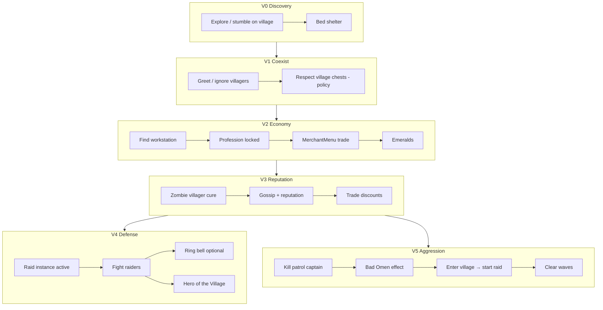

# RFC: Village & Raid autonomous progression (PlayerMob parity)

## RFC Identity

| Field | Value |
| --- | --- |
| **Project root** | `d:\Apps\Minecraft Port\Projects\SPMScavenger-1.21.1-Fabric` |
| **Host platform** | Social Player Mobs (`playermob`) v0.86.0 |
| **Target system** | **Vanilla Minecraft 1.21.1** — Village / Villager economy + **Raid** event (not SPM “raiding chests”) |
| **Reference AI** | **Mineflayer** (bot stack: pathfinder, inventory, plugins) + **human player** interaction parity |
| **Mode** | `WORKING_FROM_PLAN` — **V1 + V1-D + V1.5 CLOSED**; **V2 CLOSED — VR-T2 RUNTIME PASS** (A–H) |
| **Status** | `RUNTIME VERIFIED` → **VR-T2 PASS**;  **V2-A…V2-D CLOSED**; **V2-E CLOSED — STATIC ACCEPT** (`CODE_CONFIRMED`, runtime **`UNVERIFIED`**, MAIBS `BEHAVIORALLY_PLAUSIBLE`); **V2-F CLOSED**; **V2-G CLOSED** |
| **Nearest frontier** | **V2-TE** (Trade Everything compat, separately authorized) / **V2-I** (optional inspector). Core vanilla trading is closed. ~~V2-H~~ (`test-datapacks/phase-village-raid/` fixtures — including the bounded-purchase-consumer semantics fix) → **VR-T2 runtime**, which stays **HOLD** until A–H are statically prepared. V2-I and V2-TE remain separately authorized post-core tasks |
| **Last update** | 2026-08-16 (**VR-T2 RUNTIME PASS** — V2-A…V2-H closed; proof support removed) |
| **Related** | `RFC-VANILLA-AUTONOMOUS-PROGRESSION.md`, `RFC-TOOL-TIER-UPGRADES.md`, `RFC-FURNACE-SMELTING.md`, `docs/wiki/Opinion-System.md` |
| **Gate** | MRFC-1, SPM-1 … SPM-5 |
| **Peer review** | `Agent_Cursor` · `Agent_ChatGPT` · `Agent_Claude` |

### Critical terminology (`CONFIRMED`)

| Term in SPM | Meaning | Village/Raid relevance |
| --- | --- | --- |
| `RaidContainersGoal` | **Loot player/village chests** | Antagonistic to villagers; not raid-event defense |
| `Raider` (vanilla) | Pillager faction mobs | SPM mixin makes them **hunt PlayerMobs** like players |
| `RaiderTargetsPlayerMobMixin` | Illagers target `PlayerMobEntity` | PlayerMob is **raid victim**, not vanilla raid initiator |
| Village companion spawn | `WorldGenRegionMixin` | Social spawn flavour; **not** economic integration |

---

## Executive Summary

**Player-interaction parity with a human player for village/raid content is `PARTIAL` at best today and `NOT PRACTICAL` for full economic + raid-initiation parity without substantial new systems.**

Social Player Mobs (`CONFIRMED` — source audit v0.86.0):

- **Can** fight illagers when engaged; use bows, shields, TNT, crystals; flee; eat; loot containers; greet villagers; sleep in beds; open doors; use commanded fake-player item use.
- **Cannot** autonomously trade with villagers, manage reputation/gossip, operate `MerchantMenu`, acquire `Bad Omen`, trigger or lead raid defense as a first-class citizen, ring bells tactically, cure zombie villagers, assign workstations, or interpret village POI graphs.
- **Actively conflicts** with “good villager citizen” play: `RaidContainersGoal` loots village chests at priority 3 (`CONFIRMED` — `PlayerMobEntity#registerGoals`).

**Mineflayer comparison:** Mineflayer achieves **scripted** parity for trading, pathing, and combat via plugins (`mineflayer-villager`, `mineflayer-pathfinder`). SPM achieves **reactive** combat and **scavenging** without a planner. Neither equals a human’s full menu/GUI literacy out of the box.

**Recommended integration:** Extend **`spmscavenger`** with a **`VillageInteractionDirector`** (see Topic below) that orchestrates perception, demand, personality, and task memory into executor goals — **without** turning `PlayerMobEntity` into a villager. Trading uses **`VillagerTradeAdapter`** (server-side, no fake GUI). Datapacks: **tags + test fixtures only**.

**Practical endgame for this RFC:** Autonomous **village ally** — defend during raids, trade via demand evaluation, bell alarm, population support, restock awareness — is **PARTIAL** feasible. Autonomous **full Hero-of-the-Village economy** (all professions, discounted hero trades, raid farming) is **NOT PRACTICAL** gen-1 without raid-credit bridges (`UNVERIFIED` for `Raid.addHero(Entity)` path).

---

## Topic: Reference parity — SPM vs Mineflayer vs human player

Comparison under **equivalent scenarios** (behaviour, not feature names).

### Scenario A — Discover village while exploring

| Behaviour | Human | Mineflayer | SPM today | Feasibility to extend |
| --- | --- | --- | --- | --- |
| Path into village | Yes | `pathfinder` goals | `WaterAvoidingRandomStrollGoal` / Scavenger `ExploringGoal` | **FULL** |
| Recognize village without `/locate` | Visual + structures | Chunk scan / POI plugin | No POI model | **PARTIAL** (cluster beds/workstations) |
| Avoid trampling crops | Sometimes | Configurable | `HarvestCropsGoal` breaks crops | **FULL** (disable harvest near village) |

### Scenario B — Trade with librarian for enchanted book

| Behaviour | Human | Mineflayer | SPM today | Feasibility |
| --- | --- | --- | --- | --- |
| Right-click villager | Opens `MerchantMenu` | `villager.trade()` plugin | `FriendlyGreetGoal` only (crouch/gift) | **PARTIAL** — `VillagerTradeAdapter` server-side (`D-VR-005`, `053`; no fake GUI) |
| Evaluate trade offer | GUI + knowledge | Scripted offer index | None | **PARTIAL** (offer scoring policy) |
| Pay emeralds + items | Click slots | Plugin | 8-slot backpack | **PARTIAL** (inventory limit) |
| Refresh trades | Break/replace workstation | Plugin | None | **REQUIRES API** (workstation access) |

### Scenario C — Raid defense (village under attack)

| Behaviour | Human | Mineflayer | SPM today | Feasibility |
| --- | --- | --- | --- | --- |
| Illagers target you | Yes | Yes | **Yes** (`RaiderTargetsPlayerMobMixin`) | **FULL** (already) |
| Fight wave mobs | Yes | `pvp` / equip | `WeaponAwareAttackGoal` | **FULL** |
| Protect villagers | Intentional | Scripted priorities | No ally filter; may hit villager | **PARTIAL** (target category + disposition) |
| Ring bell | Yes | Block activate | No autonomous bell use | **PARTIAL** (`InteractableCapability`) |
| Hide in house | Yes | Path to shelter | `SeekShelterGoal` (bed scoring) | **PARTIAL** |
| Win raid → Hero | Yes | If present as Player | **No** — not `Player` class | **REQUIRES MIXIN** (effect + raid Omen) |

### Scenario D — Start raid in 1.21.1 (captain → bottle → Bad Omen → Raid Omen)

| Behaviour | Human | Mineflayer | SPM today | Feasibility |
| --- | --- | --- | --- | --- |
| Kill patrol captain | Combat; captain drops Ominous Bottle outside a raid | Combat | Combat works | **FULL** combat; pickup policy pending |
| Pick up and intentionally consume bottle | Inventory + self-use | Inventory/use plugin | Pickup/self-drink planning absent | **PARTIAL** — finishing applies Bad Omen to any `LivingEntity`; initiating self-use needs an executor |
| Enter intended village | Bad Omen transforms to 30-second Raid Omen | Plugin | Vanilla effect body rejects non-`ServerPlayer` | **REQUIRES BRIDGE** |
| Commit or abort during omen window | Wait; milk can cancel before expiry | Script policy | No raid-intent state | **PARTIAL** planner + bridge |
| Trigger raid when Raid Omen expires | Vanilla `Raids#createOrExtendRaid` | Plugin | Vanilla effect body is `ServerPlayer`-owned | **REQUIRES BRIDGE** |
| Farm raid loot | Yes | Scripted | Can fight; no wave orchestration | **PARTIAL** |

### Scenario E — TACZ-style firearms (pattern example, not village target)

| Behaviour | Human | Mineflayer | SPM today | Feasibility |
| --- | --- | --- | --- | --- |
| Recognize mod gun | Item knowledge | Plugin registry | `ModdedRangedWeapons` config | **FULL** (config tags) |
| Reload via item use | Yes | `bot.activateItem()` | `ModdedRangedAttackGoal` + fake player | **FULL** (proven pattern) |
| Avoid allies | Yes | Friendly-fire filter | `DispositionResolver` + loved ones | **PARTIAL** |
| Seek ammo | Yes | `bot.collectBlock` | `SeekAmmoGoal` | **FULL** |

**Parity verdict:** SPM **matches or exceeds** Mineflayer for **reactive combat + modded item use lifecycle**. SPM **lags** Mineflayer for **trading, raid orchestration, and menu-driven progression**. Full human parity is **NOT PRACTICAL** without a dedicated trade adapter subsystem (not a client GUI).

---

## Topic: Human-player parity vs villager lifecycle (`D-VR-004`)

**Author:** `Agent_ChatGPT`  
**Status:** `LOCKED`

### What we want

```text
PlayerMob
    interacts with
         ↓
 Vanilla Village System
         ↓
Villagers / Golems / Bells / POIs / Raids
```

…like **Steve** would — **player-interaction parity**, not copying villager internal AI.

### What we explicitly reject

```text
PlayerMob
  → acquire profession
  → claim workstation
  → sleep like villager
  → gossip like villager
```

That is **entity-lifecycle parity** (becoming a villager). Out of scope.

### In-scope human-like capabilities

A PlayerMob can potentially (`INFERRED` product goal; implementation per phase):

| Capability | Notes |
| --- | --- |
| Discover a village | `VillageMemory` / `VillagePerception` |
| Trade | `VillagerTradeAdapter` + `TradeWithVillagerGoal` |
| Bring supplies | Gift / drop / trade inputs |
| Ring bells | `RingVillageBellGoal` — **FULL** (`BellBlock.ring(Entity, …)`) |
| Help villagers breed | Player actions (food + beds), not villager `canBreed()` calls |
| Move villagers | Boat/minecart push — **PARTIAL**; no lead AI gen-1 |
| Build/repair infrastructure | Scavenger place + future build goals — **PARTIAL** |
| Defend village | Composed raid support (bell + combat) |
| Trigger/avoid raids | **REQUIRES MIXIN** for Omen; avoid via utility policy |
| Benefit from trades | Demand-driven acquisition |
| Seek particular professions | `KnownVillager` registry |
| Cause restock (indirectly) | Workstation reachability assistance |
| Cure zombie villagers | `CureVillagerGoal` + adapter |
| Loot abandoned resources | SPM loot with `StorageOwnership` gate |
| Establish base nearby | `KnownVillage` affinity + shelter |
| Return later | Persistent `VillageMemory` |

---

## Topic: VillageInteractionDirector (`Agent_ChatGPT`)

**Author:** `Agent_ChatGPT`  
**Status:** `CONSENSUS` — preferred orchestration layer; supersedes ad-hoc village goals.

Central coordinator in **`spmscavenger`**. **No Brain migration.** Does not replace SPM `GoalSelector`; feeds it.

### Architecture

```text
  [Gates — Village / SPM / Shelter / Trade policy / Navigation]
                 VillagePerception  →  facts + legal candidates
                        │
       ┌────────────────┼────────────────┐
       ▼                ▼                ▼
 KnownVillagers    KnownVillage      ActiveRaid
       │                │                │
       └────────────────┼────────────────┘
                        ▼
              VillageInteractionDirector
              (factual utility among VALID options)
                        │
        ┌───────────────┼────────────────┐
        ▼               ▼                ▼
   WorkDemand      TaskMemory      VillageDayNightContext
   (trade need)    (interrupt)     (read-only)
        │               │                │
        └───────────────┼────────────────┘
                        ▼
         Opinion layer (soft rank only — D-VR-025)
         SettlementOpinionBias.request(...)  ← bounded int; Opinion owns math
                        ▼
                   Utility choice
                        │
   ┌──────────┬─────────┼─────────┬───────────┐
   ▼          ▼         ▼         ▼           ▼
 Trade      Farm      Social    Village      Raid
 Goal       Goal       Goal     Support      Support
   │          │         │         │           │
   └──────────┴─────────┼─────────┴───────────┘
                        ▼
                 SPM GoalSelector (priorities)
                        ▼
           Navigation / interaction executors
```

**Authority rule (`CONFIRMED` — `docs/wiki/Opinion-System.md`):** *Preference affects choice. Preference
does not create permission.* Opinion ranks **already-legal** village candidates; it cannot declare a
settlement valid, override raid/shelter mandates, or invent trade permission.

### Memory models (not `VillagerBrain`)

**`KnownVillage`** — settlement graph, not vanilla village object clone:

```text
KnownVillage
├── anchor / approximate center
├── bell positions
├── beds seen
├── workstations seen
├── known villagers (→ KnownVillager)
├── known containers (+ StorageOwnership)
├── crop areas
├── current danger / raid link
├── last visit tick
└── (no affinity in V1 — factual tier only; see Opinion↔Village topic)
```

How a particular mob relates historically to a settlement (for example, *helped found*) is observer
history, not settlement identity. A future `SettlementHistory`/relationship record may carry that
fact; `KnownVillage` is created only by ordinary `VillagePerception` after world truth satisfies the
locked village predicate (D-VR-032).

**V1 code (`CONFIRMED`):** `KnownVillage` ships anchor, tier, observation quality only — explicitly **no**
villagers, offers, or affinity (`KnownVillage.java` class javadoc). `MobVillageMemory.designateHome()`
is the factual **HOME_VILLAGE** designation (`MobVillageMemory.java` L87–105).

**`KnownVillager`** — profession hunting registry (**V4+ / deferred from V2** — see D-VR-056):

```text
KnownVillager
├── UUID
├── profession + level
├── lastKnownPos
├── lastSeenTick
├── interestingOffers (cached snapshot)
└── restockBlocked? (workstation reach heuristic)
```

**Detection (`INFERRED`):** Several villagers + beds + bell/workstations → settlement; optionally consult vanilla POI via addon (`PARTIAL`). No `/locate` unless cheat profile.

### Mineflayer layering (copy abstraction, not implementation)

| Mineflayer | PlayerMob |
| --- | --- |
| API action → packets | `Task` → `Goal` → entity navigation |
| `openVillager()` / `trade()` | `VillagerTradeAdapter.performTrade()` |
| `find` / `pathfinder` | `VillagePerception` + SPM navigation |
| Compose jobs | `VillageInteractionDirector` utility choice |

**Do not** turn `PlayerMobEntity` into a fake networked player.

### Mixin scope (minimal) — **V2 trade amended (`D-VR-053`)**

| Needs mixin / bridge | Does not need mixin |
| --- | --- |
| Hero discount / player-session special prices (V6) | **V2 core trade** (`MerchantOffer` + `notifyTrade`) |
| Raid trigger eligibility (Bad Omen) | Bell ring |
| Raid reward/credit (`heroesOfTheVillage`) | Crop harvest/replant |
| Zombie-villager conversion attribution | Door walk |
| Advancement/stat parity (optional) | Village memory, inventory, social greet |

---

## Topic: Advanced village site selection & home anchoring (`Agent_Cursor`)

**Author:** `Agent_Cursor` (brainstorm continuation, 2026-08-14)
**Status:** `PROPOSED` — extends V1 `KnownVillage` + V4 persistent relationship; **not** vanilla `/locate` cheat.

Parallels mining **advanced site selection** (`RFC-VANILLA-AUTONOMOUS-PROGRESSION.md` — `MiningDirector`
chooses cave vs tunnel vs return). Here the director chooses **which settlement** and **which in-village
anchor** to act on.

### Problem (observable)

A PlayerMob that stumbles into three bed clusters has no principled way to pick a **home village**,
a **trade run target**, or a **raid-defend priority** without hardcoding nearest chunk. Humans pick by
safety, remembered traders, distance, and prior outcomes — not Euclidean distance alone.

### Settlement tiers (`PROPOSED`)

```text
PASSING_THROUGH   — seen once; no repeat utility
TRADING_POST      — known useful villager(s); commute acceptable
HOME_VILLAGE      — defend + storage ally profile; highest interrupt priority
AVOID             — looted chests, hit villagers, golem hostility signals
```

Tier promotion/demotion is **utility-driven**, not a quest flag.

### Representation gate before V4/V5 (`OPEN`)

`SettlementTier` currently compresses several independent facts into one enum. A settlement can be
the mob's home, a valuable trading destination, and temporarily unsafe at the same time. Before V4
or V5 persists more assumptions around this field, compare:

| Option | Shape | Benefit | Failure mode |
| --- | --- | --- | --- |
| Keep one tier enum | Existing `PASSING_THROUGH / TRADING_POST / HOME_VILLAGE / AVOID` | No migration; simple ranking | Mutually excludes states that can coexist; demotion may erase unrelated home/economic meaning |
| Decompose factual dimensions (recommended for review) | `HomeDesignation`, `EconomicRole`, `SafetyStanding`, later capabilities | Truthful combinations and narrower owners | Migration/serialization work; more predicates if introduced prematurely |

Do **not** change V1 merely from aesthetic concern. Gate the decomposition on V4/V5 consumer mapping,
saved-data migration design, and tests showing independent state transitions. **Must happen:** a home
can become temporarily unsafe without ceasing to be home. **Must not happen:** adding a trading role
silently removes home designation.

### Village site score — factual vs opinion split (`REVISED` — User + Agent_Cursor, 2026-08-14)

D-VR-009 locked the **tier vocabulary** and home designation. V4 utility-driven promotion must **not**
conflate village facts with personal preference — Opinion already owns the latter.

**Layer 1 — Village director (facts + legality only):**

```text
FactualVillageUtility =
    tradeNeedFit(MaterialDemand, knownOffers?)   // can this village satisfy a deficit?
  + safetyFacts(recentRaidAtAnchor)              // is it dangerous right now?
  + homeTierWeight(SettlementTier)               // HOME_VILLAGE factual designation
  - travelCost(pathDistance)
  - legalityPenalty(AVOID tier, blocked trade)
```

**Layer 2 — Opinion (soft rank among legal candidates; Village consumes, does not compute):**

```text
settlementBias = SettlementOpinionBias.request(village, opinionInput, ctx)
  // Opinion package owns Place chunk preference, personality, affect, Entity trader prefs
  // Returns int clamped to ±PlaceOpinionRouteRanker.MAX_ROUTE_BIAS (15)
```

**Combined ranking (V4+):**

```text
foreach village in MobVillageMemory.remembered():     // persisted; unload-safe
  if village.tier == AVOID: continue                    // factual gate
  if blockingDemand && !tradeReachable(village): continue
  if ShelterAuthority.mustHold(): continue
  factual = FactualVillageUtility(village, rememberedAnchor)
  score = factual + SettlementOpinionBias.request(...)
pick max score

// Refresh pass (when mob present + loaded chunks):
VillagePerception.observe → MobVillageMemory.remember
```

**Must happen:** mob far from a remembered `HOME_VILLAGE` with unloaded chunks between can still select
it for commute/defend when gates pass.
**Must not happen:** empty `VillagePerception.observe` (unloaded) **removes** the village from candidacy.

**Example (User):**

| System | Output |
| --- | --- |
| Village | A, B, C are **valid** trading destinations; C is **HOME_VILLAGE** (factual) |
| Opinion | "I like A more"; "bad experiences at B"; sociable → prefers populated; stressed → prefers familiar |
| Director | Chooses among **valid** options after gates; Opinion does not make B illegal |

**Must not happen:** negative Place opinion at village B **blocks** trade when `MaterialDemand` is
blocking and B is the only legal source. Opinion may prefer A when both are legal.

### In-village anchor selection (micro site selection)

Once a village is chosen, pick **which POI** to path to:

| Intent | Anchor candidates | Ranking |
| --- | --- | --- |
| Alarm | Known bells | Nearest reachable + line-of-sight to raiders |
| Trade | `KnownVillager` with restock | Offer utility − walk cost |
| Farm support | Crop clusters | Deficit-driven (`CropDemand`) |
| Raid hide (`EVACUATE`) | Shelter cells (SCR-2R5) | Interior tier + not villager-owned bed |
| Post-raid recovery | Safe retreat point from `RaidTask` | Last known interior during victory |

**Rejected:** flood-fill entire village POI graph gen-1; `/locate village`; chunk-global offer cache.

### Detection (`SUPERSEDED` — V1 shipped)

**Historical:** pre-V1 brainstorm proposed a bed-cluster heuristic. **D-VR-019 `LOCKED`:** detection is
`VillagePerception` bounded POI query reproducing vanilla raid-centre derivation (`VillagePerception.java`,
`VillageAnchorPolicy.java`). **`CODE_CONFIRMED`:** `KnownVillage`, `MobVillageMemory`, `SettlementTier`
ship in `com.noobk.spmscavenger.village`.

### Unblock

V1 **`IMPLEMENTED`** — detection + tier enum + home designation. **V1.5** adds mob-owned
`SettlementRelationship` + return/social slice (`D-VR-034`). **V4** ships factual utility scoring +
**Place-opinion bridge** at anchor (D-VR-025/026). V5 consumes `HOME_VILLAGE` for raid interrupt.

---

## Topic: Opinion ↔ Village boundary (`User` + `Agent_Cursor`)

**Author:** User (architecture); `Agent_Cursor` (RFC capture, 2026-08-14)
**Status:** `CONSENSUS` — aligns with shipped Opinion central rule (`docs/wiki/Opinion-System.md`).

### Division of labour

| Question | Owner | Opinion may not |
| --- | --- | --- |
| Is this actually a village? | `VillagePerception` | Invent settlements |
| Is this POI visible / loaded? | `VillagePerception` | Clairvoyant POI |
| Is this my home? | `MobVillageMemory` / `SettlementTier` | Override `HOME_VILLAGE` designation |
| Is a raid occurring? | `Raid` / `level.getRaidAt` | Ignore active raid |
| Can I legally trade this offer? | `TradeEvaluationPolicy` / `WorkDemandPolicy` | Create affordance |
| Must I seek shelter? | Shelter authority (`SHELTER_HOLD`) | Rank REST above mandatory hold |
| Must I obey a player order? | SPM command goals | — |
| Can I path there safely? | Navigation / executor admission | Skip hard blockers |
| **Which legal village do I prefer?** | **Opinion** (soft) + Director (pick) | — |

Opinion comes **after** those gates.

### What Opinion may influence (V4+ discretionary village time)

- Which **legal** village to visit for trade
- Which **legal** trader to prefer among several
- Whether to spend discretionary time **socializing** in a village (`SOCIAL` + `FriendlyGreetGoal`)
- Whether to **revisit** a pleasant settlement (Place preference at anchor)
- Whether to **explore** a newly discovered settlement (`adventurousness` / `curiosity`)
- How strongly to prefer **familiar vs novel** settlements (`stress` + Place memory)
- Soft weight when **adopting** a home (factual designation remains `designateHome()`; Opinion does not
  auto-promote tier without product rule)

### Investigation — should villages become Opinion subjects?

**Question:** Does `KnownVillage` fit under existing **Place** opinion, or justify a new **SETTLEMENT**
subject type?

| Need | Place @ **current** `KnownVillage.anchor` chunk | Dedicated SETTLEMENT subject |
| --- | --- | --- |
| "I like this geography" / bad experience at a place | **Yes** — `PlaceOpinionMemory` keyed by `ChunkPos` | Wrong abstraction |
| "I like this settlement" across anchor moves | **No** — geographic Place does not follow identity (D-VR-026 **HELD**) | **Yes** — settlement-persistent pref |
| Soft route bias to village | **Yes** — `PlaceOpinionRouteRanker` via `SettlementOpinionBias` (±15) | Overkill until identity gap proven |
| HOME_VILLAGE / TRADING_POST tier | **No** — factual `MobVillageMemory` | Wrong layer |
| Trader profession / offer memory | **No** — V2 `KnownVillager` + Entity opinion optional | Could blur subjects |
| Raid history at anchor | **No** — village factual record | Either works; keep factual |
| Sociability → populated settlements | **Yes** — inside `SettlementOpinionBias` (Opinion package) | New subject unnecessary gen-1 |

**Decision (`D-VR-026` **HELD** — User amendment, 2026-08-14):** **Do not add SETTLEMENT gen-1.** Place
learning and ranking use **current** `KnownVillage.anchor()` geography (`ChunkPos` of current anchor) via
`SettlementOpinionBias` → `PlaceOpinionRouteRanker`. **Rejected:** frozen `placeOpinionChunkKey` — that
turns geographic Place memory into a settlement-ID store.

**Accepted limitation:** when anchor supersede moves across chunks, Place preference does **not** follow
settlement identity; factual `MobVillageMemory` (tier, trade, home) still does. If runtime needs *"I like
this same village regardless of anchor movement"*, that is evidence to reopen **SETTLEMENT** — not to
encode settlement identity in an old chunk key.

**Evidence threshold to reopen SETTLEMENT:** Place@current-anchor + Entity trader prefs cannot express
settlement-persistent preference that (a) cannot live in `KnownVillage`/`KnownVillager` facts and (b)
cannot use Entity opinion for named traders — **after** V2/V4 ship and runtime proves the gap (including
anchor-cross-chunk preference continuity).

### Authority stack (village slice)

```text
world safety / combat threat
        ↓
player command
        ↓
nighttime SHELTER_HOLD / raid mandatory defend (profile-dependent)
        ↓
trade legality + navigation admission
        ↓
VillageInteractionDirector factual utility
        ↓
Opinion Place/Entity/Activity bias (≤ route tie-breaker magnitude)
        ↓
idle fallback
```

**Cross-link:** GAO-10 discretionary `SOCIAL` is the correct executor for "browse village socially" —
Opinion picks **who** to greet; Village supplies **where** the settlement is.

---

## Topic: Village attachment & settlement relationship (`User`)

**Author:** `User` (architecture + brainstorm, 2026-08-14)
**Status:** `PROPOSED` — **V1.5** slice; not implementation authorization
**Peer review:** `Agent_Cursor` (dedup + RFC capture, 2026-08-14)

### Problem (observable)

With V1 shipped, a PlayerMob can **know** a village exists (`KnownVillage`) but still treats it as
**POI cluster → (future) trade machine → leave**. Humans and the broader capability list already
assume something stronger: home nearby, return visits, discretionary social time, preferential trade,
bringing supplies, village manners, raid defense, and later personal-base establishment. The RFC has
most pieces scattered across V2–V7, but **"this place matters to me"** is not yet an explicit,
mob-owned layer between world truth and behavior.

### Layer model (`CONSENSUS` — aligns with Opinion central rule)

```text
KnownVillage
  = "I know this settlement exists."          // factual; per settlement row
        ↓
Settlement experience
  = "Things have happened to me here."      // events: visits, trades, raids, gifts, harm
        ↓
SettlementRelationship
  = "This place matters to me."             // mob-owned attachment + history
        ↓
Opinion / VillageInteractionDirector
        ↓
Behavior (return, socialize, work, trade, defend, camp nearby)
```

**Locked invariant (reinforces V1 + Opinion boundary):** *Preference affects choice. Preference does
not create permission.* Attachment may bias return or social time; it may **not** override combat
safety, player commands, shelter holds, or illegal trade/storage actions.

### What stays factual — `KnownVillage` (`LOCKED` — no change)

`KnownVillage` remains world-truth memory only:

```text
KnownVillage
├─ anchor
├─ observation quality / coverage
├─ factual tier (SettlementTier — home designation is factual, not affection)
└─ first/last seen
```

**Rejected:** storing `attachment`, `familiarity`, `socialHistory`, or personality-specific affection
inside `KnownVillage` — that would reintroduce the epistemic leak V1-R1/R4 paid to prevent.

**`CODE_CONFIRMED`:** `KnownVillage.java` javadoc explicitly excludes villagers, offers, containers,
and affinity; `MobVillageMemory.designateHome()` is the existing factual **HOME_VILLAGE** gate
(`MobVillageMemory.java` L87–105).

### Mob-owned relationship (`PROPOSED` — `SettlementRelationship`)

Attachment belongs on the **mob**, keyed to settlement identity (anchor merge via
`VillageIdentityPolicy`), conceptually:

```text
SettlementRelationship          // mob-owned; keyed by canonical anchor (Option A map)
├─ familiarityScore             // persisted; capped int
├─ lastVisitTick
├─ socialEventCount             // greets / GAO SOCIAL episodes credited at this settlement
└─ (derived, not persisted) attachmentBand()  // LOW | MEDIUM | HIGH from familiarityScore only

HOME is NOT stored here. Read home via MobVillageMemory.home() / KnownVillage.isHome() only.
helpfulHistory / meaningfulEvents → V3+ (no gen-1 producer).
```

**Storage shape (options — pick one at V1.5 lock):**

| Option | Shape | Benefit | Failure mode |
| --- | --- | --- | --- |
| **A — parallel map on `MobVillageMemory`** | `Map<anchorKey, SettlementRelationship>` beside `List<KnownVillage>` | Minimal new persistence file; clear split from factual rows | Two structures must stay in sync on merge/evict |
| **B — embed relationship handle on `KnownVillage`** | relationship fields adjacent but namespaced | One list to iterate | Violates "attachment not in KnownVillage" unless fields are strictly mob-prefixed and reviewed as migration |
| **C — separate `MobSettlementRelationships` saved-data** | Own codec keyed by mob UUID | Cleanest boundary | Extra saved-data surface; RET-1 for both |

**Recommendation (`Agent_Cursor`):** **Option A** for V1.5 — relationship map keyed by settlement
identity on `MobVillageMemory`, evicted with the same LRU rules as non-home villages. Revisit **C**
only if relationship event logs outgrow per-mob bounds.

### Attachment must accumulate (`PROPOSED`)

**Rejected:** `enter village once → LOVE +100`.

**Accepted accumulation signals (non-exhaustive):**

| Signal | Attachment effect | Owner |
| --- | --- | --- |
| Meaningful time in village bounds | `+` familiarity | Relationship |
| Sleep / camp nearby (not villager bed theft) | `+` attachment | Relationship + shelter |
| Discretionary `FriendlyGreetGoal` / GAO SOCIAL | `+` socialHistory | Opinion executor + relationship |
| Successful trades (V2+) | `+` economic familiarity | Relationship episode; persistent trader memory only after a separate consumer is approved |
| Helpful acts (replant, gift food, ring bell) | `+` helpfulHistory | V3+ executors |
| Raid defense / rescue | `+++` helpfulHistory | V5 |
| Repeated return visits | `+` familiarity | Relationship |
| `designateHome()` | factual `HOME_VILLAGE` tier (`MobVillageMemory` only) + relationship familiarity **floor** via `onHomeDesignated` | **Factual:** `designateHome()` · **Relationship:** service bump |

**Personality modulation (`INFERRED` — fits existing Opinion stack):** sociable mobs attach via
villagers; materialistic mobs via economy first; adventurous mobs oscillate leave/return; coward
mobs may attach because the settlement reads as **safe home** — all via `SettlementOpinionBias` /
personality inputs, not hardcoded tier jumps.

### What attachment should change (behavioral contract)

Strong attachment should make villages **visibly matter**:

| Behavior | Phase | Gate |
| --- | --- | --- |
| Return after exploration / mining | **V1.5** | Relationship + remembered anchor |
| Prefer camping / sleeping nearby | **V1.5** partial | Shelter + attachment; no bed theft |
| Greet / discretionary social time | **V1.5** | GAO SOCIAL + village-aware `FriendlyGreetGoal` |
| Prefer this village when multiple legal options | **V2+** | Trade legality first; attachment biases |
| Bring food/resources back | **V3** | `GiftPolicy` + storage ownership |
| Replant / village work | **V3** | Farm goals + manners |
| Avoid village-owned storage theft | **V1.5** precursor | VR-20 ally gate when HOME or high attachment |
| Defend during raids | **V5** | `HOME_VILLAGE` + raid matrix |
| Interrupt lesser work when endangered | **V5** | D-VR-010 |
| Personal base nearby | **V4** | Site utility + Place opinion |

**Must happen (V1.5):** Bob with `HOME_VILLAGE` and high familiarity **paths back** after a long
mining trip instead of treating all remembered clusters as equal noise.
**Must not happen:** attachment causes looting village chests, ignoring mandatory shelter, or
abandoning combat safety.

### Relationship to existing RFC pieces (dedup)

| Existing | Relationship to attachment |
| --- | --- |
| `SettlementTier` / `HOME_VILLAGE` | **Factual** designation — attachment **reads** it, does not replace it |
| `SettlementOpinionBias` (D-VR-025) | **Soft rank** among legal villages — consumes relationship + Place/Entity opinion |
| V4 return visits / home designation | **Split:** factual home stays V1; **return commute + attachment history → V1.5** |
| B-VR-17 GAO SOCIAL browse | **→ V1.5** executor slice |
| B-VR-40 stress → familiar anchor | **→ Opinion package**; attachment supplies "familiar" signal |
| SETTLEMENT Opinion subject (B-VR-39) | **Still DEFERRED** — relationship history is factual/experiential, not a new Opinion subject type |
| `SettlementTier` decomposition gate | **Still OPEN** — attachment does not remove need to split home/economic/safety **facts** before V5 |

### Phase insert — **V1.5** before V2 Trading (`PROPOSED` — `D-VR-034`)

User proposal: small village/social features **before** full `VillagerTradeAdapter` — makes trade
*meaningful* ("I trade **here** because I care") instead of nearest-offer machine.

```text
V1   ✅ Perceive villages (IMPLEMENTED; VR-T1A PASS)
V1.5 Settlement attachment & return (NEXT)
├─ SettlementRelationship persistence + accumulation rules
├─ recognize factual home + familiarity bands
├─ return / commute-to-home-or-familiar goal
├─ village-aware FriendlyGreet / discretionary SOCIAL weighting
└─ (V1.5-E / VR-T1.5d **DEFERRED** → V3 `StorageOwnership`)
V2   Trading (VillagerTradeAdapter, TradeEvaluationPolicy, TradeWithVillagerGoal)
V3+  Work, reputation, raid, site utility (unchanged ordering after V2)
```

**Strongest objection:** V1.5 scope creep absorbs V3 manners + V4 return + part of V5 ally logic.
**Mitigation:** V1.5 MVP is **relationship + return + social weighting only**; ally storage gate,
replant, full gift loops, and raid interrupt remain later phases.

**Viable alternative:** keep original plan (V2 trade before attachment). **Rejected for gen-1** per
User — trade without attachment reads as machine-like; attachment without trade still produces
visible "my village" play.

### V1.5 runtime matrix (`PROPOSED`)

| ID | Must happen | Must not happen | Result |
| --- | --- | --- | --- |
| VR-T1.5a | After 10+ min away, mob with HOME paths toward home anchor | Treats home same as never-seen cluster | **PASS** (User, Bob, 2026-08-15) |
| VR-T1.5b | Repeated visits increase familiarity in saved data | Single visit maxes attachment; standing-still HIGH farm | **CLOSED PASS** (User, God, 2026-08-15) |
| VR-T1.5c | Village-aware greet fires more near familiar settlement | Greet mistaken for trade completion | **CLOSED PASS** (User, God, 2026-08-15) — `350→390`, social events `0→1`; taxonomy repair |
| ~~VR-T1.5d~~ | **DEFERRED → VR-T3** (`D-VR-052`) | — | — |

### Decisions

| ID | Decision | Status |
| --- | --- | --- |
| **D-VR-034** | Insert **V1.5** (attachment + return + village social) **before V2 Trading** | **`LOCK RECOMMENDED`** — User intent + VR-T1A foundation |
| **D-VR-035** | `SettlementRelationship` is mob-owned, separate from factual `KnownVillage` | **`LOCK RECOMMENDED`** — Option **A** (parallel map on `MobVillageMemory`) |
| **D-VR-036** | Attachment accumulates from events; no single-visit max | **`LOCK RECOMMENDED`** — gen-1 bands below |
| **D-VR-037** | V1.5 MVP excludes `VillagerTradeAdapter` and raid interrupt | **`LOCKED`** — scope guard |
| **D-VR-038** | Return commute via **ExploringGoal / discretionary bias**, not priority-3 gather competitor | **`LOCK RECOMMENDED`** — see implementation contract |
| **D-VR-039** | `designateHome()` needs a **production caller** for VR-T1.5a (debug command minimum) | **`LOCK RECOMMENDED`** — **CONFIRMED** gap: API exists, zero production callers |
| **D-VR-040** | Presence/familiarity bounds = **64-block** perception radius (`SettlementBoundsPolicy`) | **`LOCK RECOMMENDED`** |
| **D-VR-041** | Single `SettlementRelationshipService` write path (record / presence / social / home-designated) | **`LOCKED`** |
| **D-VR-042** | Auto-home when HIGH familiarity + sleeps (config default off) | **`PRODUCT DECISION`** — manual debug ships first |
| **D-VR-043** | Commute blocked during mining/cave handoff; forced-heading `ExploringGoal` seed | **`LOCK RECOMMENDED`** |
| **D-VR-044** | Merge relationship rows when `remember()` merges village identity | **`LOCK RECOMMENDED`** |
| **D-VR-045** | Village SOCIAL via `SettlementSocialBias`, not global FriendlyGreet hack | **`LOCK RECOMMENDED`** |
| **D-VR-046** | Settlement return requires `ScavengerConfig.exploring` | **`LOCKED`** |
| **D-VR-047** | COMMUTE = non-discretionary `ExpeditionKind`; admitted before discretionary explore gate | **`LOCKED`** |
| **D-VR-048** | Multi-leg commute until inside `SettlementBoundsPolicy` (150-block legs) | **`LOCKED`** |
| **D-VR-049** | Option A relationship `rekey` on anchor supersede + merge on `remember()` + evict sync | **`LOCKED`** |
| **D-VR-050** | Social credit requires `settlementAnchorAtStart` on greet binding at admission | **`LOCKED`** |
| **D-VR-051** | No permanent village debug commands; temporary `designate-home` removed post VR-T1.5 | **`LOCKED`** |
| **D-VR-052** | V1.5-E ally loot gate — **REJECT for V1.5**; defer to V3 `StorageOwnership` + VR-T3 | **`LOCKED`** — User 2026-08-14 |

**Authorized:** task-46 / V1.5 slices A–D + temporary F → **1.11.0**. **Not authorized:** V1.5-E,
Minecraft launch.

**Next frontier:** **V2 Trading** design closure → **task-47** brief (V1.5 runtime **CLOSED** 2026-08-15).

### V2 implementation contract (`LOCKED` — **not implementation-authorized**)

**Evidence baseline (`CODE_CONFIRMED`, pinned 1.21.1 jar):**

- `MerchantOffer#satisfiedBy` / `#take` mutate payment stacks without `MerchantMenu`. **Wording reconciled 2026-08-15 (task-47):** this line established that a menu is not required; it is **not** a mandate to use `#take` for payment. `#take` is menu-shaped (it shrinks only the two stacks passed) and is **superseded for payment** by `D-VR-061`/`D-VR-071`'s staged multi-slot allocator. **V2-A as shipped calls `take` zero times**; `satisfiedBy`-equivalent affordability is performed by `TradeTransaction.debit`'s pre-check.
- `AbstractVillager#notifyTrade(MerchantOffer)` increments uses, awards villager XP, plays sound — **no `Player` parameter**; `CriteriaTriggers.TRADE` and NeoForge `TradeWithVillagerEvent` fire only when `tradingPlayer instanceof ServerPlayer` (absent for PlayerMob — acceptable gen-1).
- `Villager#setTradingPlayer` / `#updateSpecialPrices(Player)` remain **player-typed** — hero discount stays **V6** (B-VR-34); gen-1 does **not** call `setTradingPlayer`.
- Production inventory seam: `PlayerMobs.backpack(mob)` (`ExplorationActivityGoal.java`).


**Evidence addendum (`Agent_Claude`, 2026-08-15) — three stack-identity facts the baseline did not pin.**
Additions to the baseline above, not corrections to it.

| Accessor | Returns | Safe to hand to a container? |
| --- | --- | --- |
| `MerchantOffer#getResult()` | the **live `result` field** | **no** |
| `MerchantOffer#assemble()` | `result.copy()` | yes |
| `MerchantOffer#getCostA()` | `baseCostA.itemStack().copyWithCount(n)` | yes |
| `MerchantOffer#getBaseCostA()` | the **live `ItemCost.itemStack` field** | **no** |

**The asymmetry is the trap.** The cost accessor copies and the result accessor does not, so an
implementer who checks `getCostA()` and finds it safe will reasonably assume `getResult()` is too.
Inserting `getResult()` into the backpack aliases the villager's own offer stack: any later count
change corrupts that villager's offer permanently, the same instance can reach two mobs' backpacks,
and it persists to the world. Vanilla's own `MerchantResultSlot` uses `assemble()`.

**V2-A must therefore call `assemble()` and `getCostA()`**, never `getResult()` / `getBaseCostA()`,
and a structural test should say so — the wrong call compiles, runs, and only shows up as an offer
quietly changing.

**`take(a, b)` is menu-shaped, and a backpack is not a menu.** Bytecode (offsets 0–44):

```java
if (!satisfiedBy(a, b)) return false;
a.shrink(getCostA().getCount());
if (!getCostB().isEmpty()) b.shrink(getCostB().getCount());
return true;
```

It mutates **exactly the two stacks handed to it** and no others, because `MerchantMenu` guarantees
payment sits consolidated in two slots. The SPM backpack has 8 slots and no such guarantee: a
20-wheat cost is routinely `16 + 4` across two of them. So `take` cannot express the payment, and
V2-A's staged transaction must debit across slots itself and use `satisfiedBy` only as the
*validation* half. **Failure shape:** compiles, passes any single-slot test, silently under-pays on
the first bulk offer.

**Checked and rejected — offer indices are stable across a villager level-up.**
`Villager#updateTrades` calls `addOffersFromItemListings(getOffers(), …)`, which **appends** to the
existing `MerchantOffers`; it does not clear or rebuild. Existing offer objects and their positions
survive, so a level-up mid-chain does not invalidate a cached index. V2-D's re-resolution therefore
does **not** need a level-up trigger, and no work is required here.

**VR-T2 uncontaminated proof chain (`LOCKED` — `D-VR-069`):** the **first** runtime proof for V2 core
(task-47 / VR-T2…VR-T2h) must exercise **only** this stack — no Trade Everything, no synthetic offers,
no player-session offer injection:

```text
spmscavenger (VillagerTradeAdapter + TradeWithVillagerGoal)
        ↓
real vanilla Villager (live entity; getOffers() as persisted + restocked)
        ↓
real vanilla MerchantOffer (from that villager's offer list — not index 0 session injection)
        ↓
PlayerMob backpack pays exact ItemCost A (+ B when present)
        ↓
PlayerMob backpack receives exact offer result stack
        ↓
that MerchantOffer uses +1 (via notifyTrade once — no double increment)
```

**Runtime mod set for VR-T2…VR-T2h:** `playermob` + `spmscavenger` + Fabric API (+ test datapack
`V2-H`). **`tradeeverything` must be absent.** Trade Everything v0.3.0 temporarily injects a
synthetic offer at offer index 0 during normal **player** trade sessions (`setTradingPlayer` mixin);
even if that path probably does not affect every PlayerMob automation route, it adds unmeasurable
uncertainty to the baseline and is **excluded on purpose**. VR-T2k/l (`V2-TE`) run only **after**
VR-T2 **PASS** in the vanilla-only instance (`D-VR-068`).

**Scope (in):**

| Slice | Deliverable |
| --- | --- |
| **V2-A** | `VillagerTradeAdapter` + immutable `OfferSnapshot`; **joint two-cost slot allocation** (`D-VR-071`) over backpack copies; staged `SlotDelta` built only at commit instant (`D-VR-072`); preflight result insertion; exact live-offer revalidation; `notifyTrade` once after inventory commit. **`assemble()` / `getCostA()` only** (never `getResult()` / `getBaseCostA()` — live stacks); **multi-slot debit**, with `take` used only as `satisfiedBy` validation (B-VR-90/91) |
| **V2-B** | `TradeEvaluationPolicy` — score `MerchantOffer` vs `WorkDemandPolicy.MaterialDemand` (D-VR-015 / B-VR-20 facade; no rename blocker) |
| **V2-C** | `TradeDemandRegistrar` + **feasibility filter before `select()` wins** (`D-VR-015`); parallel acquisition candidates per `ConsumerRecipeSpec` (CRAFT/SMELT vs TRADE); no autonomous emerald-hoarding loop |
| **V2-D** | transient bounded `TradeChainPlan` SELL → BUY ticket (D-VR-029); **`SellExpendabilityPolicy`** disposable-quantity math (`D-VR-058`); re-evaluate before every transaction; expiry; re-resolve current offer/villager after interruption or reload |
| **V2-E** *(CLOSED 2026-08-16 — STATIC ACCEPT; runtime `UNVERIFIED`)* | Introduces **`TradeWithVillagerGoal`** @ priority **3** (MOVE+LOOK) with one selected `TradeDemandGate` owner, the bounded `TradeCandidateRound`, the greet interlock, and the full executor: exact-quote binding, execute-time SELL reauthorization, cross-villager `TradeAttemptFunding`, and post-SELL chain continuation. The `ActivityClass.VILLAGE_TRADE` **enum value and its classifier pin belong to V2-F** (`D-VR-073`: the goal type must exist before anything classifies it) |
| **V2-F** *(CLOSED 2026-08-16)* | Introduces **`ActivityClass.VILLAGE_TRADE`**, the `MoveHolderClassifier.staticActivityClass` pin `TradeWithVillagerGoal` → `VILLAGE_TRADE`, and the `classify()` mapping → **`ORDINARY_HOST_WORK`** (`D-VR-074`). **Co-lands with V2-E or immediately follows in the same task batch** (`D-VR-073`); the classifier cannot precede the goal type it classifies |
| **V2-G** *(CLOSED 2026-08-16)* | `SettlementRelationshipService.onTradeEpisode` familiarity bump once per completed visit/chain; no persistent `KnownVillager` or offer-index memory in gen-1. **If any part persists per-mob, it must register in `PerMobSavedData.forgetAll`** or `PerMobRemovalContractTest` fails the build (B-VR-93, Gate RET-1e) |
| **V2-H** | `test-datapacks/phase-village-raid/` trade presets for VR-T2 / VR-T2b |
| **V2-I** *(optional, post-VR-T2 static)* | O-panel trade inspector row (`B-VR-79`): active `consumerKey`, anchor, villager id, `TradeBlockedReason` — no new debug command |
| **V2-TE** *(optional follow-up; does not block core)* | Trade Everything v0.3.0 Fabric compatibility through `TradeOpportunitySource`; no fake player/menu/session; exact quote revalidation; fail closed when absent/incompatible (`D-VR-068`) |

**Implementation dependency order (`LOCKED` sequencing — amended pass 2):**

```text
V2-A (adapter) → V2-B (evaluation) → V2-C (demand registrar) → V2-D (chain ticket)
        ↓
V2-E (TradeWithVillagerGoal + TradeDemandGate + executor)
        ↓
V2-F (VILLAGE_TRADE enum + MoveHolderClassifier pin + ORDINARY_HOST_WORK mapping)
        — same task batch as V2-E or next commit; never before E (D-VR-073)
        ↓
V2-G (onTradeEpisode) → V2-H (datapack fixture)
V2-I (inspector) — optional after VR-T2 static green; not a release gate
V2-TE (Trade Everything compat) — separate task after V2-A/B static green; not part of task-47 core acceptance
```

**Scope (out):** client `MerchantMenu` / fake GUI (`D-VR-005`); hero discount mixin (V6); restock / workstation place / door-clear loops (V3); discretionary trade browse without demand (V2+ backlog); `RaidContainersGoal` ally-storage gate (V3, `D-VR-052`); full `VillageInteractionDirector` (V5); persistent `KnownVillager` / offer memory; wandering-trader TTL merchant (B-VR-16 deferred); reputation **read** accessor consumer (V4).

**Admission (`LOCKED` — amended peer review 2026-08-15):**

```text
derive consumer need (e.g. ConsumerRecipeSpec / external demand)
        ↓
derive acquisition candidates
   ├─ SMELT / CRAFT feasible now?
   └─ TRADE feasible only if loaded evidence supports a route (D-VR-015)
        ↓
WorkDemandPolicy.select() among FEASIBLE candidates only
        ↓
TradeDemandGate.activeDemand(mob)     // mutual exclusion @ P3; only if TRADE won
        ↓
TradeSettlementPicker                 // legality/offer fit BEFORE home/familiarity rank (D-VR-070)
        ↓
TradeWithVillagerGoal
   WALK → FACE → re-fetch live villager/offer/backpack
        → build fresh SlotDelta → simulate → revalidate → APPLY IMMEDIATELY (D-VR-072)
        ↓
(on chain) TradeChainPlan.advanceStep()   // disposable sell qty re-checked each hop (D-VR-058)
```

**Villager / settlement pick (gen-1):** scan **remembered settlements that are currently
loadable/observable**; **hard-filter** for a useful offer matching the active demand, legal villager
availability (`VillagerTradeAvailability`), and plausible path; **then** rank by HOME / familiarity /
offer utility / travel cost (`D-VR-070`). **Do not** call `SettlementReturnPolicy.commuteTarget()` —
that answers *"where do I return?"*, not *"where can I satisfy this trade?"* An unloaded remote village
with unknown offers is **honestly unselectable** (good epistemics, not a V2 gap). Nearest **reachable**,
alive, non-sleeping `Villager` with a currently useful offer inside `SettlementBoundsPolicy`. Offer
utility may create a soft profession preference, but the picker does not hardcode `librarian = good`
(`D-VR-007`). No live match → bounded `TaskLifecycle.BLOCKED`, not a random-villager loop. A villager
with `getTradingPlayer() != null` is temporarily unavailable.

**Trade vs greet (`MUST NOT` repeat VR-T1.5c) — `D-VR-067` is mandatory, not defensive plumbing:**

`SOURCE_CONFIRMED` (SPM v0.86.0): `FriendlyGreetGoal` owns **MOVE + LOOK**, actively searches for
`Reaction.GREET` targets; villagers are classified **VILLAGERS**; friendly PlayerMobs resolve
villagers to **GREET**. Real collision sequence:

```text
PlayerMob wants to trade with Villager A
        ↓
reaches FACE phase (MOVE + LOOK)
        ↓
SPM FriendlyGreetGoal also sees A as GREET
        ↓
both want MOVE/LOOK on the same villager
```

| Guard | Mechanism |
| --- | --- |
| Activity taxonomy | `TradeWithVillagerGoal` → `ActivityClass.VILLAGE_TRADE` (not `SOCIAL_REFLEX`) |
| Concurrent greet | `canUse()` false while `FriendlyGreetGoal` running **or** `SocialExecutionBindingRegistry` holds SOCIAL binding |
| Trade face phase | **`TradeSessionClaimWindow` mandatory** (`D-VR-067`): same villager only, FACE/EXECUTE only, bounded expiry — blocks greet admission symmetric to `SocialGreetClaimWindow` |
| Credit separation | `onTradeEpisode` ≠ `onSocialEpisode`; trade does not increment `socialEventCount` |

**`TradeChainPlan` gen-1 contract (D-VR-029):**

```text
TradeChainPlan
  consumerKey          // stable owner, e.g. spmscavenger:trade_chain/mending_book
  desiredOutput/demand // durable meaning; not a MerchantOffer/index identity
  steps[]              // SELL then BUY; current offer is resolved live per attempt
  sellQuantity         // disposable count authorized by SellExpendabilityPolicy (D-VR-058)
  openedAtTick / expiryTick
  anchorHint           // optional BlockPos — settlement hint, not commuteTarget()
```

Gen-1 stores this ticket only while the entity session is live. Save/reload closes it neutrally;
the still-valid external demand may construct a fresh plan from current offers. This is safer than
serializing a volatile offer index, price, use count, or villager UUID as durable authority.

**Disposable lifetime rule (`LOCKED`):**

| Artifact | May survive interruption / ticks? |
| --- | --- |
| `OfferSnapshot` | Yes — evaluation evidence for one attempt |
| `TradeChainPlan` | Yes — durable demand meaning + step index |
| `Path` | **No** — discard on interruption (`D-VR-062`) |
| `SlotDelta` / staged inventory mutation | **No** — must not survive a scheduler yield (`D-VR-072`) |

Between WALK and FACE the backpack can change (SPM `EatFoodGoal`, loot, gift, pickup). **Safer
execution (`D-VR-072`):**

```text
WALK
  ↓
FACE (+ TradeSessionClaimWindow on same villager)
  ↓
re-fetch live villager, live offer, live backpack
  ↓
build fresh staged transaction from CURRENT slots
  ↓
joint-allocate costs (D-VR-071) → simulate debit → simulate result insertion
  ↓
revalidate demand / customer / offer / disposable sell quantity
  ↓
APPLY IMMEDIATELY (one server-thread SlotDelta)
  ↓
notifyTrade exactly once
```

**Transaction boundary (`LOCKED` design — `D-VR-061` + `D-VR-071` + `D-VR-072`):** copy all
backpack slots at **commit instant**; run a bounded **joint** allocation for cost A and optional cost B
(**one item count may satisfy at most one cost allocation** — stacks may be **partitioned** across costs,
e.g. one stack of 2 emeralds paying cost A=1 and cost B=1; find a valid partition when one exists —
greedy pay-A-then-B can falsely reject overlapping predicates, e.g. generic diamond + component-specific
diamond in different slots); simulate removal and result insertion on copies; revalidate live offer; apply
one slot-index delta; then `notifyTrade` once. `MerchantOffer#take` validates only — not the allocator.
Mineflayer's menu consolidates payment into two slots; our 8-slot `SimpleContainer` cannot assume that.

**Interruption/arbitration:** a temporary P1 greet/door helper discards the current navigation path,
not the demand/chain meaning; resume re-resolves a fresh path and offer. Player command, combat,
night shelter, death/unload, expiry, or invalid demand closes/yields according to existing authority.
An already-running SPM `RaidContainersGoal` may complete its bounded episode; its 20-tick post-visit
cooldown should then expose P3 to trade. This is `CODE_INFERRED`, not runtime proof. VR-T2e is a
release gate; if trade remains starved, use a thin centralized *exact admitted-trade* suppression
hook rather than raising trade above command/shelter or prematurely shipping full V3 storage policy.

**Must happen (static):** offer scoring unit tests; staged transaction tests for split costs, **joint two-cost partition** (D-VR-071 negative controls: (1) generic + component-specific diamonds in different slots; (2) **one stack of 2 emeralds** paying cost A=1 + cost B=1), full/near-full backpack, component mismatch, stale price/use, human customer, and two sequential mobs; successful trade removes exact cost, inserts exact result, and increments uses once; **SlotDelta built only after FACE with fresh backpack**; taxonomy regression for `VILLAGE_TRADE`; chain step advance + **SellExpendability** negative control (SPM may eat; trade replans with reduced disposable qty); **trade candidate blocked from winning `select()` when no feasible route**; `TradeDemandGate` excludes concurrent Scavenger P3 work when chain active; one relationship episode for a multi-click visit.

**Must not happen:** mutate costs before result capacity is known; **persist SlotDelta across ticks**; greedy two-cost allocator **double-counting item counts** or false reject when stack partition is valid; double `increaseUses`; use a stale offer index after restock/reload; automate a villager while a real player is its customer; greet completion credited as trade; one ten-trade visit grants ten familiarity episodes; **global food lock against SPM EatFoodGoal**; selling below disposable quantity; create emeralds with no external consumer; **trade wins `select()` then suppresses feasible smelt/craft path**; call `commuteTarget()` for trade settlement choice; raise trade priority over command/combat/shelter to hide P3 arbitration.

**Verification:** `.\gradlew.bat test --tests "*trade*"` + `*village*` structural extensions; VR-T2 /
VR-T2b runtime after launch approval in a **vanilla-only** instance (`D-VR-069` — no
`tradeeverything`); God/Bob taiga fixture or `V2-H` datapack preset.

**Artifact:** `.superpowers/sdd/task-47-brief.md` (**to be written on authorization**).

### V2 runtime matrix (`PROPOSED`)

| ID | Must happen | Must not happen | Notes |
| --- | --- | --- | --- |
| **VR-T2** | **Vanilla-only instance** (`D-VR-069`): mob paths to farmer; pays **exact** carrot cost; receives **exact** emerald result; offer **uses +1** | `tradeeverything` installed; synthetic/session offer; client menu; dupe/void; greet as trade | First proof = uncontaminated vanilla chain |
| **VR-T2b** | Deterministic fixture: sell expendable input → acquire emeralds → buy the externally demanded tool/output within expiry | Sells protected survival stock; resumes stale BUY after reload without revalidate; hoards emeralds with no consumer | D-VR-029 / D-VR-065 |
| **VR-T2c** | Trade deferred when villager sleeping / night window (`VillageDayNightContext` helper) | Busy-waits all night blocking shelter | Pure read helper ships in V2; full director matrix remains V5 |
| **VR-T2d** | `onTradeEpisode` bumps familiarity separate from greet | Trade mistaken for social event in inspector | Extends V1.5 relationship service |
| **VR-T2e** | Visible village chest may delay one admitted trade only by the current bounded raid-container episode; trade then starts during cooldown | Infinite `Raiding chest ↔ Trading` churn or permanent trade starvation | Decides whether a narrow host-goal admission hook is actually necessary |
| **VR-T2f** | Friendly greet/door helper interrupts travel; the exact external demand survives and trade resumes with a fresh path/current offer | Preserve old `Path`; credit trade before commit; restart arbitrary emerald plan | Path state is disposable; demand identity is not |
| **VR-T2g** | Two PlayerMobs choose the same nearly exhausted offer; first commits, second revalidates and replans/blocks | Both consume final use; duplicate result; permanent villager reservation | Gen-1 uses server-thread revalidation, no persistent trader claim |
| **VR-T2h** | Backpack costs split over slots and result only fits after payment; staged simulation commits exactly once | Reject affordable split stack; void result; partial payment | Gate 4.18-style transaction case |
| **VR-T2i** | Night window or all reachable villagers sleeping → `TaskLifecycle.BLOCKED` with `TradeBlockedReason` | Busy-spin at bed; trade goal owns MOVE+LOOK all night | `D-VR-059` + `D-VR-066`; extends VR-T2c |
| **VR-T2j** *(stretch)* | Component-predicate cost (enchanted/custom-data offer) commits once when fixture provides one | Reject affordable enchanted payment; match wrong component only | Optional if `V2-H` fixture includes one; not gen-1 release gate |
| **VR-T2k** *(Trade Everything optional)* | **Only after VR-T2 PASS** (`D-VR-069`). With `tradeeverything` v0.3.0 installed, an eligible surplus stack produces its exact synthetic quote without opening a menu or setting `tradingPlayer` | Synthetic offer absent merely because no human session exists; fake `ServerPlayer`; saved synthetic offer | V2-TE; separate instance from vanilla baseline |
| **VR-T2l** *(Trade Everything negative)* | Missing/incompatible Trade Everything disables only that source; vanilla trades continue | Contaminating VR-T2 baseline with `tradeeverything` present; startup/classloading crash; reimplemented approximate pricing | Optional compatibility must fail closed |

### Task-46 peer review — User P1 closure (`AUTHORIZED`, 2026-08-14)

**Review state (`CONFIRMED`, User):**

| Item | Status |
| --- | --- |
| V1.5 concept | **APPROVED** |
| Phase placement (before Trading) | **APPROVED** |
| Architecture direction | **APPROVED** |
| Task-46 implementation | **AUTHORIZED** — D-VR-052 REJECT V1.5-E |

#### P1-1 — V1.5-F vs VR-T1A cleanup (`CLOSED`)

**Finding:** Re-adding `village-memory` contradicts `mustHappen_vrT1aDiagnosticsRemoved` and the VR-T1A
permanent-removal invariant.

**Resolution (`LOCKED`):**

- **No** `village-memory`, `village-probe`, or `village-driver` in task-46 or 1.11.0 release.
- VR-T1.5 probes use **unit tests + save/reload NBT inspection** (or logger at `INFO` on relationship
  change). Bob session is **overworld-only**; cross-dimension retest **not** required (VR-T1A already
  PASS).
- **Temporary** operator command `/spmscavenger designate-home <PlayerMob>` is allowed **only** for
  VR-T1.5a until runtime PASS, then **removed** in the same cleanup pass as VR-T1A diagnostics
  (task-46 report must list removal; contract test continues to forbid `village-memory`).

#### P1-2 — Home ownership (`CLOSED`)

**Finding:** `home?` in relationship sketch + “factual only” designate-home + `onHomeDesignated`
missing from D-VR-041 write path.

**Resolution (`LOCKED`):**

| Fact | Single owner |
| --- | --- |
| Is this my home? | `MobVillageMemory.designateHome()` → `KnownVillage.tier == HOME_VILLAGE` |
| Familiarity floor on designation | `SettlementRelationshipService.onHomeDesignated(mob, anchor, tick)` |

`designate-home` command calls **both** (factual tier + relationship floor). Relationship stores **no**
home flag.

#### P1-3 — Presence radius stale text (`CLOSED`)

**Finding:** Accumulation table said “raid-association radius” while D-VR-040 locks presence @ **64**.

**Resolution (`LOCKED`):** all presence/familiarity heartbeat ticks use
`SettlementBoundsPolicy.within(mobPos, anchor)` → **64²**. Raid association **96²** is V5 only.

#### P1-4 — Return-commute admission sequence (`CLOSED`)

**Finding:** Forced heading specified; admission point in `ExploringGoal.canUse()` was not pinned.

**Resolution (`LOCKED` — `D-VR-047`):** commute is a **non-discretionary** expedition kind
(`ExpeditionKind.COMMUTE`). Admission in `ExploringGoal.canUse()` **after** `MiningExecutionGuard` and
**after** cave-handoff check, **before** `mayStartDiscretionaryExplore()`:

```text
canUse():
  … enabled, exploring, no target …
  MiningExecutionGuard.permits(…)
  if acceptCaveHandoff → true          // commute blocked while handoff active
  if retry window → false
  if expedition == null:
      if SettlementReturnPolicy.trySeedCommute(…) → expedition COMMUTE, return true
      … eligibility + mayStartDiscretionaryExplore for ordinary explore …
```

COMMUTE expeditions **do not** call `DiscretionaryAuthority.onExploreAdopted` — SOCIAL/REST arbitration
unchanged. `SettlementSocialBias` remains separate (V1.5-D).

#### P1-5 — 150-block expedition cap vs long return (`CLOSED`)

**Finding:** `MAX_EXPEDITION_DISTANCE = 150` (`ExploringGoal.java` L81) cannot reach a home 400+ blocks
away in one leg.

**Resolution (`LOCKED` — `D-VR-048`):** COMMUTE uses **multi-leg chaining**:

- Each leg: `routeBudget = min(distanceToAnchor, COMMUTE_LEG_MAX)` where `COMMUTE_LEG_MAX` defaults to
  **150** (reuse constant).
- On leg completion (waypoints exhausted) **or** `expeditionExpired`: if still outside
  `SettlementBoundsPolicy` and `SettlementReturnPolicy.shouldCommute` still true → seed **next** COMMUTE
  leg toward same anchor.
- VR-T1.5a **PASS** when mob **enters bounds** of home anchor after one or more legs, not after a
  single 150-block walk.

#### P1-6 — `cfg.exploring` dependency (`CLOSED`)

**Finding:** Return routed through `ExploringGoal`, which requires `ScavengerConfig.exploring`.

**Resolution (`LOCKED` — `D-VR-046`):** settlement return **requires** `cfg.exploring == true`. Disabling
generic exploration also disables autonomous return-to-village. No silent fallback in V1.5.

#### P1-7 — SOCIAL settlement anchor at episode start (`CLOSED`)

**Finding:** `SocialExecutionBindingRegistry` records intent/subject/tick but not settlement context.

**Resolution (`LOCKED` — `D-VR-050`):** at greet **admission** (same seam as
`FriendlyGreetAdmissionSeamMixin`), snapshot `Optional<BlockPos> settlementAnchorAtStart` =
nearest remembered village anchor within `SettlementBoundsPolicy`, or empty. Persist on `Binding`.
`onSocialEpisode` credits relationship **only** when `settlementAnchorAtStart.isPresent()` at
**admission** and terminal `COMPLETED` — not location-at-stop alone.

#### P1-8 — Option A rekey / sync (`CLOSED`)

**Finding:** D-VR-044 merge on `remember()` insufficient for anchor supersede orphans.

**Resolution (`LOCKED` — `D-VR-049`):** production call sites:

| Event | Action |
| --- | --- |
| `remember()` merges into existing village | fold relationship rows (D-VR-044) |
| `withObservation()` replaces anchor (new `KnownVillage` instance) | `rekeyRelationship(oldAnchor, newAnchor)` |
| LRU evicts non-home village | `relationships.remove(canonicalKey)` |
| `designateHome()` | no new relationship key; floor bump on existing row |

Structural contract test required before task-46 authorization.

#### P1-9 — V1.5-E coarse ally gate (`CLOSED` — User REJECT)

**Finding:** Global `RaidContainersGoal#canUse` cancel for HOME/HIGH may suppress legitimate scavenging.
Attachment answers “this settlement matters”; it does not classify container ownership.

**Resolution (`LOCKED` — `D-VR-052`):** **REJECT V1.5-E for this release.**

| Item | Decision |
| --- | --- |
| V1.5-E | **DEFER → V3** `StorageOwnership` |
| VR-T1.5d | **DEFER → VR-T3** — prove manners with container classification, not blanket cancel |
| V1.5 ships | A + B + C + D + temporary F only |

**V3 proof contract (when implemented):** HOME/HIGH-attached village **+** container classified
`VILLAGE_PUBLIC` → `RaidContainersGoal` cannot loot it. Tests actual village manners, not attachment
as a substitute for ownership.

**Rejected alternatives:** coarse HOME/HIGH blanket (throws away container information); narrow
`VILLAGE_PUBLIC` tag in V1.5 (starts `StorageOwnership` incompletely, migration debt for V3).

#### P2 cleanup (`CLOSED`)

- `attachmentBand`: **derived only** at read time from `familiarityScore`; not NBT field.
- `helpfulEventCount`: **removed** from gen-1 schema (no consumer).

### V1.5 implementation contract (`AUTHORIZED` — task-46 / **1.11.0**)

**Scope (in):**

| Slice | Deliverable |
| --- | --- |
| **V1.5-A** | `SettlementRelationship` record + parallel map on `MobVillageMemory`; NBT codec; RET-1 evict with village LRU |
| **V1.5-B** | Gen-1 accumulation (`D-VR-036`): presence via `SettlementBoundsPolicy` @ 64, visit on `record`, social via `SettlementRelationshipService` |
| **V1.5-C** | `SettlementReturnPolicy` + forced-heading `ExploringGoal` commute (`D-VR-043`); blocked during mining/cave handoff |
| **V1.5-D** | Village-aware discretionary SOCIAL weighting near familiar anchor (GAO bridge; no trade confusion) |
| **V1.5-F** | **Temporary** `/spmscavenger designate-home` for VR-T1.5a only; **remove post-VR-T1.5**. **No** `village-memory` |

**Scope (out):** **V1.5-E** (`RaidContainersGoal` suppression — **DEFERRED V3**, `D-VR-052`);
`VillagerTradeAdapter`, raid interrupt, replant, full `StorageOwnership`, `SettlementOpinionBias`
(V4), SETTLEMENT Opinion subject.

**Storage — Option A (`LOCK RECOMMENDED`, D-VR-035):**

```text
MobVillageMemory
├─ List<KnownVillage> villages          // factual — unchanged
└─ Map<BlockPos, SettlementRelationship> relationships  // mob-owned; key = merged anchor
```

- Key: canonical anchor from `at(anchor)` merge (`VillageIdentityPolicy`), not a minted id.
- Eviction: when `remember()` LRU evicts a non-home village, drop the matching relationship row.
- `relationships` never written inside `KnownVillage` codec.

**`SettlementRelationship` gen-1 fields (persisted):**

```text
familiarityScore   // int, capped
lastVisitTick
socialEventCount
// attachmentBand() derived from familiarityScore — NOT stored in NBT
```

**Accumulation (`D-VR-036` gen-1 — provisional, VR-T1.5b tunes):**

| Signal | Rule | Cap |
| --- | --- | --- |
| Perception `record` while inside bounds | `+VISIT` on **bootstrap** or **re-entry** after `lastOutsideTick > lastVisitTick` | routine re-scan while resident |
| Observer heartbeat while mob inside **`SettlementBoundsPolicy` (64²)** of remembered anchor | `+5` familiarity / 200t via `lastPresenceTick`, **presence channel capped at 250** | same cap |
| Observer heartbeat while mob **outside** bounds | updates `lastOutsideTick` only | — |
| GAO SOCIAL / greet `COMPLETED` with `settlementAnchorAtStart` present (`D-VR-050`) | `+SOCIAL_BUMP` + socialEventCount | band thresholds |
| `designateHome()` | factual `HOME_VILLAGE` + `onHomeDesignated` familiarity floor | — |

Bands: LOW `< 200`, MEDIUM `200–599`, HIGH `≥ 600` (names only; thresholds are tuning constants).

**Return commute (`D-VR-038`):**

**Rejected:** orphan `ReturnToSettlementGoal` at priority **3** beside gather/smelt — loses forever to `RaidContainersGoal` / gather (`SpmScavenger.java` priority table).

**Accepted (`D-VR-047` / `D-VR-048`):**

```text
SettlementReturnPolicy.shouldCommute(…)
        ↓
ExploringGoal.trySeedCommute → ExpeditionKind.COMMUTE (non-discretionary)
        ↓
multi-leg forced heading toward home().anchor() else highest familiarity anchor
        ↓
repeat legs until SettlementBoundsPolicy satisfied or policy revokes
```

Admission: `HOME_VILLAGE` **or** familiarity HIGH; mob farther than `COMMUTE_MIN_DISTANCE` (e.g. 128);
mining/cave handoff idle; `cfg.exploring` true (`D-VR-046`); no mandatory combat/shelter hold.

**`designateHome` gap (`CONFIRMED`):** `VillageMemorySavedData.designateHome` and `MobVillageMemory.designateHome` are **test-only** today (grep `src/main` — no production caller). VR-T1.5a **cannot pass** without **V1.5-F** debug command or an auto-home policy (`D-VR-039` defers auto policy to product review; debug command is minimum).

**Ally storage / VR-T1.5d (`DEFERRED` — `D-VR-052`):** V1.5 does **not** mixin `RaidContainersGoal`.
`FriendlyGreetShelterHoldMixin` gates shelter only — loot suppression belongs in V3 when
`StorageOwnership` can classify containers (`VILLAGE_PUBLIC` vs legitimately scavengable). VR-T3
proves: HOME/HIGH attachment **+** `VILLAGE_PUBLIC` classification → no loot.

**Must happen (static):** relationship persists across save/reload; evict sync; return policy unit tests; commute does not call `VillagePerception.observe` from debug paths; Option A rekey contract test (`D-VR-049`).

**Must not happen:** attachment fields inside `KnownVillage` NBT; return goal at priority 3; trade adapter; perception refresh from debug read commands; `RaidContainersGoal` mixin in 1.11.0; reintroduction of `village-memory` / probe / driver.

**Verification:** `.\gradlew.bat test --tests "*village*"` + structural contract extensions; VR-T1.5a–c runtime after launch approval (overworld-only; Bob taiga fixture).

**Artifact:** `.superpowers/sdd/task-46-brief.md` (**written** 2026-08-14).

### Brainstorm continuation 5 — V1.5 binding gaps (`Agent_Cursor`, 2026-08-14)

Deduplicated against V1.5 implementation contract, D-VR-038/039, B-VR-61…65, and pinned source.
Advances the **nearest unresolved** V1.5 frontiers: presence geometry, write-path hooks, commute
arbitration, relationship merge, and auto-home product choice.

#### Settlement bounds for presence (`D-VR-040`)

Three radii, three jobs — do not collapse:

| Radius | Source | Job |
| --- | --- | --- |
| 48² | `VillageIdentityPolicy` | Merge remembered settlements |
| 64 | `VillagePerception.VILLAGE_QUERY_RADIUS` | **Presence / familiarity accumulation** |
| 96² | `RaidAssociationPolicy` | Raid association (V5) |

Add `SettlementBoundsPolicy.within(mobPos, anchor)` → `distSqr ≤ 64²`.

**Must not happen:** use identity radius for presence and stall attachment because the mob stands in
a valid POI field 50 blocks from anchor.

#### Single relationship write path (`D-VR-041`)

```text
SettlementRelationshipService
  ├─ onVillageRecorded(mob, KnownVillage, tick)
  ├─ onPresenceHeartbeat(mob, anchor, tick)      // SettlementBoundsPolicy @ 64
  ├─ onSocialEpisode(mob, anchorAtStart, tick)   // D-VR-050; only if present at admission
  └─ onHomeDesignated(mob, anchor, tick)           // familiarity floor; factual tier elsewhere
```

**`CODE_CONFIRMED` hooks:** `VillageMemorySavedData.record` L139–148;
`VillagePerceptionObserver.tick`; `SocialExecutionBindingRegistry` terminal `COMPLETED` L221–224.

#### Commute vs mining / cave handoff (`D-VR-043`)

`SettlementReturnPolicy.shouldCommute` must refuse when:

- `MiningExecutionCommitment` active
- Cave handoff claimed on `ExploringGoal` (`acceptCaveHandoff`, L514+)
- `readiness.hasDescentPressure()` true (descent route wins L586–588)

Commute uses **forced heading** toward anchor (`createExpedition` L570–572) — same as companion
expeditions. Terminate when mob enters `SettlementBoundsPolicy` around target.

#### Relationship merge on village merge (`D-VR-044`)

When `remember()` merges via `at(anchor)`, fold relationship rows: `max` familiarity,
`sum` event counts (capped), `max` lastVisit, re-derive band.

#### Village-aware SOCIAL (`D-VR-045`)

**Rejected:** global `FriendlyGreetGoal` mixin (VR-T1.5c trade confusion).

**Accepted:** `SettlementSocialBias` in Opinion package — bounded bump to discretionary `SOCIAL`
when within bounds of MEDIUM+ familiarity settlement. `onSocialEpisode` only when greet
`COMPLETED` **and** mob was in bounds at episode start.

#### Auto-home (`D-VR-042` — `PRODUCT DECISION`)

Ship **V1.5-F** debug `designate-home` for VR-T1.5a. Auto-familiar (HIGH + sleeps, config **off**
by default) is **V1.5-G stretch**, not MVP.

#### Camp near home (`B-VR-66` — stretch)

`SeekShelterGoal` bias toward shelter within bounds of home when attachment HIGH — after commute
slice lands.

#### No full director in V1.5 (`B-VR-67`)

`SettlementReturnPolicy` + `SettlementRelationshipService` + `ExploringGoal` + optional
`SettlementSocialBias` suffice. Full `VillageInteractionDirector` ranking waits for V4.

### MAIBS — V1.5 (implementation-ready)

| Minute | Predicted observable | Failure mode |
| --- | --- | --- |
| 0–3 | Paths through village; greets villagers | Ignores villagers (unchanged V1 gap if GAO not wired) |
| 3–8 | `KnownVillage` + rising familiarity on repeat presence | Attachment stuck at zero |
| 8–15 | Leaves for mining; later **chooses** return heading to home/familiar anchor | Picks random explore forever |
| 15–20 | Camps near village (shelter/torch), not inside villager beds | Steals bed → anger |

**Implementation binding:** return must route through `ExploringGoal` expedition seed (`D-VR-038`), not a new priority-3 executor.

**Weirdness watch:** without `designateHome` production caller, VR-T1.5a needs debug home designation (`D-VR-039`) until auto-home policy exists (`D-VR-042`). Commute must yield to active mining/cave handoff (`D-VR-043`).

---

## Topic: Pre-lock review — D-VR-025/026 (`User` + `Agent_Cursor`)

**Author:** User (review criteria); `Agent_Cursor` (code evidence, 2026-08-14)
**Status:** `D-VR-025` **LOCKED**; `D-VR-026` **HELD** (User amendment, 2026-08-14)

### Finding 1 — Remembered villages while unloaded/unperceived (`CONFIRMED` gap in draft)

**User requirement:** remembered villages must remain **selectable** when chunks are not loaded and
`VillagePerception` cannot run.

**Evidence (`CODE_CONFIRMED`):**

- `MobVillageMemory` persists across unload (`MobVillageMemory.java` javadoc — V1-R1; unload no longer
  deletes).
- `VillagePerception.observe` admits POIs only when `level.hasChunk(...)` (`VillagePerception.java`
  L110–112) — **no perception without loaded chunks**.
- Draft ranking loop incorrectly gated on `VillagePerception.isValid(candidate)` — that would drop every
  remembered village the mob is not currently standing in.

**Amendment (D-VR-025):** three-phase model:

| Phase | Source | Unloaded OK? |
| --- | --- | --- |
| **Candidate pool** | `MobVillageMemory.villages()` | **Yes** — travel/defend intent |
| **Refresh** | `VillagePerception.observe` when present | No — updates anchor/quality only |
| **Execution** | trade/villager/path gates on arrival | Partial — needs loaded destination |

Raid interrupt (`D-VR-010`) uses **remembered** `home.anchor()` with `getRaidAt` — does not require
current perception (`INFERRED` — raid state is world-scoped).

**Must-not-happen test (VR-T4b):** mob with two remembered villages, both chunks unloaded → director
still returns a ranked commute target using remembered anchors + cached trade facts.

### Finding 2 — Village must consume bounded Opinion bias, not own personality/affect math (`DISAGREE` with draft formula)

**User requirement:** Village code calls a bounded bias; **Opinion package** owns sociability,
stress, curiosity, Place memory composition.

**Evidence (`CODE_CONFIRMED`):** `PlaceOpinionRouteRanker` javadoc — *"Place memory ranks among
already-valid candidate destinations. It must never veto mandatory mining..."* (`PlaceOpinionRouteRanker.java`
L8–9). `DiscretionaryScoringInput` already bundles `AffectiveState`, `OpinionMemory`, personality
fields for discretionary scoring (`DiscretionaryScoringInput.java`).

**Amendment (D-VR-025):** add **`SettlementOpinionBias`** (Opinion package, name TBD):

```java
/** Bounded soft bias for a remembered settlement. Village director adds; never vetoes. */
public static int request(
        KnownVillage village,
        DiscretionaryScoringInput opinionInput,
        SettlementOpinionContext ctx) {
    // internally: PlaceOpinionRouteRanker + personality/affect/trader prefs
    // clamp to ±PlaceOpinionRouteRanker.MAX_ROUTE_BIAS
}
```

`VillageInteractionDirector` **must not** import `PersonalityModel` / `AffectiveState` math directly
(SPM-2 boundary + single owner for discretionary composition).

**Rejected:** `OpinionVillageBias` formula inlined in village package (superseded draft).

### Finding 3 — Place key vs anchor drift (`CONFIRMED` tradeoff; frozen key **REJECTED**)

**User question:** Is `KnownVillage.anchor()` safe as the Place opinion key when anchor recomputation
crosses chunks?

**Technical answer (`CODE_CONFIRMED`):** using **current** anchor chunk means Place preference is
**geographic** — when `withObservation` moves the anchor across chunks, prior Place learning on the old
chunk does not automatically apply to the new geography (`PlaceOpinionMemory` keys by `ChunkPos` only;
`KnownVillage.java` replacement semantics; V1-R2 400-block drift).

**User amendment (D-VR-026 held):** that behaviour is **correct for Place**, not a bug to paper over.
Frozen `placeOpinionChunkKey` was **rejected** because it encodes settlement identity in Place storage.
Keep learning/ranking tied to **actual/current** anchor geography. Settlement-persistent liking across
anchor moves is **SETTLEMENT-subject** evidence, not a chunk-key workaround.

**V4 wiring:**

- **Learning:** village terminal / outcome wrapper records at `ChunkPos(current anchor)`.
- **Ranking:** `SettlementOpinionBias` → `PlaceOpinionRouteRanker.destinationBias(places, anchor.x, anchor.z)`.
- **Navigation:** path target remains current `anchor()` (raid-centre agreement, D-VR-019).
- **Identity / tiers / home:** factual `MobVillageMemory` — unchanged.

**Rejected:** immutable `placeOpinionChunkKey`; Place-entry migration on every anchor supersede (defer unless
VR-T4 shows geographic split is player-visible and SETTLEMENT is still deferred).

### Lock outcome

| Decision | Prior | After review |
| --- | --- | --- |
| **D-VR-025** | `LOCK RECOMMENDED` | **`LOCKED`** — remembered pool + `SettlementOpinionBias` consumer |
| **D-VR-026** | `LOCK RECOMMENDED` (frozen key) | **`HELD`** — Place@current anchor; SETTLEMENT if settlement-persistent pref needed |

**Blockers before V4 implementation:** `SettlementOpinionBias` ships in Opinion package before director
wiring (`D-VR-025`). Place key policy (`D-VR-026`) remains open until SETTLEMENT evidence or re-lock.

---

## Topic: Cross-system reuse — shelter, mining interrupt, activity admission (`Agent_Cursor`)

**Author:** `Agent_Cursor` (brainstorm continuation, 2026-08-14)
**Status:** `CONSENSUS` direction — reuse shipped Scavenger primitives; **no** parallel raid mega-state.

### Shipped primitives to reuse (`CODE_CONFIRMED`)

| Primitive | Location | Village/raid use |
| --- | --- | --- |
| `TaskLifecycle` + interrupt snapshot | `progression/TaskLifecycle.java`, `MiningProject` | `RaidTask.previousTask` resume after victory |
| `MiningProjectEnd.COMBAT` | `MiningProjectEnd.java` | Precedent for raid → `INTERRUPTED` → resume iron demand |
| `ShelterCommitment` / SCR-2R5 | `SeekShelterGoal`, shelter RFC in Vanilla | `EVACUATE` profile hide during wave; not new `HideInHouseGoal` |
| `ShelterActivityEnvelope` | `FriendlyGreetShelterHoldMixin` | Already suppresses `RaidContainersGoal` during shelter hold |
| `WorkDemandPolicy` | `WorkDemandPolicy.java` | Trade evaluation input (`D-VR-007`); diamond/iron chain cross-RFC |
| `ActivityAdmission` pattern | Opinion RFC / `ActivityAdmissions` | Raid defense as **high-priority voluntary activity** with yield rules |
| `PlaceOpinionRouteRanker` | `PlaceOpinionRouteRanker.java` | Soft bias at **current** village anchor chunk (D-VR-026 **HELD**) |
| `PlaceOpinionService` | `PlaceOpinionService.java` | Terminal learning from village outcomes at **current** anchor chunk |
| `PersonalityModel` + `AffectiveState` | Opinion package | Composed inside `SettlementOpinionBias`, not village director (D-VR-025) |

### Raid interrupt admission (`PROPOSED` — D-VR-010)

Borrow MI-14 **lease + resume** semantics without copying mining geometry:

```text
Acquire iron (TaskLifecycle.RUNNING)
  → getRaidAt(homeVillageAnchor) != null
  → snapshot previousTask + demand ticket
  → RaidTask.state = ACTIVE_WAVE
  → DEFEND / SUPPORT / EVACUATE via utility (existing raid topic)
  → raid ends SUCCESS
  → revalidate MaterialDemand
  → resume previousTask if still valid
```

**Must not happen:** raid ends → mob immediately loots village chest (`RaidContainersGoal`) before
re-checking `StorageOwnership` + ally profile.

### `RaidContainersGoal` ally gate (`CONFIRMED` need — D-VR-012)

`PlayerMobEntity#registerGoals` adds `RaidContainersGoal` at priority **3** (`CONFIRMED` —
`PlayerMobEntity.java` L835). Scavenger already mixin-blocks it during shelter hold
(`FriendlyGreetShelterHoldMixin` L20–22). **Gen-1 ally play** still needs a **predicate** on the goal
or a scavenger-side admission: `VILLAGE_ALLY` + container tagged `VILLAGE_PUBLIC` / unknown ownership
→ refuse. Full storage RFC remains deferred; **minimum predicate is V3 blocker**.

### Raider hostility side effect (`CONFIRMED`)

`RaiderTargetsPlayerMobMixin` adds `NearestAttackableTargetGoal` for `PlayerMobEntity` at priority **2**
on all `Raider` subclasses — **including Witch** (`RaiderTargetsPlayerMobMixin.java` L37–39). Village
defense planning must assume witches hunt PlayerMobs on sight during raids, not only pillagers.

### Shelter ↔ raid combat coupling (`CONFIRMED` — B-VR-21)

`ShelterThreatPolicy` (`ShelterThreatPolicy.java`) classifies `mob.getTarget() instanceof Enemy` with
nearby active threat as `NEARBY_HOSTILE`, which **overrides** shelter hold (`overridesShelter` → true).
Vanilla `Raider` subclasses implement `Enemy` (`INFERRED` — standard Monster hierarchy). **Effect:**
coward `EVACUATE` profile hiding in SCR-2R5 interior is **automatically ejected** when a raider
acquires the mob as target (`RaiderTargetsPlayerMobMixin` makes this likely during waves).

**Must happen:** coward profile reaches interior before first raider aggro.
**Must not happen:** mob oscillates door ↔ bed every tick because threat classification flaps without
hysteresis — consider raid-wave grace window (`PROPOSED`).

**Design note:** Do **not** fork a parallel threat policy for raids gen-1; extend `ShelterThreatPolicy`
only if raider-specific hysteresis is required (D-VR-016).

### Iron golem neutrality (`CONFIRMED` design rationale)

PlayerMob avoids `Enemy` marker so golems do not auto-attack (`RaiderTargetsPlayerMobMixin` L24–26).
Golem anger still applies if mob hits villager — **friendly fire during raid AOE is a reputation risk**
(brainstorm catalogue L910); target filter must prefer `Raider` over `Villager` (`VR-7`).

---

## Topic: Day/night director arbitration (`Agent_Cursor`)

**Author:** `Agent_Cursor` (user-requested topic, 2026-08-14)
**Status:** `PROPOSED` — extends `VillageInteractionDirector` + cross-system shelter/raid topics; **no** new night mega-goal.

### Problem (observable)

Village play is **time-gated** in ways the director must reconcile:

| Clock | Vanilla / SPM behaviour | Village RFC demand |
| --- | --- | --- |
| **Dusk → dawn** | `SeekShelterGoal` runs from tick **11500** (`DUSK`), not `isNight()` (`SeekShelterGoal.java` L249–271) | Mob paths home / village interior before dark |
| **Villager work hours** | Trades + workstation restock require villager awake and reachable | `TradeWithVillagerGoal` may fail at night |
| **Active `Raid`** | `level.getRaidAt(anchor)` independent of sun position | DEFEND / bell / EVACUATE can start at dusk |
| **Coward EVACUATE** | SCR-2R5 shelter hold | Conflicts with DEFEND unless profile + arbitration say otherwise |
| **Mandatory combat** | `ShelterInterruptionPolicy` → `OVERRIDE_AND_CANCEL` for `MANDATORY_COMBAT` | Raider aggro already ejects shelter (B-VR-21) |

Without a single arbitration contract, predictable failures include: mob beds through a home-village raid;
abandons shelter at dusk to path to a distant trader; or rings bell at dawn while villagers still sleep.

### Architectural rule (hard)

**Do not** add a parallel `NightDirector` or duplicate `SeekShelterGoal` scheduling inside village code.

`VillageInteractionDirector` publishes **time-aware admission** and **activity class** for village/raid
executors; existing shelter and SPM goals remain executors.

```text
World clock + dimension rules
        ↓
VillageDayNightContext (read-only)
        ↓
VillageInteractionDirector.arbitrate(...)
        ↓
ActivityAdmission per intent (trade / raid / shelter commute / farm)
        ↓
ShelterInterruptionPolicy + TaskLifecycle (existing)
        ↓
SPM GoalSelector executors
```

### `VillageDayNightContext` (`PROPOSED` — pure, impure-probe-free)

Bounded read-only facts — **no** goal mutation during observation (Compatibility Contract #12):

| Field | Source |
| --- | --- |
| `shelterWindowActive` | `SeekShelterGoal.shelterTime(level)` semantics — dusk 11500 → dawn 23000 |
| `villagerWorkWindow` | `!level.isDay()` defer trade; optional stricter “villagers sleeping” heuristic |
| `raidActiveAtHome` | `getRaidAt(homeVillageAnchor) != null` |
| `raidActiveNearby` | `getRaidAt(mob.blockPosition())` |
| `shelterHoldActive` | `ShelterNightAuthority` / `ShelterActivityEnvelope` |
| `profile` | `VillageScenarioProfile` (ALLY / COWARD / …) |

Fixed-time dimensions (Nether/End): shelter window **false** — director must not schedule village night
commute there (`CONFIRMED` — `SeekShelterGoal` L257–258).

### Priority matrix (`PROPOSED` — gen-1)

Higher row wins when intents conflict. Reuse `ShelterInterruptionPolicy` for shelter hold vs displacement;
this matrix is **director-level** intent selection before goals start.

| Priority | Condition | Winning intent | Notes |
| --- | --- | --- | --- |
| 1 | `MANDATORY_COMBAT` / player attack order | Combat (SPM P2) | Already overrides shelter |
| 2 | `raidActiveAtHome` + `HOME_VILLAGE` + `DEFEND` utility | Raid DEFEND / SUPPORT | D-VR-010 interrupt snapshot |
| 3 | `raidActiveAtHome` + `COWARD` profile | EVACUATE (SCR-2R5) | Not DEFEND; may still lose hold to aggro (B-VR-21) |
| 4 | `shelterWindowActive` + no home raid + no mandatory combat | Night shelter / commute to village anchor | Defer discretionary trade |
| 5 | `villagerWorkWindow` + trade demand urgent | Trade run (day) | Defer “browse” trades |
| 6 | `shelterWindowActive` + `raidActiveNearby` (not home) | Profile-dependent: TRADER flees; ALLY may assist | B-VR-14 product boundary |
| 7 | Default discretionary | Farm / social / explore per utility | |

**Must happen:** raid at **home** during dusk → mob does **not** enter new bed sleep until raid resolved or
EVACUATE profile explicitly chosen (raid intent preempts shelter **adoption**).
**Must not happen:** mob sleeps through wave 1 at home village bell while raiders kill villagers.

**Must happen:** trade for emeralds deferred until day when villager asleep and no raid interrupt.
**Must not happen:** infinite “wait for morning” if raid lasts multiple nights — raid hold persists (D-VR-010).

### Integration with existing systems (`CODE_CONFIRMED` seams)

| System | Arbitration hook |
| --- | --- |
| `SeekShelterGoal` | Shelter window already uses dusk, not `isNight()` — align `VillageDayNightContext` with same constants or shared helper |
| `ShelterInterruptionPolicy` | `MANDATORY_COMBAT` → `OVERRIDE_AND_CANCEL` — raid defense should classify as mandatory combat when `RaidTask` active at home |
| `TaskLifecycle` / `RaidTask` | Night does not clear `INTERRUPTED` mining/trade tickets (D-VR-010) |
| `RingVillageBellGoal` | Allowed during raid regardless of shelter window; **blocked** during voluntary bed sleep |
| Restock deferral (trade topic) | “night → defer” becomes director admission `BLOCKED` with reason `VILLAGER_SLEEPING` |

### Coward vs defender at dusk (`MAIBS pre-mortem`)

| Minute | DEFEND profile | COWARD profile |
| --- | --- | --- |
| 0–1 | Dusk; raid horn; paths bell or edge | Paths SCR-2R5 interior |
| 1–3 | Fights raiders; shelter hold cancelled via combat | In bed / interior |
| 3–5 | If low health: eat, not sleep | Raider aggro → ejected from shelter (B-VR-21) |
| 5+ | Raid ends → may sleep if still shelter window | Re-hide or flee village |

**Strongest objection:** classifying raid DEFEND as `MANDATORY_COMBAT` may over-preempt **Opinion**
discretionary REST at night — village director must own **village-scoped** raid admission, not global
combat reclassification.

**Viable alternative:** raid-at-home sets `VillageRaidAuthority` hold (mirror `ShelterNightAuthority`)
that blocks new shelter adoption but does not cancel in-progress eating/healing.

### Phased delivery

| Phase | Scope |
| --- | --- |
| **V1** | `VillageDayNightContext` read model + inspector field; no new goals |
| **V2** | Trade admission respects `villagerWorkWindow` |
| **V5** | Full matrix rows 1–4 + raid-vs-shelter preempt; VR-T5 dusk-raid scenario |

### Open product decisions

- **Nearby raid, not home** (matrix row 6): does `VILLAGE_ALLY` commute to defend a `TRADING_POST` tier village at night?
- **Multi-night raid:** sleep deprivation is human-realistic — allow bed only `BETWEEN_WAVES` if raid state permits?

---

## Topic: Vanilla API mapping verification (`Agent_Cursor`)

**Author:** `Agent_Cursor` (brainstorm continuation 2, 2026-08-14)
**Status:** `CONFIRMED` — pinned 1.21.1 Mojmap via project Loom cache
**Evidence:** `.gradle/loom-cache/source_mappings/1425f5a1b73d8da53d978a43e065a7bbd26518ca.tiny`

| RFC / colloquial name | Mojmap symbol | Signature | Implementation note |
| --- | --- | --- | --- |
| `BellBlock.ring` | **`BellBlock.attemptToRing`** | `(Entity, Level, BlockPos, Direction) → boolean` | Entity initiator **not** `Player`-typed; use block interaction executor |
| `Raid.addHero` | **`Raid.addHeroOfTheVillage`** | `(Entity) → void` | Heroes stored in `heroesOfTheVillage` set — **may** accept `PlayerMobEntity`; reward path still `UNVERIFIED` |
| Trade UI | **`MerchantMenu`** | player-gated inventory | `VillagerTradeAdapter` must bypass menu (`D-VR-005`) |
| Bad Omen | **`BadOmenMobEffect`** + `Raid.absorbRaidOmen(ServerPlayer)` | player-centric | PlayerMob bridge required (`D-VR-002`) |

**NOT FOUND** (3 probes each, Scavenger `src` + SPM `src`): `BadOmen`, `HeroOfTheVillage`, `MerchantMenu`.

**Unblock:** D-VR-008 can move from CONSENSUS → **LOCK RECOMMENDED** with `attemptToRing` naming;
D-VR-002 evidence upgraded from `INFERRED` to **mapping CONFIRMED** for hero *registration* only
(effect/discount path still runtime `UNVERIFIED`).

---

## Topic: Vanilla player-gate audit — where the `Player` type actually blocks us (`Agent_Claude`)

**Author:** `Agent_Claude` (brainstorm continuation 3, 2026-08-14)
**Status:** `CODE_CONFIRMED` — bytecode read from the pinned 1.21.1 Mojmap-named merged jar
**Evidence:** `.gradle/loom-cache/minecraftMaven/net/minecraft/minecraft-merged-1425f5a1b7/1.21.1-loom.mappings.1_21_1.layered+hash.2198-v2/…jar`, via `javap -p -c`

### Why this audit exists

The RFC repeatedly reasons from **API names and signatures** — "`absorbRaidOmen(ServerPlayer)` is
player-centric → REQUIRES MIXIN". A signature is where a gate is *declared*; it is not necessarily
where the gate *is*, nor how wide it is. Three of the four village subsystems turn out to be gated in
a **different place and at a different width** than the RFC assumed, and the difference is worth
several phases of work.

Method bodies were read, not signatures. Each claim cites its opcode offset.

| Subsystem | RFC assumption | What the bytecode says | Verdict |
| --- | --- | --- | --- |
| Hero of the Village | `REQUIRES MIXIN` — "award effect on raid win" (VR-11) | **One `EntityType` comparison** in `Raider#die`; the award loop accepts any `LivingEntity` | **Much cheaper** |
| Villager reputation | `REQUIRES API` — "map PlayerMob UUID" (VR-4) | Gossip write path is **already entity-agnostic** and running today | **Already native** |
| Village detection | Hand-rolled cluster heuristic (D-VR-009) | Vanilla defines it as a **POI tag query**, and the raid system uses that definition | **Mirror it** |
| Raid initiation | `REQUIRES MIXIN` (VR-9/VR-10) | `ServerPlayer` all the way down, including entity-level omen state | **Confirmed hard** |

---

### F1 — Hero of the Village: a single type comparison, not a reward reimplementation

`Raider#die(DamageSource)` (offsets 39–58):

```java
Entity killer = source.getEntity();
Raid raid = this.getCurrentRaid();
if (raid != null) {
    if (this.isPatrolLeader()) raid.removeLeader(this.getWave());
    if (killer != null && killer.getType() == EntityType.PLAYER) {   // <-- the ONLY gate
        raid.addHeroOfTheVillage(killer);
    }
}
```

`Raid#addHeroOfTheVillage(Entity)` (offsets 0–14) is a bare `heroesOfTheVillage.add(entity.getUUID())`.
The victory award loop in `Raid#tick` (offsets 617–742) then does:

```java
for (UUID uuid : heroesOfTheVillage) {
    Entity e = level.getEntity(uuid);                            // getEntity, NOT getPlayerByUUID (656)
    if (e instanceof LivingEntity hero && !e.isSpectator()) {    // LivingEntity, NOT Player       (663)
        hero.addEffect(new MobEffectInstance(
                MobEffects.HERO_OF_THE_VILLAGE, 48000, raidOmenLevel - 1, …));                  // (684–710)
        if (hero instanceof ServerPlayer p) {                    // player-only AFTER the award   (713)
            p.awardStat(Stats.RAID_WIN);
            CriteriaTriggers.RAID_WIN.trigger(p);
        }
    }
}
```

**Consequence.** Everything downstream of that type check — UUID storage, `setDirty()` persistence,
the 48000-tick duration, the amplifier derived from `raidOmenLevel`, spectator exclusion, and the
effect application itself — **already works for a `PlayerMobEntity`**. Only `awardStat` and the
advancement are player-only, and both are meaningless for a mob.

So VR-11 is not "reimplement the hero reward". It is: widen one comparison in `Raider#die` so a
`PlayerMobEntity` killer also reaches `addHeroOfTheVillage`. A `@Redirect` on that single
`getType()` / `if_acmpne` pair — or an `@Inject` at `TAIL` that calls `addHeroOfTheVillage` when our
own predicate matches — is the whole feature.

**Why this is an unusually good mixin target:** it is a public override on a vanilla class the addon
*already* mixes into for raider hostility; the gate is a **single comparison against a registry
constant** rather than a control-flow shape; and failure degrades to *vanilla behaviour* — no hero
credit — rather than to a broken raid.

**Objection (mine, unresolved).** `HERO_OF_THE_VILLAGE`'s actual *benefit* is the trade discount,
applied by `Villager#updateSpecialPrices(Player)` — **player-typed**. The mob therefore receives a
genuine, persistent, visible effect instance that vanilla will never convert into cheaper trades.
That is acceptable here **only** because D-VR-005 already owns the trade path: `VillagerTradeAdapter`
can read the mob's own `HERO_OF_THE_VILLAGE` amplifier and apply the discount arithmetic itself. Had
we chosen a fake-GUI trade design, this effect would have been purely decorative. Recording that as a
non-obvious dependency: **F1's gameplay value is contingent on D-VR-005 holding.**

---

### F2 — Villager reputation is already entity-agnostic, and already running

`Villager#onReputationEventFrom(ReputationEventType, Entity)` (offsets 0–116) — every branch keys on
`entity.getUUID()` with **no** `Player` check:

| Event | Gossip written |
| --- | --- |
| `ZOMBIE_VILLAGER_CURED` | `MAJOR_POSITIVE +20`, `MINOR_POSITIVE +25` |
| `TRADE` | `TRADING +2` |
| `VILLAGER_HURT` | `MINOR_NEGATIVE +25` |
| `VILLAGER_KILLED` | `MAJOR_NEGATIVE +25` |

Dispatch is equally ungated. `Villager#setLastHurtByMob(LivingEntity)` (offsets 21–50):

```java
level.onReputationEvent(ReputationEventType.VILLAGER_HURT, attacker, this);  // unconditional   (26)
if (this.isAlive() && attacker instanceof Player) {
    level.broadcastEntityEvent(this, (byte) 13);      // angry particles — COSMETIC ONLY     (36–50)
}
```

The **only** `instanceof Player` in the entire `Villager` class is that particle broadcast.
`Villager#die` → `tellWitnessesThatIWasMurdered(Entity)` is likewise ungated, spreading
`VILLAGER_KILLED` to every nearby `ReputationEventHandler` witness.

**Consequence — this is present-tense, not future-tense.** A PlayerMob that clips a villager with an
AOE **today, with zero addon code**, already writes `MINOR_NEGATIVE 25` into that villager's gossip
under the mob's own UUID, and already tells the witnesses. B-VR-13 "witness resentment on villager
AOE" is therefore **not a feature to build** — it is an **existing consequence to measure and
expose**.

This also reclassifies VR-4. The *write* path needs nothing at all. The *read* path,
`Villager#getPlayerReputation(Player)`, is a `Player`-typed convenience wrapper over the UUID-keyed
`GossipContainer` — so what V3/V4 needs is a **`gossips` field accessor**, not a "reputation bridge".
Accessor mixins are the cheapest and most update-stable class of mixin available.

**Open question (evidence needed before V3).** Does anything *consume* that reputation for a
non-player? Golem aggression and trade discount are the two consumers, and both are expected to be
player-typed. If both are, the mob accrues a real reputation the world never acts on — accurate
bookkeeping with no gameplay consequence until our own systems read it. That is still worth having
(it is the honest input for `KnownVillage` affinity, B-VR-25), but it must not be *described* as
"villagers remember you" until a consumer exists.

---

### F3 — Vanilla already defines "village", and the raid system uses that definition

`Raids#createOrExtendRaid` (offsets 44–65) determines the raid's village and centre as:

```java
PoiManager.getInRange(
        holder -> holder.is(PoiTypeTags.VILLAGE),     // a TAG                            (offset 51)
        pos, 64, PoiManager.Occupancy.IS_OCCUPIED)    // claimed ⇒ actually inhabited     (57–62)
    .toList()                                         // → centroid → raid centre
```

`data/minecraft/tags/point_of_interest_type/village.json`, read from the same jar:

```json
{ "values": ["#minecraft:acquirable_job_site", "minecraft:home", "minecraft:meeting"] }
```

Every workstation, plus beds, plus the bell — exactly the RFC's intended signal set, already expressed
as a **datapack-extensible tag** rather than a block list.

**Under Gate SPM-0's ladder**, the RFC's proposed heuristic ("≥2 villagers + ≥3 beds OR bell +
workstation within radius R, merge clusters by anchor distance") sits near the bottom: it enumerates
what a tag already expresses. `PoiTypeTags.VILLAGE` + `IS_OCCUPIED` is **level 3–4** — it mirrors the
consuming system's own predicate, and any datapack or mod registering a village-ish POI becomes a
village to our mob for free.

**The correctness argument is stronger than the elegance one.** D-VR-010's entire interrupt trigger is
`getRaidAt(homeVillageAnchor) != null`, and `Raids#getNearbyRaid` compares
`raid.getCenter().distSqr(pos)` against a radius. If `KnownVillage.anchor` is a hand-rolled bed
centroid while the raid centre is a POI centroid, the two disagree by an unbounded amount in any
village with an off-centre bed cluster — and **D-VR-010 silently never fires**. Not a crash, not a log
line: the mob keeps mining while its home village burns, which is precisely the failure D-VR-010
exists to prevent. Deriving our anchor from the same query makes the two agree **by construction**.

Cost drops too: `PoiManager` is a sectioned spatial index exposing `getCountInRange` and
`findClosestWithType`, so V1 perception becomes an indexed lookup rather than a block scan.

**Objection I must raise against my own finding — fake-intelligence risk.** `PoiManager` extends
`SectionStorage` and will happily read **persisted POI sections for chunks that are not loaded**.
Queried naively, the mob gains knowledge of villages it has never been near — exactly the omniscience
the Brainstorm skill forbids, and *worse* than the cluster heuristic it replaces, because the cluster
heuristic could only ever see loaded blocks. The query **must** be bounded to loaded / simulation-
distance chunks, and discovery must still require the mob to have been present. `PoiManager` supplies
the **predicate and the anchor**; it must not supply the **discovery**. This is a must-not-happen test,
not a design note.

---

### F4 — Raid initiation: confirmed hard, and hard at the entity level

The RFC is right about V6 initiation, and the reason is deeper than one signature:

| Symbol | Type | Access |
| --- | --- | --- |
| `Raids#createOrExtendRaid(ServerPlayer, BlockPos)` | `ServerPlayer` | `public` |
| `Raids#getOrCreateRaid(ServerLevel, BlockPos)` | player-free | **`private`** |
| `Raid#absorbRaidOmen(ServerPlayer)` | `ServerPlayer` | `public` |
| `ServerPlayer#setRaidOmenPosition` / `getRaidOmenPosition` / `clearRaidOmenPosition` | — | declared on **`ServerPlayer`**, not `Entity` |

1.21's omen rework is **two-stage** — `BadOmenMobEffect` → (on entering a village) `RaidOmenMobEffect`
→ raid — and the intermediate state lives in fields **on `ServerPlayer` itself**. A PlayerMob has
nowhere to hold it. V6 initiation therefore needs an accessor onto the private `getOrCreateRaid` plus
our own omen state, or a broader `ServerPlayer`-shaped shim. Both are `MIXIN_FRAGILE`; neither is
V1–V5 work.

**This is the one place the RFC understated the difficulty** — and it is worth stating plainly that the
two ends of raid parity have **opposite** difficulty from what the phase ordering assumes: *winning*
credit is nearly free, *starting* a raid is the hardest thing in this RFC.

---

### MAIBS-1 — behavioural prediction for the F3 anchor change

Ordinary village, bell at the south edge, bed cluster to the north; mob's home anchor set on arrival.

| Minute | Hand-rolled bed centroid (D-VR-009 as written) | POI-tag anchor (F3) |
| --- | --- | --- |
| 0–2 | Anchor lands in the bed cluster, ~30 blocks north of the bell | Anchor lands on the POI centroid, within metres of the raid centre |
| 3 | Raid spawns; `Raid.getCenter()` is the POI centroid | Same centre |
| 3–4 | `getRaidAt(homeAnchor)` — **may return null**; mob keeps mining, no log, no error | Returns the raid; D-VR-010 snapshot fires |
| 4–8 | Villagers die; mob arrives only if a raider happens to path to it and aggro fires | Mob paths to bell / engages |
| 8+ | Post-mortem indistinguishable from "raid interrupt not implemented" | Interrupt/resume observable |

**Must happen:** `KnownVillage.anchor` and `Raid.getCenter()` for the same settlement agree within the
`getNearbyRaid` radius.
**Must not happen:** the mob knows about a village whose chunks it has never had loaded.

---

## Topic: V1-R1 — memory lifecycle, settlement identity, anchor evidence (`Agent_Claude` + User)

**Status:** `IMPLEMENTED` (static) — 852 tests, 3 negative controls
**Origin:** User review of V1, 2026-08-14. One blocker, two redesigns. All three confirmed in code
before repair.

---

### P0 — generic unload deleted persistent memory (**BLOCKER**)

`SpmScavenger` called `VillageMemorySavedData.get(world).forget(mob.getUUID())` from
`ServerEntityEvents.ENTITY_UNLOAD`, and `forget` removes the mob's entry from persisted `SavedData`.
Fabric defines `ENTITY_UNLOAD` as **any** entity leaving a server world — a chunk unloading, a player
walking away. Not death.

So the lifecycle contract was backwards: a PlayerMob could remember villages through NBT and have
the record erased by wandering out of range, before the memory ever had a chance to matter.

**Root cause worth recording.** The call was written by copying the shape of its neighbours —
`SocialAdmissionSeam.release`, `OpinionExperienceRegistry.parkOnUnload` — without checking their
semantics. Those release **runtime** state, which genuinely should die on unload. This is persisted
`SavedData`. The rule now written into the class:

> **Generic unload parks or releases runtime state. Only permanent removal deletes semantic memory.**

**The test was part of the defect.** `VillagePerceptionContractTest` asserted *exactly two* `forget`
call sites — unload and death — so the structural test **enforced** the bug it was meant to guard.
A structural test locks in a wrong invariant exactly as firmly as a right one. The assertion now
encodes the semantics (*only permanent removal deletes*), not the shape that happened to be in the
file when it was written. This generalises beyond this repo and is a candidate for Reflection.

**RET-1 still has to hold without that call site.** Death alone cannot reach a mob removed without a
death event (discarded, killed while unloaded, removed by another mod). Two load-time bounds close
it, both with production callers:

| Bound | Value | Rationale |
| --- | --- | --- |
| `MEMORY_TTL_TICKS` | 30 in-game days | long enough to outlive the absence unload causes — the whole point of the repair — short enough that a vanished mob does not persist forever |
| `MAX_TRACKED_MOBS` | 256 per dimension | hard ceiling, stalest evicted first |

Pruned at `SERVER_STARTED`, not per tick: a stale entry belongs to a mob that is not ticking, so a
per-tick sweep would be looking for something that cannot appear between loads. **Residual, stated
honestly:** such an entry survives until the next world load, bounded by the cap.

---

### P1a — raid association had been promoted into village identity

`sameSettlement()` treated anchors within 96 blocks as one `KnownVillage`, justified by vanilla's
raid lookup radius. The User's counter-example is decisive and was unrepresentable:

```text
Village A  — HOME_VILLAGE, where the mob sleeps and stores
Village B  — 85 blocks away, TRADING_POST, has the good librarian
```

One entry cannot hold two tiers. Every later feature keyed on identity — affinity, storage ownership,
trade routing, community projects — would have inherited the collapse.

**Vanilla considering two centres one raid neighbourhood is a statement about raids.** It is not a
statement about what the mob should treat as one place. Split:

| Policy | Question | Radius | Owner |
| --- | --- | --- | --- |
| `VillageIdentityPolicy` | "is this the same village I remember?" | **48** (ours, `UNVERIFIED`) | cognitive model |
| `RaidAssociationPolicy` | "is vanilla's raid here my village's raid?" | **96** (`9216`, must not drift) | vanilla compatibility |

`RaidAssociationPolicy.associatedVillages` returns **every** match rather than the nearest, so one
raid covering a HOME_VILLAGE and a nearby TRADING_POST is now representable. The natural consumer
rule — highest tier wins — is a decision the collapsed model could not even pose.

**The 48 is a judgement, labelled as one.** There is no vanilla constant for "one settlement" because
vanilla has no settlement identity; villages are emergent POI density, which is exactly why the value
has to be ours. It is village-scale and sits below the 64-block query radius so two views of one
settlement converge rather than fork (regression: same settlement seen from two sides, 25 blocks
apart, still merges). **Too small** produces duplicate entries inside one village — visible and
cheap to fix. **Too large** collapses distinct settlements irreversibly and is invisible. Erring
small is the recoverable direction.

**The evidence-backed upgrade, deferred:** identity by admitted-POI-set overlap rather than anchor
distance — exact and radius-free. Deferred because it means storing POI positions per remembered
village rather than a count, and there is no runtime evidence yet that a radius is insufficient.

---

### P1b — POI quantity was the only confidence score

`withStrongerObservation` accepted a new anchor only when `newPoiCount > oldPoiCount`. That protected
a good anchor from an edge glance — the real risk it was written for — but froze the anchor of any
settlement that genuinely changed:

| Case | Old rule | Consequence |
| --- | --- | --- |
| village loses buildings, 20 POIs → 16 | `16 <= 20` → rejected | anchor **never** updates again |
| village rebuilt in place, 20 → different 20 | `20 <= 20` → rejected | same |

Both drift out of agreement with `Raid.getCenter()` — D-VR-019's failure reached from the opposite
direction. *"More POIs"* is a proxy for *"better view"* that stops being true the moment the
settlement is the thing that changed.

**The right signal was already being computed — but V1-R1 shipped a P0 epistemic leak (User review,
2026-08-14).** `VillagePerception.Observation` carries `withheldPoiCount` — POIs returned by
`PoiManager` whose chunks the boundary refused — and `ObservationQuality.completeness()` uses
`admitted / (admitted + withheld)` in `supersedes()`. That lets **unperceived world truth** alter
cognition: two mobs with identical loaded-chunk views can get different completeness when the server
persists different unloaded POI counts nearby. See **V1-R4** and **Topic: D-VR-033 implementation
review** — **must fix before V1-D.**

**Intended signal (post-V1-R4):** observation confidence from **`PerceptionCoverage`** — what fraction
of the 64-block search footprint's chunk columns were **loaded and perceivable** at observation time.
**Not** admitted POI count (that resurrects the V1-R1 quantity-freezing bug) and **not** hidden POI
counts (epistemic leak). **V1-R4 `ACCEPTED`** — see decision block and implementation lock below.

```text
64-block POI search footprint
        ↓
which chunk columns intersect the footprint?
        ↓
how many are already loaded (hasChunk)?
        ↓
PerceptionCoverage = loadedColumns / totalColumns
```

**Data model (V1-R4 — `LOCKED`):**

```text
PerceptionCoverage
├── loadedColumns   // int — chunk columns in footprint with hasChunk == true
└── totalColumns    // int — chunk columns intersecting 64-block footprint

Observation
├── anchor
├── admittedPoiCount      // settlement detection + diagnostics only
└── coverage              // PerceptionCoverage

ObservationQuality
├── loadedColumns         // persisted; ratio is derived view only
└── totalColumns
```

**`supersedes()` compare (deterministic — no persisted float):**

```text
new.loaded * old.total  vs  old.loaded * new.total
// equal → newer tick replaces
```

Percentages (100%, 45%, …) are **derived views** for docs/logging — not serialized float truth.

**`supersedes()` (conceptual):**

```text
new coverage > old coverage  → replace
new coverage < old coverage  → keep
equal coverage               → newer observation replaces
```

**Preserves V1-R1 without the leak:**

| Old | New | Result |
| --- | --- | --- |
| coverage 100%, 20 POIs | coverage 100%, 16 POIs (village shrank) | **replace** — equal opportunity, newer evidence |
| coverage 100%, 10 POIs | coverage 45%, 18 POIs (rim glance) | **keep** — worse legitimate window despite more POIs |

**NBT migration (V1-R4):** pre-R4 rows load observation quality as **optimistic full coverage** — do
not reinterpret persisted `withheld` from old saves (would preserve the hidden-world signal through
migration).

**Rejected (V1-R4 draft regression):** `supersedes()` on admitted POI count — `"village got smaller"`
must not mean `"my observation got worse"`.

---

### V1-R2 — memory age is not an owner-liveness signal (**P0**, User review)

The V1-R1 repair removed the unload deletion and replaced it with a staleness TTL: prune, at load,
any entry whose newest sighting was over 30 in-game days old. **That was the same mistake in a new
place.**

```text
lastTouchedTick  measures  how fresh the memory is
                 NOT       whether the mob still exists
```

An alive PlayerMob that spends thirty in-game days mining, then crosses a server restart, loses every
settlement it knows — including its `HOME_VILLAGE`. The first version deleted memory on the wrong
*event*; the second deleted it on the wrong *clock*. Both came from reaching for whatever signal was
nearest to hand to satisfy Gate RET-1, rather than asking what the gate actually requires: a bound,
not a lifecycle violation.

**The real seam exists and vanilla publishes it.**

| `RemovalReason` | `shouldDestroy()` | Village memory |
| --- | --- | --- |
| `KILLED` | `true` | delete |
| `DISCARDED` | `true` | delete |
| `UNLOADED_TO_CHUNK` | `false` | **keep** |
| `UNLOADED_WITH_PLAYER` | `false` | **keep** |
| `CHANGED_DIMENSION` | `false` | **keep** (and memory is per-dimension anyway) |

`Entity#setRemoved` assigns `removalReason` at offset 9 and invokes `levelCallback.onRemove` at
offset 45, and Fabric's `ENTITY_UNLOAD` fires downstream of that callback — so the reason is populated
when the handler reads it (`CODE_CONFIRMED`, pinned jar). `ENTITY_UNLOAD` is therefore usable after
all; what was wrong was treating the *event* as the decision instead of the *reason*.

**What remains, and what it is honestly for.** `MAX_TRACKED_MOBS` (256/dimension) survives purely as a
safety valve for a mob that vanishes without any lifecycle event reaching us. It should never fire in
normal play, so it now logs a **warning** when it does, and its victim ordering (least-recently-active)
is documented as a known-imperfect last resort rather than a correctness mechanism — because least
recently active still is not the same as gone. Reaching the cap is a signal that something is wrong,
not a routine maintenance event.

**Locked as a principle:** if village forgetting is ever wanted, it is a **cognition feature** — a
memory-decay policy with its own design, tests and player-visible behaviour — not a side effect of
garbage collection. Deleting a mob's home because it was busy elsewhere is not memory management.

---

### V1-R2 — adversarial anchor stability (User-raised, D-VR-024)

The equal-completeness-and-newer rule replaces an anchor, so a sequence of individually legal
sub-48-block observations could in principle walk it across the map. Tested rather than assumed:

| Sequence | Result |
| --- | --- |
| alternating opposite sides ×40, equal completeness | **no accumulated drift** — the anchor oscillates between the two reported positions and returns exactly to each |
| the same, checked every step against a raid centre | **stays inside the raid-association radius throughout** — D-VR-010's trigger cannot become intermittent from oscillation |
| repeated edge glances ×50 against a stored complete view | **anchor never moves** |
| monotone 20-block steps ×20 | **the anchor follows, ending 400 blocks away** |

The first three are `must` assertions. **The fourth is a real limitation, recorded rather than papered
over.** Replacement means the anchor tracks the most recent equally-good observation — correct when a
settlement is genuinely rebuilt progressively, wrong when an observation sequence merely looks like
that. Distinguishing them requires the POI-set-overlap identity already deferred under D-VR-022.

Why no drift in the alternating case: `withObservation` **replaces** the stored anchor rather than
blending toward the new one. An averaging or nudging implementation would have drifted; replacement
cannot. That is a property worth knowing was load-bearing, not a lucky accident.

**VR-T1 must report** whether real observation sequences produce the monotone shape at all — the mob's
POI set depends on where it stands, so the answer is empirical.

---

### V1-R2 — vertical settlement exposure (User-raised, D-VR-022)

`BlockPos.distSqr` is 3D. A mountainside village 30 blocks horizontally and 40 vertically apart is
`2500 > 2304` — **one village to a player, two to us**. Characterised in
`AnchorStabilityTest`, not fixed: going 2D would diverge from `RaidAssociationPolicy`, which is 3D
because vanilla's `getNearbyRaid` is. Added as a named VR-T1 runtime scenario instead of changing the
model on speculation.

---

### V1-R3 — permanent removal must clear every dimension (**P0**, User review)

Memory is per-dimension. A mob is not. Nothing reconciled the two, so the ordinary sequence leaked:

```text
Overworld : perceives villages       -> entry written to the OVERWORLD store
-> Nether : CHANGED_DIMENSION        -> shouldDestroy() false, memory preserved   [correct]
-> Nether : KILLED                   -> forget() ran against the NETHER store
                                        which never had an entry
Overworld : entry survives forever, owner permanently gone
```

**This was the common path, not an edge case.** Villages are overwhelmingly an Overworld feature and
PlayerMobs die in the Nether and End, so a long-running server accumulated one immortal Overworld
entry per such death. Worse, it would have made the `MAX_TRACKED_MOBS` warning added in V1-R2 fire
for a completely ordinary cause — destroying the signal value of a warning whose entire purpose is to
mean *something abnormal has happened*.

**The UUID survives the transition**, which is both why preserving memory on `CHANGED_DIMENSION` is
right and why the eventual deletion has to be global (`CODE_CONFIRMED`, pinned jar):
`Entity#changeDimension` creates a new entity and calls `restoreFrom`, which copies the full NBT via
`saveWithoutId` and removes only `"Dimension"`; `saveWithoutId` writes `"UUID"`.

**Fix:** `VillageMemorySavedData.forgetEverywhere(server, uuid)` sweeps `server.getAllLevels()`,
wired to both permanent-removal call sites. `forget(UUID)` survives as the single-dimension primitive
and is now banned from production by a structural test.

**The sweep must not create what it is sweeping.** `computeIfAbsent` across every dimension would
materialise village-memory files for the Nether and End of a world that never had one — cleaning up
by writing files. `DimensionDataStorage#get` returns the cached instance, else reads from disk *only
if the file exists*, else returns and caches `null` (pinned jar, offsets 0–58). Enforced by
`mustHappen_theSweepIsNonCreating`.

**Residual:** a dimension absent from `getAllLevels()` at removal time retains its entry. Vanilla
creates all registered levels at startup so this should not arise; it is covered by the
`MAX_TRACKED_MOBS` valve, which is now once again reserved for genuinely abnormal causes.

**Third repair in the same family, and the pattern is worth naming.** Each time, an eviction was
written against the *dimension the code happened to be holding* rather than against *the thing whose
lifetime it is*: the wrong event (R1), the wrong clock (R2), the wrong scope (R3). Gate RET-1 asks
who evicts and when; it does not ask **over what extent**, and all three defects lived in that gap.

---

### Verification

864 tests, 0 failures. Three negative controls, each restoring the original defect:

| Control | Fails |
| --- | --- |
| ungate the unload deletion (delete on any unload) | `mustNotHappen_unloadDeletesMemoryWithoutCheckingTheReason` |
| reinstate the staleness TTL | `mustNotHappen_memoryAgeIsUsedAsAnOrphanCollectionSignal` |
| revert to per-level eviction | `mustHappen_permanentRemovalSweepsEveryDimension`, `mustNotHappen_unloadDeletesMemoryWithoutCheckingTheReason` |
| sweep with `computeIfAbsent` | `mustHappen_theSweepIsNonCreating` |
| identity radius back to `9216` | `mustHappen_twoSettlements85BlocksApartStaySeparate`, `mustHappen_oneRaidCanCoverBothRememberedVillages`, `mustHappen_identityIsTighterThanRaidAssociation` |
| acceptance rule back to `admitted > stored.admitted()` | `mustHappen_shrunkenVillageUpdatesItsAnchor`, `mustHappen_rebuiltVillageUpdatesItsAnchor`, `mustHappen_moreCompleteViewWinsOverLargerCount` |

Still `STATIC_CONFIRMED` only — no PlayerMob has perceived a village in a running world.

---

## Topic: V2-E Behavioral Prediction — physical trade executor (`Agent_Claude`, Gate MAIBS-1)

**Status:** `DESIGN LOCKED` — prediction accepted with amendments; implementation not yet authorized.
**Gate result: `FAIL — ARCHITECTURE_DEFECT` as first briefed → `PASS — BEHAVIORALLY_PLAUSIBLE` after
the User's contract amendments below.** The original three defects are resolved by design, plus four
corrections the User found in this prediction itself — two of which were errors of mine (claim timing
and seam ordering). Read this topic together with *V2-E contract amendments and lock*.

### Evidence baseline

| Fact | Value | Label |
| --- | --- | --- |
| `FriendlyGreetGoal` priority / flags | **1**, MOVE+LOOK | `CODE_CONFIRMED` (repo-recorded; **re-verify from the pinned jar at implementation**) |
| `RaidContainersGoal` priority | **3** | `CODE_CONFIRMED` (`PlayerMobEntity#registerGoals`) |
| SPM combat / flee | preempt at **0–2** | `CODE_CONFIRMED` |
| Addon shelter goal | **2**, MOVE | `CODE_CONFIRMED` (`SpmScavenger.java:214`) |
| Addon P3 band | craft-torches · gather · smelt · descent · tunnel, all MOVE+LOOK | `CODE_CONFIRMED` (`SpmScavenger.java:221–281`) |
| `EnvironmentalEscapeGoal` | **0** | `CODE_CONFIRMED` |
| Planned `TradeWithVillagerGoal` | **3**, MOVE+LOOK | design |
| Villager wander speed vs PlayerMob | villagers stroll ~0.5, mob paths ~1.0 | `GAME_MECHANICS_INFERRED` |

---

### 1 — The defect, stated first

**A priority-3 goal cannot hold a claim against a priority-1 goal.** `GoalSelector` re-evaluates
every tick; when `FriendlyGreetGoal.canUse()` returns true it takes MOVE+LOOK and the P3 trade goal
is **stopped**, not queued. A `TradeSessionClaimWindow` owned by the trade goal therefore cannot
protect anything — the goal holding it has already lost.

Worse, the collision is *likely* rather than incidental: `FriendlyGreetGoal.canUse` calls
`nearestWhereReaction(GREET, range)` and takes the **nearest greetable entity**. A mob that has just
walked into interaction range of a villager has made that villager the nearest greetable entity. So
the approach itself creates the preemption.

**The only mechanism that can express this claim is the one we already own:**
`FriendlyGreetAdmissionSeamMixin` redirects that exact call. Returning `null` for the claimed
villager makes `canUse` false and the greet never starts.

**But that is the veto removed in 44D-R2** for good reason — it silently deleted native greeting.
The resolution must therefore be *narrow*, and the difference is real:

| 44D-R2 removed | V2-E needs |
| --- | --- |
| a **global** veto: any greet without a bound SOCIAL intent | a **targeted, expiring** suppression: this one villager, while a trade session is live |

**Required shape:** the seam consults a claim keyed by `(mobUUID → villagerUUID, expiresAtTick)`,
suppresses only that pairing, and expires on a hard tick bound. Every other greet, including this
mob's greet of any *other* villager, proceeds untouched. Without that, V2-E as briefed produces
WEIRD-4 on the first trade.

**Rejected alternative:** raise `TradeWithVillagerGoal` above priority 1. That inverts trade above
combat and shelter, which is unacceptable — the mob would trade through a skeleton fight.

---

### 2 — Exact observable loop

```text
external demand exists            (WorkDemandPolicy, live — not a cached flag)
        ↓
TRADE wins acquisition admission  (V2-C, existing route infeasible)
        ↓
filter candidate set to currently legal AND reachable      ← §6
        ↓
rank remaining by V2-B utility, choose best remaining
        ↓
path toward villager                                        MOVE claimed
        ↓
villager strolls / door closes / world changes
        ↓
repath on a bounded cadence; give up after N failures for THIS candidate
        ↓
enter interaction range
        ↓
FACE (LOOK)                        claim (mob → villager) opens here, not earlier
        ↓
re-fetch LIVE villager, offers, backpack, demand
        ↓
recompute EVERY attempt-bound fact:
    affordability for THIS offer   (V2-C carried obligation)
    sell uses for THIS offer       (V2-D carried obligation)
    consumer still wants it        (live selection, not cached boolean)
    result capacity
        ↓
commit (V2-A executeAgainst)      inventory + MerchantOffer.uses change
        ↓
release claim immediately
        ↓
re-perceive → chain step advances / completes / replans
```

**The claim opens at FACE and not at path start.** A claim held across a 30-second walk suppresses
greeting for a villager the mob may never reach, and is the difference between a bounded interlock
and a village-wide greet outage.

---

### 3 — GoalSelector interaction table

| Goal | Priority | Flags | Interrupts trade? | State retained | Observable result |
| --- | ---: | --- | --- | --- | --- |
| `EnvironmentalEscapeGoal` | 0 | MOVE | **yes** | chain survives (transient, re-evaluated) | mob abandons approach to escape fire/lava; resumes if demand persists |
| SPM combat / flee | 0–2 | MOVE+LOOK | **yes, immediately** | chain survives; claim must be released on `stop()` | mob breaks off mid-approach; **claim must not outlive the goal** |
| Player command | SPM | MOVE | **yes** | demand survives, revalidates | commanded movement wins; trade re-admits afterwards if still legal |
| Addon shelter | 2 | MOVE | **yes** | chain survives | at dusk, shelter outranks trade; trade cannot start during a shelter hold |
| **`FriendlyGreetGoal`** | **1** | MOVE+LOOK | **yes — and this is the defect** | claim ineffective without the seam | see §1 |
| `DoorOperationGoal` | 1 | stationary, finite | suspends travel | path becomes stale | door opens, **path must be discarded and rebuilt**, not resumed |
| `EatFoodGoal` (SPM) | SPM | — | yes | chain revalidates smaller stock | survival stays authoritative; V2-D already reports `sellBlocked` rather than locking out |
| `RaidContainersGoal` | **3** | MOVE+LOOK | **same band — alternates** | both retain intent | §5 WEIRD-2 |
| Addon gather/smelt/craft P3 | 3 | MOVE+LOOK | same band | `TradeDemandGate` mutual exclusion | one P3 owner at a time by design |
| `VillagePerceptionObserver` | 9 | **no flags** | no | — | flagless; cannot contend |

**Two MOVE owners never run concurrently** — every row above that claims MOVE stops the trade goal
outright rather than sharing.

---

### 4 — Time simulation (normal scenario)

```text
T0      demand: 1 book. Existing route infeasible. TRADE admitted.
        Candidate set: farmer A (best offer, 18 blocks), librarian B (worse, 9 blocks).

T+10    A chosen and reachable. Path built. MOVE owned by trade goal.
        Villager A is strolling; path target is an entity, so it must be re-issued, not set once.

T+60    A has walked behind a house. Path invalidated.
        Repath #1 succeeds. (Bound: N failures for THIS candidate, then demote it — §6.)

T+200   Mob arrives within interaction range. FACE.
        FriendlyGreet.canUse fires against A — the nearest greetable entity is now A.
        WITH the targeted claim: greet suppressed for A only; trade proceeds.
        WITHOUT it: greet takes MOVE+LOOK, trade goal stops. → WEIRD-4.
        Live re-fetch: offer still matches, affordable for THIS offer, room for result.
        Commit. uses 0→1. Claim released.

T+201   Re-perceive. Chain: emeralds spent, book held. Demand satisfied.
        TradeChainPolicy → TARGET_OBTAINED (held ≥ desired). Chain terminates.
        V2-C re-runs: no demand → EXISTING_WORK. P3 band returns to gather/smelt.

T+1200  Twenty minutes. No demand → no trade goal activity beyond the flagless
        perception observer. THE FAILURE TO WATCH FOR: `canUse` returning false
        every tick while an unsatisfiable demand persists — cheap, but if it
        re-runs candidate ranking each tick it is a per-tick scan (§5 WEIRD-5).
```

---

### 5 — Adversarial suite

| # | Scenario | Prediction | Class |
| --- | --- | --- | --- |
| A | villager moves during approach | entity-target path re-issued on cadence; bounded repaths | plausible |
| B | villager sleeps before FACE | vanilla merchant refuses; must classify as *candidate unavailable*, demote, try next — **not** BLOCKED | plausible **if** §6 holds |
| C | human player trading the target | `tradingPlayer != null`; our adapter never sets it, so we could trade *underneath* a player session. **Must refuse while `getTradingPlayer() != null`** — not currently in the V2-A adapter | `RUNTIME_QUESTION` → becomes a V2-E requirement |
| D | another PlayerMob consumes the final use | live re-fetch sees `isOutOfStock` → `OUT_OF_STOCK`, no mutation (V2-A proven) | plausible |
| E | FriendlyGreet on the same villager | **§1 defect** without the targeted claim | `ARCHITECTURE_DEFECT` |
| F | combat during WALK | P0–2 preempts; claim not yet open; chain survives | plausible |
| G | combat during FACE | preempts **with the claim open** → claim must release on `stop()`, or greeting stays suppressed for a villager nobody is trading with | `ARCHITECTURE_DEFECT` if the claim has no `stop()` release |
| H | SPM eats a planned sell input | V2-D recalculates, reports `sellBlocked`; no lockout | plausible (proven statically) |
| I | backpack full before commit | V2-A preflight returns `NO_ROOM`, nothing spent | plausible (proven statically) |
| J | desired output acquired during travel | chain terminates `TARGET_OBTAINED_ELSEWHERE` mid-walk; goal must check this on `canContinueToUse`, not only at commit | plausible **if** the check is in continue |
| K | best candidate unreachable, #2 reachable | **§6** — the central rule | `ARCHITECTURE_DEFECT` if unhandled |
| L | `RaidContainersGoal` wants the same P3 slot | same band; alternation, not starvation, **unproven** | `RUNTIME_QUESTION` (VR-T2e) |
| M | two PlayerMobs on one nearly-exhausted offer | both re-fetch live; one gets `OUT_OF_STOCK`; no shared reservation exists | `ACCEPTABLE_STEPPING_STONE` |
| N | repeated path failure | must demote the candidate after N attempts (§6) | plausible **if** bounded |
| O | no valid trade for minutes | `canUse` false cheaply; must not re-rank per tick | `RUNTIME_QUESTION` (§5 WEIRD-5) |

**Omitted deliberately:** cave/ravine/elevation geometry — trade targets are entities inside a
settlement on walkable ground, and the descent goals own vertical navigation.

---

### 6 — The candidate-selection rule (must be explicit before coding)

> **"best-ranked offer is unreachable" ≠ "trade is unreachable".**

```text
candidate set (bounded, from V2-C ranking)
        ↓
filter: villager alive · awake · not player-occupied · reachable
        ↓
rank remaining by V2-B utility
        ↓
attempt best REMAINING
        ↓
path fails N times → demote THIS candidate for this decision cycle
        ↓
next legal candidate, or BLOCKED only when the set is empty
```

Without the demotion step the loop is: choose A → path fails → re-evaluate → A still ranks best →
choose A → … That is technically correct and visibly idiotic, and it is the exact shape MAIBS exists
to catch. **No persistent blacklist is needed** — demotion within the decision cycle is sufficient,
and it keeps the policy stateless in the V2-C sense.

---

### 7 — Predicted weird behaviours

| # | Behaviour | Class | Resolution / probe |
| --- | --- | --- | --- |
| **WEIRD-1** | villager strolls just beyond interaction range; mob follows indefinitely | `ACCEPTABLE_STEPPING_STONE` **iff** bounded by a pursuit tick budget or total attempt cap; **`ARCHITECTURE_DEFECT`** unbounded | villagers stroll slower than the mob paths, so convergence is normal; the risk is a villager pathing through a door loop. **Bound it.** |
| **WEIRD-2** | `RaidContainersGoal` (P3) finishes, trade gets one window, chest raiding reacquires immediately, forever | `RUNTIME_QUESTION` | Same band, so the selector alternates rather than starves — but SPM's goal has a 12-block reactive trigger and ours needs a walk. **VR-T2e:** place a chest cluster and a trade candidate in range and count completed trades over 5 minutes. |
| **WEIRD-3** | best candidate path fails; picker re-selects it every cycle; approach→fail→approach thrash | `ARCHITECTURE_DEFECT` **as briefed** | §6 demotion. Falsified by K in the adversarial suite. |
| **WEIRD-4** | FACE claim absent/expired; P1 greet wins; trade/greet oscillation on the same villager | `ARCHITECTURE_DEFECT` | §1 targeted seam claim, released on `stop()`, hard-expiring. |
| **WEIRD-5** | trade infeasible but demand persists → `canUse` churn, candidate re-ranking every tick | `ACCEPTABLE_STEPPING_STONE` **iff** `canUse` is cheap and ranking is cadenced; `ARCHITECTURE_DEFECT` if ranking runs per tick | Reuse the existing failed-search cooldown pattern (`SmeltAtFurnaceGoal` `FAILED_SEARCH_COOLDOWN_TICKS`). **Log-frequency sample** is the probe (RET-1d). |

---

### 8 — Two design options

| | **Option 1 — seam-claim interlock** (recommended) | **Option 2 — trade as a SOCIAL sub-mode** |
| --- | --- | --- |
| Mechanism | targeted, expiring greet suppression through the existing admission redirect | trade runs *inside* `FriendlyGreetGoal`'s slot as an Opinion-bound SOCIAL execution |
| Priority conflict | resolved: greet never starts for the claimed villager | resolved: only one goal involved |
| Cost | reintroduces suppression logic 44D-R2 removed — must be narrow, keyed, expiring | couples trade to the GAO-10 binding machinery; a trade failure becomes a social-learning event |
| Risk | a leaked claim silently suppresses greeting (mitigated by hard expiry + `stop()` release) | conflates two activities; `ActivityClass.VILLAGE_TRADE` (V2-F) would then be a lie |
| Verdict | **recommended** — narrow, testable, keeps trade and social separable | rejected for gen-1 |

---

### 9 — Acceptance

**Must happen**
- with a live demand, a reachable villager and an affordable matching offer, the mob **walks to that
  villager, faces it, and completes exactly one trade**, with `uses` +1 and the exact result in the
  backpack;
- when the best-ranked candidate is unreachable and a second legal candidate exists, the mob trades
  with the **second**;
- every attempt-bound fact (affordability, sell uses, consumer, capacity) is recomputed against the
  **offer actually being attempted**.

**Must not happen**
- greeting suppressed for any villager other than the claimed one, or after the claim's expiry, or
  after the trade goal stops;
- approach→path-fail→approach thrash on one candidate;
- a trade committed while a human player holds the merchant session;
- candidate re-ranking every tick while no trade is possible.

### 10 — Falsifying runtime experiment (VR-T2 family, not yet authorized)

Vanilla-only instance (`tradeeverything` absent, `D-VR-069`). One PlayerMob, one demand, a village
with **two** matching villagers — the better offer walled off behind geometry, the worse one
reachable. A chest cluster in range to engage `RaidContainersGoal`. Run 5 minutes.

**Falsifies the prediction if:** the mob never trades · it trades with the unreachable candidate's
villager after a wall-clip · greeting stops working for unrelated villagers · the log shows candidate
ranking at tick frequency · zero completed trades while chests remain.

---

### V2-E contract amendments and lock (User, 2026-08-15) — gate flips to `PASS`

**Option decision: `TARGETED SEAM CLAIM` `LOCKED`. `TRADE AS SOCIAL SUB-MODE` `REJECTED`.**

Rejected because the FriendlyGreet integration is SOCIAL-specific end to end — admission, binding,
`start()`, DONE observation, `stop()`, learning evidence, all through
`SocialExecutionBindingRegistry`. Putting trade inside that executor would make *"external
progression demand → acquisition strategy → merchant interaction"* arrive as *social completion
evidence*, contaminating Opinion learning, activity classification, interruption semantics and
telemetry — and would make `ActivityClass.VILLAGE_TRADE` (V2-F) fight the architecture rather than
describe it. **SOCIAL is why a mob engages an entity; VILLAGE_TRADE is why it acquires resources
through a merchant.** Both involving walking toward a villager is not sufficient reason to merge them.

**This is not the 44D-R2 veto.** That was *no SOCIAL intent → suppress native greeting*, which let
Opinion globally erase SPM behaviour. This is *active trade with Bob + SPM wants to greet Bob →
suppress that exact collision*. Alice untouched, Charlie untouched, another PlayerMob greeting Bob
untouched, and Bob greetable again the moment the attempt ends. An arbitration interlock, not social
ownership.

---

#### Correction 1 — the claim opens at attempt start, not at FACE (`Agent_Claude` was wrong)

The prediction above put the claim at FACE and argued a claim held across the walk was too broad.
**That leaves V2-E's correctness resting on an unproven scheduler-ordering fact**: that the trade
goal transitions WALK → FACE and publishes its claim *before* `FriendlyGreetGoal.canUse()` next
evaluates the now-close villager. Nothing proves that ordering, and the same prediction states the
selector re-evaluates the P1 greet every tick. Correctness must not rest on a sequencing detail we
neither modelled nor pinned.

```text
candidate Bob selected
        ↓
navigation attempt admitted
        ↓
claim(mob, Bob)          ← here, before WALK can enter greet range
        ↓
WALK → FACE → EXECUTE
        ↓
release
```

The claim means only: *while I am deliberately trying to reach Bob to trade, I will not interrupt
myself to greet Bob.* The "30-second walk suppresses greeting" objection is answered by bounding the
**attempt**, which WEIRD-1 independently requires — not by letting trade self-destruct by greeting
its own target. A lease/interlock, never a villager reservation.

#### Correction 2 — the interlock runs before SOCIAL admission is published (`Agent_Claude` missed this)

`FriendlyGreetAdmissionSeamMixin` records the observation on its **fourth line**, before any
downstream logic. An interlock bolted onto the end would produce:

```text
trade owns Bob → SPM says Bob is greetable → SocialAdmissionSeam records Bob
              → Opinion forms SOCIAL/Bob → interlock finally returns null
```

The physical greet never happens, but cognitive work has been manufactured for an executor we
deliberately made unavailable. Required order:

```text
original = SPM nearestWhereReaction(...)
if (original == null)                      -> existing handling
if (TradeSessionClaimWindow.claims(mob, original)) return null;   // BEFORE publication
recordObservation(...)                     // only now is native admission genuinely available
existing Opinion / social-binding machinery
```

`SocialAdmissionSeam` must **not** become a trading abstraction. The trade interlock stays a separate
type; the mixin is the integration boundary that consults both.

#### Correction 3 — a bounded candidate-attempt ROUND, not a "decision cycle"

*"Demote for this decision cycle"* was ambiguous: if the cycle ends when `canUse()` returns, the
demotion vanishes exactly when it is needed.

```text
discover candidate set → rank A > B > C
attempt A → path budget exhausted → mark A attempted FOR THIS ROUND
attempt B → fails            → mark B attempted
attempt C → …
all exhausted → round ends → failed-search cooldown → fresh round (A eligible again)
```

No permanent blacklist, no `SavedData`. **V2-C's policy stays stateless; the physical executor holds
transient attempt state because movement unfolds over time.** That distinction is the point.

#### Correction 4 — evidence split on the busy merchant, and sleep is ours

| Claim | Label |
| --- | --- |
| `VillagerTradeAdapter.performTrade` has **no** `getTradingPlayer()` check — it guards `backpack != null`, `villager != null`, `villager.isAlive()` only | **`CODE_CONFIRMED`** (verified in the shipped file) |
| What racing a live human session actually looks like at runtime | `RUNTIME_QUESTION` |

Two layers, the second mandatory: candidate selection ignores a merchant a human currently occupies,
**and** `performTrade` re-checks `getTradingPlayer() != null` at the transaction boundary, returning
an explicit `MERCHANT_BUSY`. A human may begin trading during the mob's walk — *planning permission
does not authorize execution*.

**Sleeping villagers likewise.** The prediction said "vanilla merchant refuses"; the adapter has no
asleep check either, so nothing is enforcing it on this no-menu path. Awake/not-sleeping is a
**V2-E candidate and attempt legality rule**, not something a lower layer handles magically.

---

#### Locked constraints

1. Targeted seam interlock; no SOCIAL sub-mode.
2. Claim identity is exactly `(mob UUID, villager UUID)`.
3. Claim begins when the concrete trade attempt starts — before WALK can enter greet range.
4. The claim confers no authority over the villager and blocks no other entity's interaction.
5. Release on `stop()`, successful transaction, abandoned/demoted target, demand disappearance,
   target loss, mob removal/unload/death and server shutdown, with a hard expiry as backstop.
6. The greet seam checks the SPM-selected entity against the trade claim **before** publishing it as
   SOCIAL admission evidence.
7. Candidate failures live in one transient candidate-attempt **round**.
8. Exhausted round → failed-search cooldown → fresh round.
9. Player-occupied merchant rejected at selection **and again** by the adapter at execution.
10. Sleeping/unavailable merchant is explicit V2-E legality, not assumed from V2-A.

Constraint 5 is a Gate RET-1e surface in miniature: the claim is runtime-only, but its release set
must be complete or a leaked claim silently suppresses greeting for a villager nobody is trading
with — the `stop()` case being the one the original prediction missed.

#### Gate MAIBS-1 — result after amendment

`PASS — BEHAVIORALLY_PLAUSIBLE`, carrying WEIRD-1 (bounded pursuit), WEIRD-2 (`RaidContainersGoal`
alternation) and WEIRD-5 (cadenced re-ranking) as bounded stepping stones with named runtime probes.
Runtime `UNVERIFIED` until VR-T2.


### Gate MAIBS-1 result

`FAIL — ARCHITECTURE_DEFECT` for V2-E **as briefed**: the greet interlock (WEIRD-4/scenario E) cannot
work at priority 3, the claim has no defined release on `stop()` (scenario G), and candidate
demotion (WEIRD-3/scenario K) is unspecified.

**All three are resolvable in design, before code.** With §1, §6 and a `stop()`-released expiring
claim adopted, the predicted result is `PASS — BEHAVIORALLY_PLAUSIBLE` with WEIRD-1, WEIRD-2 and
WEIRD-5 carried as bounded stepping stones plus two named runtime probes. Scenario C
(player-occupied merchant) becomes a new V2-E requirement on the V2-A adapter.


---

## Topic: Trade demand integration — `WorkDemandPolicy` facade (`Agent_Cursor`)

**Author:** `Agent_Cursor` (brainstorm continuation 2, 2026-08-14)
**Status:** `PROPOSED` — reconciles D-VR-007 with production code

`MaterialDemandPolicy` is cited across RFCs (`D-TTU-017`) but **NOT FOUND** in Scavenger `src/main`
(3× probe: glob, `rg MaterialDemandPolicy`, package scan). Production arbitrator:

```text
WorkDemandPolicy.java
  → record MaterialDemand(materialKey, derivedDeficit, consumerKey)
  → select() among charcoal / iron-tool smelt demands today
```

**Gen-1 trade integration (`PROPOSED` — B-VR-20):**

```text
TradeEvaluationPolicy
  → scores MerchantOffer against MaterialDemand tickets
  → emerald consumerKey: "trade:<profession>:<offerIndex>" or "wealth:emerald"
  → VillagerTradeAdapter.performTrade mutates villager offers + mob backpack atomically
```

Do **not** block V2 on renaming `WorkDemandPolicy` → `MaterialDemandPolicy`; add a thin
`TradeDemandFacade` or extend `consumerKey` vocabulary. Cross-RFC iron/diamond chains stay on
existing `WorkDemandPolicy` paths.

**Must happen:** "need 27 emeralds" creates a demand ticket trade evaluation can satisfy.
**Must not happen:** parallel emerald-hoarding goal fights `TradeWithVillagerGoal` without director arbitration.

---

## Topic: Trading — `VillagerTradeAdapter` (`Agent_ChatGPT`)

**Author:** `Agent_ChatGPT` (design); `Agent_Cursor` (V2 brainstorm continuation 6, 2026-08-15)
**Status:** `CONSENSUS` + **V2 contract `LOCKED`** — core path **mixin-free** (`D-VR-053`); hero discount remains V6.

### Hard boundary (`CONFIRMED` design constraint)

Vanilla merchant contract is **player-centric**: `Merchant` stores a player customer; menu APIs expect `Player`. Mineflayer exposes explicit `openVillager()` / `trade()` — SPM has neither.

| Approach | Trading parity |
| --- | --- |
| Datapack | **No** |
| KubeJS | Partial / fake |
| Events only | Partial |
| **Compat addon (`spmscavenger`)** | **Yes — preferred** |
| Addon + Mixins/accessors | **Strongest** |
| Direct SPM source edit | Yes, unnecessary (licence) |

### Recommended design

**Do not create a fake GUI.** Server-controlled mob needs no client menu.

**`VillagerTradeAdapter`** (pure + bridge):

```text
inspectOffers(villager, mob)     // copy MerchantOffers snapshot; apply gen-1 price view (no hero discount)
evaluateOffers(...)              ← TradeEvaluationPolicy / MaterialDemand
planTransaction(backpack, offer) // pure staged slot allocation + result-capacity simulation
performTrade(...)                // exact live revalidation → apply slot delta → notifyTrade once
                                 // notifyTrade already increaseUses — adapter must not double-count
```

`MerchantOffer#satisfiedBy/#take` accept exactly two aggregate payment stacks; they are not a
multi-slot backpack transaction API. The adapter therefore uses each public `ItemCost` predicate to
allocate payment across copied backpack slots, invokes vanilla matching semantics on staged values,
and commits only after output capacity and the live offer are revalidated. Directly shrinking live
slots and attempting rollback afterward is rejected: a partial insert, component-bearing cost, or
offer mutation can make rollback ambiguous.

The offer snapshot is evaluation evidence, not durable identity. A chain stores its external demand;
each execution attempt resolves a current live offer. It never persists `lastOfferIndex` as authority.
If a human is currently trading with that villager, automation defers until `getTradingPlayer()` is
null so player-specific mutable `specialPriceDiff` cannot leak into a PlayerMob transaction.

### Optional compatibility — Trade Everything v0.3.0 (`D-VR-068` / `D-VR-069`)

**Prerequisite:** VR-T2 **PASS** in a vanilla-only instance (`D-VR-069`). This section does **not**
define the first proof.

**Source-confirmed baseline:** [`bh679/tradeeverything-mc@fe305e6`](https://github.com/bh679/tradeeverything-mc/tree/fe305e663052c637dfeae2c9a8294c7748c611b0), Minecraft 1.21.1, Fabric mod id
`tradeeverything`. `AbstractVillagerTradingMixin` prepends its synthetic offer only during
`setTradingPlayer(player)` and removes it on `setTradingPlayer(null)`; the save redirect filters it
from NBT. Therefore ordinary no-menu `villager.getOffers()` cannot discover it.

Do not fake a player session. Preserve one transaction owner and separate opportunity discovery:

```text
TradeOpportunitySource
  ├─ VanillaTradeSource          → live MerchantOffers
  └─ TradeEverythingTradeSource  → exact synthetic quote when optional mod is compatible
                         ↓
                 TradeEvaluationPolicy
                         ↓
              VillagerTradeAdapter transaction
```

`TradeOpportunitySource` supplies immutable, revalidatable quotes; it does **not** mutate the
backpack or call `notifyTrade`. V2's staged slot transaction remains the only execution path.

The advertised `TradeEverythingApi` exposes valuation/config/provider hooks but **not** exact quote
construction. Exact behavior also depends on payout selection, exemptions, buyback, margins, caps,
and `SyntheticOfferFactory` marking. Options:

| Integration | Stability | Fidelity | Decision |
| --- | --- | --- | --- |
| Upstream adds official quote API | `API_STABLE` | Exact | **Preferred** |
| Bounded reflective call to internal `OfferQuoter.quote` at pinned v0.3.0 | `VERSION_LOCKED / API_DEPENDENT` | Exact for supported version | Acceptable fallback; fail closed on signature/linkage mismatch |
| Recreate quote from `getValueSixteenths` | Locally stable, behavior-drifting | Inexact | Rejected — duplicates Trade Everything's economy |

Trade Everything may pay coal, wheat, paper, iron, emeralds, or another selected buy item—not
necessarily emeralds. The planner evaluates the **actual quoted result** against the external demand.
Before quoting, `SurplusDispositionPolicy` must authorize the exact input stack: economic value never
overrides equipped-tool, survival-stock, protected-chain-input, progression-reserve, or unique-item
protection. Exact component matching is preserved for damaged, enchanted, named, and trimmed stacks.

**Performance:** no per-tick economy scan. Only an admitted downstream demand at a reached villager
may inspect the bounded PlayerMob backpack (currently eight slots) and quote eligible surplus. Mod
absence or incompatibility returns zero Trade Everything opportunities and leaves vanilla V2 intact.

**Author overlap is provenance, not an API guarantee.** BrennanHatton owning both projects makes the
integration relevant, but only pinned API/source and compatibility tests justify support claims.

**Mixin scope (`CODE_CONFIRMED`, 2026-08-15 audit):** gen-1 **does not require** `MerchantMenu` or
`setTradingPlayer` mixins. **Optional / later:** hero discount (`updateSpecialPrices`), raid gift
bridges (V6). Amends phased-plan **REQUIRES MIXIN** label to **PARTIAL** for V2 core; V6 bridges
unchanged.

**`TradeWithVillagerGoal`** executor:

```text
pick villager
  → walk over
  → face villager
  → inspect offers
  → choose useful offer (utility, not hardcoded profession)
  → execute one trade (atomic inventory)
  → pause
  → optionally trade again
  → leave
```

### Demand-driven evaluation (not “librarian = good”)

Plug into future **`MaterialDemandPolicy`** (`RFC-TOOL-TIER-UPGRADES` D-TTU-017):

```text
MaterialDemand: need 27 emeralds

Villager offers:
  20 wheat → 1 emerald
  15 carrots → 1 emerald
  coal → 1 emerald

Policy computes: stock, acquisition cost, restock state, demand
→ decision: "Sell carrots."
```

Reverse chain:

```text
Demand: specific useful item (e.g. mending book)
  → villager trade can satisfy
  → acquire emeralds (gather/craft/loot/trade)
  → return to known librarian
```

**Acquisition strategies** (unified):

```text
Need X → gather | craft | loot | process | trade
```

### Restock awareness (emergent)

Villagers restock at workstation (up to twice per day; must **reach** POI — Mojang workstation logic).

```text
desired trade unavailable
  → villager needs restock?
  → workstation reachable?
      blocked → open door / clear obstruction (if ALLY + mobGriefing)
      missing → optionally place workstation (policy)
      night → defer
  → wait → return when restocked
```

Example emergent sequence (`UNVERIFIED` runtime): *"That librarian isn't working."* → inspect lectern → open door → wait → trade.

### Trade curiosity (personality)

Not every trade must be optimal (`Agent_ChatGPT`):

- Unfamiliar profession → inspect offers → leave
- Villager leveled up → re-check offers
- Wandering Trader → browse → mild purchase
- Idle browsing when no urgent `MaterialDemand`

---

## Topic: Bells, farming, population, golems (`Agent_ChatGPT`)

### Bells — **FULL** practical parity

`BellBlock.attemptToRing(Entity, Level, BlockPos, Direction)` — initiator **not** restricted to
`Player` (`CONFIRMED` — Mojmap pin; see API mapping topic).

**`RingVillageBellGoal`** triggers:

| Trigger | Rationale |
| --- | --- |
| Raid detected | Alert villagers; reveal raiders (vanilla bell behaviour) |
| Large nearby threat | Alarm |
| Curiosity trait | Ring once for no reason |
| Another mob rang bell | Look toward bell |
| Raid ended | Celebration ring (unnecessary = human) |

**Intelligent defense composition** (prefer over monolithic `DefendVillageGoal`):

```text
exposed villagers + active raid + known bell
  → go to bell → ring → villagers retreat
  → PlayerMob moves to village edge → existing combat engages raiders
```

### Population support — **FULL** practical parity

**Not** calling villager `wantsToStartBreeding()` directly. **Player parity:**

```text
recognize low population (bed count vs villager count heuristic)
  → collect food (HarvestCropsGoal / hunt)
  → throw food to villagers (GiftPolicy / drop)
  → ensure accessible beds (observe, not claim villager beds)
  → leave villagers to breed
```

**`SupportVillagePopulationGoal`** — reuse SPM gift + harvest executors.

Personality variants: over-feed proudly; bring bread because it worked once (`InteractionMemory`: action → outcome → utility modifier — deterministic, not ML).

### Farming — generalize `HarvestCropsGoal` motive

SPM today (`CONFIRMED`): harvest ripe crops when mob wants food; **no replant** (`ForagePolicy` issue #5 area).

**`CropDemand` motives:**

| Motive | Executor |
| --- | --- |
| Personal food | `HarvestCropsGoal` |
| Trade stock | Same executor, different policy |
| Villager support | Same |
| Hoarding / seed reserve | Same |

**`ReplantCropGoal`** or atomic harvest→replant:

```text
harvest mature crop → retain seed → replant → keep surplus
```

Personality: responsible always replants; greedy leaves; chaotic half-farm; village-ally replants.

**Composting** (low-priority side activity): excess seeds → composter → bone meal → crops/trees/flowers.

### Golem relationship

SPM `PathfinderMob` (not `Enemy`) — iron golems don't auto-attack PlayerMobs (`CONFIRMED` — `RaiderTargetsPlayerMobMixin` javadoc).

| Behaviour | Feasibility |
| --- | --- |
| Treat golem as neutral protector | **FULL** |
| Assist when golem fights raid threat | **PARTIAL** (shared target) |
| Wait/repath if golem blocks door | **FULL** |
| Disengage if golem angry at PlayerMob | **PARTIAL** |
| Hang near golem (high village affinity) | **FULL** (social) |

### Zombie-villager curing

`ZombieVillagerEntity` stores converter UUID (`INFERRED` — verify field at implementation). **`CureVillagerGoal`:**

```text
identify curable zombie villager
  → gather weakness + golden apple
  → legitimate interaction sequence via adapter
  → wait for conversion
  → register relationship / reputation read
```

**Feasibility:** **REQUIRES MIXIN / ADDON** for player-credit path; not instant entity swap.

### Storage ownership (separate concern, prerequisite)

Before village residency (`Agent_ChatGPT`):

```text
StorageOwnership:
  OWNED | SHARED | VILLAGE_PUBLIC? | FOREIGN | UNKNOWN
```

SPM `RaidContainersGoal` treats all chests alike — **dangerous** in villages. Gate looting by ownership + `VILLAGE_ALLY` profile. Full storage RFC deferred; **P0 blocker** for ally play.

---

## Topic: Raid orchestration (`Agent_ChatGPT`)

### Composed defense (not one mega-goal)

```text
RaidAwareness
  + RingBellGoal
  + existing SPM combat (WeaponAwareAttackGoal)
  + VillagerProtectionUtility (target filter)
  + retreat/recovery
```

### `Raid` object awareness — **PARTIAL** / **FULL** for read

Query `level.getRaidAt(pos)` / `Raid` instance (`INFERRED` — vanilla exposes center, status, raiders, waves).

**`RaidTask` state:**

```text
RaidTask
├── raidId / village anchor
├── startedTick
├── state: PRE_RAID | ACTIVE_WAVE | BETWEEN_WAVES | VICTORY | DEFEAT
├── previousTask (TaskMemory resume)
├── villagersAtStart
├── knownBell
└── safeRetreatPoint
```

Maps to `TaskLifecycle`: `RUNNING`, `INTERRUPTED`, `RETRY`, `SUCCESS`, `FAILURE`.

### Interrupt / resume progression

```text
Current project: Acquire iron
  → raid at home village recognized
  → project INTERRUPTED
  → participate / survive
  → raid ends
  → revalidate demand
  → resume Acquire iron
```

### Raid utility (not always fight)

| Output | Factors |
| --- | --- |
| `DEFEND` | affinity, gear, health |
| `SUPPORT` | ring bell, close doors |
| `EVACUATE` / `HIDE` | coward profile, low health |
| `LEAVE_VILLAGE` | low affinity, severe raid |

No LLM — utility scoring only.

### Hero of the Village — promising but `UNVERIFIED`

`Raid` stores `heroesOfTheVillage` as `Set` with **`addHeroOfTheVillage(Entity)`** — **may** accept
`PlayerMobEntity` (`CONFIRMED` mapping; runtime reward/effect path `UNVERIFIED`). Reward/effect path
may still assume player semantics → **MIXIN-assisted** target: meaningful participation credit +
trade discount equivalent, not only vanilla status effect clone.

### After-raid cleanup (busy PlayerMob content)

```text
victory → collect drops → check villagers → check golem
  → optional celebration bell → eat → repair → trade → resume old work
```

---

## Topic: Opportunistic village jobs & curiosity (`Agent_ChatGPT`)

Idle / side-activity catalogue (executor reuse):

| Job | Executor |
| --- | --- |
| Harvest / replant field | Farm goals |
| Compost | `InteractableCapability` |
| Trade browse | `TradeWithVillagerGoal` (low urgency) |
| Inspect workstation | Walk + look |
| Bring food | Gift |
| Ring bell | Bell goal |
| Fix path blockage | Door / break (griefing gated) |
| Light dark common area | `PlaceTorchGoal` |
| Visit golem / friend | Social goals |
| Wandering Trader browse | Trade adapter (mobile merchant) |
| Loot **permitted** chest | `RaidContainersGoal` + ownership |

**Curiosity examples:** new bell → ring once; baby villager → watch; villager working → stand nearby; villagers sleeping → don't bother (or annoy); cat → follow briefly; empty house → inspect if personality allows.

**Trade arbitrage:** No exploit-hall AI — planner may naturally notice cheap→valuable sequences if math works.

**Wandering Trader:** `temporary mobile Merchant` in `KnownVillager` with short TTL.

---

## Topic: Mineflayer-inspired maximum practical AI architecture

Adapt Mineflayer’s separation of concerns to **entity-bound** classical AI (no LLMs):

```text
Perception (bounded, local)
  → World facts: visible entities, block classes, POI hints, raid status, backpack
  → No chunk-global omniscience unless cheat profile

Decision (WorkDemandPolicy)
  → ProgressGoal / scenario profile (ALLY, TRADER, RAIDER, COWARD)
  → RequirementResolver backward chain
  → Priority vs SPM goals (combat 2, chores 3, …)

Navigation (existing + extensions)
  → Vanilla pathfinder + door goals + Scavenger approach policies

Inventory (8 slots + equipment)
  → SPM backpack + EquipmentEvaluator
  → Trade staging / junk drop policy

Execution (executors)
  → SPM: combat, eat, flee, loot, greet
  → Addon: trade, bell, workstation, raid-post, cure zombie villager

Lifecycle
  → TaskLifecycle per executor; interrupt by combat/flee/death
```

### What maps cleanly from Mineflayer

| Mineflayer module | Entity AI equivalent | Status |
| --- | --- | --- |
| `pathfinder` | `Navigation` + door goals | **FULL** |
| `collectBlock` / dig | Scavenger gather (limited blocks) | **PARTIAL** |
| `craft` | Scavenger `ScavengerCrafting` | **PARTIAL** (small recipe set) |
| `equip` | `EquipmentEvaluator` | **FULL** for combat gear |
| `pvp` | `WeaponAwareAttackGoal` | **FULL** |
| `villager` plugin | **Missing** | **REQUIRES MIXIN** |
| `state` machine | `TaskLifecycle` + saved tickets | **PARTIAL** (design stub) |

### Behaviours: full / partial / not at all

| Class | Examples |
| --- | --- |
| **FULL** (today or thin wrapper) | Melee/ranged combat vs raiders; flee fire; eat; pick up emeralds (`ItemPickupPolicy` valuables); greet villagers; sleep in unclaimed bed; open doors; follow loved player; commanded use |
| **PARTIAL** (addon + policy) | Defend village during active `Raid`; trade selected offers; ring bell when raid active; don’t loot village chests when `ALLY` profile; cure zombie villager (golden apple + weakness); workstation discover |
| **NOT PRACTICAL** gen-1 | Full profession leveling; gossip-optimized reputation; hero-trade min-max; evoker fang dancing; autonomous raid farming with Bad Omen; iron golem army coordination; multi-village economy |

---

## Topic: Vanilla village/raid progression dependency graph

Progression for **village ecosystem participation**, not item-name guessing.

### Tier V0 — World entry

```text
Spawn
  → find village (bed/workstation cluster) OR patrol road
  → safe shelter (bed) — SPM SeekShelterGoal partial
```

### Tier V1 — Passive coexistence

```text
Coexistence
  requires: not killing villagers (DispositionResolver IGNORE/GREET)
  enables: iron golem neutrality (PlayerMob not Enemy — CONFIRMED design)
  conflict: RaidContainersGoal may steal from village chests (ANTAGONISTIC)
```

### Tier V2 — Economic entry

```text
Emeralds
  requires: trade goods OR loot (raider drops, chests, mining)
  requires: villager with locked profession + workstation
  requires: MerchantMenu interaction (2 slots trade)
Workstation graph
  librarian ← lectern
  armorer ← blast furnace
  toolsmith ← smithing table
  … (all 1.21.1 professions via POI)
```

### Tier V3 — Reputation & discounts

```text
Reputation (per villager + gossip)
  requires: successful trades, not hitting villagers
  unlocks: price discounts, priest cures, poppy gossip
Zombie villager cure
  requires: weakness (witch/splash) + golden apple + villager safe spot
```

### Tier V4 — Raid participation (defender)

```text
Raid active (vanilla Raid instance)
  requires: village center + raiders spawned
  defender loop:
    fight Raider subclasses (SPM combat)
    optional: ring bell (Raider.setCanJoinRaid false when bell)
    protect villagers (target selection policy)
  success: Hero of the Village on nearby Players — NOT PlayerMob today
```

### Tier V5 — Raid initiation (aggressor)

```text
Bad Omen
  requires: kill RaidCaptain (PatrolLeader banner)
  requires: Player-equivalent effect holder
Enter village
  triggers: Raid.createOrExtendRaid
  waves: pillager → vindicator → evoker → ravager → witch
Endgame loop: farm totems/emeralds/raid loot
```

**PlayerMob gap (`CONFIRMED` / `INFERRED`):** Tier V4 victory rewards and Tier V5 initiation assume **`Player`** participation in vanilla raid code. `PlayerMobEntity extends PathfinderMob` — **not** a `Player` (`CONFIRMED` — `RaiderTargetsPlayerMobMixin` javadoc). Hero/Bad Omen parity likely needs **server-side effect bridging** (`REQUIRES MIXIN`).

### Consolidated graph



---

## Topic: Autonomous prerequisite planning

Reuse **D-VP-001** from `RFC-VANILLA-AUTONOMOUS-PROGRESSION.md`:

```text
ProgressGoal (e.g. TRADE_LIBRARIAN_MENDING, DEFEND_VILLAGE, HERO_BUFF)
  → RequirementResolver
  → WorkDemand (EMERALDS, BOOK, WEAPON, SAFE_BED, …)
  → Executor goals
  → TaskLifecycle
```

### Example — Goal: Buy mending book from librarian

```text
BUY_MENDING_BOOK
  requires: emeralds ≥ price, book trade slot, librarian with mending offer
LIBRARIAN
  requires: villager + lectern POI, profession level
EMERALDS
  requires: prior trades OR raid loot OR scavenger mine/trade chain
LECTERN
  requires: discover village library OR place lectern (griefing)
TRADE_EXECUTION
  requires: VillagerTradeAdapter.performTrade (no GUI — D-VR-005)
```

Cross-link **vanilla survival** prerequisites (wood → stone → iron) when trades demand emeralds from ore/equipment — single graph (`RFC-VANILLA-AUTONOMOUS-PROGRESSION.md`).

### Scenario profiles (not one script)

Director admission uses **`VillageScenarioProfile`** (`PROPOSED` — B-VR-24) — same pattern as Opinion
`ActivityAdmission`: profile must be active before utility assigns village/raid executors.

| Profile | Primary goals | SPM conflict to resolve |
| --- | --- | --- |
| `VILLAGE_ALLY` | Defend, trade fairly, no chest theft | Disable/suppress `RaidContainersGoal` near village |
| `VILLAGE_RAIDER` | Loot chests, flee golems | Default SPM behaviour |
| `TRADER` | Emerald farming via arbitrage | Needs trade executor |
| `RAID_HUNTER` | Bad Omen + wave clear | Needs Player effect bridge |
| `COWARD` | Hide during raid | `SeekShelterGoal` + flee |

---

## Topic: Existing capabilities (reuse map)

### SPM native (`CONFIRMED`)

| Capability | Village/raid use |
| --- | --- |
| `WeaponAwareAttackGoal` | Kill pillagers/vindicators/evokers |
| `BlockArrowsGoal` | Ranged raid defense |
| `RaiderTargetsPlayerMobMixin` | Raider aggro (you are a target) |
| `FriendlyGreetGoal` | Social approach to villagers |
| `DispositionResolver` VILLAGERS | Never proactive attack (`GREET`/`IGNORE`) |
| `SeekShelterGoal` + bed sleep | Night + raid hideout |
| `PlayerMobDoorGoal` | Village pathing |
| `EatFoodGoal` / `HuntForFoodGoal` | Sustain during long raids |
| `CommandedUse` + `FakePlayerSource` | **Prototype** for trade/cure/bell |
| `ModdedRangedAttackGoal` pattern | Template for any item-use lifecycle |
| `CollectFloorItemsGoal` | Raid drops (crossbows, banners, totems) |
| Village companion spawn | Flavour only |

### SPM Scavenger addon (`CODE_CONFIRMED`)

| Capability | Village/raid use |
| --- | --- |
| Torches / shelter | Village lighting at night |
| Gather/craft/smithing | Tools for combat; **not** villager workstations |
| Exploration | Find villages |

### Explicit non-capabilities (`CONFIRMED` NOT FOUND)

- `MerchantMenu`, `MerchantOffer`, reputation, gossip
- `BadOmen`, `HeroOfTheVillage` on PlayerMob
- `Raid` wave coordination goals
- Bell activation goal
- Workstation linking / villager brain interaction

---

## Topic: Missing behaviours + integration method

| ID | Behaviour | Feasibility | Integration method | Notes |
| --- | --- | --- | --- | --- |
| VR-1 | Village POI discovery | **PARTIAL** | `PoiManager` query on `PoiTypeTags.VILLAGE` + `IS_OCCUPIED` — vanilla's own village predicate, bounded to loaded chunks | `Agent_Claude` F3; no `/locate`; **must not** read unloaded POI sections |
| VR-2 | Trade execution | **PARTIAL** (mixin-free core) | `VillagerTradeAdapter` + `TradeWithVillagerGoal` (no fake GUI; `D-VR-053`) | `notifyTrade`. **`#take` SUPERSEDED by `D-VR-061`/`D-VR-071`** — payment ownership moved to the staged multi-slot allocator; V2-A never calls `take` (task-47, shipped). `#satisfiedBy` retains its validation role |
| VR-3 | Offer scoring | **PARTIAL** | Pure policy on `MerchantOffer` cost/result | Unit-testable |
| VR-4 | Reputation awareness | **ALREADY NATIVE (write)** / accessor (read) | Gossip write path is entity-agnostic and running today; read needs a `Villager.gossips` accessor, not a bridge | `Agent_Claude` F2 — `onReputationEventFrom(…, Entity)` has no `Player` check |
| VR-5 | Raid state detection | **PARTIAL** | `level.getRaidAt(pos)` poll | No planner needed |
| VR-6 | Raid defense goal | **PARTIAL** | Addon goal priority 2; target `Raider` only | Reuse combat |
| VR-7 | Friendly fire avoidance | **PARTIAL** | `TargetCategory` + `FeelingLedger` loved villagers | |
| VR-8 | Bell ringing | **FULL** (`INFERRED`) | `RingVillageBellGoal` → `BellBlock.ring(Entity, …)` | Verify mapping at V1 |
| VR-9 | Captain-kill Bad Omen acquisition | **SUPERSEDED (1.21.1)** | Captains outside raids drop Ominous Bottles; do not apply Bad Omen on kill | Replaced by VR-27/29 + omen bridge |
| VR-10 | Raid trigger as initiator | **REQUIRES BRIDGE** | Extend the `ServerPlayer`-gated Bad Omen → Raid Omen and Raid Omen → raid-creation path for exact PlayerMob ownership | Bottle finishing itself is not this gate |
| VR-11 | Hero of the Village | **REQUIRES MIXIN (narrow)** | Widen the single `killer.getType() == EntityType.PLAYER` gate in `Raider#die`; vanilla awards the effect to any `LivingEntity` | `Agent_Claude` F1; the discount half still needs `VillagerTradeAdapter` |
| VR-12 | Suppress village chest loot | **FULL** | Config profile + `RaidContainersGoal` predicate | Policy only |
| VR-13 | Cure zombie villager | **PARTIAL** | `CommandedUse` weakness potion + golden apple | Needs splash timing |
| VR-14 | Workstation craft-for-villager | **NOT PRACTICAL** | Would need villager AI coupling | |
| VR-15 | Iron golem summon (village-driven) | **NOT PRACTICAL** | Village defender spawn is village-driven | Distinct from **manual construction** (VR-28) |
| VR-16 | Advanced village site selection | **PARTIAL** | Factual `FactualVillageUtility` + `SettlementOpinionBias` (D-VR-025); tiers on `KnownVillage` | V4 after V2 traders |
| VR-17 | In-village anchor pick (bell/trader/shelter) | **PARTIAL** | Micro ranking inside `VillageInteractionDirector` | Depends VR-16 |
| VR-18 | Raid task interrupt/resume | **PARTIAL** | `RaidTask` + `TaskLifecycle` snapshot | Reuse `MiningProject` pattern |
| VR-19 | Raid shelter (`EVACUATE`) | **PARTIAL** | SCR-2R5 `SeekShelterGoal` + interior tier | Not new hide goal |
| VR-20 | Ally chest loot suppression | **FULL** | `RaidContainersGoal` predicate + `StorageOwnership` min | V3 blocker; mixin optional |
| VR-21 | Distinct `RaidTask` activity taxonomy | **PARTIAL** | `ActivityClass.VILLAGE_RAID` (not `SCAVENGE_LOOT`) | B-VR-27; avoids SPM naming collision |
| VR-22 | Day/night director arbitration | **PARTIAL** | `VillageDayNightContext` + director priority matrix | V1 read model; V2/V5 admission; D-VR-018 |
| VR-23 | Anchor agreement with `Raid.getCenter()` | **FULL** | Derive `KnownVillage.anchor` from the same POI query the raid system uses | `Agent_Claude` F3; prerequisite for D-VR-010 firing at all |
| VR-24 | Reputation readout (gossip accessor) | **PARTIAL** | Accessor mixin on `Villager.gossips`; no reputation bridge | `Agent_Claude` F2; consumer still `UNVERIFIED` |
| VR-25 | Place opinion at village anchor | **PARTIAL** | `SettlementOpinionBias` at **current** anchor chunk (D-VR-026 **HELD**); no frozen chunk key | V4 |
| VR-26 | Remembered-village candidacy while unloaded | **PARTIAL** | Candidate pool = `MobVillageMemory`; perception refresh separate (D-VR-025) | VR-T4b |
| VR-33 | Village perception scheduler (B2) | **IMPLEMENTED** (V1-D) | `VillagePerceptionScheduler` + observer + service | VR-T1 |
| VR-27 | Ominous Bottle pickup & retention | **PARTIAL** | Strategic pickup value + separately bounded inventory retention | V5; D-VR-027 lock candidate |
| VR-28 | Manual iron golem construction | **PARTIAL** | Defense policy + structured placement, pumpkin last; repair existing first when comparable | V7; D-VR-030 lock candidate |
| VR-29 | Ominous Event intent and bottle consumption | **PARTIAL + REQUIRES BRIDGE** | Cross-domain `OminousEventPolicy`; Village contributes RAID intent; self-use executor plus exact effect bridges | V6; D-VR-028 redesigned |
| VR-30 | Two-step trade chain (sell → buy) | **PARTIAL** | Demand-owned multi-step `AcquisitionPlan`; exact ticket class remains open | V2; D-VR-029 concept lock candidate |
| VR-31 | Hero villager gift receipt | **REQUIRES MIXIN (narrow)** | Widen `GiveGiftToHero` hero-target discovery; reuse SPM floor-item collection | V6; D-VR-031 lock candidate |
| VR-32 | Village founding vs discovery | **PARTIAL** | Founding changes world truth; ordinary V1 perception creates memory; founder history separate | V7; D-VR-032 held/redesign |

### Integration option comparison (village trade case)

| Method | Capability | Reliability | Compatibility | Maintainability | MP safety | API access |
| --- | --- | --- | --- | --- | --- | --- |
| **Datapack** | Trade offer tags for tests only | Low alone | High | High | Safe | No menu |
| **KubeJS** | Rescript offers | Med | Pack-dependent | Low | Safe | None on SPM |
| **Addon + fake player** | Drive `MerchantMenu` | Med–High | Mod-sensitive | Med | **Risk** dupes if sloppy | Item use events |
| **Mixin `MerchantMenu`** | Server-side slot clicks | High | Version-pin | Low | Must validate | Full |
| **SPM source change** | Native trade goal | High | **Blocked licence** | N/A | — | PolyForm |

**Recommendation:** **`VillagerTradeAdapter`** in **`spmscavenger`** (`Agent_ChatGPT`); mixin only for customer/reputation bridge where adapter cannot reach vanilla merchant contract. **Do not** fork SPM.

---

## Topic: Village feature roles (`Agent_ChatGPT`)

**`VillageFeatureRegistry`** — interpret blocks by **role**, not id alone:

| Block / entity | Role |
| --- | --- |
| Lectern | Workstation → librarian trades |
| Composter | Workstation + processing |
| Bell | Alarm / gathering point |
| Bed | Population infrastructure (ownership-aware) |
| Crop blocks | Farm area |
| Iron golem | Protector |

Feeds `VillagePerception` scans and restock heuristics.

---

## Topic: Capability interfaces (addon)

```java
/** Server-side villager trade without client GUI (D-VR-005). */
public interface VillagerTradeAdapter {
    OfferSnapshot inspectOffers(Villager villager, Mob mob);
    Optional<MerchantOffer> evaluateOffers(OfferSnapshot offers, MaterialDemand demand);
    boolean canAfford(Container backpack, MerchantOffer offer);
    TaskLifecycle performTrade(Mob mob, Villager villager, MerchantOffer offer);
}

/** Village context: POI cluster, raid active, ally profile. */
public interface VillageCapability {
    Optional<KnownVillage> scan(Level level, BlockPos origin, int radius);
}

/** Block/entity use: bell, lever, workstation, bed claim. */
public interface InteractableCapability {
    TaskLifecycle useBlock(Mob mob, BlockPos pos, InteractionHand hand);
}

/** Combat target filter for raid defense. */
public interface RaidDefenseCapability {
    boolean shouldEngage(LivingEntity target);
}
```

Legacy alias: `TradeCapability` → `VillagerTradeAdapter` in implementation docs.

---

## Topic: Brainstorm — plausible PlayerMob behaviours (village/raid)

Includes efficient, silly, antagonistic, and emergent — all **technically plausible** if built.

### Social / economic

- Bow to villager after trade (greet reuse)
- Follow wandering trader caravan
- Stare at villager until trade UI opens (player meme behaviour)
- Gift emeralds back to villager (`GiftPolicy` inverse — **PARTIAL**)
- Hoard emeralds without spending (`ItemPickupPolicy` valuables)
- Steal from villager chest while crouching (`RaidContainersGoal` + sneak — **already**)
- Refuse to trade until feeling ≥ love threshold
- Compete with player for same villager trade slot
- Camp outside village; commute for trades

### Raid — defender

- Sprint to bell and ring during raid
- Hide in house and peek through window (shelter + look goal)
- Body-block ravager from villager
- Shoot evoker before fang line
- Accidentally shoot villager → reputation crash
- Flee raid entirely (coward profile)
- Chase raider outside village (leash break)
- Collect totem from evoker drop
- Pick up ominous banner as trophy

### Raid — aggressor / chaos

- Hunt patrols for Bad Omen (needs VR-9)
- Start raid on village that wronged them (feeling hate)
- Join raid **against** village that looted them
- Die to raid; drop gear; player retrieves

### Environmental / emergent

- Light village with scavenger torches
- Break workstation accidentally while gathering
- Plant flowers in village square (gift fetch flower reuse)
- Sleep in villager bed → anger (`SeekShelter` must check ownership)
- Open all doors during raid (door goal)
- Sit in boat at village dock (no vehicle AI — **NOT PRACTICAL**)
- Milk cow in village pen (`CommandedUse`)
- Feed animals (`INFERRED` — not autonomous today)

### Cross-system combos

- Trade for bread → eat during raid
- Loot raid chest → craft arrows → defend
- Hero buff + scavenger torch placement spree
- Reincarnated player mob returns to defend home village (`PlayerReincarnation` snapshot + village anchor)

### Brainstorm continuation (`Agent_Cursor`, 2026-08-14)

Early candidates — promoted to stable topics above or deferred below:

| ID | Idea | Disposition | Notes |
| --- | --- | --- | --- |
| B-VR-09 | **Advanced village site selection** | **→ Topic** | Settlement tiers + `VillageSiteScore`; D-VR-009 |
| B-VR-10 | **Raid interrupt via TaskLifecycle** | **→ Topic** | MiningProject precedent; D-VR-010 |
| B-VR-11 | **EVACUATE reuses SCR-2R5 shelter** | **→ Topic** | No `HideInHouseGoal`; D-VR-011 |
| B-VR-12 | **Iron golem as moving village centroid** | **DEFERRED** | Golem position hints anchor when bell unknown |
| B-VR-13 | **Witness resentment on villager AOE** | **CONSENSUS risk** | `DispositionResolver.witnessedAttackDelta` if mob hurts villager |
| B-VR-14 | **Autonomous Ominous Bottle use for raid intent** | **PRODUCT DECISION** | 1.21 captains drop bottles; decide whether RAID intent may target `HOME_VILLAGE` (default no) |
| B-VR-15 | **Multi-bell villages — pick alarm bell** | **→ VR-17** | Nearest reachable + raider LOS |
| B-VR-16 | **Wandering trader as ephemeral `KnownVillager`** | **Already in RFC** | TTL merchant row |
| B-VR-17 | **GAO SOCIAL browse village** | **DEFERRED** | Opinion discretionary `SOCIAL` + `FriendlyGreetGoal` executor |
| B-VR-18 | **Post-raid arrow craft loop** | **CROSS-RFC** | Raid drops → `ScavengerCrafting` → resume defend |
| B-VR-19 | **Mojmap pin bell + hero APIs** | **→ Topic** | `attemptToRing` / `addHeroOfTheVillage`; D-VR-013/014 |
| B-VR-20 | **Trade demand via `WorkDemandPolicy` facade** | **→ Topic** | Reconcile `MaterialDemandPolicy` name; emerald `consumerKey` |
| B-VR-21 | **ShelterThreatPolicy ejects cowards on raider aggro** | **→ Topic** | `Enemy` + `NEARBY_HOSTILE`; EVACUATE self-limiting |
| B-VR-22 | **Ally gate extends shelter-hold mixin pattern** | **→ VR-20** | Profile-based `RaidContainersGoal` block, not shelter-only |
| B-VR-23 | **`RaidDefenseCapability` Raider-first target filter** | **PROMOTE** | Collateral villager hits → golem anger (B-VR-13) |
| B-VR-24 | **`VillageScenarioProfile` admission** | **PROMOTE** | ALLY/TRADER/RAIDER/COWARD gates director like ActivityAdmission |
| B-VR-25 | **Witness villager hurt → tier demote AVOID** | **PROMOTE** | Operationalizes B-VR-13 via `KnownVillage` affinity |
| B-VR-26 | **Bell ring = block interaction path** | **CONSENSUS** | Path to bell + `attemptToRing`; not melee bell block |
| B-VR-27 | **`RaidTask` distinct activity class** | **PROMOTE** | Avoid `MoveHolderClassifier` SCAVENGE_LOOT collision with SPM `RaidContainersGoal` naming |
| B-VR-28 | **VR-T1 datapack village fixture** | **PROMOTE** | `test-datapacks/phase-village-raid/` — bell, beds, villager preset |
| B-VR-29 | **Day/night director arbitration** | **→ Topic** | `VillageDayNightContext` + dusk raid vs shelter vs trade; D-VR-018 |

### Brainstorm continuation 3 (`Agent_Claude`, 2026-08-14)

Deduplicated against every row above, the rejected list, the deferred table, and locked decisions.

| ID | Idea | Class | Disposition | Notes |
| --- | --- | --- | --- | --- |
| B-VR-30 | **Hero credit by widening one `EntityType` check** | `REFINEMENT` of B-VR-19 / VR-11 | **→ Topic** | `Raider#die` is the only gate; `Raid#tick` awards to any `LivingEntity`. D-VR-020 |
| B-VR-31 | **Villager reputation is already native — measure it, don't build it** | `CONFLICT` with VR-4 as written | **→ Topic** | Gossip write path is entity-agnostic **today**; B-VR-13 is an existing consequence, not a feature. D-VR-021 |
| B-VR-32 | **Village = `PoiTypeTags.VILLAGE` + `IS_OCCUPIED`, not a bed-cluster heuristic** | `ALTERNATIVE` to D-VR-009 detection | **→ Topic; contests D-VR-009** | Makes `KnownVillage.anchor` agree with `Raid.getCenter()` by construction. D-VR-019 |
| B-VR-33 | **Bound every POI query to loaded chunks** | `NEW` (safety) | **PROMOTE — must-not-happen test** | `PoiManager` reads persisted sections for unloaded chunks; naive use is omniscience |
| B-VR-34 | **Hero discount arithmetic lives in `VillagerTradeAdapter`** | `NEW` (dependency) | **DEFERRED V6** | `updateSpecialPrices(Player)` player-typed; not V2 MVP (`D-VR-060`) |
| B-VR-35 | **Phase order is inverted at the raid end** | `NEW` (planning) | **PRODUCT DECISION** | Winning credit is nearly free; *starting* a raid is the hardest item in the RFC. Consider pulling hero credit forward, pushing initiation out of V6 |
| B-VR-36 | **Reputation without a consumer is bookkeeping, not memory** | `NEW` (honesty) | **DEFERRED — probe before V3** | Golem anger + trade discount are both expected player-typed; do not describe as “villagers remember you” until a consumer exists |
| B-VR-37 | **Village facts vs Opinion preference split** | User architecture | **→ Topic** | Director ranks legal candidates; Opinion soft-bias only. D-VR-025 |
| B-VR-38 | **KnownVillage → Place opinion at anchor chunk** | User architecture | **→ D-VR-026 (HELD)** | Place@**current** anchor geography; no settlement-ID chunk key |
| B-VR-39 | **SETTLEMENT Opinion subject** | User investigation | **DEFERRED** | Reopen when Place@current-anchor cannot express settlement-persistent pref across anchor moves |
| B-VR-40 | **Stress → prefer familiar village anchor** | `NEW` | **PROMOTE → Opinion package** | Lives inside `SettlementOpinionBias`, not village director |
| B-VR-41 | **Remembered pool vs perception refresh** | User pre-lock review | **→ D-VR-025** | Unloaded villages stay selectable |
| B-VR-42 | **Frozen `placeOpinionChunkKey`** | User pre-lock review | **REJECTED** | Turns Place into settlement-ID store; User amendment D-VR-026 |
| B-VR-43 | **`SettlementOpinionBias` facade** | User pre-lock review | **→ D-VR-025** | Village consumes ±15 bias only |
| B-VR-44 | **Ominous Bottle strategic pickup + bounded retention** | User request + review | **→ D-VR-027 lock candidate** | Pickup value is not indefinite retention; five amplifier variants can compete for an 8-slot backpack |
| B-VR-45 | **Cross-domain Ominous Event intent** | User request + review | **→ D-VR-028 redesigned** | Village contributes RAID intent; bottle use is not globally village-owned |
| B-VR-46 | **Demand-owned sell resources → buy target plan** | User request + review | **→ D-VR-029 `LOCK RECOMMENDED`** | `TradeChainPlan` in V2 contract |
| B-VR-47 | **Repair or construct iron golem manually** | User request + review | **→ D-VR-030 concept lock candidate** | Repair-first when comparable; vanilla final-pumpkin path preserves player-created flag |
| B-VR-48 | **Receive Hero-of-the-Village villager gifts** | User request + review | **→ D-VR-031 lock candidate** | Bridge target recognition only; reuse host floor pickup |
| B-VR-49 | **Found village by changing world truth** | User request + review | **→ D-VR-032 held/redesign** | Ordinary perception creates `KnownVillage`; founding history is observer-relative |

### Brainstorm continuation 4 (`Agent_Codex`, 2026-08-14)

Deduplicated against B-VR-09…49, V1-R1…R3, the deferred table, and the current source. These ideas
advance the existing **V1 perception-driver** frontier; they do not add V2/V5 behaviour.

| ID | Idea | Class | Disposition | Why it matters |
| --- | --- | --- | --- | --- |
| B-VR-50 | **Individual flagless village observer** | `NEW` | **PROMOTE → V1-D / D-VR-033** | Each PlayerMob records only its own physical observations; no MOVE/LOOK authority and no shared omniscient result cache |
| B-VR-51 | **Hybrid dirty + heartbeat cadence** | `REFINEMENT` | **PROMOTE → D-VR-033** | Chunk transition prevents a fast crossing from falling between slow scans; heartbeat catches POI claims/changes while stationary |
| B-VR-52 | **Strict per-server-tick POI-query budget** | `PERFORMANCE_PATTERN` | **PROMOTE → D-VR-033** | Staggering smooths normal load but is not a hard burst bound; a one-query safety budget makes 1/10/50/100-mob cost falsifiable |
| B-VR-53 | **Partial-observation recheck pressure** | `REFINEMENT` | **DEFER until V1-R4 ships** | `coverage < 100%` → earlier re-observation (legitimate chunk-availability signal) |
| B-VR-55 | **`withheldPoiCount` epistemic leak** | User review | **→ V1-R4 `ACCEPTED`** | Dual pipeline; coverage independent of `getInRange` |
| B-VR-56 | **Dirty request ≠ prompt service** | User review | **→ D-VR-033 P1** | Conditional Must happen; VR-T1 measures traversal vs latency separately |
| B-VR-57 | **Queue admission fairness under saturation** | User review | **→ D-VR-033 P1** | Prefer fair admission; consider ticking-mob-bound queue; not `MAX_QUEUE >= 100` alone |
| B-VR-59 | **Admitted-count supersede regression** | User review | **REJECTED** | V1-R4 draft would freeze anchor on village shrink — use coverage only |
| B-VR-58 | **POI query cost vs loaded admission** | User review | **→ VR-T1b** | `getInRange` may scan persisted unloaded sections; measure edge cases |
| B-VR-60 | **Ticking-mob-bound queue + round-robin admission** | P1 closure | **→ D-VR-033** | Normal capacity = one pending slot per ticking observer; emergency cap only |
| B-VR-54 | **Explicit social transfer of village knowledge** | `NEW` | **DEFERRED** | Useful later, but silently copying one mob's observation to companions would violate individual perception; any transfer needs an observable social event |
| B-VR-61 | **SettlementRelationship mob layer** | User architecture | **→ Topic (V1.5)** | Attachment/history separate from `KnownVillage`; D-VR-035 |
| B-VR-62 | **V1.5 before V2 Trading** | User phase reorder | **→ D-VR-034 PROPOSED** | Social/return/manners before `VillagerTradeAdapter` |
| B-VR-63 | **Accumulating attachment (no one-visit max)** | User design | **→ D-VR-036 PROPOSED** | Personality-modulated familiarity |
| B-VR-64 | **Return / commute-to-home goal** | User behavior | **→ V1.5-C** (`D-VR-038`) | `SettlementReturnPolicy` + `ExploringGoal` seed, not priority-3 goal |
| B-VR-65 | **Village-aware FriendlyGreet weighting** | User + B-VR-17 | **→ V1.5** | GAO SOCIAL + settlement context |
| B-VR-66 | **Camp near home (shelter bias)** | `NEW` | **V1.5 stretch** | SeekShelter within bounds of home anchor |
| B-VR-67 | **V1.5 without full VillageInteractionDirector** | `CONSENSUS` | **ACCEPTED** | Policy + ExploringGoal sufficient gen-1 |
| B-VR-68 | **`SettlementBoundsPolicy` @ 64** | continuation 5 | **→ D-VR-040** | Presence ≠ identity ≠ raid radii |
| B-VR-69 | **`SettlementRelationshipService`** | continuation 5 | **→ D-VR-041** | Single write path |
| B-VR-70 | **Forced-heading commute expedition** | continuation 5 | **→ D-VR-043** | Reuse `ExploringGoal` companion pattern |
| B-VR-71 | **Auto-home on HIGH familiarity** | continuation 5 | **→ D-VR-042** | Config default off; debug home first |

**Rejected alternatives:** put the 64-block POI query in the existing 10-tick
`ExplorationActivityGoal` observer (unnecessarily couples expensive perception to control-plane
bookkeeping); cache one village observation globally and hand it to nearby mobs (cheap, but creates
knowledge without an individual observation); create a shared result cache/deduplicator before
profiling proves it necessary. Scheduling individual requests centrally remains a distinct option.

### Brainstorm continuation 4 — V2 Trading (`Agent_Claude`, 2026-08-15)

Deduplicated against the V2 implementation contract, its Scope (out) list, and every prior B-VR row.
The contract is `LOCKED` and thorough; these are additions to it, not a re-plan.

| ID | Idea | Class | Disposition | Notes |
| --- | --- | --- | --- | --- |
| B-VR-90 | **`assemble()` / `getCostA()`, never `getResult()` / `getBaseCostA()`** | `NEW` (evidence) | **→ V2-A** | Result accessor returns the live field while the cost accessor copies; aliasing corrupts the villager's offer and persists |
| B-VR-91 | **Multi-slot debit; `take` is menu-shaped** | `NEW` (evidence) | **→ V2-A** | `take` shrinks only the two stacks passed; an 8-slot backpack pays 20 wheat as 16+4. Under-pays silently on the first bulk offer |
| B-VR-92 | **`SellExpendabilityPolicy` (FuelExpendability pattern)** | `REFINEMENT` of V2-D | **→ D-VR-058** | Disposable quantity math; permission before preference; SPM may still eat |
| B-VR-93 | **Any persisted V2 per-mob state registers in `PerMobSavedData.forgetAll`** | `NEW` (Gate RET-1e) | **→ V2-G** | The rule added 2026-08-15 after the same defect appeared in three stores; `PerMobRemovalContractTest` already enforces it, so this is a build failure rather than a review item |
| B-VR-94 | Villager level-up invalidates a cached offer index | `REJECTED` (checked) | **no action** | `updateTrades` appends via `addOffersFromItemListings`; indices are stable. Recorded so it is not re-raised |

**Rejected (dedup):** `ExploreForVillageGoal` (director + perception); villager profession brain clone
(`D-VR-004`); client menu bot for trade (`D-VR-005`).

### Brainstorm continuation 6 — V2 Trading (`Agent_Cursor`, 2026-08-15)

Deduplicated against B-VR-09…71, D-VR-005/007/029/034, V1.5 contract, pinned 1.21.1 trade APIs, and
three `src/` probes (`VillagerTradeAdapter`, `TradeWithVillagerGoal`, `TradeEvaluationPolicy` — all
**NOT FOUND**). Advances **V2** only; does not authorize implementation.

| ID | Idea | Class | Disposition | Notes |
| --- | --- | --- | --- | --- |
| B-VR-72 | **Mixin-free core trade path** | `REFINEMENT` of VR-2 | **→ D-VR-053** | `notifyTrade` sufficient for gen-1; amends **REQUIRES MIXIN** label |
| B-VR-73 | **`ActivityClass.VILLAGE_TRADE`** | `NEW` (safety) | **→ D-VR-054** | Prevents greet/trade taxonomy collision (V1.5 lesson) |
| B-VR-74 | **Demand-only trade admission** | `CONSENSUS` | **→ D-VR-055** | No browse-without-demand in V2 MVP |
| B-VR-75 | **Familiar-anchor villager pick** | `REFINEMENT` | **→ V2 contract** | Soft profession match; HOME/familiarity rank |
| B-VR-76 | **Atomic trade rollback** | `NEW` (safety) | **→ V2-A** | Partial backpack insert → restore cost stacks |
| B-VR-77 | **`onTradeEpisode` familiarity** | `REFINEMENT` of B-VR-61 | **→ D-VR-057** | Parallel to social credit, not shared counter |
| B-VR-78 | **Minimal `KnownVillager` row** | `REFINEMENT` of deferred table | **→ D-VR-056** | Not full B-VR-16 wandering-trader TTL |
| B-VR-79 | **Trade inspector readout** | `NEW` | **→ V2-I optional** | O-panel line: `consumerKey`, anchor, villager id, `TradeBlockedReason`; no resurrected debug command |
| B-VR-80 | **Night defer helper only** | `REFINEMENT` of B-VR-29 | **→ D-VR-059** | Full director matrix still V5 |
| B-VR-81 | **Sell expendability vs smelt/eat race** | `NEW` (safety) | **→ D-VR-058** | Replan when disposable qty drops; no SPM mixin |
| B-VR-82 | **`consumerKey` trade namespace** | `REFINEMENT` of B-VR-20 | **→ V2-C, amended by D-VR-065** | `spmscavenger:trade_chain/<id>`; no ownerless `wealth/emerald` loop |
| B-VR-83 | **Post-trade greet bow** | `COSMETIC` | **DEFERRED V3** | Reuse greet after `SUCCESS` — not VR-T2 gate |
| B-VR-84 | **Trade interrupt snapshot** | `REFINEMENT` of D-VR-010 | **DEFERRED V5** | V2 records `TradeChainPlan` expiry only |
| B-VR-85 | **Emerald open-loop guard** | `NEW` (closed loop) | **→ V2-C** | `wealth/emerald` consumer must pair with buy step or tool demand |

**Strongest objection:** priority-3 `TradeWithVillagerGoal` still competes with `RaidContainersGoal`
and gather when demand is active — same band as smelt today. **Mitigation:** `TradeDemandGate` +
`WorkDemandPolicy.select()` single winner; trade ticket expires; night defer returns `BLOCKED`.

**Viable alternative:** Opinion discretionary TRADE intent (GAO-owned) instead of P3 executor.
**Rejected for V2 MVP** — adds director surface before first hop is proven; revisit if P3 arbitration
churns in VR-T2.

**MAIBS V2 — expanded (`Agent_Cursor`, 2026-08-15):**

| Minute | Predicted observable (God fixture, familiar taiga village) | Failure mode |
| --- | --- | --- |
| 0–2 | `WorkDemandPolicy` emits carrot→emerald demand; mob paths toward settlement | No demand registered; wanders explore |
| 2–4 | Picks farmer over unrelated villager at same anchor | Hardcoded librarian bias |
| 4–6 | Faces villager; trade sound; backpack −carrots +emeralds | GUI packet; double `increaseUses` dupe |
| 6–8 | `onTradeEpisode` familiarity bump; inspector shows `VILLAGE_TRADE` | Credited as `SOCIAL_REFLEX` greet |
| 8–12 | Chain step 2: paths to librarian; buys book | Sells last bread; smelt consumes sell stock |
| 12–15 | Chain completes; demand cleared; resumes explore/commute | Emerald hoard with no consumer |

**Must not happen:** greet claim window starts during active trade face phase; `VillagePerceptionObserver`
misclassified (already fixed V1.5); trade at night while villagers sleep without `BLOCKED` defer.

### Brainstorm continuation 7 — V2 causal transaction and scheduler review (`Agent_Codex`, 2026-08-15)

**Contribution type:** `REVIEW / BRAINSTORM_IN_RFC / MAIBS_STATIC`. Deduplicated against B-VR-72…85,
the V2 contract, current Scavenger source, SPM v0.86.0 source, and the pinned mapped 1.21.1 jar.

| ID | Idea | Class | Disposition | Evidence / consequence |
| --- | --- | --- | --- | --- |
| B-VR-86 | **Stage the complete backpack transaction before mutation** | `SAFETY / DATA` | **→ D-VR-061** | `MerchantOffer#take` mutates only two supplied stacks; it is not an atomic multi-slot container operation |
| B-VR-87 | **Demand identity outlives offer identity** | `LIFECYCLE` | **→ D-VR-062** | Restock, price, uses, customer, and entity availability can change; offer index is evidence for one attempt only |
| B-VR-88 | **Human customer exclusion** | `COMPATIBILITY` | **→ D-VR-061** | `Villager#updateSpecialPrices(Player)` mutates offers for the live player session; `stopTrading()` later resets them |
| B-VR-89 | **No persistent `KnownVillager` in gen-1** | `SCOPE / RETENTION` | **D-VR-056 HELD** | Current picker can re-resolve loaded villagers from `KnownVillage`; no V2 consumer justifies durable UUID/offer memory |
| B-VR-90 | **Normalize familiarity per trade visit/chain** | `CAUSAL LEARNING` | **→ D-VR-063** | Ten clicks in one visit must not teach ten independent village relationships |
| B-VR-91 | **Finish bounded incumbent P3 episode, then trade** | `SCHEDULER` | **→ D-VR-064 + VR-T2e** | SPM `RaidContainersGoal` is P3 MOVE+LOOK, but has bounded phases and a 20-tick post-visit cooldown |
| B-VR-92 | **Two-mob commit-time revalidation before reservation machinery** | `MULTI_MOB` | **GEN-1 ACCEPT** | Server-thread sequencing can safely reject the second stale offer; persistent villager claims add RET-1 cost before runtime proves crowding harmful |
| B-VR-93 | **Concrete external consumer, not generic emerald appetite** | `CLOSED LOOP` | **→ D-VR-065** | Existing `WorkDemandPolicy` has real tool/progression consumers; an unowned emerald target is another autonomous hoarding loop |

#### Options reviewed

| Choice | Option A | Option B | Recommendation / switch evidence |
| --- | --- | --- | --- |
| Backpack mutation | Shrink live slots, insert result, rollback on failure | Stage copied slots, apply one validated slot delta | **B.** Switch only if a proven transactional container API provides the same component-aware semantics |
| P3 conflict | Raise trade to P2 | Keep P3; single demand owner; incumbent finishes; runtime-gate starvation | **Keep P3.** P2 can outrank/contend with command, follow, and shelter. Add a narrow exact-trade host hook only if VR-T2e fails |
| Trader coordination | Persistent per-villager reservation | Commit-time revalidation, bounded replan | **Revalidation for gen-1.** Add a short claim only if multi-mob runtime shows crowding/thrash, with RET-1 cleanup |
| Chain persistence | Serialize villager/offer steps | Close neutrally on load and rebuild from external demand | **Rebuild.** Persist only later if a real consumer cannot reconstruct intent without loss |

#### Predicted Weird Behaviors (MAIBS)

| Weird behavior | Classification | Required response |
| --- | --- | --- |
| Mob pauses behind one chest-raiding episode before trading | Acceptable gen-1 stepping stone | Must remain bounded; VR-T2e falsifies starvation assumption |
| Two mobs walk to the same last-use villager; second leaves/replans | Acceptable but visually imperfect | No duplicate final use; consider short claim only after runtime evidence |
| P1 greeting interrupts approach and the mob later returns | Acceptable host social behavior | Preserve demand, discard old path, no premature trade credit |
| Offer price changes while walking and mob pays stale price | Architecture defect | Exact live revalidation must abort/replan before any slot mutation |
| Full backpack loses payment but receives no result | Release blocker | Staged post-payment insertion simulation must prevent commit |
| One rapid trade burst instantly maxes settlement familiarity | Learning defect | One bounded episode terminal per visit/chain |

#### Temporal prediction

```text
T0      external tool/progression demand selects TRADE
T+10    live familiar-anchor villagers/offers resolved; path begins
T+60    greet/door or bounded current P3 work may temporarily own MOVE+LOOK
T+200   trade resumes with fresh path and current offer; staged transaction commits once
T+1200  demand completed, explicitly blocked/expired, or replanned — never endless emerald work
```

**MAIBS verdict:** `BEHAVIORALLY_PLAUSIBLE` only with D-VR-061…065 and VR-T2e…T2h. Runtime remains
`UNVERIFIED`; no Minecraft launch occurred. The strongest remaining uncertainty is whether the
host P3 cooldown reliably exposes an admission window in the integrated GoalSelector ordering.

### Brainstorm continuation 8 — V2 demand wiring and bilateral guards (`Agent_Cursor`, 2026-08-15)

**Contribution type:** `BRAINSTORM_IN_RFC / CODE_AUDIT / MAIBS_STATIC`. Deduplicated against
B-VR-72…93, continuation 7 verdict, V1.5 `SettlementReturnPolicy` / `SocialGreetClaimWindow`, and
three `src/` probes (`ActivityClass.VILLAGE_TRADE`, `TradeSessionClaimWindow`, `WorkDemandPolicy.TRADE`
— all **NOT FOUND**).

| ID | Idea | Class | Disposition | Evidence / consequence |
| --- | --- | --- | --- | --- |
| B-VR-94 | **Extend `WorkDemandPolicy` without rename** | `INTEGRATION` | **→ D-VR-015 LOCKED** | Production has `MaterialDemand` + `consumerKey` today (`torch_chain`, diamond tool); trade registers as another `select()` candidate, not a parallel emerald goal |
| B-VR-95 | **`WorkType.TRADE_CHAIN` or `consumerKey` namespace gate** | `INTEGRATION` | **→ D-VR-015** | `spmscavenger:trade_chain/*` distinguishes trade tickets from smelt batches; `TradeDemandGate` admits only when the winning demand is trade-owned |
| B-VR-96 | **`TradeSettlementPicker` — not `commuteTarget()`** | `REFINEMENT` | **REJECTED literal reuse → D-VR-070** | `commuteTarget()` = return commute (HOME first); trade needs offer-fit **before** familiarity rank |
| B-VR-97 | **`VillagerTradeAvailability` predicate pack** | `SAFETY` | **→ D-VR-066** | Pure checks: baby, zombified, sleeping, no useful offer, out of `SettlementBoundsPolicy`, `getTradingPlayer() != null`, unreachable — each maps to `TradeBlockedReason` |
| B-VR-98 | **`TradeSessionClaimWindow` (greet symmetry)** | `SAFETY` | **→ D-VR-067** | `SocialGreetClaimWindow` already defers greet until Opinion binds; trade FACE/EXECUTE must defer greet on the **same villager** to avoid VR-T1.5c taxonomy replay |
| B-VR-99 | **Component-predicate payment matrix** | `DATA` | **→ VR-T2j stretch** | Staged slot-delta must honor `ItemCost` component tests; static matrix mandatory; runtime enchanted fixture optional |
| B-VR-100 | **Discretionary trade browse without demand** | `COSMETIC` | **DEFERRED V3+** | Same family as wandering-trader TTL (`B-VR-16`); demand-only admission (`D-VR-055`) stays gen-1 |

#### Options reviewed

| Choice | Option A | Option B | Recommendation / switch evidence |
| --- | --- | --- | --- |
| Demand owner | New `MaterialDemandPolicy` rename | Extend `WorkDemandPolicy.select()` | **B.** `MaterialDemandPolicy` still **NOT FOUND** in Scavenger `src`; RFC-TOOL-TIER-UPGRADES `D-TTU-017` is planning vocabulary, not a compile blocker |
| Trade anchor | New `TradeAnchorPolicy` | Reuse `SettlementReturnPolicy.commuteTarget` | **TradeSettlementPicker (`D-VR-070`).** Reuse ranking *concepts*, not return function |
| Greet during trade | Only `canUse()` false on trade goal | Bilateral claim windows | **Bilateral.** Trade blocks greet on same villager during face phase; existing greet guards still block trade start |
| Blocked defer | Silent `canUse()` false | `TradeBlockedReason` + `TaskLifecycle.BLOCKED` | **Explicit reason.** Inspector (`V2-I`) and VR-T2i need a stable enum, not log-only narrative |

#### Predicted Weird Behaviors (continuation 8)

| Weird behavior | Classification | Required response |
| --- | --- | --- |
| Mob paths to village at dusk; all villagers sleep | Acceptable defer | `BLOCKED` + `ALL_VILLAGERS_SLEEPING`; shelter may preempt — not a trade spin |
| Greet pulse fires while mob faces villager for trade | Taxonomy defect (VR-T1.5c replay) | `TradeSessionClaimWindow` must defer greet on bound villager |
| Trade demand wins `select()` but no villager route | Closed-loop defect | Feasibility filter before `select()` (`D-VR-015`); must not suppress smelt/craft |
| Trade demand wins `select()` but smelt still runs | Closed-loop defect | `TradeDemandGate` + `SellExpendabilityPolicy` (`D-VR-058`) while chain active |
| Inspector shows `UNKNOWN_ACTIVE` during trade | Taxonomy defect | `VILLAGE_TRADE` pinned before goal ships (`D-VR-054`) |

**MAIBS verdict (continuation 8):** `BEHAVIORALLY_PLAUSIBLE` with D-VR-015/066/067 added to the
continuation 7 contract. **V2 design frontier is closed** for implementation planning; runtime
(`VR-T2e`…`T2j`) remains `UNVERIFIED` until explicit launch approval.

### Brainstorm continuation 9 — Trade Everything optional economy source (`User` + `Agent_Codex`, 2026-08-15)

**Contribution type:** `RESEARCH / REVIEW / COMPATIBILITY DESIGN / MAIBS_STATIC`. New evidence does
not reopen vanilla V2; it creates an optional post-core source behind the existing transaction.

| ID | Idea | Class | Disposition | Evidence / consequence |
| --- | --- | --- | --- | --- |
| B-VR-101 | **Trade Everything synthetic offer is session-scoped** | `COMPATIBILITY FACT` | **→ D-VR-068** | `setTradingPlayer` mixin inserts/removes index 0 and filters it from save NBT; core no-menu inspection cannot see it |
| B-VR-102 | **`TradeOpportunitySource` discovery seam** | `ARCHITECTURE` | **→ D-VR-068** | Known second source justifies a narrow interface; central adapter still owns execution/atomicity |
| B-VR-103 | **Prefer official quote API; bounded internal bridge only as fallback** | `UPDATE RESILIENCE` | **→ D-VR-068** | Public API exposes value, not complete quote; `OfferQuoter` is public Java but internal package |
| B-VR-104 | **Disposition before valuation** | `INVENTORY SAFETY` | **LOCKED IN V2-TE** | A high item value cannot authorize selling primary gear, survival stock, chain inputs, progression reserves, or unique items |
| B-VR-105 | **Score actual payout, not assumed emeralds** | `CAUSAL ECONOMY` | **LOCKED IN V2-TE** | Trade Everything selects a villager buy item and can pay commodities other than emeralds |

**Before:** downstream emerald/tool demand sees only persistent vanilla offers; Trade Everything's
temporary row is invisible without a human session. **After:** once vanilla V2 is proven, an optional
source quotes eligible surplus exactly, the same demand policy ranks its real payout, and the same
staged transaction commits it—without opening a GUI or changing scheduler authority.

**Predicted weirdness:** a valuable but protected diamond ranks economically high (`ARCHITECTURE_DEFECT`
if sold); payout is an irrelevant commodity (`ACCEPTABLE` only when scorer rejects it); internal API
changes (`RUNTIME_QUESTION`, must disable compat without crashing); multiple cheap stacks cause repeated
quotes (`PERFORMANCE_RISK`, bounded to admitted demand + eight backpack slots).

**MAIBS verdict:** `BEHAVIORALLY_PLAUSIBLE` as a separate V2-TE follow-up with VR-T2k/l. No movement,
priority, or GoalSelector change is introduced. Runtime and binary compatibility remain `UNVERIFIED`.

### Brainstorm continuation 10 — User peer review pre-task-47 (`User` + `Agent_Cursor`, 2026-08-15)

**Contribution type:** `REVIEW / CONTRACT TIGHTENING`. No scope expansion. Confirms prior architecture;
pins four transaction/arbitration traps before implementation.

| Finding | Status after review | Decision |
| --- | --- | --- |
| V2 overall architecture | **SOUND** | unchanged |
| `D-VR-067` trade↔greet guard | **SOURCE-CONFIRMED mandatory** | SPM `FriendlyGreetGoal` MOVE+LOOK + villager GREET collision |
| `D-VR-061` staged transaction | **SOUND** — tighten lifetime | `D-VR-072` commit-instant `SlotDelta` |
| `D-VR-058` protected inputs | **SEMANTIC FIX** | `SellExpendabilityPolicy`; SPM may eat; replan |
| Two-cost payment allocator | **NEEDS explicit rule** | `D-VR-071` joint partition |
| `D-VR-015` trade arbitration | **NEEDS feasibility-first** | TRADE cannot win without route evidence |
| `B-VR-96` `commuteTarget` reuse | **REJECT literal** | `D-VR-070` `TradeSettlementPicker` |
| Trade Everything separation | **SOUND** | `D-VR-068` / `069` unchanged |
| `KnownVillager` deferral | **SOUND** | `D-VR-056` HELD |
| Vanilla-only VR-T2 baseline | **SOUND** | `D-VR-069` unchanged |
| Early RFC doc debt (mixin/menu/KnownVillager) | **SWEPT** | Scenario B, mixin table, KnownVillager header |

**Verdict:** V2 design **ready for task-47** after these contract amendments. Superseded by
continuation 11 pass-2 repairs.

### Brainstorm continuation 11 — User peer review pass 2 (`User` + `Agent_Cursor`, 2026-08-15)

**Contribution type:** `REVIEW / CONTRACT REPAIR`. Four findings; no scope expansion.

| ID | Severity | Finding | Repair |
| --- | --- | --- | --- |
| P1 | **BLOCKING** | `D-VR-071` stack exclusivity too strict — falsely rejects valid stack partition (2 emeralds → A=1, B=1) | **Amended:** invariant is **no double-counting of item counts**; stacks may partition across costs |
| P1 | **BLOCKING** | Locked order `V2-F` before `V2-E` — classifier cannot pin goal that does not exist | **`D-VR-073`:** E introduces goal class; F co-lands or immediately follows |
| P2 | Minor | `D-VR-067` missing server-stop cleanup | **`shutdownServerState()`** — mirror `SocialGreetClaimWindow` |
| P3 | Doc debt | `D-VR-066` `protected-input conflict` stale vs `SellExpendabilityPolicy` | **`INSUFFICIENT_DISPOSABLE_QUANTITY`**; reject `PROTECTED_INPUT` enum |

**Verdict:** **LOCK-CLEAN for task-47** — architecture PASS; contract defects repaired.

---

## Topic: Ominous Bottle pickup & inventory knowledge (`User`)

**Author:** `User` (topic request, 2026-08-14)
**Status:** `LOCK RECOMMENDED` — strategic pickup value and bounded retention are separate; extends
inventory policy, not a new GoalSelector mega-goal.

### Problem (observable)

Raid and trial loot can drop **`Ominous Bottle`** items (`OminousBottleItem` — `CONFIRMED` in 1.21.1 Mojmap).
Today SPM `ItemPickupPolicy` / Scavenger gather paths prioritize ammo, food, and a curated valuables
set (diamond/emerald/ingot tier — `GatherResourcesGoal.java` comment). Ominous bottles are **not**
first-class inventory knowledge: mob may ignore them, treat them as junk, or consume backpack slots
without a retention policy.

### Architectural rule (hard)

**`OminousBottlePolicy`** is a **pure inventory-knowledge + pickup-ranking** module — not a drink
executor and not a raid planner. Consumption timing is a **separate topic** (below).

```text
Raid/trial drop or floor item
        ↓
ItemPickupPolicy / CollectFloorItemsGoal eligibility
        ↓
OminousBottleValue.rank(stack, mob, demand)
        ↓
InventoryRetentionPolicy.keep / replace / discard
        ↓
InventoryKnowledge slot (tagged ominous_bottle, amplifier, source)
        ↓
(later) cross-domain OminousEventPolicy
```

### `OminousBottlePolicy` (`PROPOSED`)

| Responsibility | Detail |
| --- | --- |
| **Pickup value** | Strategic/high when a valid Ominous Event intent can use the bottle; this is not permission to retain every bottle |
| **Retention budget** | Separately bounded by profile, amplifier value, demand, and backpack pressure; replacement/discard is legal when the budget is exceeded |
| **Amplifier awareness** | Read bottle amplifier component (loot function `SetOminousBottleAmplifierFunction` exists in mappings) |
| **Slot budget** | Cap retained stacks/count (exact number is a later product/tuning decision) — five component variants may occupy separate stacks in an 8-slot backpack |
| **Ally conflict** | `VILLAGE_ALLY` default: retain but **do not** auto-drink near `HOME_VILLAGE` (consumption topic) |

**Must happen:** mob picks up ominous bottle from raid floor when space available.
**Must not happen:** bottle picked up then immediately dropped by unrelated junk policy.

**NOT FOUND** (3 probes): `OminousBottle`, `ominous_bottle` in Scavenger `src` and SPM `src`.

### Phased delivery

| Phase | Scope |
| --- | --- |
| **V5** | Pickup rank + `InventoryKnowledge` record |
| **V6** | Profile gates tied to raid-initiation policy |

**Decision:** **D-VR-027** (`LOCK RECOMMENDED`, amended): strategic pickup classification and
retention are two policies. Exact count/amplifier replacement rules remain implementation-time
product decisions.

---

## Topic: Ominous Event intent — when to consume a bottle (`User` + peer review)

**Author:** `User` (topic request, 2026-08-14)
**Status:** `RESEARCHING / REDESIGNED` — cross-domain owner identified; vanilla/SPM source audit
completed; exact bridge and autonomous self-use executor remain unimplemented.

### Problem (observable)

In 1.21.1 Bad Omen is the entry point to multiple Ominous Events, including raids and Ominous Trials.
Village/Raid therefore must not globally own bottle consumption. A human chooses the intended event,
site and abort policy before drinking; autonomous use needs explicit admission, not "drink on pickup."

### Cross-domain contract (`PROPOSED`)

```text
Ominous Bottle
      ↓
OminousEventPolicy
      ├── RAID intent  ← Village/Raid contributes this candidate
      └── TRIAL intent ← future Trial Chamber subsystem
      ↓
capability + site + inventory + safety admission
      ↓
consume bottle
```

| Profile / state | Default |
| --- | --- |
| `RAID_HUNTER` | Emit RAID intent only when a target village/farm site and abort plan are selected; never consume merely because a bottle exists |
| `VILLAGE_ALLY` | **Refuse** autonomous drink gen-1 unless product overrides B-VR-14 |
| `VILLAGE_RAIDER` | May drink near disliked village (`AVOID` tier) — **PRODUCT DECISION** |
| Active raid at home | **Block** drink (already in raid) |
| Low health / fleeing | **Defer** drink |

### Source-audited execution boundary (`CODE_CONFIRMED`)

- `OminousBottleItem#finishUsingItem` applies Bad Omen and consumes the stack for any
  `LivingEntity`; only advancement/stat side effects are `ServerPlayer`-specific. Do **not** duplicate
  effect application or add a mixin at this layer.
- `OminousBottleItem#use` is `Player`-typed, and SPM `CommandedUse` performs entity/block-targeted use;
  it does not prove a targetless self-drink lifecycle. Add or reuse a bounded autonomous self-use
  executor that reaches vanilla `finishUsingItem` normally.
- `BadOmenMobEffect#applyEffectTick` is hard-gated to `ServerPlayer` before village detection and
  Raid Omen creation. `RaidOmenMobEffect#applyEffectTick` is also hard-gated and calls
  `Raids#createOrExtendRaid(ServerPlayer, pos)`. Those are the actual compatibility bridge seams.

**Negative executor probes:** (1) SPM `CommandedUse.perform` does nothing when both entity and block
targets are null; (2) SPM `EatFoodGoal#finishEating` manually applies food semantics and never calls
the held item's `finishUsingItem`; (3) Scavenger/SPM source searches found no Ominous Bottle-specific
self-use executor. Therefore “SPM already knows item use” is not proof of autonomous bottle drinking.

**Primary references:** [official Java 1.21 notes](https://feedback.minecraft.net/hc/en-us/articles/27547857163917-Minecraft-Java-Edition-1-21-Tricky-Trials),
[Yarn OminousBottleItem API](https://maven.fabricmc.net/docs/yarn-1.21%2Bbuild.9/net/minecraft/item/OminousBottleItem.html),
plus method bodies from the project's pinned named 1.21.1 jar.

### Raid-Omen commitment window

```text
Drink bottle → Bad Omen → enter intended village → Raid Omen (600 ticks)
                                             ├── COMMIT: remain eligible until raid starts
                                             └── ABORT: command/danger/wrong site → leave or milk
```

The intent must retain target village, source bottle/amplifier, authority owner, commit/abort reason,
and expiry. A command, critical health, or wrong village during the 30-second window must not become
an accidental raid.

**Must happen:** an admitted `RAID_HUNTER` consumes one chosen bottle, receives Bad Omen, enters the
intended village, obtains Raid Omen, and either deliberately commits or aborts during the 600-tick
window.
**Must not happen:** Village code consumes a bottle reserved for a Trial intent; an ally mob drinks
while casually crossing home; a failed/aborted intent starts a raid anyway.

**Strongest objection:** the vanilla raid lifecycle stores player-specific omen state and raid
ownership. Widening only the first `instanceof ServerPlayer` can create a half-working lifecycle;
the bridge must preserve exact PlayerMob intent/position ownership across both effects without
reimplementing raid rules.

**Decision:** **D-VR-028** (`REDESIGNED / SOURCE AUDIT COMPLETE`, not locked): use a cross-domain
`OminousEventPolicy`; Village/Raid contributes RAID intent and owns raid-specific commitment, not
global bottle consumption. Implementation waits on a complete bridge design.

---

## Topic: Two-step villager trade chains — sell for emeralds, then buy (`User`)

**Author:** `User` (topic request, 2026-08-14)
**Status:** `PROPOSED` — extends `VillagerTradeAdapter` + `RequirementResolver`; not a second trade GUI.

### Problem (observable)

Human trade progression is rarely one hop:

```text
Want: mending book
Have: carrots, coal, wheat
Path: sell surplus → emeralds → buy book
```

RFC already sketches reverse chain in `VillagerTradeAdapter` topic (`BUY_MENDING_BOOK` example) but
does not treat **sell-then-buy** as a **first-class planner contract** with ticket lifecycle.

### Behavioural contract (`CONCEPT LOCK RECOMMENDED`)

```text
ProgressGoal: ACQUIRE_ITEM(book_mending)
  → RequirementResolver
  → sub-goal: WEALTH_EMERALDS(deficit)
  → TradeEvaluationPolicy:
        phase SELL — pick best input→emerald offer (farm surplus, mine loot)
        phase BUY  — pick emerald→target offer at known trader
  → TaskLifecycle per phase (interruptible by D-VR-010 raid)
```

| Required plan field | Purpose |
| --- | --- |
| Originating demand + consumer | Prevent autonomous arbitrage from becoming its own objective |
| Required output + disposable-quantity bounds | Preserve demanded output; sell only above `SellExpendabilityPolicy` reserves (`D-VR-058`) |
| Budget + expiration | Bound emerald/input spending and stale plans |
| Current step + revalidation evidence | Recheck villager, offer, inventory and whether the output was acquired elsewhere before every step |
| `consumerKey` | `"trade:chain:<goalId>"` on `WorkDemandPolicy.MaterialDemand` (D-VR-015) |
| Backpack staging | Reserve slots for sell inputs **and** expected emerald output — 8-slot risk |

`TradeChainTicket` is one viable representation, but not locked. If the existing progression RFC's
generic `AcquisitionPlan` can express dependent SELL → BUY steps without losing interruption,
reservation or revalidation semantics, reuse it rather than introducing a trade-only planner type.

**Must happen:** mob with carrots but no emeralds completes sell then buy in one directed visit or two commutes.
**Must not happen:** buys book offer without emerald budget; sells last food leaving starvation;
continues stale step 2 after the offer changes or the demanded output was acquired elsewhere; trades
for profit without an external demand.

**Cross-RFC:** `RFC-VANILLA-AUTONOMOUS-PROGRESSION` `RequirementResolver`; farm surplus from V3 harvest.

**Decision:** **D-VR-029** (`CONCEPT LOCK RECOMMENDED`): demand-owned, revalidated multi-step
acquisition is required. The exact `TradeChainTicket` abstraction remains `PROPOSED`.

---

## Topic: Manual iron golem construction (`User`)

**Author:** `User` (topic request, 2026-08-14)
**Status:** `CONCEPT LOCK RECOMMENDED` — **distinct from VR-15** (village-driven golem spawn is
`NOT PRACTICAL`); vanilla creator semantics source-audited.

### Problem (observable)

A human **builds** an iron golem: place iron block pattern + carved pumpkin. This is player parity
**construction**, not waiting for village mechanics to spawn one. RFC golem section only covers
**relationship** with existing golems (neutral, assist, door repath).

### Feasibility (`CODE_CONFIRMED` trigger; executor `PROPOSED`)

| Step | Integration |
| --- | --- |
| Acquire 4 iron blocks + pumpkin | `WorkDemandPolicy` / gather / smelt chain |
| Place pattern | Scavenger block placement (`PlaceTorchGoal` pattern) + griefing gate |
| Trigger spawn | Place the carved pumpkin/jack-o'-lantern **last** through the normal block-placement lifecycle; `CarvedPumpkinBlock#trySpawnGolem` recognizes the iron pattern and unconditionally calls `IronGolem#setPlayerCreated(true)` |
| Post-spawn | Existing golem relationship table — hang near / assist vs raid |

Before building, `VillageDefensePolicy` must compare repairing a damaged existing golem with spending
four iron blocks on a new one. Prefer `REPAIR_EXISTING` when it provides comparable defense value;
an active home raid may authorize construction mandatorily, while safe surplus improvement may be
soft-ranked by Opinion.

**Must happen:** mob with materials constructs a player-created golem near `HOME_VILLAGE` when defense
utility justifies it, placing the pumpkin last and verifying the entity actually spawned.
**Must not happen:** griefing pumpkins on player builds; raw-spawning/bypassing the vanilla pattern;
building a new golem while a cheap repair satisfies the same defense demand; infinite iron sink.

**Strongest objection:** 8-slot backpack + 5 blocks + pathing alignment is fiddly; failure modes
(pattern off-by-one) look stupid without retry policy.

**Phased delivery:** **V7** (advanced community) or late **V5** if raid defense demands it.

**Decision:** **D-VR-030** (`CONCEPT LOCK RECOMMENDED`): defense policy selects repair/build and a
structured construction executor uses vanilla placement semantics. Exact site planner remains open.

---

## Topic: Hero-of-the-Village villager gifts (`User`)

**Author:** `User` (topic request, 2026-08-14)
**Status:** `LOCK RECOMMENDED` (amended after source audit) — bridge villager recipient recognition;
reuse host pickup; depends on hero effect credit (D-VR-020 / F1).

### Problem (observable)

After raid victory, villagers **throw gifts** at the hero. Source audit confirms
`GiveGiftToHero#getNearestTargetableHero` reads `NEAREST_VISIBLE_PLAYER` and returns `Player`; its
start/tick/range lifecycle is Player-typed, while `throwGift(Villager, LivingEntity)` is general after
a recipient is selected. The missing seam is therefore hero **recognition/targeting**, not gift
generation and not a new item-collection system.

### Design (`PROPOSED`)

```text
Raid VICTORY + hero effect active on mob
        ↓
Narrow GiveGiftToHero compatibility bridge:
villager recognizes eligible PlayerMob hero
        ↓
vanilla villager throws normal gift
        ↓
SPM CollectFloorItemsGoal
        ↓
InventoryKnowledge / demand re-evaluation
```

A bounded post-raid `AFTERMATH` state may keep the hero in the village long enough to be noticed, but
it does not own floor-item collection and must not duplicate SPM's pickup executor.

**Must happen:** defender mob with hero credit receives thrown items within ~1 minute of victory.
**Must not happen:** gifts despawn while mob raids chests (`VR-20` ally gate).

**Compatibility boundary:** narrow optional mixin/adapter on `GiveGiftToHero` hero lookup and its
Player-typed lifecycle, preserving vanilla gift tables and throw behavior. Do not introduce a
`HeroGiftCollectionGoal`.

**Phased delivery:** **V6** with hero credit; static tests mock `throwGift` eligibility.

**Decision:** **D-VR-031** (`LOCK RECOMMENDED`, amended): bridge recipient recognition; reuse SPM
pickup; optional `AFTERMATH` presence hold only.

---

## Topic: Village founding vs discovery (`User`)

**Author:** `User` (topic request, 2026-08-14)
**Status:** `HELD / REDESIGN` — founding is a valid future project, but it must not mint settlement
memory or encode observer history inside `KnownVillage`.

### Problem (observable)

V1 (`D-VR-019`) answers: *"What village is here?"* via `PoiManager` / occupied village POI.
Humans also **found** settlements: place beds, workstations, bells; transport/cure villagers; create
a new POI cluster that vanilla later recognizes. RFC treats villages as **discovered objects**, not
**authored projects**.

### Founding vs discovery (`REDESIGNED` ownership)

| Concern | Owner |
| --- | --- | --- |
| Construct beds/workstations, transport/cure villagers | `VillageFoundingProject` / generic progression executors |
| Determine whether world now satisfies village truth | Existing `VillagePerception` + D-VR-019 predicate |
| Create/update remembered settlement | Existing `VillageMemorySavedData.record`; no founding shortcut |
| Remember “I helped found this place” | Future observer-relative `SettlementHistory` / relationship record, not `KnownVillage` identity |

**Founding pipeline (high level):**

```text
VillageFoundingIntent (site selected — cave base, plains camp, etc.)
        ↓
RequirementResolver: beds, workstation, bell, housing, optional villager (cure/transport)
        ↓
Place blocks (griefing + StorageOwnership)
        ↓
Wait for POI registration / villager assignment
        ↓
ordinary VillagePerception.observe
        ↓
ordinary KnownVillage record/update
        ↓
optional founder relationship evidence recorded separately
```

**Must happen:** after the project changes the world enough to satisfy vanilla-compatible village
conditions, the exact ordinary perception path recognizes the settlement.
**Must not happen:** `VillageFoundingProject` inserts a fake `KnownVillage`, assigns `HOME_VILLAGE`, or
records founder credit before the D-VR-019 predicate succeeds.

**Strongest objection:** overlaps `RFC-VANILLA-AUTONOMOUS-PROGRESSION` base-building; village RFC should
own **POI/villager/economy** founding semantics only, delegating generic shelter to SCR-2.

**Phased delivery:** **V7** primary. No V4 `FOUNDED` source tag; a later history model needs its own
evidence and decision.

**Decision:** **D-VR-032** (`HELD / REDESIGN`): founding project concept retained; `KnownVillage.origin`
rejected; ordinary perception is the only memory-creation authority.

---

## Topic: D-VR-033 implementation review — V1-D authorization blockers (`User`)

**Author:** `User` (implementation review, 2026-08-14)  
**Status:** `REVIEW` — architecture direction (B2 bounded UUID lanes + global budget) **accepted**;
**V1-D implementation authorization BLOCKED** until P0 + P1 items below are resolved

**P0 — CLOSED** (V1-R4 1.9.5 APPROVED). **P1 scheduler contracts — CLOSED** in RFC (see V1 perception
driver topic). Remaining blocker: **explicit V1-D implementation authorization**.

### P0 — `withheldPoiCount` violates the perception boundary (`CODE_CONFIRMED`)

**Claim in code:** `VillagePerception` javadoc — *"every record passes `withinPerception` before it can
influence anything."*

**Actual behaviour (`VillagePerception.java` L82–100):**

```text
PoiManager.getInRange(...) → materialize all records in radius
        ↓
per record: loaded? → admit : withheld++
        ↓
ObservationQuality.completeness = admitted / (admitted + withheld)
        ↓
supersedes() → anchor replacement decision
```

Unloaded POI **positions** are excluded from the anchor, but their **count** still alters cognition.

**Epistemic leak example:** two PlayerMobs with identical loaded-chunk views:

| Mob | admitted | withheld (unloaded persisted) | completeness |
| --- | --- | --- | --- |
| A | 10 | 0 | 1.0 |
| B | 10 | 20 | 0.333 |

Same legitimate perception; different confidence and different `supersedes()` outcomes because the
server knows about different unperceived POIs. That violates:

```text
WORLD TRUTH → perception boundary → observation → knowledge
```

Hidden world truth must not jump the boundary through `withheld`.

**Not:** "the mob knows where hidden beds are."  
**But:** "hidden world truth alters the mob's confidence and therefore its memory."

**Required fix (V1-R4):** remove hidden POI information from cognition. Confidence = **`PerceptionCoverage`**
(loaded chunk columns in the 64-block footprint ÷ total columns in footprint). The mob legitimately
knows whether surrounding chunks are available to perception; it must not know what hidden POIs those
chunks contain.

```text
ObservationQuality.coverage = PerceptionCoverage only
supersedes: coverage first, then tick on equality
admittedPoiCount: isSettlement + diagnostics — NOT supersede ordering
withheld: removed from persisted quality / supersede (telemetry optional)
```

**Must-not-happen tests:**

1. Two observers at same position, identical loaded views → identical supersede-relevant quality
   regardless of nearby unloaded persisted POI storage.
2. coverage 100%/20 POIs → coverage 100%/16 POIs (village shrank) → **newer replaces** (no freeze).
3. coverage 100%/10 POIs → coverage 45%/18 POIs → **keep old** (worse window wins over more POIs).

**Why this blocks V1-D:** the driver makes the dormant leak **live** for every ticking PlayerMob.
**V1-R4 design is now `ACCEPTED`** — implement when separately authorized; V1-D remains blocked until
R4 lands and D-VR-033 scheduler P1s close.

### P1 — chunk-transition dirtying ≠ prompt observation (`CONTRACT`)

B2 correctly queues `(dimension, UUID)` and observes at **current** position on service — not stale
position. Good.

But dirtying only creates a **request**; service may arrive **later** after the mob has left the
64-block village radius:

```text
T0   enter village → dirty queued
T1…80 global budget busy; mob walks through
T81  scheduler services UUID → observe(currentPosition) → empty → village missed
```

At one query/server tick, 100 pending UUIDs can need ~100 ticks before a given mob is serviced again.
Chunk dirtying **reduces** traversal misses; it does **not** eliminate them. Prior RFC wording that
treated dirtying as fixing the architecture defect (not merely tuning) **overpromised**.

**Amendment (scheduler contract):** bounded service latency is **conditional**, not unconditional:

> **If** a PlayerMob remains within a perceivable occupied-village observation region until its
> pending request is serviced, **then** it **must** record that observation within the scheduler's
> bounded service latency.

A finite service bound does **not** guarantee the mob stays inside the 64-block radius for the whole
wait. Fast traversal + backlog can still produce empty observe-at-exit — that is a **cadence/budget
evidence** problem (VR-T1), not a violation of an impossible architectural guarantee.

**VR-T1 separately measures:** whether normal compact-village traversal duration is long enough
relative to actual service latency at 1 / 10 / 50 / 100 mobs. If mobs regularly traverse entire
villages before service, that is evidence the budget/cadence is too conservative — not proof the
contract is broken.

### P1 — queue saturation reintroduces unfair **admission** (`CONTRACT`)

B2's FIFO/round-robin fairness applies **inside** the queue. When the queue is full, new requests are
refused while mobs retain a cheap pending marker and retry later. **Who wins the next open slot** is
undefined if retries follow GoalSelector poll order — recreating B1's emergent contention at the
queue entrance.

**Amendment required before lock (User, 2026-08-14):**

- **Prefer explicit fair admission** over `MAX_QUEUE >= 100` as a semantic magic ceiling — 101 mobs
  brings starvation back unless 100 is declared the **supported concurrency ceiling** for expansion.
- **Alternative under consideration:** queue size structurally bounded by **currently ticking
  PlayerMobs** (one pending UUID each); lifecycle cleanup + stale-entry validation provide RET-1
  discipline; a numerical emergency cap (like `MAX_TRACKED_MOBS`) exists for abnormal cases but is not
  normal admission behaviour.

Tests must prove **no starvation at admission**, not only eventual service once admitted. Do **not**
re-lock D-VR-033 on `MAX_QUEUE >= 100` alone.

### Performance note — loaded filter ≠ cheap query (`UNVERIFIED`)

`hasChunk` bounds **knowledge admission** but `PoiManager.getInRange` may still materialize persisted
unloaded sections before filtering. VR-T1b must measure:

- loaded dense village
- unloaded persisted village edge
- fresh/cold POI storage
- 1 / 10 / 50 / 100 mobs

Do not equate "no chunk generation" with "cheap query."

### D-VR-027…032 review snapshot (same session)

| Decision | Verdict |
| --- | --- |
| **D-VR-027** | Lockable after P2 title/wording — pickup **value** ≠ unconditional HIGH retention |
| **D-VR-028** | Correctly not locked — `OminousEventPolicy` RAID/TRIAL split; bridge open |
| **D-VR-029** | Concept lock good — demand-owned SELL→BUY; ticket class flexible |
| **D-VR-030** | Concept lock good — `setPlayerCreated(true)` is vanilla classification, not creator ownership |
| **D-VR-031** | Lock candidate — recipient bridge + host `CollectFloorItemsGoal` |
| **D-VR-032** | Correctly held — founding project depends on future construction capabilities |
| **D-VR-033** | Return to **REVIEW** — block V1-D until P0/P1 resolved |

**SettlementTier decomposition gate:** no objection — defer enum churn until V4/V5 consumers force it.

### V1-R4 — `PerceptionCoverage` replaces withheld in cognition (`APPROVED` — 1.9.5)

**Status:** **`APPROVED`** (User review of pushed 1.9.5, 2026-08-14)

| Closure | Status |
| --- | --- |
| P0 epistemic leak (`withheld` → cognition) | **CLOSED** |
| Admitted-count supersede regression (B-VR-59) | **CLOSED** |
| Runtime village perception (VR-T1A) | **PASS** — autonomous discovery, observer→scheduler→service→record, same-village identity, save/reload, cross-dimension persistence **CONFIRMED** (Bob, User 2026-08-14) |
| Runtime multi-mob / POI cost (VR-T1b) | **DEFERRED** — 10/50/100-mob profiling + B-VR-58; performance validation backlog, not a V1 gate |

**User review (`CONFIRMED` against pushed 1.9.5):** `PerceptionCoverage.compute()` derives coverage solely
from the 64-block chunk-column footprint via `hasChunk`, independent of POI results;
`VillagePerception.observe()` computes coverage before `PoiManager`; `ObservationQuality.supersedes()`
delegates exclusively to coverage (admitted POI count = diagnostics/settlement evidence only); comparison
uses exact integer cross-multiplication; pre-R4 quality and pre-R1 `poiCount` rows migrate optimistically
to full coverage; `VillageMemorySavedData.record()` persists coverage-based quality. Regression tests pin
100%/20→100%/16 replaces and 100%/10→45%/18 does not replace. Structural contract enforces
`PerceptionCoverage.compute()` before `getInRange()` and `withinPerception()` on raw POI results.

**P2 test hardening (deferred — not 1.9.5):** extend
`mustNotHappen_theBoundaryCheckCanLoadAChunk()` structural invariant to **both** `VillagePerception.java`
and `PerceptionCoverage.java` — forbid `getChunk`, `getChunkAt`, `addRegionTicket`, `forceLoad`, and
chunk generate/load calls. Current `PerceptionCoverage` is clean (`hasChunk` only); guard against future
regression when Pipeline A lives outside `VillagePerception`.

**Cosmetic (deferred):** `KnownVillage` Javadoc duplicated word — not a release blocker.

**Next gate:** ~~V1-D~~ **DONE** → ~~VR-T1A~~ **PASS** → ~~task-46 / 1.11.0~~ **DONE** → ~~VR-T1.5a–c~~ **CLOSED** → **V2 Trading**.

**Status (2026-08-14 continuation):** P1 contracts **CLOSED** in RFC — see `Topic: V1 perception driver`
scheduler contracts section. D-VR-033 → **`LOCK RECOMMENDED`**. **Awaiting V1-D implementation authorization.**

**Fixes both prior failures:**

| Failure | Mechanism | V1-R4 repair |
| --- | --- | --- |
| **A** — epistemic leak | hidden unloaded POIs → `withheld` → `completeness()` | coverage from **loaded chunk columns only** |
| **B** — quantity freeze | admitted POI count → supersede | coverage only; 100%/20→100%/16 **newer wins** |

**Locked epistemic model:**

```text
loaded observation opportunity → PerceptionCoverage → quality → supersede
```

**Implementation lock (part of acceptance):** coverage is computed **independently** of POI records
returned by `getInRange()`. No property of an unloaded `PoiRecord` — count, position, type, or
existence — may contribute to coverage.

```text
PIPELINE A — coverage (no PoiManager)
origin + radius 64
        ↓
derive intersecting chunk columns
        ↓
hasChunk() each
        ↓
PerceptionCoverage(loadedColumns, totalColumns)

PIPELINE B — settlement facts (separate)
PoiManager.getInRange(...)
        ↓
admit only records in loaded chunks
        ↓
anchor + admittedPoiCount
```

**`supersedes()`:** cross-multiply `loadedColumns`/`totalColumns`; equal → newer tick replaces.
**`admittedPoiCount`:** `isSettlement()` + diagnostics only — **not** supersede ordering.

**Required tests (must ship with R4):**

1. Same position, identical loaded views, different nearby unloaded persisted POI storage → identical
   supersede-relevant coverage.
2. 100% / 20 POIs → 100% / 16 POIs (village shrank) → **newer replaces**.
3. 100% / 10 POIs → 45% / 18 POIs → **keep old** (worse window beats more POIs).
4. Coverage computation does not call or depend on `getInRange()` result cardinality for unloaded chunks.

**NBT migration:** pre-R4 quality → optimistic **full coverage** (`loadedColumns == totalColumns`);
do not reinterpret saved `withheld`. A partial post-upgrade glance cannot degrade an old anchor; a
later full-coverage observation can still replace via equal-coverage-newer-wins.

**Deferred (post-R4):** B-VR-53 — `coverage < 100%` may justify earlier re-observation.

**Rejected:** withheld in supersede; admitted-count supersede (B-VR-59); float coverage in NBT;
deriving coverage from `getInRange()` withheld/unloaded record counts.

**Next gate:** ~~V1-R4~~ **DONE (1.9.5)** → ~~scheduler P1 closure~~ **DONE (RFC)** → **authorize V1-D (1.10.0)** → VR-T1 runtime.

---

## Topic: V1 perception driver and observation budget (`Agent_Codex`)

**Status:** `LOCK RECOMMENDED` — B2 direction accepted; **V1-D implementation authorization pending**
(V1-R4 **`APPROVED`** / 1.9.5; scheduler P1 contracts closed below)

**Goal:** connect the implemented V1 perception/identity substrate to real PlayerMobs without giving
the observer scheduler authority, manufacturing shared knowledge, or running a 64-block POI query
per mob per tick.

### Current implementation

`CODE_CONFIRMED`:

- `VillagePerception.observe(ServerLevel, BlockPos)` performs one radius-64
  `PoiTypeTags.VILLAGE` + `IS_OCCUPIED` query and filters every result through the locked loaded-chunk
  boundary.
- `VillageMemorySavedData.record(UUID, Observation, tick)` is non-allocating for an empty
  observation and persists a real settlement observation.
- `ExplorationActivityGoal` demonstrates a flagless observer installed on each PlayerMob and a
  deterministic ten-tick phase, but its cadence owns mining/readiness/Opinion control-plane work.
- `PhasedScanClock` already handles GoalSelector polling that misses an exact modulo tick.

Production caller audit:

| Probe | Result |
| --- | --- |
| `VillagePerception.observe` under `src/main/java` | **NOT FOUND** |
| production call to `VillageMemorySavedData.record` | **NOT FOUND** |
| village perception/driver registration in `SpmScavenger.install` | **NOT FOUND** (only lifecycle cleanup references village memory) |

Therefore V1 currently has a tested perception function, not a mob perception lifecycle. A build or
unit test cannot prove that a PlayerMob ever learns a village.

### Candidate designs

| Option | Design | Benefit | Strongest objection / failure mode |
| --- | --- | --- | --- |
| **A — extend `ExplorationActivityGoal`** | Run village observation from the existing 10-tick flagless observer | Fewest classes and no new Goal registration | Couples a large POI query to unrelated control-plane cadence; changing one cadence changes mining, affect, and village cost together |
| **B1 — per-mob flagless driver + budget gate** | Each observer marks itself pending and contends for a strict server-tick permit | Preserves individual knowledge, no movement authority, small gen-1 surface | Fairness is emergent from contention; collision/starvation proof is harder |
| **B2 — per-level bounded UUID queue (peer-review alternative)** | Per-mob cheap eligibility enqueues UUID; level scheduler grants a fixed number of POI queries/tick; result is written only to that mob | Explicit FIFO/round-robin fairness and a hard global cap without sharing facts | Long-lived queue must satisfy RET-1 and reconcile unload/death/dimension changes; more lifecycle code |
| **C — central result cache/deduplication** | Queue mobs and reuse spatial village query results | Lowest repeated-query potential | Risks shared omniscience/stale facts; not justified without profile evidence |

**Recommended resolution: B2.** A is rejected and C remains deferred. B1's permit race needs a
fairness mechanism to prove eventual service; once that mechanism remembers pending UUIDs and orders
them, it has effectively recreated a less explicit queue. B2 makes the ownership honest. The queue
schedules *when* a specific mob may observe, but never reuses or broadcasts *what* another mob
observed.

### Proposed V1-D contract

```text
entity-ticking PlayerMob
        ↓
flagless eligibility observer
        ↓
observation requested by either:
  - changed chunk since last successful observation
  - bounded heartbeat elapsed
        ↓
enqueue deduplicated (dimension, mob UUID) request
        ↓
server scheduler services per-level lanes round-robin
under one global POI-query budget
        ↓
VillagePerception.observe(level, mob.blockPosition())
        ↓
settlement?
  no  → no memory row created
  yes → VillageMemorySavedData.record(mob UUID, observation, gameTime)
```

Provisional gen-1 tuning for implementation review:

- heartbeat: **200 ticks** (ten-second maximum stationary refresh target);
- movement dirtying: **chunk transition**, coalesced rather than queried immediately;
- retry/debounce floor: **20 ticks** after a denied/dirty request;
- hard burst budget: **one POI query per server tick** across the server.

These are proposed safety/timing values, not performance claims or copied vanilla constants. They
must remain named constants (or configuration only if players benefit from tuning), and VR-T1 must
measure actual query frequency/cost. The hard budget limits bursts; it does not prove that one query
per tick is cheap. A denied permit leaves the observation pending, so successful contenders move to
their next heartbeat and the backlog can drain instead of one entity monopolising every tick.

### Ownership and lifecycle

| Concern | Owner / invariant |
| --- | --- |
| Scheduler flags | Empty; observation may run beside combat/work but cannot move or look |
| Knowledge | Per-mob `VillageMemorySavedData`; no companion/global result sharing |
| Query budget | Server-scoped hard cap; no observation cache or cross-mob result reuse |
| Queue retention | Key = `(dimension, mob UUID)`; at most one pending request/key; hard configured cap; no entity references; dequeue on service; remove on unload/death/dimension transition; clear on server stop |
| Queue saturation | Refuse duplicate/over-cap insertion without clearing the mob's cheap pending marker; bounded retry allows later admission rather than losing perception forever |
| Cross-level fairness | Per-level lanes serviced round-robin under one **server-global** cap; multiple dimensions must not multiply the budget or starve a quieter level |
| Entity unload/death | Observer object dies with entity; persistent memory follows V1-R2/R3 semantics |
| Dimension change | New observer instance; UUID memory remains; first eligible local observation is dirty |
| Addon disabled | No new query or memory write; existing persisted memory remains unchanged |
| Empty result | Does not create/erase memory; absence at one moment is not evidence the old settlement ceased to exist |

### Predicted behaviour (MAIBS pre-implementation)

| Layer | Result |
| --- | --- |
| Intended behaviour | A PlayerMob notices villages it physically passes through and remembers them |
| Implemented mechanism (planned) | Flagless, budgeted POI observation at chunk changes/heartbeat; only loaded POIs admitted |
| Predicted observable behaviour | No visible goal/readout/movement change; village memory appears within a bounded delay after entry |
| Failure/weirdness | Small village crossed between requests; partial boundary observation updates anchor; many mobs create a pending backlog; teleport/dimension change dirties immediately |
| Confidence | `CODE_CONFIRMED` substrate; `GAME_MECHANICS_INFERRED` cadence; runtime `UNVERIFIED` |

**Strongest objection:** a 200-tick heartbeat alone can miss a fast traversal through a small village.
That is an architecture defect, not tuning; chunk-transition dirtying **requests** prompt observation
but does **not** guarantee prompt **service** under a global budget (see implementation review P1).

**Alternative:** query on every chunk transition without a heartbeat. It lowers traversal misses but
fails when villagers claim POIs around a stationary mob, and multiple mobs crossing one boundary can
burst together. Rejected in favour of the hybrid.

### Acceptance and falsification

**Must happen (conditional):** **if** a ticking PlayerMob remains within a perceivable occupied-village
observation region until its pending request is serviced, it records a `KnownVillage` within the
scheduler's bounded service latency, without acquiring MOVE/LOOK or changing its current goal.

**Must not happen:** disabled addon, empty observation, unloaded-only POIs, or another mob's
observation creates village memory for this mob; aggregate POI queries exceed the configured
per-server-tick budget; **hidden POI counts or admitted POI quantity alter supersede ordering**
(V1-R4 `PerceptionCoverage` only).

**Runtime falsifiers:** (1) mob **stays in village** through service but records nothing — contract
violation; (2) 100 ticking PlayerMobs produce a same-tick query burst above the budget; (3) one denied
mob starves at **admission** or remains pending indefinitely once admitted; (4) observation changes
objective labels or interrupts movement; (5) an empty follow-up erases a valid remembered village;
(6) two mobs at same position, identical loaded views → identical supersede-relevant coverage (V1-R4);
(7) coverage 100%/20 POIs → coverage 100%/16 POIs newer → anchor **updates** (no quantity freeze).

**VR-T1 (empirical, separate):** measure whether normal traversal through compact villages completes
before service at 1/10/50/100 mobs — informs budget tuning, not the conditional Must happen above.

**Locked architecture (pending review closure):** B2 owns pending requests; cheap per-mob eligibility
owns pending marker. Tests must prove deduplication, global cap, round-robin service fairness,
**explicit fair queue admission** (not `MAX_QUEUE >= 100` alone), eventual service, lifecycle cleanup.
Consider queue bound = ticking PlayerMobs (one UUID each) + emergency cap. 200/20/1 values provisional.

### Scheduler contracts — P1 closure (`LOCK RECOMMENDED`, 2026-08-14)

User implementation review identified two P1 gaps after V1-R4 approval. **P0 is closed.** These
amendments close the P1 **contract** gaps so D-VR-033 can re-lock; runtime VR-T1 still measures
whether tuning is adequate.

#### B-VR-56 — conditional service latency (`LOCK RECOMMENDED`)

**Amended Must happen (replaces any “prompt observation” wording):**

> If a ticking PlayerMob remains within a perceivable occupied-village observation region until its
> pending request is serviced, it **must** record that observation within the scheduler's bounded
> service latency.

**Must not happen:** claiming a finite global budget *guarantees* observation for mobs that traverse
a village faster than backlog drain.

**Documented service bound (gen-1):**

```text
worstCaseTicks ≈ (pendingQueueDepth / GLOBAL_QUERY_BUDGET_PER_TICK) + HEARTBEAT_DEBOUNCE
```

With `GLOBAL_QUERY_BUDGET_PER_TICK = 1` and queue depth ≤ ticking PlayerMob count, worst-case is
**O(n)** server ticks from dirty to service — not instantaneous.

**VR-T1 role:** empirical — does normal compact-village traversal exceed worst-case at 1/10/50/100
mobs? Tuning evidence only; not a contract violation if a sprinting mob misses a hamlet.

#### B-VR-57 — fair queue admission (`LOCK RECOMMENDED`)

**Rejected:** `MAX_QUEUE >= 100` as the primary fairness story — at 101+ ticking mobs starvation
returns at the **admission** gate unless 100 is declared the supported concurrency ceiling.

**Accepted admission model (B2 amended):**

| Rule | Detail |
| --- | --- |
| **Normal capacity** | One pending slot per **currently ticking** `PlayerMob` observer — queue depth structurally ≤ ticking mob count |
| **Dedup** | Key `(dimension, mobUuid)` — re-dirty coalesces to one pending entry |
| **Saturation** | If admission refuses (emergency cap only), mob retains **dirty flag**; next eligibility uses **round-robin insertion index** — not GoalSelector poll order |
| **Service fairness** | Per-dimension lanes drained round-robin under one **server-global** query budget |
| **Emergency cap** | `MAX_EMERGENCY_PENDING` (e.g. 256) — abnormal only; log warning; not normal multiplayer posture |

**Required static tests (V1-D):**

1. N mobs dirty same tick → all admitted within N enqueue attempts (no permanent refuse at admission).
2. Saturated emergency cap → mob stays dirty; services rotate without one UUID monopolizing re-entry.
3. Dequeue on service; remove on death/unload/dimension change; no stale UUID observe.

#### Scheduler API sketch (`LOCK RECOMMENDED`)

```text
VillagePerceptionObserver          // per PlayerMob, flagless — no MOVE/LOOK
  markDirty(reason)                // chunk transition | heartbeat
  boolean isDirty()
  void clearDirtyAfterEnqueue()

VillagePerceptionScheduler         // server singleton
  boolean requestObservation(ServerLevel level, UUID mobId)
  void onServerTick(MinecraftServer server)  // service ≤ GLOBAL_QUERY_BUDGET_PER_TICK

VillagePerceptionService           // package-private
  observeAndRecord(ServerLevel, UUID mobId)  // mob.blockPosition() at service time
```

**Integration:** register observer in `SpmScavenger` beside `ExplorationActivityGoal`; scheduler
hook on server tick end (or shared phased clock — **not** inside `ExplorationActivityGoal` cadence).

**RET-1:** queue entries keyed by `(dimension, uuid)`; evict on death (`forgetEverywhere`), unload
(observer dies), dimension change (re-dirty on new observer); clear lanes on server stop.

---

## Topic: Phased implementation plan

**Author synthesis:** `Agent_Cursor` + `Agent_ChatGPT` (V1–V7 replaces earlier P0–P5 labels; map in table).

| Phase | Scope | Feasibility | Runtime proof |
| --- | --- | --- | --- |
| **V1** | ~~Village awareness~~ → **Village perception & identity** (narrowed by review): `VillagePerception`, `VillageAnchorPolicy`, `KnownVillage`, `SettlementTier`, `MobVillageMemory`, `VillageMemorySavedData` | **IMPLEMENTED** | VR-T1A **PASS** |
| **V1-D** | Bounded production perception driver (D-VR-033) | **IMPLEMENTED** (1.10.0) | VR-T1A **PASS**; VR-T1b **DEFERRED** |
| **V1.5** | **Settlement attachment & return:** `SettlementRelationship`, familiarity/visit history, commute-to-home/familiar, village-aware social | **IMPLEMENTED + RUNTIME CLOSED** — task-46 / 1.11.0 (A–D) | VR-T1.5a–c **CLOSED** (2026-08-15) |
| ~~V1 (dropped from V1)~~ | `KnownVillager`, `RingVillageBellGoal`, `VillageSiteScore` | `KnownVillager` held until V4+ consumer; other work moved to V4 | V1 got *smaller* under review — it ships the ontology every later phase depends on, and nothing that acts on it |
| **V2** | Trading: `VillagerTradeAdapter`, `TradeEvaluationPolicy`, `TradeWithVillagerGoal`, **two-step sell→buy chains** | **PARTIAL** — mixin-free core; design **LOCKED / READY FOR TASK-47 AUTHORIZATION** (`D-VR-053`, `061`–`065`) | VR-T2: exact staged trade; VR-T2b: external-demand sell→buy; VR-T2e–h arbitration/transaction gates |
| **V3** | Village work: replant, compost, population food, workstation awareness, `StorageOwnership` gate | **PARTIAL** | VR-T3: replant field; no steal from `VILLAGE_PUBLIC` chest (**VR-T1.5d deferred here**, `D-VR-052`) |
| **V4** | Factual site utility + **Place opinion bridge** (`D-VR-025` **LOCKED**; `D-VR-026` **HELD**), known traders, home designation, return visits | **PARTIAL** | VR-T4: prefer liked legal village; blocking demand still reaches B when only legal source |
| **V5** | Raid awareness: `RaidTask` state, bell alarm, **TaskLifecycle interrupt/resume**, shelter EVACUATE, **day/night arbitration**, **`OminousBottlePolicy` pickup** | **PARTIAL** | VR-T5: iron demand interrupted → defend → resume; **VR-T5b:** dusk raid vs shelter |
| **V6** | Raid player-parity bridges: cross-domain Ominous Event RAID intent, self-drink executor, Bad Omen/Raid Omen bridges, participation credit, hero recognition gift bridge + host pickup | **REQUIRES MIXIN/BRIDGE** | VR-T6: bottle → Bad Omen → Raid Omen commit/abort → raid; VR-T6b: villager gift recognition + host pickup |
| **V7** | Advanced community: rescue, repair, transport, settlement projects, group coop, founding through world truth + ordinary perception, repair/build golem | **NOT PRACTICAL** gen-1 | Deferred |

### Legacy phase map (superseded)

| Old | New |
| --- | --- |
| P0 ally + raid detect | V1 + `StorageOwnership` in V3 |
| P1 RaidDefense | V5 composed defense |
| P2 Trade | V2 |
| P3 Reputation | V4 + V6 |
| P4 Bad Omen | V6 |
| P5 Cure | V3 |

**Proposed datapack:** `test-datapacks/phase-village-raid/` (`spm_vr`) — flat village, spawn raid, trade villager presets (`PLANNED`).

**Cross-RFC:** V2+ trades chain to `MaterialDemandPolicy` / `RFC-VANILLA-AUTONOMOUS-PROGRESSION.md` and `RFC-TOOL-TIER-UPGRADES.md` D-TTU-017.

---

## Topic: MAIBS — behavioural prediction (pre-implementation)

**Gate:** MAIBS-1 — required before V1/V5 implementation authorization.

### V1 — village perception + site selection

| Minute | Predicted observable | Failure mode |
| --- | --- | --- |
| 0–2 | Mob paths through village; greets villagers (`FriendlyGreetGoal`) | Ignores villagers entirely |
| 2–5 | First `KnownVillage` created; bell/beds cached | Creates duplicate villages per bed |
| 5–8 | Leaves village; returns to same anchor | Forgets cluster on short leave |
| 8–12 | Second village seen; prefers higher `VillageSiteScore` when trading | Always picks nearest chunk |
| 12–15 | `HOME_VILLAGE` set; commute back after explore | Treats all clusters as equal |

**Must not happen:** `RaidContainersGoal` loots village chest while `HOME_VILLAGE` ally profile active
(shelter hold alone is insufficient — need VR-20 predicate).

### V1-D — production perception driver (`IMPLEMENTED` — 1.10.0; VR-T1A **PASS**)

| Scenario | Predicted observable | Failure/weirdness under test |
| --- | --- | --- |
| VR-M1: one mob crosses a compact village | Memory appears after dirty request **obtains budget** (may be many ticks later) | Crosses completely before service; empty observe at exit |
| VR-M2: mob stands while villagers claim POIs | Heartbeat eventually refreshes facts | Chunk-only design never notices the change |
| VR-M3: combat during observation turn | Combat continues; flagless observer records facts | Readout/GoalSelector authority changes |
| VR-M4: 100 mobs enter together across levels | Deduplicated UUID requests drain round-robin; max one global query in a server tick | Same-tick POI storm, level starvation, stale queue entries |
| VR-M5: only persisted/unloaded POIs nearby | Empty observation creates no memory; **coverage/supersede use PerceptionCoverage only** (V1-R4) | Hidden POI counts or admitted quantity alter supersede |
| VR-M6: dimension change/teleport | New local observation is requested; old UUID memory survives | Old observer state suppresses local discovery |
| VR-M7: addon disabled | No query/new memory; existing memory remains | Disabled cleanup mutates or creates knowledge |

Temporal prediction: `T0` entry dirties observation and enqueues once; `T+0…bounded backlog` its
level lane receives the global query slot;
`T+200` stationary heartbeat can correct changed facts; `T+1200` prolonged presence should show
stable memory rather than repeated new identities. Runtime query counts and anchor sequences are
required evidence; code/static tests cannot confirm this timeline.

### V5 — raid interrupt + resume

| Minute | Predicted observable | Failure mode |
| --- | --- | --- |
| 0–3 | Iron demand active; mob mining/gathering | — |
| 3–4 | Raid starts at home; mob paths to bell OR engages raider | Ignores raid; keeps mining |
| 4–8 | Combat vs `Raider`; no villager melee | Shoots villager; golem aggro |
| 8–10 | Coward profile: SCR-2R5 shelter interior | Stands in open doorway |
| 10–12 | Raid victory; collects drops | Loots villager chest first |
| 12–15 | Resumes iron demand if still valid | Starts unrelated explore |

**Strongest objection:** `RaidContainersGoal` at priority 3 may win post-raid unless VR-20 ships with V5.

### V2 — trade adapter (pre-implementation)

| Minute | Predicted observable | Failure mode |
| --- | --- | --- |
| 0–2 | `MaterialDemand` / chain ticket active; mob paths to familiar anchor | No demand; idle explore |
| 2–4 | `inspectOffers` returns snapshot; no GUI; `VILLAGE_TRADE` taxonomy | Client menu flash; `UNKNOWN_ACTIVE` suppresses Opinion |
| 4–6 | Picks offer matching demand; farmer/librarian soft match | Hardcoded profession bias |
| 6–8 | Atomic trade: backpack −input, +output; `notifyTrade` once | Duplication or voided items; double use increment |
| 8–12 | Chain step 2 or leaves villager; night → `BLOCKED` defer | Busy-waits blocking shelter |
| 12–15 | Demand ticket deficit decreases; familiarity bump via `onTradeEpisode` | Trades junk offers; greet mistaken for trade |

**Must not happen:** `FriendlyGreetGoal` crouch-gift mistaken for trade completion; smelt consumes chain sell inputs; emerald surplus without downstream consumer.

### V5b — dusk raid vs night shelter (`PROPOSED` — D-VR-018)

| Minute | Predicted observable (ALLY + HOME_VILLAGE) | Failure mode |
| --- | --- | --- |
| 0–1 | Sun touches horizon; raid active at home | Enters bed anyway |
| 1–3 | Paths to bell or raid edge; no new shelter adoption | Keeps mining off-site |
| 3–8 | Fights or SUPPORT; shelter hold cancelled if combat | Sleeps through wave 1 |
| 8–12 | Raid ends; if still dusk window, may seek shelter | Immediately loots chest (VR-20) |
| 12–15 | Dawn; resumes deferred trade ticket if valid | Forgets interrupted demand |

**Must not happen:** coward profile ordered to DEFEND by matrix — profile gate must win (row 3 vs 2).

---

## Topic: Deferred / unverified

| Item | Status |
| --- | --- |
| Full hero-trade optimization | **NOT PRACTICAL** gen-1 |
| Multi-village empire | **NOT PRACTICAL** |
| Villager breeding **automation** (micro-manage AI) | **Deferred** — population **support** in V3 is **PARTIAL** |
| Iron golem army directing | **NOT PRACTICAL** |
| `Raid.addHero(Entity)` full reward path | **CODE_CONFIRMED** — `Raid#tick` awards to any `LivingEntity` via `level.getEntity(uuid)`; runtime still `UNVERIFIED` (`Agent_Claude` F1) |
| Hero **discount** for a non-player | **BLOCKED** in vanilla — `updateSpecialPrices(Player)`; must be applied by `VillagerTradeAdapter` (B-VR-34) |
| A non-player **consumer** of villager reputation | **UNVERIFIED** — probe before V3 (B-VR-36) |
| `PoiManager` unloaded-chunk leakage | **V1-R4 `ACCEPTED`** — dual pipeline; coverage independent of `getInRange` unloaded records; query cost `UNVERIFIED` (B-VR-58) |
| V1-R4 `PerceptionCoverage` | **`ACCEPTED`** — shipped 1.9.5; runtime VR-T1 partial **CONFIRMED** |
| V1 perception **driver** | **RUNTIME CONFIRMED** (Bob, 2026-08-14) — debounce `Long.MIN_VALUE` overflow fixed; `ensureVillagePerceptionObserver` on reload |
| `MaterialDemandPolicy` class name | **NOT FOUND** — ship trade via `WorkDemandPolicy` facade (B-VR-20) |
| Storage RFC (full personal/village chest system) | **Deferred** — `StorageOwnership` minimum in V3 |
| Runtime VR-T* tests | VR-T1A **PASS** (2026-08-14). VR-T1b 10/50/100-mob profiling **DEFERRED** (performance backlog). Temporary `village-probe` / `village-driver` / `village-memory` commands **REMOVED** post-VR-T1A |
| 48-block village identity radius | **UNVERIFIED** — our judgement, no vanilla constant exists. Upgrade path (POI-set overlap) designed and deferred pending runtime evidence (D-VR-022) |
| Mobs removed without **any** lifecycle event, or in a dimension absent from `getAllLevels()` | **BOUNDED, not eliminated** — held by `MAX_TRACKED_MOBS` (256/dimension), which warns when it fires (D-VR-023) |
| Monotone anchor following over a long observation sequence | **DOCUMENTED LIMITATION** — replacement tracks the newest equally-good view; separating "rebuilt" from "looks rebuilt" needs POI-set-overlap identity (D-VR-022). VR-T1 must report whether real sequences produce this shape |
| Place opinion at current anchor chunk | **ACCEPTED** (D-VR-026 **HELD**) — geographic fidelity; cross-chunk anchor drift may split Place history |
| Settlement-persistent preference across anchor moves | **SETTLEMENT evidence** — not solvable via frozen chunk key (B-VR-42 **REJECTED**) |
| Vertically spread settlement splits into two | **VR-T1 SCENARIO** — `distSqr` is 3D; 30 horizontal + 40 vertical exceeds the 48 sphere. Not fixed on speculation: 2D would diverge from `RaidAssociationPolicy`, which is 3D because vanilla is (User, 2026-08-14) |
| Reflection candidates | "structural tests must encode semantics, not incidental code shape"; "unload ≠ permanent removal" as a shared lifecycle rule **once a second persistent per-mob system needs it** — no framework built prematurely (User agreed, 2026-08-14) |
| TACZ / vehicle mods | Out of scope |
| PlayerMob-as-villager lifecycle | **Rejected** (`D-VR-004`) |
| Exploit-optimized trading hall AI | **Rejected** — emergent arbitrage only |
| Iron golem as village centroid heuristic | **Deferred** (B-VR-12) |
| GAO SOCIAL village browse | **→ V1.5-D** — discretionary SOCIAL weighting near familiar anchor (B-VR-65) |
| SETTLEMENT Opinion subject | **Deferred** — reopen if mob needs same-settlement pref when anchor geography moves (D-VR-026 **HELD**; B-VR-39) |
| Ominous Bottle RAID intent targeting home village | **PRODUCT DECISION** open; default refuse (B-VR-14 / D-VR-028) |
| `SettlementTier` decomposition | **OPEN architecture gate before V4/V5** — map consumers and saved-data migration before splitting home/economic/safety dimensions |
| Ominous Bottle drink near ally village | **PRODUCT DECISION** — default refuse for `VILLAGE_ALLY` (D-VR-028) |
| Raid EVACUATE threat hysteresis | **Deferred** — only if shelter flap observed (B-VR-21) |
| Nearby non-home raid night commute | **PRODUCT DECISION** — matrix row 6 (day/night topic) |
| Multi-night raid bed allowance | **PRODUCT DECISION** — between-waves sleep (day/night topic) |

---

## Topic: Decisions

### D-VR-001: Target is vanilla village/raid, not SPM “raid”

**Status:** `LOCKED`  
**Accepted:** Village RFC means `MerchantMenu` + `Raid` event.  
**Rejected:** Equating `RaidContainersGoal` with illager raids.

### D-VR-002: Player parity for Omen/Hero requires bridge — **SPLIT**

**Status:** `CONSENSUS`, amended by `Agent_Claude` 2026-08-14 — **Omen and Hero are not one problem**
**Accepted (amended):** the two halves have opposite difficulty and must not share a decision.

| Half | Gate | Cost | Owner |
| --- | --- | --- | --- |
| **Hero credit** | one `EntityType` comparison in `Raider#die`; the award loop already accepts any `LivingEntity` | **narrow mixin** | D-VR-020 |
| **Omen / raid initiation** | `ServerPlayer`-typed all the way down, incl. `setRaidOmenPosition` declared on `ServerPlayer`; `getOrCreateRaid` is `private` | **`MIXIN_FRAGILE`, V6+** | D-VR-002 (this) |

**Evidence:** `Raider#die` offsets 39–58; `Raid#tick` offsets 617–742; `Raids#createOrExtendRaid`
signature + `getOrCreateRaid` access flags; `ServerPlayer#{set,get,clear}RaidOmenPosition`. All from
the pinned 1.21.1 merged jar.
**Consequence for planning:** treating these as one item is what put hero credit in V6. See B-VR-35 —
the phase order at the raid end is inverted, and that is an open **product decision**.

### D-VR-003: Integration surface

**Status:** `LOCKED`  
**Accepted:** `spmscavenger` addon + capabilities; reuse SPM combat/social.  
**Rejected:** SPM source fork; datapack-only trade.

### D-VR-004: Human-player interaction parity, not villager lifecycle

**Status:** `LOCKED` (`Agent_ChatGPT`)  
**Accepted:** PlayerMob **interacts with** village system like Steve; no profession/workstation claim/gossip brain.  
**Rejected:** `PlayerMob` → villager entity parity.

### D-VR-005: `VillagerTradeAdapter` without fake GUI

**Status:** `LOCKED` (`Agent_ChatGPT`; amended `Agent_Cursor`; peer-reviewed `Agent_Codex` 2026-08-15)
**Accepted:** Server-side `inspectOffers` / `performTrade` via `MerchantOffer` + `notifyTrade`; `TradeWithVillagerGoal` executor. Gen-1 **without** `MerchantMenu` or `setTradingPlayer`.
**Rejected:** Client menu simulation for autonomous mobs; mandatory mixin for core single-hop trade.

### D-VR-006: `VillageInteractionDirector` orchestration

**Status:** `CONSENSUS` (`Agent_ChatGPT`)  
**Accepted:** Perception → Director → utility → executor goals; composable raid defense.  
**Rejected:** Monolithic `DefendVillageGoal`; Brain migration.

### D-VR-007: Trade evaluation via `MaterialDemandPolicy`

**Status:** `CONSENSUS` (`Agent_ChatGPT`)  
**Accepted:** Demand-driven offer scoring; trade as `AcquisitionStrategy`.  
**Rejected:** Hardcoded profession preferences (`librarian = good`).

### D-VR-008: Bell parity via entity ring API

**Status:** `LOCK RECOMMENDED` (`Agent_ChatGPT` + mapping verify)
**Accepted:** `RingVillageBellGoal` using **`BellBlock.attemptToRing(Entity, …)`** — entity initiator not `Player`-typed.
**Rejected:** Player-only bell assumption; colloquial `ring` without Mojmap name in implementation.

### D-VR-009: Advanced village site selection (`CONTESTED` — detection half)

**Status:** `CONTESTED` (`Agent_Claude`, 2026-08-14) — **scoring half endorsed, detection half contested**
**Accepted (peer-reviewed, endorse):** settlement tiers, bounded `VillageSiteScore`, home anchor NBT, no `/locate`.
Two viable alternatives were compared, objections were answered, and the score is bounded and testable.
**Contested (`Agent_Claude`):** the *detection* mechanism — “≥2 villagers + ≥3 beds OR bell + workstation,
merge clusters by anchor distance”. Superseded by **D-VR-019**: vanilla already defines a village as a
`PoiTypeTags.VILLAGE` + `IS_OCCUPIED` query, and the raid system uses that definition to place
`Raid.getCenter()`. A hand-rolled centroid can disagree with the raid centre by an unbounded distance,
**silently disabling D-VR-010** with no crash and no log line.
**Rejected:** nearest-chunk default; full vanilla POI *graph* clone (still rejected — D-VR-019 uses the
flat query, not the graph).
**Resolved 2026-08-14 (User).** D-VR-019 accepted and locked; the detection half of this decision is
**`SUPERSEDED`** by it. The scoring half — settlement tiers, `VillageSiteScore`, home anchor NBT — is
**`LOCKED`**. V1 ships the tier vocabulary and the `HOME_VILLAGE` identity; utility-driven promotion
and demotion remain V4, because their inputs (affinity, remembered traders, raid history) do not exist
yet and inventing them now would mean scoring zeros dressed as judgements.

### D-VR-010: Raid interrupt via `TaskLifecycle` snapshot

**Status:** `LOCKED` (`Agent_Cursor` proposed; **independent peer review `Agent_Claude` 2026-08-14**)
**Review:** the `MiningProject` → `MiningProjectEnd.COMBAT` → resume precedent is shipped and tested,
two alternatives were considered, and the snapshot/revalidate shape avoids the stale-ticket failure.
**Lock is conditional on D-VR-019**: the trigger `getRaidAt(homeVillageAnchor)` is only meaningful if the
anchor agrees with `Raid.getCenter()` (VR-23). Without it this decision is correct and inert.
**Accepted:** `RaidTask.previousTask` + revalidate demand on victory — mirror `MiningProject` COMBAT interrupt.
**Rejected:** Ad-hoc goal cancel without resume ticket.

### D-VR-011: Raid `EVACUATE` reuses shelter commitment

**Status:** `LOCKED` (`Agent_Cursor` proposed; **independent peer review `Agent_Claude` 2026-08-14**)
**Review:** reuse of SCR-2R5 over a new `HideInHouseGoal` is correct under SPM-2, and the B-VR-21
self-limiting interaction (raider aggro ejects the coward via `ShelterThreatPolicy`) is documented rather
than papered over. The hysteresis risk stays open as a runtime watch item, not a blocker.
**Accepted:** SCR-2R5 `SeekShelterGoal` interior cells for coward profile during raid waves.
**Rejected:** New standalone `HideInHouseGoal`.

### D-VR-012: Ally chest gate on `RaidContainersGoal` predicate

**Status:** `LOCKED` (`Agent_Cursor` proposed; **independent peer review `Agent_Claude` 2026-08-14**)
**Review:** a profile-gated predicate rather than a global goal strip is the right width, and it matches the
shipped `FriendlyGreetShelterHoldMixin` precedent. **GVC-5 applies**: the gate must be evaluated
continuously, not once on village entry — SPM mobs pick up and re-evaluate constantly, so a one-shot
check is a filter, not a guard.
**Accepted:** `VILLAGE_ALLY` + `StorageOwnership` minimum predicate before V3 ally play.
**Rejected:** Disabling SPM loot goal globally; silent mixin strip without profile.

### D-VR-013: Mojmap bell API name (`CONFIRMED`)

**Status:** `LOCKED` (`Agent_Cursor`, mapping verify 2026-08-14)
**Accepted:** Implementation references `BellBlock.attemptToRing(Entity, Level, BlockPos, Direction)`.
**Rejected:** `BellBlock.ring` alias in production code without comment mapping to Mojmap.

### D-VR-014: Mojmap hero registration API (`CONFIRMED`)

**Status:** `LOCKED` (`Agent_Cursor`, mapping verify 2026-08-14)
**Accepted:** Hero credit bridge calls `Raid.addHeroOfTheVillage(Entity)`.
**Rejected:** Assuming hero registration implies full Hero-of-the-Village effect parity without V6 runtime proof.
**Evidence upgraded** (`Agent_Claude` 2026-08-14, `CODE_CONFIRMED`): registration is a bare
`heroesOfTheVillage.add(entity.getUUID())`, and the victory loop resolves it with
`ServerLevel.getEntity(uuid)` + `instanceof LivingEntity` — so the **effect** genuinely applies to a
PlayerMob. The caution this decision recorded was still correct for the **discount**, which remains
player-typed (`updateSpecialPrices(Player)`) and must be applied by `VillagerTradeAdapter` (B-VR-34).
Implementation shape is now D-VR-020.

### D-VR-015: Trade demand via `WorkDemandPolicy` facade (`Agent_Cursor`)

**Status:** `LOCKED` — amended User peer review 2026-08-15
**Accepted:** V2 trade evaluation extends existing `WorkDemandPolicy.MaterialDemand` + `consumerKey`
vocabulary without renaming the policy. For each consumer need (e.g. `ScavengerCrafting.ConsumerRecipeSpec`
iron pickaxe), derive **parallel acquisition candidates** — PROCESS/SMELT/CRAFT **and** TRADE only when
current evidence supports a reachable route with a useful offer. **`WorkDemandPolicy.select()` chooses
among feasible candidates only**; a TRADE candidate must not win and become the sole P3 owner if no loaded
villager can satisfy the demand (would wrongly suppress a valid smelt/craft path). Trade-owned demands use
`consumerKey` namespace `spmscavenger:trade_chain/<id>` **or** explicit `WorkType.TRADE_CHAIN`;
`TradeDemandGate` admits only when the **winning** demand is trade-owned.
**Rejected:** Blocking V2 on `MaterialDemandPolicy` rename; parallel emerald goals without arbitration;
registering TRADE before feasibility exists; a dedicated P3 trade goal that ignores `select()` winner.
**Cross-RFC:** heads toward future `AcquisitionStrategy` model — same consumer key, multiple routes.

### D-VR-016: Shelter threat policy is gen-1 raid combat override (`PROPOSED`)

**Status:** `PROPOSED` (`Agent_Cursor`)
**Accepted:** `ShelterThreatPolicy.NEARBY_HOSTILE` (Raider as `Enemy`) ejects coward EVACUATE — no parallel raid threat system gen-1.
**Rejected:** Disabling shelter override during raids globally (would trap mobs in beds while pillagers kill villagers).

### D-VR-017: `VillageScenarioProfile` gates ally behaviour (`PROPOSED`)

**Status:** `PROPOSED` (`Agent_Cursor`)
**Accepted:** `VILLAGE_ALLY` profile is minimum predicate for VR-20 chest suppression, trade fairness, and raid DEFEND priority.
**Rejected:** Per-mob hardcoded village UUID allowlists without profile enum.

### D-VR-018: Day/night director arbitration (`PROPOSED`)

**Status:** `PROPOSED` (`Agent_Cursor`)
**Accepted:** `VillageInteractionDirector` owns a read-only `VillageDayNightContext` and gen-1 priority matrix; home-village active raid preempts new night-shelter adoption; trade defers when villagers unavailable at night; reuse `SeekShelterGoal` dusk constants and `ShelterInterruptionPolicy` — no parallel night director.
**Rejected:** Duplicate `SeekShelterGoal` scheduling inside village package; global reclassification of all night combat as village raid.

---

### D-VR-019: One canonical settlement coordinate system (`Agent_Claude`)

**Status:** `LOCKED` (`Agent_Claude` proposed; **User accepted and strengthened, 2026-08-14**)
**Implemented:** V1 — `village/` package, 28 tests, 4 negative controls.

**Accepted (four-part contract, as strengthened by the User):**

```text
Village membership:
    vanilla PoiTypeTags.VILLAGE
    + IS_OCCUPIED

Perception boundary:
    loaded/perceivable chunks only
    no chunk loads
    no persisted-unloaded POI knowledge

Canonical anchor:
    reproduce vanilla raid-center derivation
    from the bounded POI set

KnownVillage:
    stores that canonical anchor
```

**The User's strengthening was the load-bearing part.** My proposal said "derive from that POI
centroid — the same query". Same input predicate does **not** imply same output coordinate: any
section conversion, dedup, averaging or centring vanilla performs must be reproduced, or the
anchor is subtly wrong in exactly the way this decision exists to prevent. Reading
`Raids#createOrExtendRaid` at offsets 72–171 settled it — vanilla does **no** section conversion
(the hypothesis was wrong) but does four things a natural rewrite gets wrong, each a silent
one-block error:

| # | Vanilla | The idiomatic rewrite | Consequence |
| --- | --- | --- | --- |
| 1 | accumulates `p.getX()` (raw int) | `Vec3.atCenterOf(p)` | every component biased `+0.5`; survives the floor |
| 2 | `BlockPos.containing` = **floor** | `Math.round` | agree on positive coords, differ on negative — invisible in a world built at spawn |
| 3 | Y participates in the average | XZ-only anchor | changes the `distSqr` that `getNearbyRaid` compares |
| 4 | duplicates significant (one record per POI) | dedupe "to be tidy" | 20 beds vs 3 workstations is a real 20:3 weighting |

The single sentence "derive from the POI centroid" would have passed review and shipped three of
these four. **Reproduce, do not resemble** is now the written contract, and each property has a
regression test that computes the wrong answer alongside the right one.
**Anchor is `VillageAnchorPolicy.anchorOf`.**
**Why:** correctness first, elegance second. Agreement with the raid centre is what makes D-VR-010 fire at
all; tag-extensibility (SPM-0 level 3–4) is the bonus.
**Rejected:** hand-rolled bed/villager cluster heuristics (enumerate what a tag expresses, and drift from
the raid centre); the full vanilla POI *graph*; `/locate`.
**Hard constraint — a construction invariant, not a test (User, 2026-08-14):**

```text
VillagePerception may inspect remembered POI storage,
but MUST NOT admit a POI into perception unless its
chunk is currently within the allowed loaded/perception boundary.
The check itself must not cause a chunk load.
```

**Memory/storage availability is not perception** — the same philosophy as hidden ore in Mining
Intelligence: the server knows it is there; the mob does not necessarily know it is there.
Enforced structurally, not by convention: `VillagePerception` holds the addon's only `PoiManager`
reference (asserted across the whole package), the raw record stream never escapes the method, and
every record passes `withinPerception` before an `Observation` exists. The check is
`ServerLevel#hasChunk` on section coordinates — it resolves against the loaded chunk map and
cannot trigger a load or generation, so asking the question cannot manufacture its own answer
(same rule as D-GAO-057).
**Identity ownership superseded by D-VR-022:** D-VR-019 owns village POI membership, the loaded
perception boundary and the canonical raid-compatible anchor derivation. It does **not** own cognitive
settlement merging. `VillageIdentityPolicy` uses the separately locked 48-block working radius;
`RaidAssociationPolicy` alone uses vanilla's `9216` (96²) radius and may associate one raid with
multiple remembered villages. Do not restore a 96-block `KnownVillage` merge in the name of raid
compatibility.
**Evidence:** `Raids#createOrExtendRaid` offsets 44–171; `Raids#getOrCreateRaid`;
`ServerLevel#getRaidAt` (offset 5, `sipush 9216`); `village.json` POI tag. All from the pinned jar.
**Would change the perception design:** a measured `PoiManager` query cost exceeding alternatives at
50+ mobs. **Would change cognitive identity:** runtime duplicate-village evidence belongs to
D-VR-022 and its POI-overlap upgrade path, not this decision.

### D-VR-022: Village identity is ours; raid association is vanilla's (`Agent_Claude` + User)

**Status:** `LOCKED` (User review, 2026-08-14) — **splits** the identity half out of D-VR-019
**Accepted:** `VillageIdentityPolicy` (48 blocks, cognitive, ours) and `RaidAssociationPolicy`
(`9216`, vanilla-compatible, must not drift) are separate concerns. A raid may cover several
remembered villages without collapsing them into one identity; `associatedVillages` returns all
matches.
**Rejected:** one radius for both (the shipped V1 behaviour) — it made a HOME_VILLAGE and a
TRADING_POST 85 blocks apart unrepresentable, and every identity-keyed feature downstream would have
inherited that.
**`UNVERIFIED`:** the 48-block value itself. Vanilla has no settlement-identity constant, so this is
necessarily our judgement. Erring small is the recoverable direction — duplicates are visible,
collapse is not.
**Would change my mind:** runtime evidence of duplicate entries inside one real village → move to
POI-set-overlap identity (already designed, deferred for lack of evidence).

### D-VR-023: Unload parks, only removal deletes (`Agent_Claude` + User)

**Status:** `LOCKED` (User review, 2026-08-14) — repository-wide lifecycle rule for this addon
**Amended V1-R2 (User review):** the *reason*, not the event, is the decision.

```text
persisted semantic memory is deleted  <=>  RemovalReason.shouldDestroy()
                                           (KILLED, DISCARDED)
```

**Accepted:** `ENTITY_UNLOAD` may delete, but only when `shouldDestroy()` is true; `AFTER_DEATH` is
the other call site. Chunk unload, player-unload and dimension change preserve memory.
**Rejected (twice, for different reasons):** deleting on any unload — Fabric fires it for any entity
leaving a world; **and** a staleness TTL over memory age — `lastTouchedTick` measures memory freshness,
not owner existence, so an alive mob that spends a month away from villages would lose its home at the
next restart. RET-1 demands a bound, not a lifecycle violation, and both attempts produced a bound
that deleted the feature.
**Amended again V1-R3 (User review):** the deletion's **extent** is every dimension, not the one
holding the entity.

```text
memory is per-dimension   +   a mob is not   =>   permanent removal sweeps all levels
```

Villages are an Overworld feature and PlayerMobs die in the Nether, so a per-level `forget` leaked on
the *common* path. The UUID survives `CHANGED_DIMENSION` (`restoreFrom` copies all NBT but
`"Dimension"`; `saveWithoutId` writes `"UUID"`), which is simultaneously why the dimension change must
preserve memory and why the eventual delete must be global. The sweep uses the **non-creating**
`DimensionDataStorage#get`, so cleaning up cannot materialise memory files for dimensions that never
had one.

**Residual, bounded not eliminated:** a mob removed with no lifecycle event at all, or a dimension
absent from `getAllLevels()` at removal time. Held by `MAX_TRACKED_MOBS` = 256/dimension, which warns
when it fires and whose victim ordering is an acknowledged heuristic.
**Corollary locked:** memory decay, if ever wanted, is a **cognition policy** with its own design and
player-visible behaviour — never garbage collection.
**Evidence:** `Entity$RemovalReason` constructor flags (KILLED/DISCARDED `destroy=true`; the three
UNLOADED/CHANGED reasons `false`); `Entity#setRemoved` sets `removalReason` (offset 9) before
`levelCallback.onRemove` (offset 45), and Fabric's event fires downstream. Pinned 1.21.1 jar.
**Generalises:** any future per-mob `SavedData` in this addon inherits both halves of this rule.

### D-VR-024: Anchor evidence is coverage, not count (`Agent_Claude` + User)

**Status:** `LOCKED` — **closed by V1-R4 acceptance** (User, 2026-08-14)
**Accepted:** anchor replacement uses **`PerceptionCoverage`** (`loadedColumns`/`totalColumns` in the
64-block footprint), not POI quantity; equal coverage + newer tick replaces; cross-multiply compare.
**Implementation lock:** coverage computed independently of `getInRange()` unloaded records; persist
ints not float ratios; optimistic full-coverage NBT migration for pre-R4 rows.
**Rejected:** `newPoiCount > oldPoiCount`; admitted-count supersede; withheld/hidden POI in supersede.

### D-VR-025: Village factual utility vs Opinion preference (`User` + `Agent_Cursor`)

**Status:** `LOCKED` (User, 2026-08-14)
**Accepted:**

1. `VillageInteractionDirector` scores **legality and need fit** (`FactualVillageUtility`).
2. Opinion supplies **bounded soft bias** via `SettlementOpinionBias.request(...)` in the Opinion
   package — village code **consumes** `int` bias only; no direct personality/affect math in village.
3. **Candidate pool** = `MobVillageMemory.remembered()` settlements — persists while chunks unloaded;
   `VillagePerception` is a **refresh** path when present, not a membership gate.
4. Central rule: *preference does not create permission* (`docs/wiki/Opinion-System.md`).

**Rejected:** folding sociability/stress into `VillagePerception`; Opinion veto of the only legal trade
source when `MaterialDemand` is blocking; requiring current perception for remembered-village selection.

### D-VR-026: Place opinion at current anchor geography; SETTLEMENT deferred (`User` + `Agent_Cursor`)

**Status:** `HELD` (User amendment, 2026-08-14) — frozen chunk key rejected; geographic Place retained
**Accepted:**

1. Place learning and ranking use **current** `KnownVillage.anchor()` chunk — geographic fidelity
   (`PlaceOpinionRouteRanker.destinationBias` at current anchor coordinates).
2. `SettlementOpinionBias` composes Opinion-owned personality/affect/Place math; village consumes
   bounded `int` only (`D-VR-025`).
3. **SETTLEMENT** Opinion subject remains **deferred**. Anchor-cross-chunk drift may split Place
   history from settlement identity; factual `MobVillageMemory` (tier, home, trade) carries identity.
4. Reopen SETTLEMENT when runtime needs *"I like this same village regardless of anchor movement"* —
   that is evidence for a real settlement subject, not a chunk-key encoding.

**Rejected:** immutable **`placeOpinionChunkKey`** (conflates Place with settlement ID);
SETTLEMENT gen-1 without evidence; Place-entry migration on anchor supersede (defer).

### D-VR-020: Hero credit by widening one type check (`Agent_Claude`)

**Status:** `PROPOSED` (`Agent_Claude`, 2026-08-14) — narrows D-VR-014's implementation, does not reopen it
**Accepted:** VR-11 ships as a single mixin on `Raider#die` widening
`killer.getType() == EntityType.PLAYER` to admit `PlayerMobEntity`. Vanilla's `Raid#tick` then awards
`HERO_OF_THE_VILLAGE` to any `LivingEntity`, with vanilla duration, amplifier, spectator check and
persistence.
**Rejected:** reimplementing the reward loop; injecting into `Raid#tick`; awarding the effect ourselves.
**Dependency:** the discount half is player-typed (`updateSpecialPrices(Player)`), so the benefit is only
realised through `VillagerTradeAdapter` (D-VR-005). If D-VR-005 is ever replaced by a GUI-driven design,
this decision loses most of its value and must be revisited.
**Evidence:** `Raider#die` offsets 39–58; `Raid#tick` offsets 617–742; `Raid#addHeroOfTheVillage` 0–14.

### D-VR-021: Reputation is native; expose, do not bridge (`Agent_Claude`)

**Status:** `PROPOSED` (`Agent_Claude`, 2026-08-14) — supersedes VR-4's “REQUIRES API” framing
**Accepted:** the gossip **write** path already accepts any `Entity` and is running today with no addon
code. V3/V4 needs only an accessor onto `Villager.gossips` to **read** the mob's own reputation.
**Rejected:** a reputation bridge, a UUID-mapping shim, or a parallel Scavenger-side reputation ledger
(SPM-2 duplication).
**Consequence to accept honestly:** B-VR-13 already happens — a PlayerMob that AOEs a villager is
accruing `MINOR_NEGATIVE 25` right now. The RFC previously listed this as a design risk to build; it is a
live behaviour to measure.
**Unverified:** whether any vanilla *consumer* of that reputation is non-player-typed. Until that probe
runs, the feature must not be described as “villagers remember you”.
**Evidence:** `Villager#onReputationEventFrom` offsets 0–116; `setLastHurtByMob` offsets 21–50
(the sole `instanceof Player` is a cosmetic particle broadcast); `tellWitnessesThatIWasMurdered` ungated.

### D-VR-027: Ominous Bottle strategic pickup with bounded retention (`User`)

**Status:** `LOCK RECOMMENDED` (peer-review amendment, 2026-08-14; P2 title cleanup pending)
**Accepted:** classify Ominous Bottles as **strategic/high pickup value when useful**, then apply a separate,
bounded retention/replacement budget using amplifier, active **event intent/demand** and backpack pressure.
**Rejected:** Auto-drink on pickup; treating bottles as undifferentiated junk; interpreting pickup rank as
unconditional retention of every amplifier stack.
**Evidence:** official 1.21 notes specify five variations and stack size 64; component-distinct stacks
can consume multiple slots, material in an eight-slot backpack.

### D-VR-028: Ominous Event policy owns consumption; Village contributes RAID intent (`User` + `Agent_Codex`)

**Status:** `REDESIGNED / SOURCE AUDIT COMPLETE`; bridge design remains `OPEN`
**Accepted:** cross-domain `OminousEventPolicy`; Village/Raid emits a target-bound RAID intent with a
600-tick Raid-Omen commit/abort policy. Bottle finishing uses vanilla LivingEntity behavior.
**Rejected:** Village globally owning bottle use; ally auto-drink in `HOME_VILLAGE`; captain kill
directly applying Bad Omen; blanket “bottle requires mixin” classification.
**Evidence:** pinned 1.21.1 method bodies: `OminousBottleItem#finishUsingItem` applies Bad Omen to any
`LivingEntity`; `BadOmenMobEffect` and `RaidOmenMobEffect` both gate their meaningful paths on
`ServerPlayer`. SPM `CommandedUse` does not prove targetless self-drink.

### D-VR-029: Two-step trade chains are first-class planner tickets (`User`)

**Status:** `LOCKED` (`User` + `Agent_Cursor`; amended/peer-reviewed `Agent_Codex` 2026-08-15)
**Accepted:** an external demand owns a bounded, expiring, revalidated SELL → BUY acquisition plan
with **disposable-quantity bounds** (`SellExpendabilityPolicy`, `D-VR-058`) and consumer identity. Gen-1 uses a transient `TradeChainPlan`; save/reload
closes neutrally and the still-valid external demand rebuilds from current world/offer state. Reuse a generic
`AcquisitionPlan` only if it satisfies the contract; `TradeChainTicket` is not mandated.
**Rejected:** Hardcoded single-hop trades only; selling last food; stale step execution; autonomous
arbitrage without an external demand.

### D-VR-053: Gen-1 trade execution is mixin-free (`Agent_Cursor`, 2026-08-15)

**Status:** `LOCKED` — peer-reviewed `Agent_Codex` 2026-08-15
**Accepted:** `VillagerTradeAdapter` uses public `MerchantOffer#satisfiedBy` / `#take`, `PlayerMobs.backpack`, and `AbstractVillager#notifyTrade` — no `MerchantMenu`, no `setTradingPlayer`.
**Rejected:** Treating all village trade work as **REQUIRES MIXIN**; fake-player menu driving.
**Evidence:** pinned 1.21.1 `MerchantOffer.java`, `AbstractVillager.java`, `Villager.java` (`updateSpecialPrices` private + player-only).
**Caveat:** hero discount and advancement criteria remain player-gated — V6 (B-VR-34).

### D-VR-054: `ActivityClass.VILLAGE_TRADE` taxonomy (`Agent_Cursor`, 2026-08-15)

**Status:** `LOCKED` — peer-reviewed `Agent_Codex` 2026-08-15
**Accepted:** `TradeWithVillagerGoal` reports `VILLAGE_TRADE`; pin in `MoveHolderClassifier` beside other village/economic classes. Scheduler occupant; not discretionary social.
**Rejected:** classifying trade as `SOCIAL_REFLEX` or `UNKNOWN_ACTIVE`; special-casing trade in `DiscretionaryEligibility` instead of taxonomy.
**Evidence:** V1.5 runtime — flagless/misclassified observers fail-closed entire Opinion director.

### D-VR-055: Gen-1 trades are demand-gated only (`Agent_Cursor`, 2026-08-15)

**Status:** `LOCKED` — amended/peer-reviewed `Agent_Codex` 2026-08-15
**Accepted:** `TradeWithVillagerGoal` runs only when `WorkDemandPolicy` (facade) or active `TradeChainPlan` supplies a `MaterialDemand` / step ticket. `TradeDemandGate` mutual exclusion at P3.
**Rejected:** always-on trade browse goal; parallel emerald-hoarding without `consumerKey`; priority-3 trade without demand arbitration.

### D-VR-056: Persistent `KnownVillager` memory (`Agent_Cursor`, 2026-08-15)

**Status:** `HELD / REMOVED FROM V2` — `Agent_Codex` peer review 2026-08-15
**Reason:** V2 can resolve loaded villagers and current offers from `KnownVillage` plus live world state;
no gen-1 consumer justifies durable villager UUIDs or volatile offer indexes. Relationship learning is
settlement-scoped. Add memory later only for a demonstrated capability such as wandering-trader TTL,
explicit return-to-merchant behavior, or offer-change recall, with RET-1 ownership and eviction.
**Rejected for V2:** `lastOfferIndex` as durable authority; full villager brain clone; global registry.

### D-VR-057: Trade familiarity via `onTradeEpisode` (`Agent_Cursor`, 2026-08-15)

**Status:** `LOCKED` — amended/peer-reviewed `Agent_Codex` 2026-08-15
**Accepted:** `SettlementRelationshipService.onTradeEpisode(mob, anchorAtStart, tick)` — separate bump from `onSocialEpisode`; does not increment `socialEventCount`; fires once per completed bounded visit/chain, not per offer use.
**Rejected:** crediting trade through greet binding; retroactive trade credit for unbound greets.

### D-VR-058: Sell expendability, not global inventory lock (`Agent_Cursor`, 2026-08-15)

**Status:** `LOCKED` — **amended** User peer review 2026-08-15
**Accepted:** V2-D uses **`SellExpendabilityPolicy`** following the `FuelExpendability` pattern
(permission before preference — **not** a second inventory owner, **not** hooks into SPM
`EatFoodGoal`). Invariant:

```text
disposable sell quantity
  = total stock
  - survival floor
  - progression reserves
  - equipped / in-use
  - current consumer reserves
```

Re-evaluate before **every** transaction. If God has 20 carrots earmarked for a farmer trade and
takes damage, SPM **may** eat one (`EatFoodGoal` splits from the mob's `SimpleContainer`); the chain
sees 19, revalidates, and either still trades or replans. **Do not** mixin SPM survival to preserve
an economic plan.
**Rejected:** global "protected inputs" that block SPM food consumption; generic reservation map
claiming ownership over SPM inventory consumers; re-derive-only without disposable-quantity math
(race with smelt at P3 remains for **Scavenger-owned** spenders — address via expendability, not locks).

### D-VR-059: Night defer via shared helper (`Agent_Cursor`, 2026-08-15)

**Status:** `LOCKED` — peer-reviewed `Agent_Codex` 2026-08-15
**Accepted:** `VillageDayNightContext.villagerWorkWindow` pure helper (reuse `SeekShelterGoal` dusk constants); `TradeWithVillagerGoal` returns `BLOCKED` until day — no busy-wait loop.
**Rejected:** duplicating night logic inside trade goal; sleeping through trade ticket forever (expiry still applies).

### D-VR-060: V2 MVP scope guard (`Agent_Cursor`, 2026-08-15)

**Status:** `LOCKED`
**Accepted:** V2 ships single-hop + one chain fixture (VR-T2 / VR-T2b); excludes restock, workstation repair, hero discount, wandering trader, Opinion trade browse.
**Rejected:** V2 absorbing V3 replant/storage or V6 hero bridges.

### D-VR-061: Staged slot-delta trade transaction (`Agent_Codex`, 2026-08-15)

**Status:** `LOCKED` — amended User peer review 2026-08-15 (`D-VR-071`, `D-VR-072`)
**Accepted:** at **commit instant** (after FACE, with fresh live backpack), build a component-aware
**joint** payment allocation and post-payment result insertion against copied slots (`D-VR-071`);
immediately before commit, require alive/reachable villager, no real trading player, and the same
still-available live offer/cost/result; apply one server-thread slot delta (`D-VR-072`); then
`notifyTrade` exactly once. Expected failures occur before mutation.
**Rejected:** passing arbitrary live backpack stacks directly to `MerchantOffer#take`; greedy pay-A-then-B
when predicates overlap; persisting `SlotDelta` across scheduler yields; shrink-then-hope rollback.
**Evidence:** pinned 1.21.1 `MerchantOffer#satisfiedBy/#take/getItemCostA/getItemCostB`,
`AbstractVillager#notifyTrade`, `Villager#stopTrading/resetSpecialPrices`; SPM `EatFoodGoal` mutates
backpack between ticks.

### D-VR-062: External demand is durable identity; offer snapshot is attempt evidence (`Agent_Codex`, 2026-08-15)

**Status:** `LOCKED`
**Accepted:** chain/intent identity is `consumerKey + desired demand/output`; villager UUID, offer index,
price, uses, and path are disposable observations. Re-resolve them after interruption. Gen-1 closes the
transient plan neutrally on load and lets the external demand replan.
**Rejected:** serialized `MerchantOffer`; stale `lastOfferIndex`; preserving a `Path` across preemption.

### D-VR-063: Trade relationship learning is visit-normalized (`Agent_Codex`, 2026-08-15)

**Status:** `LOCKED`
**Accepted:** one successful bounded trade visit/chain may emit one settlement relationship episode,
regardless of individual offer-use count. Milestones may be traced but do not each increase familiarity.
**Rejected:** per-click familiarity; greet/social counter reuse; learning from path failure or abort.

### D-VR-064: P3 trade arbitration preserves higher authority (`Agent_Codex`, 2026-08-15)

**Status:** `LOCKED WITH RUNTIME GATE`
**Accepted:** trade remains priority 3 and participates in the single Scavenger demand owner. Existing
command/combat/shelter/P1 behavior stays authoritative. An already-running host P3 loot episode may
finish; trade must then obtain a bounded admission window. VR-T2e decides whether a thin centralized
exact-admitted-trade compatibility hook is required.
**Rejected:** priority 2 trade; blanket cancellation of all host P3 behavior; implementing the full V3
ally-storage policy merely to make V2 schedule.
**Least-verified claim:** SPM's 20-tick post-visit cooldown is sufficient in the integrated insertion order.

### D-VR-065: No ownerless emerald accumulation (`Agent_Codex`, 2026-08-15)

**Status:** `LOCKED`
**Accepted:** a SELL step exists only to satisfy a named external consumer (for example an existing
tool/progression output demand) with protected survival stock and a bounded requirement. The V2
datapack may provide deterministic offers, but production evaluation remains generic.
**Rejected:** autonomous emerald appetite; assumed vanilla `iron ingot`/`book` fixture without pinned
offer evidence; profitable-trade loops that manufacture their own demand.

### D-VR-066: `VillagerTradeAvailability` + `TradeBlockedReason` (`Agent_Cursor`, 2026-08-15)

**Status:** `LOCKED` — amended User peer review pass 2 (2026-08-15)
**Accepted:** pure predicate pack for gen-1 defer paths: baby, zombified, sleeping, no currently
useful offer, outside `SettlementBoundsPolicy`, real-player customer (`getTradingPlayer() != null`),
unreachable/offline villager, night defer (`D-VR-059`), demand expired,
**`INSUFFICIENT_DISPOSABLE_QUANTITY`** (`SellExpendabilityPolicy` — fresh calculation per attempt;
not a global protected-input lock). Each failure maps to a stable `TradeBlockedReason` enum consumed
by `TradeWithVillagerGoal`, `TaskLifecycle.BLOCKED`, and optional `V2-I` inspector — not ad-hoc log strings.
**Rejected:** silent `canUse()` false with no reason; spinning path retries when all villagers sleep;
treating `TradeBlockedReason` as persistent saved state (ephemeral episode only); **`PROTECTED_INPUT`
/ reservation-style blocked reasons** that imply SPM inventory locks (`D-VR-058`).

### D-VR-067: Bilateral trade/greet claim windows (`Agent_Cursor`, 2026-08-15)

**Status:** `LOCKED` — **SOURCE-CONFIRMED mandatory** (User peer review 2026-08-15)
**Accepted:** `TradeSessionClaimWindow` mirrors `SocialGreetClaimWindow` (`opinion/` package pattern):
while `TradeWithVillagerGoal` is in **FACE or EXECUTE** against villager `V`, greet admission on **the
same villager `V` only** defers until trade completes, aborts, or bounded expiry. SPM
`FriendlyGreetGoal` owns MOVE+LOOK and classifies villagers as GREET targets — a real collision, not
defensive plumbing. Existing trade `canUse()` guards (no active greet / SOCIAL binding) remain. RET-1:
bounded per-mob map keyed by mob UUID; `clear` on episode end, unload, death, and **server stop**
(`shutdownServerState()` — mirror `SocialGreetClaimWindow.java` L74–76; prevents stale UUID claims on
integrated-server world switch in the same JVM).
**Rejected:** indefinite greet veto; taxonomy-only guard without time-bounded face-phase claim;
persistent per-villager reservation registry; optional/skip `TradeSessionClaimWindow` in task-47.

### D-VR-070: Trade settlement pick ≠ `commuteTarget()` (`User`, 2026-08-15)

**Status:** `LOCKED`
**Accepted:** `TradeSettlementPicker` (or equivalent) reuses **familiarity / HOME ranking concepts**
but **not** `SettlementReturnPolicy.commuteTarget()` itself. Filter remembered settlements that are
currently loadable for useful offers matching the active demand; rank by need-fit, legality, path, then
HOME/familiarity/utility. Unloaded villages with unknown offers are honestly unselectable.
**Rejected:** literal `commuteTarget()` for trade (HOME can beat a nearer site with the needed offer);
omniscient offer memory for unloaded settlements in V2.

### D-VR-071: Joint two-cost slot allocation (`User`, 2026-08-15)

**Status:** `LOCKED` — amended User peer review pass 2 (2026-08-15)
**Accepted:** when an offer has cost A and optional cost B, allocate across up to 8 backpack slots
with a bounded matching/backtracking pass. **Invariant: one item count may not be double-counted
across cost allocations** — not "one stack per cost." A single stack **may be partitioned** between
costs (e.g. cost A = 1 emerald, cost B = 1 emerald, one stack of 2 emeralds — valid human payment).
Required static negative controls: (1) generic diamond + component-specific diamond in different slots
(greedy A-then-B falsely rejects; joint assignment succeeds); (2) single emerald stack partitioned across
two emerald costs.
**Rejected:** sequential greedy pay-A-then-pay-B as sole allocator; **stack-level exclusivity** that
forbids partitioning one stack across costs; double-counting the same items toward both costs.

### D-VR-072: `SlotDelta` is commit-instant only (`User`, 2026-08-15)

**Status:** `LOCKED`
**Accepted:** `OfferSnapshot` and `TradeChainPlan` may survive ticks/interruption; `Path` must not
(`D-VR-062`). **`SlotDelta` / staged inventory mutation is built only after FACE with a fresh live
backpack and applied in the same tick** — no staged payment surviving WALK/animation/yields. Execution:
WALK → FACE → re-fetch → stage → simulate → revalidate → APPLY → `notifyTrade` once.
**Rejected:** multi-tick staged payment while SPM eat/loot/gift can mutate the container.

### D-VR-075: Consumer-preserving trade output projection (`User`, 2026-08-16)

**Status:** `LOCKED` — discovered while constructing V2-H; scoped as prerequisite **V2-H0**.

**Evidence.** A probe over the real `VillagerTrades.TRADES` table (283 of 286 listings; the three
unsampled are `EmeraldsForVillagerTypeItem`, `EnchantBookForEmeralds`, `TreasureMapForEmeralds`,
none a plausible ingot or fuel source) found vanilla sells the finished `iron_pickaxe`, `iron_axe`,
`iron_sword` and iron armour — but **never `iron_ingot`, `charcoal` or `coal`**. Since
`chooseFundingTarget` requires an offer whose *result* satisfies the live `MaterialDemand`, the
registrar could never reach `TRADE` in an uncontaminated vanilla world. Correct machinery, empty
market — the north star's first invariant (*every demand must have a reachable supply*) failing.

**Root cause.** Not a fixture inconvenience: the implementation treated the route-specific
**ingredient** demand as if it were the consumer. `D-VR-015` always intended parallel acquisition
candidates for one `ConsumerRecipeSpec`; the abstraction stopped one layer short.

```text
consumer  spmscavenger:iron_pickaxe_upgrade
EXISTING_WORK   raw iron -> smelt -> iron_ingot x3 -> craft -> iron_pickaxe
TRADE           emeralds -> villager                       -> iron_pickaxe
```

**Accepted.** A narrow pure projection, `TradePurchaseProjection`: source `MaterialDemand` +
active `ConsumerRecipeSpec` → recipe **output**, deficit **1**, **same `consumerKey`**. Live only
while that consumer's recipe is. **Direct material is evaluated first and wins when it is
actionable** — already funded, or carrying a SELL leg that fully closes its deficit. An unactionable
direct quote falls through to an actionable projected-output purchase; a datapack that ever sells a
*fundable* `iron_ingot` keeps the original path, which is why nothing here knows what a Toolsmith is.

*(Amended V2-H0-R1/R2. The original wording said "tried first and always wins", which let an
unfundable ingredient quote suppress a reachable tool purchase — first with no SELL leg at all, then
with a partial one. A future agent reading the superseded text could have "corrected" production
back into that defect, which is why the amendment is recorded here rather than only in the code.)*

**Bound to the source demand, not the projection:** `ExistingRouteFeasibility` and
`RouteExhaustionEvidence`. Their logic describes the raw-iron gather/smelt route, and reinterpreting
published exhaustion records as statements about crafting a pickaxe would be a category error. This
is enforced structurally as well as by test — `existingFeasible` is computed before `purchaseDemand`
exists, so the projection is not in scope at that call site.

**Rejected.** Changing `WorkDemandPolicy`'s iron demand to `iron_pickaxe ×1` globally (`iron_ingot`
remains correct for gather/smelt/craft and drives raw-iron gathering and furnace work); declaring
gen-1 vanilla trade unreachable (`Option 3` — would preserve the abstraction bug as product
behaviour); NBT-authored BUY offers as the core VR-T2 proof (`Option 2` — permitted by `D-VR-065` as
a **secondary** deterministic executor fixture only, since it proves Scavenger can use a vanilla
`MerchantOffer`, not that vanilla's economy contains a useful route).

### D-VR-074: `VILLAGE_TRADE` is ordinary host work, not cooperative project work (`User`, 2026-08-16)

**Context.** V2-F pins `TradeWithVillagerGoal` → `ActivityClass.VILLAGE_TRADE`. The pin itself is
mechanical; the consequential half is which `MoveHolderClassification` the `classify()` switch
returns, because that decides how a mining lease accounts for the trade attempt.

**Options.**

| Option | Lease effect | Claim being made |
| --- | --- | --- |
| `ORDINARY_HOST_WORK` **(chosen)** | ages — real MOVE contention | trade is a chore competing with mining, like `SCAVENGE_LOOT` / `FARMING` |
| `COOPERATIVE_PROJECT_WORK` | pauses — downstream handoff | trade is the project's own work by another route |
| leave at `default` → `UNKNOWN_MOVE_HOLDER` | unchanged | none; defers the semantics |

**Decision — `ORDINARY_HOST_WORK`.** `COOPERATIVE_PROJECT_WORK` has a stronger existing contract: an
**arbiter-recognised `MiningGoalKind` participant** allowed to do downstream project work.
`TradeWithVillagerGoal` has no project binding, and `MiningGoalKind.classify` returns empty for it,
so the arbiter never evaluates it at all. V2-C's `EXISTING_WORK` vs `TRADE` relationship is route
competition **at the consumer level** — it is not evidence of participation in the active
`MiningProject`. Granting lease-pausing semantics would manufacture cooperation out of shared demand.

**Rejected `UNKNOWN_MOVE_HOLDER`:** the holder is now semantically known, and reporting it as unknown
would keep `ActivityObservationService` counting every trade attempt as unidentified activity — the
telemetry honesty V2-F exists for.

**What would cause a switch.** A future slice that explicitly binds a *particular* trade attempt to
an active mining project. Add a conditional project-provenance path at that point; do **not**
globally declare all village trading cooperative mining work.

**Enforced by:** `ActivityTaxonomyTest.tradeIsOrdinaryHostWorkNotCooperativeProjectWork` (NC-32
inverts it and fails) and `ShelterCommitmentTest.tradeDoesNotDisplaceCommittedShelter` (the new enum
member's fall into the shelter policy's `default` branch, pinned rather than assumed).

**Blast radius of the new enum member — corrected.** Adding a value to `ActivityClass` is exactly the
moment a `default` branch silently gains a member, so the reachable switches were enumerated:

| Switch | Parameter type | Reached by `VILLAGE_TRADE`? |
| --- | --- | --- |
| `MoveHolderClassifier.classify` | `ActivityClass` | **yes** — explicit `case`, `D-VR-074` |
| `ShelterInterruptionPolicy.decideCandidate` | `ActivityClass` | **yes** — `default` → `BLOCK_WHILE_SHELTERED`, pinned |
| `ActivityAdmissions.forActivity` | `DiscretionaryActivity` | **no** |
| `ActivityContinuations.forActivity` | `DiscretionaryActivity` | **no** |
| `ActivityUtilityScorer.score` | `DiscretionaryActivity` | **no** |

The last three switch on **`DiscretionaryActivity`** — the director's three-member explore/rest/social
enum — not on `ActivityClass`. `VILLAGE_TRADE` cannot enter them at all, so their `default` arms are
irrelevant here. An earlier completion note described them as `ActivityClass` switches that "also
default"; that reasoning was wrong, and the correct statement is that trade is invisible to the
discretionary director by type, not by fall-through.

### D-VR-073: V2-F taxonomy pin follows V2-E goal type (`User`, 2026-08-15)

**Status:** `LOCKED`
**Accepted:** `MoveHolderClassifier` pin for `TradeWithVillagerGoal` → `VILLAGE_TRADE` lands in the
**same task batch as V2-E** or the immediately following commit. V2-E introduces the goal class (and
enum value) first; V2-F cannot complete ahead of E because the classifier target does not exist yet.
**Rejected:** locked sequence `… → V2-F → … → V2-E`; taxonomy pin before goal class exists.

### D-VR-068: Trade Everything is an optional post-core `TradeOpportunitySource` (`User` + `Agent_Codex`, 2026-08-15)

**Status:** `LOCKED DESIGN / SEPARATE IMPLEMENTATION AUTHORITY REQUIRED`
**Accepted:** vanilla V2 establishes trade truth first (`D-VR-069`). A separate V2-TE task may add
`VanillaTradeSource` and optional `TradeEverythingTradeSource`, while `VillagerTradeAdapter` remains
the sole staged transaction owner. Never create a fake `ServerPlayer`, open `MerchantMenu`, or call
`setTradingPlayer` to materialize the session offer. Prefer an upstream official quote API; absent
that, support a pinned Trade Everything version through a bounded reflective `OfferQuoter.quote`
bridge that returns no opportunity on absence/signature/linkage failure. Quote only inventory stacks
already authorized as disposable and score the actual payout against external demand.
**Rejected:** making Trade Everything required; including it in V2-A acceptance; approximating its
economy from public valuation alone; selling by value without disposition protection; assuming every
quote pays emeralds; copying upstream pricing code.
**Evidence:** Trade Everything v0.3.0 / commit `fe305e663052c637dfeae2c9a8294c7748c611b0`:
`TradeEverythingApi`, `OfferQuoter`, `AbstractVillagerTradingMixin`, `SyntheticOfferFactory`, and
Fabric metadata. CurseForge confirms 1.21.1 Fabric and author BrennanHatton.
**Compatibility class:** preferred `API_STABLE` after upstream API; current fallback
`VERSION_LOCKED / API_DEPENDENT`. Absence must preserve vanilla V2 parity.

### D-VR-069: VR-T2 baseline is vanilla-only and uncontaminated (`User`, 2026-08-15)

**Status:** `LOCKED`
**Accepted:** task-47 core acceptance and VR-T2…VR-T2h runtime proof use a mod set of
`playermob` + `spmscavenger` + Fabric API only (plus `V2-H` test datapack when used). Proof chain:
Scavenger adapter → live vanilla `Villager` → live vanilla `MerchantOffer` from `getOffers()` → exact
cost paid → exact result received → offer uses incremented once. Trade Everything (`tradeeverything`)
is **absent** from this instance; VR-T2k/l run in a **separate** follow-up instance after VR-T2
**PASS**.
**Rejected:** proving V2 core with Trade Everything installed “because it might not matter”; treating
session-injected synthetic offers as baseline truth; VR-T2k as substitute for VR-T2.
**Evidence:** Trade Everything `AbstractVillagerTradingMixin` prepends/removes synthetic offer at index
0 during `setTradingPlayer` sessions and filters it from save NBT — baseline uncertainty even when
PlayerMob path bypasses player menus (`D-VR-068`).

### D-VR-030: Manual iron golem construction is distinct from village golem spawn (`User`)

**Status:** `CONCEPT LOCK RECOMMENDED` after source audit
**Accepted:** `VillageDefensePolicy` chooses repair-existing vs build-new; structured executor places
the body then pumpkin last through normal block placement and verifies spawn. Mandatory raid defense
and discretionary surplus improvement may share the executor but not authority policy.
**Rejected:** Equating with VR-15; inferring PlayerMob-specific golem ownership from `setPlayerCreated`;
griefing foreign builds; building another golem when repair offers comparable defense.
**Caveat (`INFERRED`):** `IronGolem#setPlayerCreated(true)` is a vanilla boolean classification, not
proof of which entity owns or commands the golem — later systems must not infer mob-specific
ownership without a stored relationship.
**Evidence:** pinned `CarvedPumpkinBlock#trySpawnGolem` unconditionally calls
`IronGolem#setPlayerCreated(true)` after matching the iron pattern, independent of placement actor.

### D-VR-031: Hero gift collection is post-raid reward behaviour (`User`)

**Status:** `LOCK RECOMMENDED` after owner-boundary amendment and source audit
**Accepted:** narrowly bridge `GiveGiftToHero` recipient discovery/lifecycle so an eligible PlayerMob
can receive vanilla gifts; reuse SPM `CollectFloorItemsGoal`; optional bounded AFTERMATH presence.
**Rejected:** `HeroGiftCollectionGoal`, new gift economy, duplicate pickup logic, looting villager
inventories.
**Evidence:** `GiveGiftToHero#getNearestTargetableHero` and lifecycle are Player-typed, while
`throwGift(Villager, LivingEntity)` is general after selection.

### D-VR-032: Village founding is distinct from village discovery (`User`)

**Status:** `HELD / REDESIGN`
**Accepted:** a future `VillageFoundingProject` changes world truth, then the ordinary D-VR-019
perception path alone may create/update `KnownVillage`. Founder history, if useful, is observer-relative
and belongs in a separate relationship/history model.
**Rejected:** `KnownVillage.origin = FOUNDED`; project-side memory insertion; single-bed wilderness
camp becoming `HOME_VILLAGE`; treating one mob's founding history as settlement identity for all.

### V1-D — task contract (`PROPOSED` — authorize for 1.10.0)

**Scope (in):** `VillagePerceptionObserver`, `VillagePerceptionScheduler`, server tick hook,
`SpmScavenger` registration, static tests for VR-M4/M7 + B-VR-57 admission fairness + V1-R4 regressions.

**Scope (out):** `KnownVillager`, bell goal, trade, raid, inspector readout, VR-T1 datapack runtime.

**Must happen:** production call path `observe` → `VillageMemorySavedData.record` for ticking PlayerMobs;
≤1 global POI query/server tick; no MOVE/LOOK flags on observer.

**Must not happen:** shared observation cache; hidden POI in supersede; starvation at admission among
≤100 simultaneous ticking observers; unload/death leaves stale queue UUIDs.

**Verification:** `.\gradlew.bat test --tests "*village*"` + structural contract tests; label runtime
`UNVERIFIED` until VR-T1 launch approval.

**Artifact:** `.superpowers/sdd/task-45-brief.md` (to be written on authorization).

### D-VR-033: Bounded individual village-perception scheduling (`Agent_Codex` + User review)

**Status:** `LOCK RECOMMENDED` (2026-08-14) — P0 **CLOSED** (V1-R4 1.9.5); P1 scheduler contracts
**CLOSED** in RFC (B-VR-56/57/60). **V1-D IMPLEMENTED** (1.10.0); VR-T1 core path **CONFIRMED** (Bob session).

**Runtime P0 (2026-08-14):** `VillagePerceptionObserver` debounce used `gameTime - Long.MIN_VALUE`, which
overflows and blocked every enqueue forever. Fixed with `VillagePerceptionEnqueueDebounce` (`hasEnqueued`
guard). Reload path also calls `ensureVillagePerceptionObserver` when `alreadyInstalled` skips full install.

**Accepted:**

- B2 per-level UUID lanes + **one server-global POI query budget** per tick.
- Flagless per-mob observer; chunk-dirty + heartbeat; no shared result cache.
- Conditional Must happen (mob must **remain** in region through service).
- Fair admission: ticking-mob-bound queue + round-robin retry; emergency cap abnormal only.
- `VillagePerception.observe(level, mob.blockPosition())` at **service** time — not enqueue time.

**Rejected:** extending `ExplorationActivityGoal` cadence (A); central POI cache (C); `MAX_QUEUE>=100`
as primary fairness; unconditional prompt observation guarantee.

**Provisional tuning constants:** `HEARTBEAT_TICKS=200`, `DEBOUNCE_TICKS=20`, `GLOBAL_QUERY_BUDGET=1`.

**Sequence:** ~~V1-R4~~ **DONE** → ~~V1-D~~ **DONE** → ~~VR-T1A~~ **PASS** → ~~V1.5~~ **CLOSED** → **V2 Trading** (next).

### VR-T1A — runtime closure (`PASS`, User, 2026-08-14)

**Scope:** core village perception path — not VR-T1b scale profiling, not raid-center alignment, not datapack fixture (B-VR-28).

**World:** natural taiga village, overworld. **Mob:** PlayerMob `Bob`. **Mod:** `spmscavenger` 1.10.0
(post-debounce fix). Evidence gathered via temporary VR-T1 diagnostics (since removed).

| Scenario | Result | Evidence |
| --- | --- | --- |
| Autonomous discovery | **CONFIRMED** | Observer→scheduler→service→record; 7–8 admitted POIs; anchor `-11666, 82, 7709` |
| Pre-fix V1-D blocker | **CONFIRMED** | `Long.MIN_VALUE` debounce overflow blocked all enqueues; `hasEnqueued` repair fixed it |
| Leave ~400 blocks | **CONFIRMED** | Still 1 village, same anchor, `First seen: 123682`, `Last seen` advanced |
| Return to village | **CONFIRMED** | Teleport `-11652, 82, 7686`; same anchor; `First seen` unchanged; `Last seen: 133393` |
| Save/reload | **CONFIRMED** | Quit/rejoin; anchor and `First seen` persisted |
| Cross-dimension persistence | **CONFIRMED** | Per-user session (User, 2026-08-14) |

**Deferred (not VR-T1A gates):**

- VR-T1b: 10/50/100-mob backlog + B-VR-58 POI query cost profiling
- Anchor vs `Raid.getCenter()` during active raid
- B-VR-28 datapack village fixture
- Permanent-removal sweep: **STATIC_CONFIRMED** (contract test); runtime eviction probe **DEFERRED**
- Monotone anchor sequence over long travel (D-VR-022)

**Post-VR-T1A cleanup:** all three temporary debug commands and trace/diagnostics plumbing removed.
Contract test `mustHappen_vrT1aDiagnosticsRemoved` guards against reintroduction.

**Reflection (PROVEN):** never use numeric extremes as sentinels in arithmetic debounce checks;
use explicit boolean state (`VillagePerceptionEnqueueDebounce`).

### VR-T1.5a — runtime closure (`PASS`, User, 2026-08-15)

**Scope:** autonomous return commute to designated home — not VR-T1.5b familiarity growth, not VR-T1.5c
village-aware social, not auto-home (`D-VR-042`).

**World:** natural taiga village, overworld (same Bob fixture as VR-T1A). **Mob:** PlayerMob `Bob`.
**Mod:** `spmscavenger` 1.11.0 (post repair pass 3 — commute dead-zone fix). Home anchor ~`-11666, 7709`
(via `/spmscavenger designate-home` fixture, **D-VR-039** / V1.5-F).

| Scenario | Result | Evidence |
| --- | --- | --- |
| Start far from home | **CONFIRMED** | User: Bob left village area; return commute seeded from distance |
| Autonomous multi-leg return | **CONFIRMED** | Bob pathing home without operator steering |
| Enter home village bounds | **CONFIRMED** | Crossed into actual village at ~`-11666` (inside 64-block anchor bounds) |
| Prior dead-zone failure | **REPAIRED** | Pre-fix stop at ~`-11592, 7716` (~74 blocks); repair pass 3 split start vs continue policy |
| Hostile interruption + resume | **CONFIRMED** | Monster encounter interrupted explore; flee/hide; exploration resumed after threat cleared (out of V1.5 scope for flee-past tuning) |

**Deferred (not VR-T1.5a gates):**

- ~~VR-T1.5b~~ **CLOSED** (2026-08-15)
- ~~VR-T1.5c~~ **CLOSED** (2026-08-15)
- Auto-home production policy (`D-VR-042` — `PRODUCT DECISION`)
- ~~Remove temporary `designate-home`~~ **DONE** (D-VR-051, 2026-08-15)

**Reflection (PROVEN):** `COMMUTE_MIN_DISTANCE` (128) is a **start** gate only; in-flight commute legs
must chain until `SettlementBoundsPolicy` (64) — applying 128 to chain legs creates a dead zone.

**Reflection (PROVEN):** hostile interruption during COMMUTE/DISCRETIONARY explore does not terminate the
expedition if the mob survives; resume after threat clearance is observable without V1.5 changes.

### VR-T1.5b — runtime closure (`CLOSED PASS`, User, 2026-08-15)

**Scope:** natural familiarity accumulation — not VR-T1.5c social bias, not auto-home (`D-VR-042`).
**No further VR-T1.5b testing** per User directive.

**World:** natural taiga village, overworld (VR-T1A anchor). **Mob:** PlayerMob `God`.
**Mod:** `spmscavenger` 1.11.0 (post repair passes 4–5 — tuning rebalance + visit/presence tick split).

| Check | Result | Evidence |
| --- | --- | --- |
| Bootstrap / initial familiarity | **PASS** | Natural discovery + relationship row |
| Passive presence accumulation | **PASS** | `Presence: 250 / 250` at cap |
| MEDIUM reachable naturally | **PASS** | `Familiarity: 300`, `Band: MEDIUM` |
| Presence cap at 250 | **PASS** | `Presence: 250 / 250` while total familiarity can exceed |
| Continuous-residency exploit | **BLOCKED** | Three status polls at 300/250 — no drift while standing inside |
| Leave → re-entry +50 | **PASS** | `300 → 350`; `lastVisit` `237861 → 259152`; presence stayed 250 |
| HOME independence | **PASS** | `Home: false` with MEDIUM attachment |

**Tuning shipped (repair passes 4–5):** visit +50; presence +5/200t capped at 250; `lastVisitTick` /
`lastPresenceTick` / `lastOutsideTick` split; re-entry visit only after departure.

### VR-T1.5c — runtime closure (`CLOSED PASS`, User, 2026-08-15)

**Scope:** village-aware discretionary SOCIAL + settlement social credit — not V2 trading.

**Mob:** God @ `-11671, 82, 7713`. **User directive:** no further V1.5 runtime tests.

| Check | Result | Evidence |
| --- | --- | --- |
| Opinion not blocked by observer taxonomy | **PASS** | Post-fix: `VillagePerceptionObserver → PASSIVE_OBSERVER`; `latestDispositionCause=NONE` |
| Village social credit | **PASS** | Familiarity `350 → 390`; `Social events: 0 → 1` |
| Root cause identified | **CONFIRMED** | Pre-fix: `UNKNOWN_ACTIVE` from unclassified `VillagePerceptionObserver` suppressed director |
| Repairs shipped | **CONFIRMED** | `MoveHolderClassifier` taxonomy; bounded greet claim window; runtime authority inspector |

**Reflection (PROVEN):** every flagless background observer must be pinned in `MoveHolderClassifier`
beside `ExplorationActivityGoal` or it fail-closes the entire discretionary director.

## Contribution

| Agent | Date | Change |
| --- | --- | --- |
| User + Agent_Claude | 2026-08-15 | **V2-E design LOCKED — targeted seam interlock; SOCIAL sub-mode rejected.** Ten constraints locked. Rejected the SOCIAL sub-mode because FriendlyGreet's integration is SOCIAL-specific end to end, so trade inside it would arrive as *social completion evidence* and make `ActivityClass.VILLAGE_TRADE` fight the architecture. **Four corrections to my prediction, two of them my errors:** (1) the claim must open at **attempt start**, not FACE — a FACE-only claim rests V2-E's correctness on an unproven GoalSelector ordering fact, and the answer to a long walk is bounding the *attempt*, not letting trade greet its own target; (2) the interlock must run **before** `recordObservation` publishes the target into the SOCIAL control plane, or Opinion forms a SOCIAL intent for an executor we deliberately made unavailable (verified: the observation is the mixin's fourth line); (3) *"decision cycle"* is ambiguous — failures live in a bounded candidate-attempt **round**, exhausted → cooldown → fresh round, keeping V2-C stateless while the physical executor holds transient attempt state; (4) the missing `getTradingPlayer()` guard is **`CODE_CONFIRMED`** not `RUNTIME_QUESTION` (the adapter guards `isAlive()` only), and sleeping-merchant legality is V2-E's, not assumed from V2-A. Gate MAIBS-1 → **`PASS — BEHAVIORALLY_PLAUSIBLE`**; runtime `UNVERIFIED`. **No code written.** |
| Agent_Claude | 2026-08-15 | **V2-E Behavioral Prediction (Gate MAIBS-1) — implementation held.** Result: **`FAIL — ARCHITECTURE_DEFECT` as briefed**, all three resolvable in design. (1) **A P3 goal cannot hold a claim against P1.** `FriendlyGreetGoal` is priority **1** with MOVE+LOOK and its `canUse` takes the *nearest greetable entity* — which is the villager the mob just walked to, so approaching *creates* the preemption. A `TradeSessionClaimWindow` owned by the P3 trade goal protects nothing. The only mechanism that can express it is the admission seam we already own, as a **targeted, expiring, `stop()`-released** suppression of one (mob → villager) pairing — narrow enough not to reintroduce the global veto 44D-R2 removed. (2) **Claim release on `stop()`** is undefined (combat during FACE leaves greeting suppressed for a villager nobody is trading with). (3) **Candidate demotion** is unspecified: best-unreachable must not re-select forever — *"best-ranked offer is unreachable" ≠ "trade is unreachable"*. Also surfaced: nothing refuses a merchant already held by a **human player** (`getTradingPlayer() != null`) — new V2-E requirement on the V2-A adapter. Five weird behaviours classified, adversarial A–O, T0…T+1200 trace, two design options, falsifying VR-T2 experiment. **No code written.** |
| User + Agent_Claude | 2026-08-16 | **V2-G CLOSED (R3 accepted); V2-H0 implemented under new `D-VR-075`.** R3: `consumeCreditFor(null)` **fails closed** — post-R2 the caller passes the chain that *earned* the episode, so `null` no longer means "terminated" but "pending evidence lost its owner", a state with no legitimate producer; the terminated-chain test is replaced by a lost-owner negative that also asserts refusal does not consume the ledger slot. NC-45 fires. **V2-H stopped before writing the fixture**: a vanilla supply probe showed no villager sells `iron_ingot`, `charcoal` or `coal`, so the whole V2-E path was economically unreachable in vanilla — see `D-VR-075`. `TradePurchaseProjection` added (pure, direct-material-first, same `consumerKey`, deficit 1, no profession hardcoding); feasibility and exhaustion stay on the source demand. 1169 tests; NC-46 (projection before direct), NC-48 (consumer check dropped), NC-49 (ingredient deficit carried) fire. **NC-47 is inexpressible**: feasibility is computed before `purchaseDemand` is declared, so no compiling mutation can feed it the projection — structural protection, recorded rather than claimed as a passing control. **Probe method note:** two earlier instruments were wrong — a `javap` window-heuristic contradicted itself on `IRON_INGOT`, and a runtime probe reached 7 of ~128 items because `ItemsForEmeralds` throws on a null entity. The finding only held once listing result fields were read directly and coverage was reported; `VanillaTradeSupplyProbeTest` now carries a coverage guard so a broken instrument fails loudly instead of looking like a finding. **Next: V2-H fixture on untouched vanilla offers.** |
| User + Agent_Claude | 2026-08-16 | **V2-G-R2 — chain-handoff repair.** R1's `onChainOpened()` reset made **planning mutate learning state**, and planning runs *between* a completed transaction and its emission: `continueChain` records the anchor, then replans, and `advanceChain` can terminate chain A and mint B before teardown emits anything. The pending A episode was then credited against B — **A re-credited** (its history had just been reset) and **B marked spent without ever trading**. Repair: `tradeEpisodeChain` is captured *with* the anchor inside the same first-success guard, `emitTradeEpisode` consumes credit for that captured chain (`earnedBy`) rather than the live field, and both pending fields are cleared before the relationship service is called. The reset API is **deleted, not merely uncalled** — `sameChainAs` already restores eligibility naturally via `createdAtTick`, so the reset was redundant as well as harmful, and a method with zero production callers is the shape Gate RET-1a exists to reject. Claim-release ordering from R1 preserved unchanged. 1159 tests; NC-42 (credit the live chain), NC-43 (planning resets learning state), NC-44 (pending chain not captured) all fire. |
| User + Agent_Claude | 2026-08-16 | **V2-G-R1 — two lifecycle repairs.** (1) **`D-VR-063` across preemption:** V2-G bounded credit with an anchor cleared at teardown, correct *within* one visit — but `TradeChainPlan` deliberately survives `stop()` (the hard lifetime Option A protects), so `SELL → combat → stop credits #1 → same chain resumes → BUY → credits #2` gave one bounded chain two relationship episodes. New transient **`TradeEpisodeLedger`** keyed on `TradeChainPlan.sameChainAs` (consumer + output + **`createdAtTick`**, since `at()` mints a new record per step while remaining one chain). Credit still fires immediately at the interruption — deferring to chain completion would lose the episode whenever a chain is abandoned after a real trade — and is restored **only** by `forDemand` minting a new chain, never at teardown. No persistence, no store; RET-1e unaffected. (2) **Claim release precedes credit in `endRound` too**, not only `stop()`; a throwing credit would leak the greet interlock from either path. Doc repaired: `onTradeEpisode(anchorAtStart)` is resolved at the **first successful transaction**, not round or chain start. Untouched as instructed: separate trade/social counters, `VillageMemorySavedData` ownership, the settlement-bounds requirement, and the `UNVERIFIED` `TRADE_FAMILIARITY_BUMP = 40`. 1157 tests. NC-38 (ledger reset at teardown), NC-39 (ledger not consulted), NC-40 (identity ignores `createdAtTick`), NC-41 (`endRound` credits before releasing) all fire. **Process note:** NC-40 initially did *not* fire — every ledger test called `onChainOpened()` between chains, so the identity comparison was never reached and the tick was untested; a direct `sameChainAs` control was added. Separately, an NC restore from a **stale** `/tmp` snapshot deleted `sameChainAs` outright — the second occurrence this session of restoring a backup older than the edit being protected. |
| User + Agent_Claude | 2026-08-16 | **VR-T2 CLOSED — RUNTIME PASS. V2 vanilla trading is complete.** First and only runtime acceptance run, against untouched vanilla economics: `T0 consumer spmscavenger:iron_pickaxe_upgrade`, `route UNKNOWN`; naturally rolled Toolsmith BUY **11 emerald → enchanted iron_pickaxe**; Fletcher **32 sticks → 1 emerald**; mob seeded exactly four emerald short. **Fletcher uses 0→4, Toolsmith uses 0→1**, final sticks 3 (the craft reserve, untouched), final emeralds 0, final pick tier **IRON**, consumer/source/projection all closed, **settlement episodes 0→1** — four sales and a purchase taught exactly one relationship episode. **Latched fails 0. Harness verdict PASS against the captured oracle.** This closes the loop the north star demands: an autonomous mob went from a stone pickaxe and no reachable iron to a finished iron pickaxe, through the real vanilla economy, having earned its own `INFEASIBLE` from a completed empty gather scan. **Runtime finding preserved (do not rediscover):** the original fixture used a **level-2** Toolsmith and failed with `setup FAILED - missing Toolsmith iron_pickaxe offer`. The iron pickaxe is a **level-3** `EnchantedItemForEmeralds` listing, and level 3 has **5** competing listings while `updateTrades` draws only **2** — so the route appears on roughly 40% of boards and is **probabilistic, not guaranteed**. Hence the bounded natural pool: several level-3 candidates, keep the first whose board naturally contains the route, selected on route presence alone, never price or enchantment. Pinned permanently by `VanillaTradeRouteContractTest.mustHappen_theIronPickaxeListingLevelIsKnown`. The static test that should have caught this found the listing and kept only its price, discarding the containing profession and level — proving "vanilla lists an iron pickaxe somewhere" while being cited for "the fixture's Toolsmith will have one". Same shape as this slice's other near-misses: a test whose subject was narrower than the claim it was read as supporting. |
| User + Agent_Claude | 2026-08-16 | **V2-H proof support removed.** Deleted `com.noobk.spmscavenger.debug` (`Vrt2ProofCommand`, `Vrt2Trace`, `Vrt2Oracle`), its tick sampler and command registration, `TradeWithVillagerGoal.DebugChainSnapshot`, the `peekStatus`/`peekExhaustedFor` observation seams, and `test-datapacks/phase-village-raid/`. All carried `TEMPORARY V2-H PROOF SUPPORT` and had no production callers once VR-T2 was captured — leaving them would be the zero-caller shape Gate RET-1a exists to reject. **Kept:** `VanillaTradeSupplyProbeTest` and `VanillaTradeRouteContractTest`, which are permanent regressions documenting the vanilla-supply and level-3 findings. |
| User + Agent_Claude | 2026-08-16 | **V2-G CLOSED.** `SettlementRelationship.recordTradeEpisode` + `SettlementRelationshipService.onTradeEpisode`, satisfying `D-VR-057` (separate credit — trade never touches `socialEventCount`) and `D-VR-063` (one episode per completed bounded visit/chain). **The once-per-visit rule lives in the executor, not the policy**: `TradeWithVillagerGoal.tradeEpisodeAnchor` is captured on the *first* successful transaction and cleared on emission, so a ten-use chain teaches one relationship and both teardown paths (`endRound`, `stop`) credit exactly once. Anchor captured at first success rather than round start — that is the moment an episode demonstrably exists *and* the mob is provably at the villager; a round opening in one settlement and succeeding in another would otherwise credit the wrong village. A round that never transacted, or one outside `SettlementBoundsPolicy`, credits nothing. **Gate RET-1e / B-VR-93: no new store.** The count persists inside `VillageMemorySavedData`, already registered in `PerMobSavedData.forgetAll`; `PerMobRemovalContractTest` green. Pre-V2-G saves load as `0` — absence and *never traded* are the same value, the one case where reading a missing field as zero is honest. `TRADE_FAMILIARITY_BUMP = 40` is set equal to the social bump as a **declared default, not a finding** — revisit with VR-T2 evidence. Also restated `mustHappen_stopReleasesTheClaimUnconditionally`: its `!body.contains("if (")` proxy held only while `stop()` was branchless and broke on a guarded statement *after* the release, which cannot make it conditional; it now checks the release is a top-level statement with no branch before it, and the release was moved first so a throwing credit cannot delay it. 1149 tests; NC-34 (social credit), NC-35 (per-click), NC-36 (non-idempotent emit), NC-37 (release delayed) all fire. **Next: V2-H.** |
| User + Agent_Claude | 2026-08-16 | **V2-F CLOSED.** `ActivityClass.VILLAGE_TRADE` added and `TradeWithVillagerGoal` pinned in `MoveHolderClassifier.staticActivityClass`, satisfying `D-VR-073` in V2-E's batch. New **`D-VR-074`**: the classification maps to `ORDINARY_HOST_WORK`, not `COOPERATIVE_PROJECT_WORK` — the latter's contract is an arbiter-recognised `MiningGoalKind` participant, and trade has neither project binding nor arbiter evaluation; consumer-level route competition is not project participation. Also enumerated the new enum member's blast radius: it reaches `MoveHolderClassifier.classify` (explicit case) and `ShelterInterruptionPolicy.decideCandidate` (`default` → `BLOCK_WHILE_SHELTERED`, now pinned). **Correction:** `ActivityAdmissions`, `ActivityContinuations` and `ActivityUtilityScorer` switch on **`DiscretionaryActivity`**, not `ActivityClass` — `VILLAGE_TRADE` never enters them, so an earlier note calling them defaulting `ActivityClass` switches was wrong. 1137 tests; NC-32 (cooperative semantics) and NC-33 (pin removed) both fire. **Next: V2-G.** |
| User + Agent_Claude | 2026-08-16 | **V2-E CLOSED — STATIC ACCEPT (R1…R8).** Eight review rounds, each finding real defects a green suite had not. Named defect class: *policy correct, caller lying, all policy unit tests green* — `RouteEvidence.of(false,…)`, `material -> 0`, and a `SellFundingLeg` chosen by list order while a different quote was attempted. **R4** tri-state epistemics (tool capability is `UNKNOWN`, not `FEASIBLE`) + one BUY-ranking authority. **R5** demand-episode invalidation; compound-cost SELL refused; **Option A locked** — `TradeChainPolicy` owns the production chain, chosen because R4's executor reproduced every V2-D invariant *except the hard lifetime*; production `RouteExhaustionEvidence` publisher with four guards. **R6** absolute `targetHeldQuantity` (holding 1 of 3 terminated the chain a purchase short), SELL **uses** vs item units, execute-time reauthorization, `completeCurrentSuccessfully`, fundable-BUY filter summing both emerald slots. **R7** cross-villager `TradeAttemptFunding`; V2-B leg selection (list order was a *deadlock*, not a preference); BUY's own non-emerald payment reserved against the funding SELL; `withoutMarketEvidence` so a strolling villager cannot restart the hard lifetime. **R8** exact BUY revalidation via read-only `VillagerTradeAdapter.revalidateOffer` (liveness ≠ existence); buyer-**local** offer index, never the flattened ranking slot; carried buyer bridges the post-SELL 16→30-block recentring. 1134 tests, 31 negative controls fired. Two agent-process lessons recorded: a negative-control loop restoring a **stale** backup silently reverted a landed repair (R6), and structural assertions scoped to a *file* rather than a *method body* passed while the code they policed was bypassed (R4, R6, R7). **MAIBS: PASS — BEHAVIORALLY_PLAUSIBLE. Evidence: `CODE_CONFIRMED`; runtime `UNVERIFIED`.** VR-T2 remains **HOLD** pending V2-F/G/H — not for any V2-E defect. |
| User | 2026-08-16 | **VR-T2 fixture debt recorded (→ V2-H).** Two gaps, neither a V2-E defect. (1) `test-datapacks/` currently contains only `shelter-commitment`; the locked runtime setup names `test-datapacks/phase-village-raid/`, which does not exist. (2) **Fixture semantics:** the first VR-T2 proof describes a farmer carrot→emerald SELL, but production correctly forbids ownerless emerald appetite — `WorkDemandPolicy` raises external material demand around the progression chains (iron ingot, charcoal). The fixture must therefore establish a **real bounded purchase consumer** that makes the farmer SELL causally necessary, rather than spawning carrots and expecting a sale because a farmer would pay. Spawning sellable goods is not a demand. |
| User + Agent_Cursor | 2026-08-15 | **V2 peer review pass 2 (continuation 11).** P1: `D-VR-071` count-level exclusivity (stack partition allowed); `D-VR-073` V2-E before V2-F. P2: `D-VR-067` server-stop cleanup. P3: `D-VR-066` → `INSUFFICIENT_DISPOSABLE_QUANTITY`. **LOCK-CLEAN for task-47.** |
| User + Agent_Cursor | 2026-08-15 | **V2 pre-task-47 peer review (continuation 10).** Locked: `D-VR-067` SOURCE-CONFIRMED mandatory; `D-VR-058` → `SellExpendabilityPolicy`; `D-VR-071` joint allocator; `D-VR-072` commit-instant SlotDelta; `D-VR-015` feasibility-before-win; `D-VR-070` reject literal `commuteTarget()`. Doc-debt sweep. **Ready for task-47.** |
| Agent_Claude | 2026-08-15 | **V2 brainstorm — stack identity and payment shape.** The LOCKED evidence baseline pinned the Merchant seams correctly; it did not pin **stack identity**. `MerchantOffer#getResult()` returns the **live** result field while `#assemble()` copies, and `#getBaseCostA()` is live while `#getCostA()` copies — an asymmetry that will fool an implementer who checks the cost side and generalises. Aliasing the result corrupts the villager's offer permanently and persists to the world. Separately, `take(a,b)` mutates **only the two stacks handed to it** because `MerchantMenu` guarantees consolidated payment slots; an 8-slot backpack pays 20 wheat as 16+4, so V2-A must debit across slots and use `take`/`satisfiedBy` as validation only. Also linked V2-D's "protected inputs" to the shipped `FuelExpendability` permission layer (SPM-2) and V2-G's persistence to `PerMobSavedData.forgetAll` (Gate RET-1e, already build-enforced). **Checked and rejected:** level-up offer-index invalidation — `updateTrades` appends, indices are stable. B-VR-90…94; V2-A/D/G amended. **No implementation authorization.** |
| User + Agent_Cursor | 2026-08-15 | **D-VR-069 LOCKED — uncontaminated VR-T2 baseline.** First V2 proof chain: Scavenger → vanilla Villager → vanilla MerchantOffer → exact cost/result → uses+1. VR-T2…T2h require `tradeeverything` **absent**; VR-T2k/l only after VR-T2 PASS in separate instance. |
| User + Agent_Codex | 2026-08-15 | **Trade Everything optional V2 compatibility brainstorm.** Verified v0.3.0 / commit `fe305e6`: synthetic offer exists only during a real player session and is excluded from NBT; public API exposes valuation but not exact quote. Locked `D-VR-068`: vanilla task-47 remains first; separate V2-TE uses a narrow `TradeOpportunitySource`, central V2 transaction ownership, disposable-input policy, actual-payout scoring, preferred upstream quote API or pinned fail-closed reflective fallback. Added B-VR-101…105 and VR-T2k/l. **No implementation/build/runtime/commit/push.** |
| Agent_Cursor | 2026-08-15 | **V2 brainstorm continuation 8.** Code audit: no `VILLAGE_TRADE`, `TradeSessionClaimWindow`, or `WorkDemandPolicy` trade path in `src`. Locked **D-VR-015** (`WorkDemandPolicy` extension, no rename blocker); added **D-VR-066** (`VillagerTradeAvailability` + `TradeBlockedReason`) and **D-VR-067** (bilateral `TradeSessionClaimWindow`). B-VR-94…100; reuse `SettlementReturnPolicy.commuteTarget` for trade anchor; V2 slice dependency order; **V2-I** optional inspector (`B-VR-79`); VR-T2i/T2j. Admission diagram → **LOCKED**. **V2 design closed for task-47; no implementation/build/runtime/commit/push.** |
| Agent_Codex | 2026-08-15 | **V2 brainstorm continuation 7 / peer review.** Source-audited mapped 1.21.1 `MerchantOffer`, `AbstractVillager`, and `Villager` plus SPM P3 `RaidContainersGoal` and current `WorkDemandPolicy`. Replaced live-mutation rollback with staged slot-index transaction (`D-VR-061`); separated durable demand from volatile offer/path identity (`D-VR-062`); normalized trade relationship episodes (`D-VR-063`); kept P3 authority with runtime starvation gate (`D-VR-064`); banned ownerless emerald accumulation (`D-VR-065`). Held persistent `KnownVillager` from V2. Added VR-T2e–h and MAIBS weirdness/temporal review. D-VR-005/029/053–055/057–059 locked after amendments. **V2 design ready for task-47 authorization; no implementation/build/runtime/commit/push.** |
| Agent_Cursor | 2026-08-15 | **V2 brainstorm continuation 6.** Pinned-jar audit: gen-1 trade **mixin-free** (`D-VR-053`); `ActivityClass.VILLAGE_TRADE` (`D-VR-054`); demand-only admission (`D-VR-055`); `KnownVillager` minimal (`D-VR-056`); `onTradeEpisode` (`D-VR-057`); protected chain inputs (`D-VR-058`); night defer helper (`D-VR-059`); V2 scope guard (`D-VR-060`). V2 implementation contract (slices A–H), VR-T2…T2d, B-VR-72…85. D-VR-005/029 → `LOCK RECOMMENDED`. VR-2 feasibility **PARTIAL**. **No implementation authorization.** |
| User + Agent_Cursor | 2026-08-15 | **V1.5 RUNTIME CLOSED.** VR-T1.5c **PASS** — God: `350→390`, social events `0→1`; taxonomy + claim window repaired; debug commands removed (D-VR-051). Frontier → **V2 Trading**. |
| User + Agent_Cursor | 2026-08-15 | **VR-T1.5b CLOSED PASS.** God (taiga): bootstrap, presence to 250 cap, MEDIUM at 300, standing-still exploit blocked, leave→re-entry +50 (`300→350`, `lastVisit` advanced), HOME independent. **No further VR-T1.5b testing.** Frontier → VR-T1.5c; God fixture ready (350/MEDIUM, 0 social). |
| User + Agent_Cursor | 2026-08-15 | **VR-T1.5a PASS.** Bob (overworld taiga): started far from home; autonomous multi-leg return; entered village at ~`-11666`; hostile interrupt + explore resume **CONFIRMED**. Prior ~74-block dead-zone stop **REPAIRED** (repair pass 3). Frontier → VR-T1.5b–c. `designate-home` removal eligible per D-VR-051; not executed this turn. |
| Agent_Cursor | 2026-08-14 | **D-VR-052 REJECT — task-46 AUTHORIZED.** User: V1.5-E **DEFER → V3** `StorageOwnership`; VR-T1.5d **DEFER → VR-T3**. Release scope: V1.5-A/B/C/D + temporary F only (1.11.0). Attachment ≠ container ownership. No `village-memory`/probe/driver resurrection. |
| Agent_Cursor | 2026-08-14 | **RFC sync — task-46 HOLD state.** Phased plan V1.5 → **HOLD** (D-VR-052 open); next-gate line updated; D-VR-041 → **LOCKED** after P1-2 closure. |
| User + Agent_Cursor | 2026-08-14 | **Task-46 HOLD — User P1 peer review.** Concept/placement/architecture **APPROVED**; implementation **HOLD**. Closed P1-1…P1-8: no `village-memory` re-add (D-VR-051); home single-owner + `onHomeDesignated` (P1-2); presence @ 64 not 96 (P1-3); COMMUTE admission sequence + multi-leg return (D-VR-047/048); `cfg.exploring` required (D-VR-046); social anchor at greet admission (D-VR-050); Option A rekey (D-VR-049). V1.5-E awaits product acceptance (D-VR-052). Bob VR-T1.5 overworld-only. |
| Agent_Cursor | 2026-08-14 | **V1.5 brainstorm continuation 5.** `SettlementBoundsPolicy` @ 64 (`D-VR-040`); `SettlementRelationshipService` write path (`D-VR-041`); commute/mining arbitration + forced-heading expedition (`D-VR-043`); relationship merge on village merge (`D-VR-044`); `SettlementSocialBias` not FriendlyGreet hack (`D-VR-045`); auto-home product decision (`D-VR-042`). B-VR-66…71. **Authorize task-46 / 1.11.0** is the only remaining frontier. |
| Agent_Cursor | 2026-08-14 | **PROGRESSIVE_CONTINUATION — V1.5 design closure.** Code audit: `designateHome()` **zero production callers** (`CONFIRMED`); `FriendlyGreetShelterHoldMixin` does not block `RaidContainersGoal` loot. Locked D-VR-034…037; added D-VR-038 (return via `ExploringGoal` not priority-3 goal), D-VR-039 (home designation gap). V1.5 implementation contract (slices A–F, Option A storage, accumulation bands, VR-T1.5d mixin note). Phased plan V1.5 → **READY**. Fixed stale V1-D / sequence lines. **No implementation authorization.** |
| User + Agent_Cursor | 2026-08-14 | **Village attachment brainstorm → V1.5 phase.** User model: KnownVillage (factual) → settlement experience → `SettlementRelationship` (mob-owned attachment/history) → Opinion/Director → behavior. Attachment accumulates; home stays factual `designateHome()`. **D-VR-034…037 PROPOSED:** V1.5 (return, social, manners precursor) **before V2 Trading**. Deduped against D-VR-025/026, V4 return/home, B-VR-17/40/39. Frontier → **V1.5**. **No implementation authorization.** |
| User + Agent_Cursor | 2026-08-14 | **VR-T1A PASS; frontier → V2 Trading.** User closed VR-T1A: autonomous discovery, full driver path, same-village identity, save/reload, cross-dimension persistence **CONFIRMED**. Debounce overflow root cause + repair runtime-confirmed. Removed `village-probe` / `village-driver` / `village-memory` and trace plumbing. VR-T1b 10/50/100 profiling **DEFERRED**. Permanent-removal sweep static-confirmed, runtime-deferred. |
| User + Agent_Cursor | 2026-08-14 | **VR-T1 partial CONFIRMED (Bob).** Post-debounce: driver RECORDED 8 POIs; memory 1 village anchor `-11666,82,7709`; leave/return same settlement; save/reload persists `First seen:123682`. Pre-fix: debounce `Long.MIN_VALUE` overflow blocked all enqueues. Diagnostics: `village-probe`, `village-driver`. VR-T1b + raid-center **UNVERIFIED**. |
| Agent_Cursor | 2026-08-14 | **PROGRESSIVE_CONTINUATION — D-VR-033 P1 closure.** V1-R4 P0 acknowledged closed. Locked B-VR-56 conditional service + B-VR-57/60 fair admission (ticking-mob-bound queue, round-robin retry, emergency cap only). Scheduler API sketch; V1-D task contract for 1.10.0; VR-33; D-VR-033 → `LOCK RECOMMENDED`. **V1-D authorization still required.** |
| User | 2026-08-14 | **Approve V1-R4 / 1.9.5** (pushed implementation). P0 epistemic leak **CLOSED**; admitted-count regression **CLOSED**. Runtime perception **UNVERIFIED**. D-VR-033 **REVIEW**; V1-D **BLOCKED** → **1.10.0** after scheduler P1 closure. P2: extend no-chunk-load structural test to `PerceptionCoverage.java` (deferred). |
| Agent_Cursor | 2026-08-14 | **V1-R4 implemented (1.9.5).** `PerceptionCoverage` dual pipeline; `ObservationQuality` cross-multiply supersede; optimistic NBT migration; `PerceptionCoverageTest` + contract/structural updates. Village tests green. V1-D still BLOCKED. |
| User | 2026-08-14 | **Accept V1-R4.** `PerceptionCoverage` LOCKED: dual pipeline (coverage independent of `getInRange`); `loadedColumns`/`totalColumns` + cross-multiply supersede; optimistic full-coverage NBT migration; required shrink + worse-coverage tests. D-VR-033 still REVIEW; V1-D BLOCKED. **No implementation authorization.** |
| User | 2026-08-14 | **V1-R4 design amendment.** Reject admitted-count supersede (regresses V1-R1 shrink freeze). Replace withheld with **`PerceptionCoverage`** (loaded/total chunk columns in 64-block footprint). Conditional scheduler Must happen; fair admission over `MAX_QUEUE>=100`; B-VR-59. **No implementation authorization.** |
| User | 2026-08-14 | **D-VR-033 implementation review — V1-D BLOCKED.** P0: `withheldPoiCount` epistemic leak (V1-R4). P1: dirty≠prompt service; queue admission fairness. D-VR-033 → `REVIEW`. D-VR-027 P2 title; 029/030/031 concept locks affirmed; 028 open; 032 held. B-VR-55…58. **No implementation authorization.** |
| User + Agent_Codex | 2026-08-14 | **Peer review of D-VR-027…033 + pinned-source reconciliation.** Split bottle pickup value from retention; redesigned consumption under cross-domain Ominous Event intent; source-confirmed LivingEntity bottle finish but ServerPlayer-gated Bad/Raid Omen effects; made trade abstraction flexible; source-confirmed vanilla golem creator flag; narrowed Hero gifts to recipient bridge + host pickup; rejected `KnownVillage.origin`; superseded pre-1.21 captain-effect and D-VR-019 96-block identity text; added SettlementTier decomposition gate. D-VR-033 selects bounded per-level UUID lanes under one server-global budget; no shared cache. **No implementation authorization.** |
| Agent_Codex | 2026-08-14 | **V1 perception-driver brainstorm.** Confirmed the implemented perception and memory APIs have no production caller (three negative probes). Compared existing-observer, per-mob-budgeted, and central-cache designs; proposed D-VR-033 / V1-D: individual flagless observer, chunk-dirty + heartbeat cadence, strict server-tick POI-query budget, no shared knowledge. Added B-VR-50…54, VR-M1…M7 and 1/10/50/100-mob falsifiers. **No implementation authorization.** |
| User | 2026-08-14 | **Lock D-VR-025.** Hold D-VR-026: reject frozen `placeOpinionChunkKey` (settlement-ID in Place store); keep Place learning/ranking at **current** anchor geography; settlement-persistent pref across anchor moves → SETTLEMENT evidence. B-VR-42 **REJECTED**. **No implementation authorization.** |
| User + Agent_Cursor | 2026-08-14 | **Six user-requested topics:** Ominous Bottle pickup (`OminousBottlePolicy`, HIGH), consumption policy, two-step sell→buy trade chains, manual iron golem construction, Hero gift collection, village founding vs discovery. VR-27…32; B-VR-44…49; D-VR-027…032; phased plan V2/V5/V6/V7 hooks. Fixed missing `VillagerTradeAdapter` topic header. **No implementation authorization.** |
| Agent_Claude + User | 2026-08-14 | **V1-R3 — permanent removal now sweeps every dimension (P0).** Memory is per-dimension, a mob is not, and nothing reconciled them: a mob that learned villages in the Overworld and died in the Nether had `forget()` run against the *Nether* store, leaving the Overworld entry immortal. Since villages are an Overworld feature and PlayerMobs die in the Nether, this was the **common** path — and it would have made V1-R2's `MAX_TRACKED_MOBS` warning fire for an ordinary cause, destroying its signal value. UUID survival across `CHANGED_DIMENSION` confirmed from the pinned jar (`restoreFrom` copies all NBT but `"Dimension"`; `saveWithoutId` writes `"UUID"`) — which is why the dimension change must preserve memory *and* why the delete must be global. Added `forgetEverywhere(server, uuid)` using the **non-creating** `DimensionDataStorage#get`, so cleanup cannot materialise memory files for dimensions that never had one; single-dimension `forget` banned from production by a structural test. **864 tests, 0 failures; 2 new negative controls fire.** Third repair in one family: eviction written against the wrong event (R1), the wrong clock (R2), the wrong scope (R3) — RET-1 asks who evicts and when, never over what **extent**. |
| User + Agent_Cursor | 2026-08-14 | **D-VR-025/026 pre-lock review.** (1) Remembered villages stay selectable while unloaded — pool = `MobVillageMemory`, not current perception. (2) Village consumes `SettlementOpinionBias` (±15); Opinion owns personality/affect math. (3) Current `anchor()` chunk unsafe as Place key — frozen `placeOpinionChunkKey` at discovery. D-VR-025/026 → `LOCK RECOMMENDED` (amended). VR-26; B-VR-41…43. **No implementation authorization.** |
| Agent_Claude + User | 2026-08-14 | **V1-R2 — owner lifecycle separated from memory freshness (P0).** The V1-R1 TTL was the same mistake in a new place: `lastTouchedTick` measures how fresh a memory is, not whether its owner exists, so an alive PlayerMob that mined for thirty in-game days would lose its `HOME_VILLAGE` at the next restart. Replaced with the real seam — `RemovalReason.shouldDestroy()` (`KILLED`/`DISCARDED` delete; chunk unload, player unload and dimension change preserve), verified against `Entity#setRemoved` offsets 9/45 so the reason is populated when Fabric's event fires. `ENTITY_UNLOAD` is usable after all; treating the *event* as the decision instead of the *reason* was the error. `MAX_TRACKED_MOBS` demoted to a warning safety valve with an acknowledged heuristic ordering. **Locked corollary:** memory decay is a cognition policy, never garbage collection. Also added the two User-raised adversarial tests: alternating equal-completeness observations show **no accumulated drift** (replacement, not blending, is why) and stay inside the raid-association radius every step; a monotone sequence **does** follow the settlement — recorded as a documented limitation needing POI-set-overlap identity. Vertical-settlement split (3D `distSqr`) characterised as a VR-T1 scenario. **858 tests, 0 failures; 2 new negative controls fire.** |
| User + Agent_Cursor | 2026-08-14 | **Opinion↔Village boundary (User architecture).** Village produces facts/legal candidates; Opinion soft-ranks among valid options only (*preference does not create permission*). Split `VillageSiteScore` → `FactualVillageUtility` + `OpinionVillageBias`; new topic with Place vs SETTLEMENT investigation (**SETTLEMENT deferred** — use `PlaceOpinionRouteRanker` at `KnownVillage.anchor`). Updated director diagram; VR-16/25; V4 phase; B-VR-37…40; D-VR-025/026 `PROPOSED`. **No implementation authorization.** |
| Agent_Claude + User | 2026-08-14 | **V1-R1 — three corrections from User review of V1.** **P0 (blocker):** `ENTITY_UNLOAD` deleted persisted village memory; Fabric fires it for any entity leaving a world, so a mob wandering out of range erased its own memory. Root cause: copied the shape of neighbouring *runtime*-state releases without checking semantics. **The structural test asserted two call sites and so enforced the defect** — a structural test locks in a wrong invariant as firmly as a right one; it now encodes semantics, not shape. RET-1 re-satisfied by a load-time TTL (30 in-game days) + cap (256/dimension) with a `SERVER_STARTED` caller. **P1a:** identity split from raid association — `VillageIdentityPolicy` (48, ours, `UNVERIFIED`) vs `RaidAssociationPolicy` (`9216`, vanilla, must not drift); one raid may now cover several remembered villages, so a HOME_VILLAGE and a TRADING_POST 85 blocks apart are representable. **P1b:** anchor evidence moved from POI *quantity* to observation *completeness* — `withheldPoiCount` was already computed and discarded; the old `newCount > oldCount` froze the anchor of any village that shrank (20→16) or was rebuilt in place (20→20). D-VR-022/023/024 `LOCKED`. **852 tests, 0 failures; 3 negative controls all fire.** Runtime still `UNVERIFIED`. |
| Agent_Claude + User | 2026-08-14 | **V1 implemented — Village Perception & Identity.** D-VR-019 `LOCKED` with the User's strengthened contract: the anchor must *reproduce* vanilla's raid-centre derivation, not merely share its input predicate. Reading `Raids#createOrExtendRaid` offsets 72–171 disproved the section-conversion hypothesis but found **four** properties a natural rewrite gets wrong (raw coords not block centres; floor not round; Y participates; duplicates significant) — three of which the original one-line wording would have shipped. Perception boundary made a **construction invariant**: `VillagePerception` is the addon's only `PoiManager` reference, the raw stream never escapes, `hasChunk` cannot load. *Storage availability is not perception* — the hidden-ore rule. Ships `VillageAnchorPolicy`, `VillagePerception`, `KnownVillage`, `SettlementTier`, `MobVillageMemory`, `VillageMemorySavedData`; RET-1 bounded (16, LRU, home exempt) with production eviction on unload + death. **28 new tests, 837 total, 0 failures; 4 negative controls all fire.** V1 got *smaller* under review — no bell, no `KnownVillager`, no site score, no goal. Runtime `UNVERIFIED`. |
| Agent_Claude | 2026-08-14 | **Vanilla player-gate audit + independent peer review.** Read method *bodies* from the pinned 1.21.1 jar rather than signatures: hero credit is gated by **one `EntityType` comparison** in `Raider#die` while `Raid#tick` awards to any `LivingEntity` (VR-11 downgraded, D-VR-020); villager gossip is **entity-agnostic and already running**, so B-VR-13 is a live behaviour not a feature (VR-4 reclassified, D-VR-021); vanilla defines “village” as a `PoiTypeTags.VILLAGE` + `IS_OCCUPIED` query that also places `Raid.getCenter()`, so a hand-rolled anchor would **silently disable D-VR-010** (D-VR-019, **contests D-VR-009's detection half**); raid *initiation* confirmed hard at the entity level (`ServerPlayer`-owned omen state). **D-VR-010/011/012 → `LOCKED`** on this review. B-VR-30–36; VR-23/24. **No implementation authorization.** |
| Agent_Cursor | 2026-08-14 | **Day/night director arbitration topic** (user request). `VillageDayNightContext`, priority matrix, shelter/raid/trade integration with `SeekShelterGoal` dusk window + `ShelterInterruptionPolicy`; MAIBS V5b; VR-22; B-VR-29; D-VR-018. **No implementation authorization.** |
| Agent_Cursor | 2026-08-14 | **Brainstorm continuation (2).** Mojmap verify: `BellBlock.attemptToRing`, `Raid.addHeroOfTheVillage`; `MaterialDemandPolicy` NOT FOUND → `WorkDemandPolicy` facade topic; `ShelterThreatPolicy` ↔ raider aggro coupling (B-VR-21); MAIBS V2 trade table; B-VR-19…28; D-VR-013…017; D-VR-008/009…012 **LOCK RECOMMENDED**. **No implementation authorization.** |
| Agent_Cursor | 2026-08-14 | **Brainstorm continuation.** Evidence re-audit (SPM v0.86.0 + Scavenger): `RaiderTargetsPlayerMobMixin` witch hostility, `RaidContainersGoal` P3 + shelter-hold mixin only partial ally fix, no `KnownVillage` in code (3× NOT FOUND). Added topics: **advanced village site selection** (settlement tiers, `VillageSiteScore`, micro anchor pick), **cross-system reuse** (TaskLifecycle, SCR-2R5 EVACUATE, ActivityAdmission pattern). VR-16…20; MAIBS V1/V5 tables; D-VR-009…012 `PROPOSED`; brainstorm B-VR-09…18. **No implementation authorization.** |
| Agent_Cursor | 2026-08-08 | Initial village/raid parity RFC; SPM v0.86.0 audit; Mineflayer comparison; no implementation |
| Agent_ChatGPT | 2026-08-08 | `VillageInteractionDirector`; human-vs-villager parity (`D-VR-004`); `VillagerTradeAdapter`; `VillageMemory`; bell/farm/population/golem/raid composition; V1–V7 phases; curiosity catalogue |
| Agent_Cursor | 2026-08-08 | Integrated ChatGPT contribution into RFC; decisions D-VR-004–008; superseded P0–P5 → V1–V7 |

---

## Contribution — Agent_Cursor (brainstorm continuation 2, 2026-08-14)

**Contribution type:** `BRAINSTORM_IN_RFC` / `PROGRESSIVE_CONTINUATION`

**Frontier before:** D-VR-009…012 proposed; bell/hero API names `INFERRED`; `MaterialDemandPolicy` cited but absent in code.

**Code evidence (`CONFIRMED`):**

- Mojmap: `BellBlock.attemptToRing(Entity, …)`, `Raid.addHeroOfTheVillage(Entity)` — Loom cache tiny mappings.
- `MaterialDemandPolicy` — **NOT FOUND** (3 probes); `WorkDemandPolicy.MaterialDemand` is production seam.
- `ShelterThreatPolicy` — `Enemy` + `NEARBY_HOSTILE` overrides shelter; couples EVACUATE to raider aggro.
- No `KnownVillage` / trade / bell goals in `src/main` — village domain remains RFC-only.

**Delivered:** API mapping topic; trade-demand facade topic; shelter↔raid coupling; MAIBS V2; B-VR-19…28; D-VR-013…017; VR-21 row; D-VR-008/009…012 **LOCK RECOMMENDED**.

**Strongest objection:** coward EVACUATE + `RaiderTargetsPlayerMobMixin` + `ShelterThreatPolicy` may produce door-bed oscillation without hysteresis — watch in VR-T5 before adding raid-specific threat fork.

**Viable alternative:** custom micro-executor for bell ring via `CommandedUse` prototype instead of direct `attemptToRing` — higher fidelity risk if fake-player path differs from entity initiator.

**Frontier after:** **lock D-VR-009…014** → authorize **V1 task brief** (`VillagePerception` + `KnownVillage` cluster heuristic + settlement tiers; no trade, no raid). VR-T1 datapack fixture (B-VR-28) can ship with V1 static tests.

---

## Contribution — Agent_Claude (brainstorm continuation 3, 2026-08-14)

**Agent:** `Agent_Claude`
**Contribution type:** `BRAINSTORM_IN_RFC` / `REVIEW` / `RESEARCH` — no implementation

**Frontier before:** D-VR-009…012 sitting at `LOCK RECOMMENDED` with no independent peer review;
bell/hero API names pinned by *signature* only; V1 task brief unauthorized.

**Reviewed:** `Agent_Cursor` — advanced village site selection, cross-system reuse, API mapping
verification, day/night arbitration. `Agent_ChatGPT` — `VillageInteractionDirector`,
`VillagerTradeAdapter`, bells/farming/population/golems, raid orchestration.

**Agreement.** The architecture is sound and I endorse it: director-over-executors rather than a
mega-goal; reuse of `TaskLifecycle`, SCR-2R5 and the shelter-hold mixin precedent instead of parallel
raid state; server-side trade adapter over a fake GUI; profile-gated ally behaviour. `Agent_Cursor`'s
`ShelterThreatPolicy` ↔ raider-aggro coupling (B-VR-21) is the kind of self-limiting interaction that
usually gets discovered at runtime, and finding it statically was good work.

**Concerns.** The RFC's evidence standard is *signatures*, and signatures under-determine gates. I
read the method bodies instead and three of four conclusions moved — two in our favour, one against.
Detail in `Topic: Vanilla player-gate audit`.

- **`CODE_CONFIRMED`** — hero credit is one `EntityType` comparison in `Raider#die`; the award loop
  in `Raid#tick` accepts any `LivingEntity` via `level.getEntity(uuid)`. VR-11 shrinks from
  "reimplement the reward" to "widen one check" (D-VR-020).
- **`CODE_CONFIRMED`** — villager gossip is entity-agnostic on both write and dispatch, with the sole
  `instanceof Player` in `Villager` being a cosmetic particle. VR-4's "REQUIRES API" is wrong, and
  B-VR-13 is a **live behaviour today**, not a feature to build (D-VR-021).
- **`CODE_CONFIRMED`** — vanilla defines a village as a `PoiTypeTags.VILLAGE` + `IS_OCCUPIED` query
  and uses it to place `Raid.getCenter()`. This is the one that matters: it **contests D-VR-009's
  detection half** (D-VR-019).
- **`CODE_CONFIRMED`** — raid *initiation* is harder than stated; the 1.21 omen intermediate state is
  declared on `ServerPlayer` itself.

**Strongest objection (mine).** D-VR-009's hand-rolled anchor and D-VR-010's `getRaidAt(anchor)`
trigger were designed in different topics and never reconciled. Together they produce the worst
failure shape in this RFC: **a correct interrupt that never fires**, with no crash, no log line, and a
post-mortem indistinguishable from "not implemented yet". Two independently reasonable decisions
compose into silence. That is why D-VR-010's lock is recorded as *conditional* on D-VR-019 rather
than granted outright.

**Objection against my own proposal.** `PoiManager` extends `SectionStorage` and returns persisted
POIs for unloaded chunks. Used naively, D-VR-019 is *more* omniscient than the heuristic it replaces
— the cluster scan could only ever see loaded blocks. The loaded-chunk bound is a must-not-happen
test (B-VR-33), not a footnote.

**Alternative I considered and rejected.** Keep the cluster heuristic and reconcile it to the raid
centre *after* the fact — on raid start, snap `KnownVillage.anchor` to `Raid.getCenter()`. It is
cheaper and needs no POI access, but it only repairs the anchor once a raid already exists, which is
exactly when the interrupt needed to have fired. Rejected: it fixes the symptom one tick too late.

**Recommendation.** Accept D-VR-019, re-lock D-VR-009, then authorize the V1 brief. V1 gets
*smaller* under this review, not larger — the detection heuristic disappears in favour of a query.

**RFC fields updated:** new `Topic: Vanilla player-gate audit` (F1–F4 + MAIBS-1 prediction);
VR-1, VR-4, VR-11 reclassified; VR-23, VR-24 added; B-VR-30…36; D-VR-019/020/021 `PROPOSED`;
D-VR-009 → `CONTESTED`; **D-VR-010, D-VR-011, D-VR-012 → `LOCKED`**; deferred table; identity header.

**Frontier after:** decisions are no longer the frontier. **Implementation authorization for V1 is.**
D-VR-019 needs one product acceptance (it contests a peer's decision, so I will not self-lock it),
and V1's scope is now: `VillagePerception` (bounded POI query) → `KnownVillage` with a raid-agreeing
anchor → settlement tiers → home anchor NBT. No trade, no raid, no bell.

---

## Contribution — User + Agent_Codex (D-VR-027…033 peer review, 2026-08-14)

**Agent:** `User` (review/design) + `Agent_Codex` (source audit/RFC integration)
**Contribution type:** `REVIEW` / `RESEARCH` / `DESIGN` — no implementation

**Frontier before:** D-VR-027…032 were broad proposals, D-VR-033 preferred a per-mob permit owner,
Scenario D still described the pre-1.21 captain-kill effect, and D-VR-019 still claimed the raid
association radius was settlement identity.

**Evidence audited:** official Java 1.21 notes (five Ominous Bottle variants, stack 64, captain drop,
Bad Omen as cross-event entry, 600-tick Raid Omen and milk abort); pinned 1.21.1 method bodies for
`OminousBottleItem`, `BadOmenMobEffect`, `RaidOmenMobEffect`, `CarvedPumpkinBlock` and
`GiveGiftToHero`; SPM `CommandedUse`, `EatFoodGoal` and `CollectFloorItemsGoal`.

**Agreement:** strategic bottle pickup, demand-owned multi-step trading, manual golem construction
and Hero gift parity are valuable. **Amendments:** retention is separate from pickup; exact trade
ticket is not locked; repair precedes build when comparable; Hero gifts reuse host floor pickup;
founding changes world truth and never mints memory directly. **Correction:** bottle finish itself is
LivingEntity-compatible, while the actual raid conversion/creation effects are ServerPlayer-gated.

**Scheduler resolution:** D-VR-033's knowledge boundary and hard budget are sound. B1's per-mob
permit contention needs remembered ordering to prove fairness, which recreates a queue implicitly;
B2 therefore wins as explicit bounded per-level UUID lanes under one server-global budget. It is not
the rejected shared cache because it schedules an individual observation without sharing its result.

**Strongest objection:** cross-domain Ominous Event ownership could become an abstraction with only
one consumer if Trial progression never exists; keep the boundary small and data-bearing rather than
building a generic event framework prematurely. For B2, stale UUID retention/cleanup is the principal
failure; for B1, starvation is the principal failure.

**Acceptance:** must preserve the 1.21 bottle lifecycle, individual village knowledge, ordinary V1
perception authority, host item pickup, and vanilla golem spawn semantics. Must not restore captain
kill → Bad Omen, broadcast observations, invent founded memory, or let a high pickup rank fill every
inventory slot.

**Frontier after:** **V1-R4 `ACCEPTED`** — implement when authorized, review code/tests, close
D-VR-033 scheduler P1s, re-lock D-VR-033, then V1-D authorization.

---

## Contribution — Agent_Codex (brainstorm continuation 4, 2026-08-14)

**Agent:** `Agent_Codex`
**Contribution type:** `BRAINSTORM_IN_RFC` / `RESEARCH` / `DESIGN` / `MAIBS` — no implementation

**Frontier before:** V1's pure perception, identity and persistence substrate was static-tested and
hardened through R3, but no production code called `VillagePerception.observe` or
`VillageMemorySavedData.record`. The RFC named cadence and 1/10/50/100-mob cost as next, without an
owner or pass/fail design.

**Evidence:** three production probes found no observer call, no memory-record call and no installed
village driver. `VillagePerception` confirms each observation is one radius-64 POI query;
`ExplorationActivityGoal` confirms a reusable flagless/staggered pattern but also owns unrelated
ten-tick control-plane work; `PhasedScanClock` confirms late GoalSelector polls can be scheduled
without losing a modulo slot. Evidence state is `CODE_CONFIRMED`; runtime cost remains `UNVERIFIED`.

**Design review:**

- **Option A:** attach the query to `ExplorationActivityGoal`. Lowest code count, but wrong coupling:
  village cost and mining/Opinion cadence would share a knob.
- **Option B (recommended):** single-purpose per-mob flagless driver plus a server-tick budget gate.
  Preserves individual perception and provides a hard burst ceiling without caching facts.
- **Option C:** central scheduler/cache. Best potential query deduplication, but adds RET-1 state and
  risks turning one mob's perception into shared omniscience before profiling proves it necessary.

**Predicted observable behaviour:** no movement, readout or scheduler change; a mob records a village
after physically entering it and waiting for a bounded permit. The likely weird cases are a compact
village crossed between scans, a boundary observation whose anchor changes as chunks become
available, a 100-mob pending backlog, and a denied entity starving. Chunk-transition dirtying,
heartbeat refresh, a hard permit cap and fairness tests address those at the contract level.

**Strongest objection:** proposed 200/20/1 values are not measured optima. The hard cap is a safety
bound, not proof of acceptable TPS. Peer review should challenge them; runtime VR-T1b must measure
query frequency/cost and discovery latency before performance is called confirmed.

**What would disprove the recommendation:** Option B should be reopened if bounded runtime profiling
shows spatially redundant POI queries dominate at 50/100 mobs, or if GoalSelector scheduling cannot
provide eventual service under collisions without a queue. That evidence would justify C, provided
individual observation remains the knowledge boundary.

**Delivered at that contribution stage (historical; superseded by the next peer review):** stable
`V1 perception driver and observation budget` topic; B-VR-50…54; D-VR-033 initially `PROPOSED`;
V1-D plan row; MAIBS VR-M1…M7; updated deferred/frontier state.

**Frontier after at that stage:** independent peer review of D-VR-033. User implementation review
(2026-08-14) accepted B2 direction but **blocked V1-D**. User **accepted V1-R4** `PerceptionCoverage`
(2026-08-14). Current frontier: implement R4 when authorized → review → close scheduler P1s → V1-D.

---

## Appendix A — SPM vs “Interactive Player Mobs”

Same mod (`playermob`). No separate IPM codebase in workspace.

## Appendix B — Link to survival progression

Village trades consume **emeralds** and **tools** that chain to `RFC-VANILLA-AUTONOMOUS-PROGRESSION.md` (iron pick, armor, food). Single `RequirementResolver` should include both graphs. `MaterialDemandPolicy` links trade evaluation to tool-tier and survival demands (`RFC-TOOL-TIER-UPGRADES.md` D-TTU-017). **Production today:** extend `WorkDemandPolicy.MaterialDemand` per D-VR-015 / B-VR-20 until a renamed policy ships.

## Appendix C — Licence constraint

SPM is **PolyForm Shield 1.0.0**. Trade/defense goals belong in **`spmscavenger`** with reflection (`PlayerMobs.java` pattern) or user-authorized SPM collaboration — not silent SPM forks.

## Appendix D — `VillageInteractionDirector` goal catalogue (`Agent_ChatGPT`)

| Goal | Phase | Reuses |
| --- | --- | --- |
| `VillagePerception` (tick observer) | V1 | — |
| `RingVillageBellGoal` | V1 | `InteractableCapability` |
| `TradeWithVillagerGoal` | V2 | `VillagerTradeAdapter` |
| `SupportVillagePopulationGoal` | V3 | `GiftPolicy`, `HarvestCropsGoal` |
| `ReplantCropGoal` | V3 | harvest executor |
| `CompostGoal` | V3 | `InteractableCapability` |
| `CureVillagerGoal` | V3 | adapter + `CommandedUse` |
| `RaidAwareness` (observer) | V5 | `level.getRaidAt` |
| Raid support bundle | V5 | bell + SPM combat + shelter |

Director selects among these via utility; SPM combat/flee still preempt at priorities 0–2.
