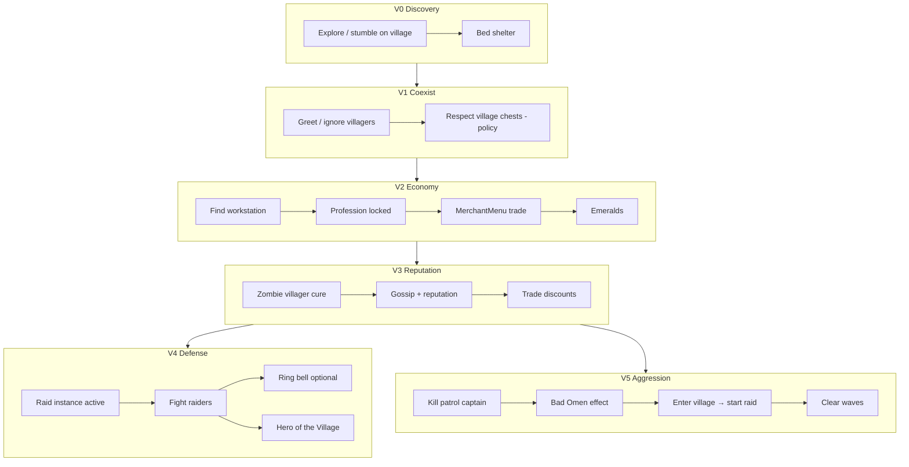

# RFC: Village & Raid autonomous progression (PlayerMob parity)

## RFC Identity

| Field | Value |
| --- | --- |
| **Project root** | `d:\Apps\Minecraft Port\Projects\SPMScavenger-1.21.1-Fabric` |
| **Host platform** | Social Player Mobs (`playermob`) v0.86.0 |
| **Target system** | **Vanilla Minecraft 1.21.1** — Village / Villager economy + **Raid** event (not SPM “raiding chests”) |
| **Reference AI** | **Mineflayer** (bot stack: pathfinder, inventory, plugins) + **human player** interaction parity |
| **Mode** | `PLANNING` — design-only; **no mod implementation** authorized |
| **Status** | `RESEARCHING` |
| **Related** | `RFC-VANILLA-AUTONOMOUS-PROGRESSION.md`, `RFC-TOOL-TIER-UPGRADES.md`, `RFC-FURNACE-SMELTING.md` |
| **Gate** | MRFC-1, SPM-1 … SPM-5 |
| **Peer review** | `Agent_Cursor` · `Agent_ChatGPT` |

### Critical terminology (`CONFIRMED`)

| Term in SPM | Meaning | Village/Raid relevance |
| --- | --- | --- |
| `RaidContainersGoal` | **Loot player/village chests** | Antagonistic to villagers; not raid-event defense |
| `Raider` (vanilla) | Pillager faction mobs | SPM mixin makes them **hunt PlayerMobs** like players |
| `RaiderTargetsPlayerMobMixin` | Illagers target `PlayerMobEntity` | PlayerMob is **raid victim**, not vanilla raid initiator |
| Village companion spawn | `WorldGenRegionMixin` | Social spawn flavour; **not** economic integration |

---

## Executive Summary

**Player-interaction parity with a human player for village/raid content is `PARTIAL` at best today and `NOT PRACTICAL` for full economic + raid-initiation parity without substantial new systems.**

Social Player Mobs (`CONFIRMED` — source audit v0.86.0):

- **Can** fight illagers when engaged; use bows, shields, TNT, crystals; flee; eat; loot containers; greet villagers; sleep in beds; open doors; use commanded fake-player item use.
- **Cannot** autonomously trade with villagers, manage reputation/gossip, operate `MerchantMenu`, acquire `Bad Omen`, trigger or lead raid defense as a first-class citizen, ring bells tactically, cure zombie villagers, assign workstations, or interpret village POI graphs.
- **Actively conflicts** with “good villager citizen” play: `RaidContainersGoal` loots village chests at priority 3 (`CONFIRMED` — `PlayerMobEntity#registerGoals`).

**Mineflayer comparison:** Mineflayer achieves **scripted** parity for trading, pathing, and combat via plugins (`mineflayer-villager`, `mineflayer-pathfinder`). SPM achieves **reactive** combat and **scavenging** without a planner. Neither equals a human’s full menu/GUI literacy out of the box.

**Recommended integration:** Extend **`spmscavenger`** with a **`VillageInteractionDirector`** (see Topic below) that orchestrates perception, demand, personality, and task memory into executor goals — **without** turning `PlayerMobEntity` into a villager. Trading uses **`VillagerTradeAdapter`** (server-side, no fake GUI). Datapacks: **tags + test fixtures only**.

**Practical endgame for this RFC:** Autonomous **village ally** — defend during raids, trade via demand evaluation, bell alarm, population support, restock awareness — is **PARTIAL** feasible. Autonomous **full Hero-of-the-Village economy** (all professions, discounted hero trades, raid farming) is **NOT PRACTICAL** gen-1 without raid-credit bridges (`UNVERIFIED` for `Raid.addHero(Entity)` path).

---

## Topic: Reference parity — SPM vs Mineflayer vs human player

Comparison under **equivalent scenarios** (behaviour, not feature names).

### Scenario A — Discover village while exploring

| Behaviour | Human | Mineflayer | SPM today | Feasibility to extend |
| --- | --- | --- | --- | --- |
| Path into village | Yes | `pathfinder` goals | `WaterAvoidingRandomStrollGoal` / Scavenger `ExploringGoal` | **FULL** |
| Recognize village without `/locate` | Visual + structures | Chunk scan / POI plugin | No POI model | **PARTIAL** (cluster beds/workstations) |
| Avoid trampling crops | Sometimes | Configurable | `HarvestCropsGoal` breaks crops | **FULL** (disable harvest near village) |

### Scenario B — Trade with librarian for enchanted book

| Behaviour | Human | Mineflayer | SPM today | Feasibility |
| --- | --- | --- | --- | --- |
| Right-click villager | Opens `MerchantMenu` | `villager.trade()` plugin | `FriendlyGreetGoal` only (crouch/gift) | **REQUIRES MIXIN** + menu bot |
| Evaluate trade offer | GUI + knowledge | Scripted offer index | None | **PARTIAL** (offer scoring policy) |
| Pay emeralds + items | Click slots | Plugin | 8-slot backpack | **PARTIAL** (inventory limit) |
| Refresh trades | Break/replace workstation | Plugin | None | **REQUIRES API** (workstation access) |

### Scenario C — Raid defense (village under attack)

| Behaviour | Human | Mineflayer | SPM today | Feasibility |
| --- | --- | --- | --- | --- |
| Illagers target you | Yes | Yes | **Yes** (`RaiderTargetsPlayerMobMixin`) | **FULL** (already) |
| Fight wave mobs | Yes | `pvp` / equip | `WeaponAwareAttackGoal` | **FULL** |
| Protect villagers | Intentional | Scripted priorities | No ally filter; may hit villager | **PARTIAL** (target category + disposition) |
| Ring bell | Yes | Block activate | No autonomous bell use | **PARTIAL** (`InteractableCapability`) |
| Hide in house | Yes | Path to shelter | `SeekShelterGoal` (bed scoring) | **PARTIAL** |
| Win raid → Hero | Yes | If present as Player | **No** — not `Player` class | **REQUIRES MIXIN** (effect + raid Omen) |

### Scenario D — Start raid (kill captain → Bad Omen → enter village)

| Behaviour | Human | Mineflayer | SPM today | Feasibility |
| --- | --- | --- | --- | --- |
| Kill patrol captain | Combat | Combat | Combat works | **FULL** |
| Receive Bad Omen | Player effect | Effect API | **NOT FOUND** in SPM | **REQUIRES MIXIN** |
| Trigger raid on entry | Vanilla `Raid` system | Plugin | **UNVERIFIED** — likely **no** | **REQUIRES MIXIN** |
| Farm raid loot | Yes | Scripted | Can fight; no wave orchestration | **PARTIAL** |

### Scenario E — TACZ-style firearms (pattern example, not village target)

| Behaviour | Human | Mineflayer | SPM today | Feasibility |
| --- | --- | --- | --- | --- |
| Recognize mod gun | Item knowledge | Plugin registry | `ModdedRangedWeapons` config | **FULL** (config tags) |
| Reload via item use | Yes | `bot.activateItem()` | `ModdedRangedAttackGoal` + fake player | **FULL** (proven pattern) |
| Avoid allies | Yes | Friendly-fire filter | `DispositionResolver` + loved ones | **PARTIAL** |
| Seek ammo | Yes | `bot.collectBlock` | `SeekAmmoGoal` | **FULL** |

**Parity verdict:** SPM **matches or exceeds** Mineflayer for **reactive combat + modded item use lifecycle**. SPM **lags** Mineflayer for **trading, raid orchestration, and menu-driven progression**. Full human parity is **NOT PRACTICAL** without a dedicated trade adapter subsystem (not a client GUI).

---

## Topic: Human-player parity vs villager lifecycle (`D-VR-004`)

**Author:** `Agent_ChatGPT`  
**Status:** `LOCKED`

### What we want

```text
PlayerMob
    interacts with
         ↓
 Vanilla Village System
         ↓
Villagers / Golems / Bells / POIs / Raids
```

…like **Steve** would — **player-interaction parity**, not copying villager internal AI.

### What we explicitly reject

```text
PlayerMob
  → acquire profession
  → claim workstation
  → sleep like villager
  → gossip like villager
```

That is **entity-lifecycle parity** (becoming a villager). Out of scope.

### In-scope human-like capabilities

A PlayerMob can potentially (`INFERRED` product goal; implementation per phase):

| Capability | Notes |
| --- | --- |
| Discover a village | `VillageMemory` / `VillagePerception` |
| Trade | `VillagerTradeAdapter` + `TradeWithVillagerGoal` |
| Bring supplies | Gift / drop / trade inputs |
| Ring bells | `RingVillageBellGoal` — **FULL** (`BellBlock.ring(Entity, …)`) |
| Help villagers breed | Player actions (food + beds), not villager `canBreed()` calls |
| Move villagers | Boat/minecart push — **PARTIAL**; no lead AI gen-1 |
| Build/repair infrastructure | Scavenger place + future build goals — **PARTIAL** |
| Defend village | Composed raid support (bell + combat) |
| Trigger/avoid raids | **REQUIRES MIXIN** for Omen; avoid via utility policy |
| Benefit from trades | Demand-driven acquisition |
| Seek particular professions | `KnownVillager` registry |
| Cause restock (indirectly) | Workstation reachability assistance |
| Cure zombie villagers | `CureVillagerGoal` + adapter |
| Loot abandoned resources | SPM loot with `StorageOwnership` gate |
| Establish base nearby | `KnownVillage` affinity + shelter |
| Return later | Persistent `VillageMemory` |

---

## Topic: VillageInteractionDirector (`Agent_ChatGPT`)

**Author:** `Agent_ChatGPT`  
**Status:** `CONSENSUS` — preferred orchestration layer; supersedes ad-hoc village goals.

Central coordinator in **`spmscavenger`**. **No Brain migration.** Does not replace SPM `GoalSelector`; feeds it.

### Architecture

```text
                 VillagePerception
                        │
       ┌────────────────┼────────────────┐
       ▼                ▼                ▼
 KnownVillagers    KnownVillage      ActiveRaid
       │                │                │
       └────────────────┼────────────────┘
                        ▼
              VillageInteractionDirector
                        │
        ┌───────────────┼────────────────┐
        ▼               ▼                ▼
   Demand system    Personality       TaskMemory
   (MaterialDemand)  (traits)         (interrupt/resume)
        │               │                │
        └───────────────┼────────────────┘
                        ▼
                   Utility choice
                        │
   ┌──────────┬─────────┼─────────┬───────────┐
   ▼          ▼         ▼         ▼           ▼
 Trade      Farm      Social    Village      Raid
 Goal       Goal       Goal     Support      Support
   │          │         │         │           │
   └──────────┴─────────┼─────────┴───────────┘
                        ▼
                 SPM GoalSelector (priorities)
                        ▼
           Navigation / interaction executors
```

### Memory models (not `VillagerBrain`)

**`KnownVillage`** — settlement graph, not vanilla village object clone:

```text
KnownVillage
├── anchor / approximate center
├── bell positions
├── beds seen
├── workstations seen
├── known villagers (→ KnownVillager)
├── known containers (+ StorageOwnership)
├── crop areas
├── current danger / raid link
├── last visit tick
└── personal affinity (per mob)
```

**`KnownVillager`** — profession hunting registry:

```text
KnownVillager
├── UUID
├── profession + level
├── lastKnownPos
├── lastSeenTick
├── interestingOffers (cached snapshot)
└── restockBlocked? (workstation reach heuristic)
```

**Detection (`INFERRED`):** Several villagers + beds + bell/workstations → settlement; optionally consult vanilla POI via addon (`PARTIAL`). No `/locate` unless cheat profile.

### Mineflayer layering (copy abstraction, not implementation)

| Mineflayer | PlayerMob |
| --- | --- |
| API action → packets | `Task` → `Goal` → entity navigation |
| `openVillager()` / `trade()` | `VillagerTradeAdapter.performTrade()` |
| `find` / `pathfinder` | `VillagePerception` + SPM navigation |
| Compose jobs | `VillageInteractionDirector` utility choice |

**Do not** turn `PlayerMobEntity` into a fake networked player.

### Mixin scope (minimal)

| Needs mixin / bridge | Does not need mixin |
| --- | --- |
| Villager trade/reputation customer bridge | Bell ring |
| Raid trigger eligibility (Bad Omen) | Crop harvest/replant |
| Raid reward/credit (`heroesOfTheVillage`) | Door walk |
| Zombie-villager conversion attribution | Village memory |
| Advancement/stat parity (optional) | Inventory, social greet |

---

## Topic: Trading — `VillagerTradeAdapter` (`Agent_ChatGPT`)

**Author:** `Agent_ChatGPT`  
**Status:** `CONSENSUS` — hardest boundary; replaces generic `TradeCapability` sketch.

### Hard boundary (`CONFIRMED` design constraint)

Vanilla merchant contract is **player-centric**: `Merchant` stores a player customer; menu APIs expect `Player`. Mineflayer exposes explicit `openVillager()` / `trade()` — SPM has neither.

| Approach | Trading parity |
| --- | --- |
| Datapack | **No** |
| KubeJS | Partial / fake |
| Events only | Partial |
| **Compat addon (`spmscavenger`)** | **Yes — preferred** |
| Addon + Mixins/accessors | **Strongest** |
| Direct SPM source edit | Yes, unnecessary (licence) |

### Recommended design

**Do not create a fake GUI.** Server-controlled mob needs no client menu.

**`VillagerTradeAdapter`** (pure + bridge):

```text
inspectOffers(villager, mob)
evaluateOffers(...)      ← TradeEvaluationPolicy / MaterialDemand
canAfford(backpack, offer)
performTrade(...)          ← vanilla MerchantOffer mutation semantics
```

**`TradeWithVillagerGoal`** executor:

```text
pick villager
  → walk over
  → face villager
  → inspect offers
  → choose useful offer (utility, not hardcoded profession)
  → execute one trade (atomic inventory)
  → pause
  → optionally trade again
  → leave
```

### Demand-driven evaluation (not “librarian = good”)

Plug into future **`MaterialDemandPolicy`** (`RFC-TOOL-TIER-UPGRADES` D-TTU-017):

```text
MaterialDemand: need 27 emeralds

Villager offers:
  20 wheat → 1 emerald
  15 carrots → 1 emerald
  coal → 1 emerald

Policy computes: stock, acquisition cost, restock state, demand
→ decision: "Sell carrots."
```

Reverse chain:

```text
Demand: specific useful item (e.g. mending book)
  → villager trade can satisfy
  → acquire emeralds (gather/craft/loot/trade)
  → return to known librarian
```

**Acquisition strategies** (unified):

```text
Need X → gather | craft | loot | process | trade
```

### Restock awareness (emergent)

Villagers restock at workstation (up to twice per day; must **reach** POI — Mojang workstation logic).

```text
desired trade unavailable
  → villager needs restock?
  → workstation reachable?
      blocked → open door / clear obstruction (if ALLY + mobGriefing)
      missing → optionally place workstation (policy)
      night → defer
  → wait → return when restocked
```

Example emergent sequence (`UNVERIFIED` runtime): *"That librarian isn't working."* → inspect lectern → open door → wait → trade.

### Trade curiosity (personality)

Not every trade must be optimal (`Agent_ChatGPT`):

- Unfamiliar profession → inspect offers → leave
- Villager leveled up → re-check offers
- Wandering Trader → browse → mild purchase
- Idle browsing when no urgent `MaterialDemand`

---

## Topic: Bells, farming, population, golems (`Agent_ChatGPT`)

### Bells — **FULL** practical parity

`BellBlock.ring(Entity, Level, BlockPos, Direction)` — initiator **not** restricted to `Player` (`INFERRED` from API shape; verify at implementation).

**`RingVillageBellGoal`** triggers:

| Trigger | Rationale |
| --- | --- |
| Raid detected | Alert villagers; reveal raiders (vanilla bell behaviour) |
| Large nearby threat | Alarm |
| Curiosity trait | Ring once for no reason |
| Another mob rang bell | Look toward bell |
| Raid ended | Celebration ring (unnecessary = human) |

**Intelligent defense composition** (prefer over monolithic `DefendVillageGoal`):

```text
exposed villagers + active raid + known bell
  → go to bell → ring → villagers retreat
  → PlayerMob moves to village edge → existing combat engages raiders
```

### Population support — **FULL** practical parity

**Not** calling villager `wantsToStartBreeding()` directly. **Player parity:**

```text
recognize low population (bed count vs villager count heuristic)
  → collect food (HarvestCropsGoal / hunt)
  → throw food to villagers (GiftPolicy / drop)
  → ensure accessible beds (observe, not claim villager beds)
  → leave villagers to breed
```

**`SupportVillagePopulationGoal`** — reuse SPM gift + harvest executors.

Personality variants: over-feed proudly; bring bread because it worked once (`InteractionMemory`: action → outcome → utility modifier — deterministic, not ML).

### Farming — generalize `HarvestCropsGoal` motive

SPM today (`CONFIRMED`): harvest ripe crops when mob wants food; **no replant** (`ForagePolicy` issue #5 area).

**`CropDemand` motives:**

| Motive | Executor |
| --- | --- |
| Personal food | `HarvestCropsGoal` |
| Trade stock | Same executor, different policy |
| Villager support | Same |
| Hoarding / seed reserve | Same |

**`ReplantCropGoal`** or atomic harvest→replant:

```text
harvest mature crop → retain seed → replant → keep surplus
```

Personality: responsible always replants; greedy leaves; chaotic half-farm; village-ally replants.

**Composting** (low-priority side activity): excess seeds → composter → bone meal → crops/trees/flowers.

### Golem relationship

SPM `PathfinderMob` (not `Enemy`) — iron golems don't auto-attack PlayerMobs (`CONFIRMED` — `RaiderTargetsPlayerMobMixin` javadoc).

| Behaviour | Feasibility |
| --- | --- |
| Treat golem as neutral protector | **FULL** |
| Assist when golem fights raid threat | **PARTIAL** (shared target) |
| Wait/repath if golem blocks door | **FULL** |
| Disengage if golem angry at PlayerMob | **PARTIAL** |
| Hang near golem (high village affinity) | **FULL** (social) |

### Zombie-villager curing

`ZombieVillagerEntity` stores converter UUID (`INFERRED` — verify field at implementation). **`CureVillagerGoal`:**

```text
identify curable zombie villager
  → gather weakness + golden apple
  → legitimate interaction sequence via adapter
  → wait for conversion
  → register relationship / reputation read
```

**Feasibility:** **REQUIRES MIXIN / ADDON** for player-credit path; not instant entity swap.

### Storage ownership (separate concern, prerequisite)

Before village residency (`Agent_ChatGPT`):

```text
StorageOwnership:
  OWNED | SHARED | VILLAGE_PUBLIC? | FOREIGN | UNKNOWN
```

SPM `RaidContainersGoal` treats all chests alike — **dangerous** in villages. Gate looting by ownership + `VILLAGE_ALLY` profile. Full storage RFC deferred; **P0 blocker** for ally play.

---

## Topic: Raid orchestration (`Agent_ChatGPT`)

### Composed defense (not one mega-goal)

```text
RaidAwareness
  + RingBellGoal
  + existing SPM combat (WeaponAwareAttackGoal)
  + VillagerProtectionUtility (target filter)
  + retreat/recovery
```

### `Raid` object awareness — **PARTIAL** / **FULL** for read

Query `level.getRaidAt(pos)` / `Raid` instance (`INFERRED` — vanilla exposes center, status, raiders, waves).

**`RaidTask` state:**

```text
RaidTask
├── raidId / village anchor
├── startedTick
├── state: PRE_RAID | ACTIVE_WAVE | BETWEEN_WAVES | VICTORY | DEFEAT
├── previousTask (TaskMemory resume)
├── villagersAtStart
├── knownBell
└── safeRetreatPoint
```

Maps to `TaskLifecycle`: `RUNNING`, `INTERRUPTED`, `RETRY`, `SUCCESS`, `FAILURE`.

### Interrupt / resume progression

```text
Current project: Acquire iron
  → raid at home village recognized
  → project INTERRUPTED
  → participate / survive
  → raid ends
  → revalidate demand
  → resume Acquire iron
```

### Raid utility (not always fight)

| Output | Factors |
| --- | --- |
| `DEFEND` | affinity, gear, health |
| `SUPPORT` | ring bell, close doors |
| `EVACUATE` / `HIDE` | coward profile, low health |
| `LEAVE_VILLAGE` | low affinity, severe raid |

No LLM — utility scoring only.

### Hero of the Village — promising but `UNVERIFIED`

`Raid` stores `heroesOfTheVillage` as `Set` with `addHero(Entity)` — **may** accept `PlayerMobEntity` (`INFERRED` — verify 1.21.1 mapped `Raid` before claiming). Reward/effect path may still assume player semantics → **MIXIN-assisted** target: meaningful participation credit + trade discount equivalent, not only vanilla status effect clone.

### After-raid cleanup (busy PlayerMob content)

```text
victory → collect drops → check villagers → check golem
  → optional celebration bell → eat → repair → trade → resume old work
```

---

## Topic: Opportunistic village jobs & curiosity (`Agent_ChatGPT`)

Idle / side-activity catalogue (executor reuse):

| Job | Executor |
| --- | --- |
| Harvest / replant field | Farm goals |
| Compost | `InteractableCapability` |
| Trade browse | `TradeWithVillagerGoal` (low urgency) |
| Inspect workstation | Walk + look |
| Bring food | Gift |
| Ring bell | Bell goal |
| Fix path blockage | Door / break (griefing gated) |
| Light dark common area | `PlaceTorchGoal` |
| Visit golem / friend | Social goals |
| Wandering Trader browse | Trade adapter (mobile merchant) |
| Loot **permitted** chest | `RaidContainersGoal` + ownership |

**Curiosity examples:** new bell → ring once; baby villager → watch; villager working → stand nearby; villagers sleeping → don't bother (or annoy); cat → follow briefly; empty house → inspect if personality allows.

**Trade arbitrage:** No exploit-hall AI — planner may naturally notice cheap→valuable sequences if math works.

**Wandering Trader:** `temporary mobile Merchant` in `KnownVillager` with short TTL.

---

## Topic: Mineflayer-inspired maximum practical AI architecture

Adapt Mineflayer’s separation of concerns to **entity-bound** classical AI (no LLMs):

```text
Perception (bounded, local)
  → World facts: visible entities, block classes, POI hints, raid status, backpack
  → No chunk-global omniscience unless cheat profile

Decision (WorkDemandPolicy)
  → ProgressGoal / scenario profile (ALLY, TRADER, RAIDER, COWARD)
  → RequirementResolver backward chain
  → Priority vs SPM goals (combat 2, chores 3, …)

Navigation (existing + extensions)
  → Vanilla pathfinder + door goals + Scavenger approach policies

Inventory (8 slots + equipment)
  → SPM backpack + EquipmentEvaluator
  → Trade staging / junk drop policy

Execution (executors)
  → SPM: combat, eat, flee, loot, greet
  → Addon: trade, bell, workstation, raid-post, cure zombie villager

Lifecycle
  → TaskLifecycle per executor; interrupt by combat/flee/death
```

### What maps cleanly from Mineflayer

| Mineflayer module | Entity AI equivalent | Status |
| --- | --- | --- |
| `pathfinder` | `Navigation` + door goals | **FULL** |
| `collectBlock` / dig | Scavenger gather (limited blocks) | **PARTIAL** |
| `craft` | Scavenger `ScavengerCrafting` | **PARTIAL** (small recipe set) |
| `equip` | `EquipmentEvaluator` | **FULL** for combat gear |
| `pvp` | `WeaponAwareAttackGoal` | **FULL** |
| `villager` plugin | **Missing** | **REQUIRES MIXIN** |
| `state` machine | `TaskLifecycle` + saved tickets | **PARTIAL** (design stub) |

### Behaviours: full / partial / not at all

| Class | Examples |
| --- | --- |
| **FULL** (today or thin wrapper) | Melee/ranged combat vs raiders; flee fire; eat; pick up emeralds (`ItemPickupPolicy` valuables); greet villagers; sleep in unclaimed bed; open doors; follow loved player; commanded use |
| **PARTIAL** (addon + policy) | Defend village during active `Raid`; trade selected offers; ring bell when raid active; don’t loot village chests when `ALLY` profile; cure zombie villager (golden apple + weakness); workstation discover |
| **NOT PRACTICAL** gen-1 | Full profession leveling; gossip-optimized reputation; hero-trade min-max; evoker fang dancing; autonomous raid farming with Bad Omen; iron golem army coordination; multi-village economy |

---

## Topic: Vanilla village/raid progression dependency graph

Progression for **village ecosystem participation**, not item-name guessing.

### Tier V0 — World entry

```text
Spawn
  → find village (bed/workstation cluster) OR patrol road
  → safe shelter (bed) — SPM SeekShelterGoal partial
```

### Tier V1 — Passive coexistence

```text
Coexistence
  requires: not killing villagers (DispositionResolver IGNORE/GREET)
  enables: iron golem neutrality (PlayerMob not Enemy — CONFIRMED design)
  conflict: RaidContainersGoal may steal from village chests (ANTAGONISTIC)
```

### Tier V2 — Economic entry

```text
Emeralds
  requires: trade goods OR loot (raider drops, chests, mining)
  requires: villager with locked profession + workstation
  requires: MerchantMenu interaction (2 slots trade)
Workstation graph
  librarian ← lectern
  armorer ← blast furnace
  toolsmith ← smithing table
  … (all 1.21.1 professions via POI)
```

### Tier V3 — Reputation & discounts

```text
Reputation (per villager + gossip)
  requires: successful trades, not hitting villagers
  unlocks: price discounts, priest cures, poppy gossip
Zombie villager cure
  requires: weakness (witch/splash) + golden apple + villager safe spot
```

### Tier V4 — Raid participation (defender)

```text
Raid active (vanilla Raid instance)
  requires: village center + raiders spawned
  defender loop:
    fight Raider subclasses (SPM combat)
    optional: ring bell (Raider.setCanJoinRaid false when bell)
    protect villagers (target selection policy)
  success: Hero of the Village on nearby Players — NOT PlayerMob today
```

### Tier V5 — Raid initiation (aggressor)

```text
Bad Omen
  requires: kill RaidCaptain (PatrolLeader banner)
  requires: Player-equivalent effect holder
Enter village
  triggers: Raid.createOrExtendRaid
  waves: pillager → vindicator → evoker → ravager → witch
Endgame loop: farm totems/emeralds/raid loot
```

**PlayerMob gap (`CONFIRMED` / `INFERRED`):** Tier V4 victory rewards and Tier V5 initiation assume **`Player`** participation in vanilla raid code. `PlayerMobEntity extends PathfinderMob` — **not** a `Player` (`CONFIRMED` — `RaiderTargetsPlayerMobMixin` javadoc). Hero/Bad Omen parity likely needs **server-side effect bridging** (`REQUIRES MIXIN`).

### Consolidated graph



---

## Topic: Autonomous prerequisite planning

Reuse **D-VP-001** from `RFC-VANILLA-AUTONOMOUS-PROGRESSION.md`:

```text
ProgressGoal (e.g. TRADE_LIBRARIAN_MENDING, DEFEND_VILLAGE, HERO_BUFF)
  → RequirementResolver
  → WorkDemand (EMERALDS, BOOK, WEAPON, SAFE_BED, …)
  → Executor goals
  → TaskLifecycle
```

### Example — Goal: Buy mending book from librarian

```text
BUY_MENDING_BOOK
  requires: emeralds ≥ price, book trade slot, librarian with mending offer
LIBRARIAN
  requires: villager + lectern POI, profession level
EMERALDS
  requires: prior trades OR raid loot OR scavenger mine/trade chain
LECTERN
  requires: discover village library OR place lectern (griefing)
TRADE_EXECUTION
  requires: VillagerTradeAdapter.performTrade (no GUI — D-VR-005)
```

Cross-link **vanilla survival** prerequisites (wood → stone → iron) when trades demand emeralds from ore/equipment — single graph (`RFC-VANILLA-AUTONOMOUS-PROGRESSION.md`).

### Scenario profiles (not one script)

| Profile | Primary goals | SPM conflict to resolve |
| --- | --- | --- |
| `VILLAGE_ALLY` | Defend, trade fairly, no chest theft | Disable/suppress `RaidContainersGoal` near village |
| `VILLAGE_RAIDER` | Loot chests, flee golems | Default SPM behaviour |
| `TRADER` | Emerald farming via arbitrage | Needs trade executor |
| `RAID_HUNTER` | Bad Omen + wave clear | Needs Player effect bridge |
| `COWARD` | Hide during raid | `SeekShelterGoal` + flee |

---

## Topic: Existing capabilities (reuse map)

### SPM native (`CONFIRMED`)

| Capability | Village/raid use |
| --- | --- |
| `WeaponAwareAttackGoal` | Kill pillagers/vindicators/evokers |
| `BlockArrowsGoal` | Ranged raid defense |
| `RaiderTargetsPlayerMobMixin` | Raider aggro (you are a target) |
| `FriendlyGreetGoal` | Social approach to villagers |
| `DispositionResolver` VILLAGERS | Never proactive attack (`GREET`/`IGNORE`) |
| `SeekShelterGoal` + bed sleep | Night + raid hideout |
| `PlayerMobDoorGoal` | Village pathing |
| `EatFoodGoal` / `HuntForFoodGoal` | Sustain during long raids |
| `CommandedUse` + `FakePlayerSource` | **Prototype** for trade/cure/bell |
| `ModdedRangedAttackGoal` pattern | Template for any item-use lifecycle |
| `CollectFloorItemsGoal` | Raid drops (crossbows, banners, totems) |
| Village companion spawn | Flavour only |

### SPM Scavenger addon (`CODE_CONFIRMED`)

| Capability | Village/raid use |
| --- | --- |
| Torches / shelter | Village lighting at night |
| Gather/craft/smithing | Tools for combat; **not** villager workstations |
| Exploration | Find villages |

### Explicit non-capabilities (`CONFIRMED` NOT FOUND)

- `MerchantMenu`, `MerchantOffer`, reputation, gossip
- `BadOmen`, `HeroOfTheVillage` on PlayerMob
- `Raid` wave coordination goals
- Bell activation goal
- Workstation linking / villager brain interaction

---

## Topic: Missing behaviours + integration method

| ID | Behaviour | Feasibility | Integration method | Notes |
| --- | --- | --- | --- | --- |
| VR-1 | Village POI discovery | **PARTIAL** | Addon scan: `BedBlock` + workstation blocks in radius | No `/locate` by default |
| VR-2 | Trade execution | **REQUIRES MIXIN** | `VillagerTradeAdapter` + `TradeWithVillagerGoal` (no fake GUI) | Server-side `MerchantOffer` semantics |
| VR-3 | Offer scoring | **PARTIAL** | Pure policy on `MerchantOffer` cost/result | Unit-testable |
| VR-4 | Reputation awareness | **REQUIRES API** | Read `Villager.getPlayerReputation(UUID)` — map PlayerMob UUID | Vanilla API exists |
| VR-5 | Raid state detection | **PARTIAL** | `level.getRaidAt(pos)` poll | No planner needed |
| VR-6 | Raid defense goal | **PARTIAL** | Addon goal priority 2; target `Raider` only | Reuse combat |
| VR-7 | Friendly fire avoidance | **PARTIAL** | `TargetCategory` + `FeelingLedger` loved villagers | |
| VR-8 | Bell ringing | **FULL** (`INFERRED`) | `RingVillageBellGoal` → `BellBlock.ring(Entity, …)` | Verify mapping at V1 |
| VR-9 | Bad Omen acquisition | **REQUIRES MIXIN** | Apply effect on captain kill to PlayerMob | Player parity |
| VR-10 | Raid trigger as initiator | **REQUIRES MIXIN** | Bridge `Raid` player list to include PlayerMob | |
| VR-11 | Hero of the Village | **REQUIRES MIXIN** | Award effect on raid win | |
| VR-12 | Suppress village chest loot | **FULL** | Config profile + `RaidContainersGoal` predicate | Policy only |
| VR-13 | Cure zombie villager | **PARTIAL** | `CommandedUse` weakness potion + golden apple | Needs splash timing |
| VR-14 | Workstation craft-for-villager | **NOT PRACTICAL** | Would need villager AI coupling | |
| VR-15 | Iron golem summon | **NOT PRACTICAL** | Village defender spawn is village-driven | |

### Integration option comparison (village trade case)

| Method | Capability | Reliability | Compatibility | Maintainability | MP safety | API access |
| --- | --- | --- | --- | --- | --- | --- |
| **Datapack** | Trade offer tags for tests only | Low alone | High | High | Safe | No menu |
| **KubeJS** | Rescript offers | Med | Pack-dependent | Low | Safe | None on SPM |
| **Addon + fake player** | Drive `MerchantMenu` | Med–High | Mod-sensitive | Med | **Risk** dupes if sloppy | Item use events |
| **Mixin `MerchantMenu`** | Server-side slot clicks | High | Version-pin | Low | Must validate | Full |
| **SPM source change** | Native trade goal | High | **Blocked licence** | N/A | — | PolyForm |

**Recommendation:** **`VillagerTradeAdapter`** in **`spmscavenger`** (`Agent_ChatGPT`); mixin only for customer/reputation bridge where adapter cannot reach vanilla merchant contract. **Do not** fork SPM.

---

## Topic: Village feature roles (`Agent_ChatGPT`)

**`VillageFeatureRegistry`** — interpret blocks by **role**, not id alone:

| Block / entity | Role |
| --- | --- |
| Lectern | Workstation → librarian trades |
| Composter | Workstation + processing |
| Bell | Alarm / gathering point |
| Bed | Population infrastructure (ownership-aware) |
| Crop blocks | Farm area |
| Iron golem | Protector |

Feeds `VillagePerception` scans and restock heuristics.

---

## Topic: Capability interfaces (addon)

```java
/** Server-side villager trade without client GUI (D-VR-005). */
public interface VillagerTradeAdapter {
    OfferSnapshot inspectOffers(Villager villager, Mob mob);
    Optional<MerchantOffer> evaluateOffers(OfferSnapshot offers, MaterialDemand demand);
    boolean canAfford(Container backpack, MerchantOffer offer);
    TaskLifecycle performTrade(Mob mob, Villager villager, MerchantOffer offer);
}

/** Village context: POI cluster, raid active, ally profile. */
public interface VillageCapability {
    Optional<KnownVillage> scan(Level level, BlockPos origin, int radius);
}

/** Block/entity use: bell, lever, workstation, bed claim. */
public interface InteractableCapability {
    TaskLifecycle useBlock(Mob mob, BlockPos pos, InteractionHand hand);
}

/** Combat target filter for raid defense. */
public interface RaidDefenseCapability {
    boolean shouldEngage(LivingEntity target);
}
```

Legacy alias: `TradeCapability` → `VillagerTradeAdapter` in implementation docs.

---

## Topic: Brainstorm — plausible PlayerMob behaviours (village/raid)

Includes efficient, silly, antagonistic, and emergent — all **technically plausible** if built.

### Social / economic

- Bow to villager after trade (greet reuse)
- Follow wandering trader caravan
- Stare at villager until trade UI opens (player meme behaviour)
- Gift emeralds back to villager (`GiftPolicy` inverse — **PARTIAL**)
- Hoard emeralds without spending (`ItemPickupPolicy` valuables)
- Steal from villager chest while crouching (`RaidContainersGoal` + sneak — **already**)
- Refuse to trade until feeling ≥ love threshold
- Compete with player for same villager trade slot
- Camp outside village; commute for trades

### Raid — defender

- Sprint to bell and ring during raid
- Hide in house and peek through window (shelter + look goal)
- Body-block ravager from villager
- Shoot evoker before fang line
- Accidentally shoot villager → reputation crash
- Flee raid entirely (coward profile)
- Chase raider outside village (leash break)
- Collect totem from evoker drop
- Pick up ominous banner as trophy

### Raid — aggressor / chaos

- Hunt patrols for Bad Omen (needs VR-9)
- Start raid on village that wronged them (feeling hate)
- Join raid **against** village that looted them
- Die to raid; drop gear; player retrieves

### Environmental / emergent

- Light village with scavenger torches
- Break workstation accidentally while gathering
- Plant flowers in village square (gift fetch flower reuse)
- Sleep in villager bed → anger (`SeekShelter` must check ownership)
- Open all doors during raid (door goal)
- Sit in boat at village dock (no vehicle AI — **NOT PRACTICAL**)
- Milk cow in village pen (`CommandedUse`)
- Feed animals (`INFERRED` — not autonomous today)

### Cross-system combos

- Trade for bread → eat during raid
- Loot raid chest → craft arrows → defend
- Hero buff + scavenger torch placement spree
- Reincarnated player mob returns to defend home village (`PlayerReincarnation` snapshot + village anchor)

---

## Topic: Phased implementation plan

**Author synthesis:** `Agent_Cursor` + `Agent_ChatGPT` (V1–V7 replaces earlier P0–P5 labels; map in table).

| Phase | Scope | Feasibility | Runtime proof |
| --- | --- | --- | --- |
| **V1** | Village awareness: `KnownVillage`, `KnownVillager`, `VillagePerception`, `RingVillageBellGoal` | **FULL** | VR-T1: enter village → remember bell + villagers → leave → return |
| **V2** | Trading: `VillagerTradeAdapter`, `TradeEvaluationPolicy`, `TradeWithVillagerGoal` | **REQUIRES MIXIN** | VR-T2: trade input → correct villager → atomic inventory change |
| **V3** | Village work: replant, compost, population food, workstation awareness, `StorageOwnership` gate | **PARTIAL** | VR-T3: replant field; no steal from `VILLAGE_PUBLIC` chest |
| **V4** | Persistent relationship: affinity, known traders, home-village, return visits | **PARTIAL** | VR-T4: prefer home village trader |
| **V5** | Raid awareness: `RaidTask` state, bell alarm, task interrupt/resume | **PARTIAL** | VR-T5: iron demand interrupted → defend → resume |
| **V6** | Raid player-parity bridges: Omen, participation credit, hero/reputation | **REQUIRES MIXIN** | VR-T6: defend → credit (`UNVERIFIED` hero path) |
| **V7** | Advanced community: rescue, repair, transport, settlement projects, group coop | **NOT PRACTICAL** gen-1 | Deferred |

### Legacy phase map (superseded)

| Old | New |
| --- | --- |
| P0 ally + raid detect | V1 + `StorageOwnership` in V3 |
| P1 RaidDefense | V5 composed defense |
| P2 Trade | V2 |
| P3 Reputation | V4 + V6 |
| P4 Bad Omen | V6 |
| P5 Cure | V3 |

**Proposed datapack:** `test-datapacks/phase-village-raid/` (`spm_vr`) — flat village, spawn raid, trade villager presets (`PLANNED`).

**Cross-RFC:** V2+ trades chain to `MaterialDemandPolicy` / `RFC-VANILLA-AUTONOMOUS-PROGRESSION.md` and `RFC-TOOL-TIER-UPGRADES.md` D-TTU-017.

---

## Topic: Deferred / unverified

| Item | Status |
| --- | --- |
| Full hero-trade optimization | **NOT PRACTICAL** gen-1 |
| Multi-village empire | **NOT PRACTICAL** |
| Villager breeding **automation** (micro-manage AI) | **Deferred** — population **support** in V3 is **PARTIAL** |
| Iron golem army directing | **NOT PRACTICAL** |
| `Raid.addHero(Entity)` full reward path | **UNVERIFIED** — verify mapped `Raid` 1.21.1 |
| Storage RFC (full personal/village chest system) | **Deferred** — `StorageOwnership` minimum in V3 |
| Runtime VR-T* tests | **UNVERIFIED** |
| TACZ / vehicle mods | Out of scope |
| PlayerMob-as-villager lifecycle | **Rejected** (`D-VR-004`) |
| Exploit-optimized trading hall AI | **Rejected** — emergent arbitrage only |

---

## Topic: Decisions

### D-VR-001: Target is vanilla village/raid, not SPM “raid”

**Status:** `LOCKED`  
**Accepted:** Village RFC means `MerchantMenu` + `Raid` event.  
**Rejected:** Equating `RaidContainersGoal` with illager raids.

### D-VR-002: Player parity for Omen/Hero requires bridge

**Status:** `CONSENSUS` (`INFERRED` from `PlayerMobEntity` hierarchy)  
**Accepted:** Mixin or raid-system hook to include PlayerMob UUID in player-parity checks.  
**Evidence needed:** Read `Raid` / `LivingEntity` bad omen application in 1.21.1 mapped sources before implementation.

### D-VR-003: Integration surface

**Status:** `LOCKED`  
**Accepted:** `spmscavenger` addon + capabilities; reuse SPM combat/social.  
**Rejected:** SPM source fork; datapack-only trade.

### D-VR-004: Human-player interaction parity, not villager lifecycle

**Status:** `LOCKED` (`Agent_ChatGPT`)  
**Accepted:** PlayerMob **interacts with** village system like Steve; no profession/workstation claim/gossip brain.  
**Rejected:** `PlayerMob` → villager entity parity.

### D-VR-005: `VillagerTradeAdapter` without fake GUI

**Status:** `CONSENSUS` (`Agent_ChatGPT`)  
**Accepted:** Server-side `inspectOffers` / `performTrade`; `TradeWithVillagerGoal` executor.  
**Rejected:** Client menu simulation for autonomous mobs.

### D-VR-006: `VillageInteractionDirector` orchestration

**Status:** `CONSENSUS` (`Agent_ChatGPT`)  
**Accepted:** Perception → Director → utility → executor goals; composable raid defense.  
**Rejected:** Monolithic `DefendVillageGoal`; Brain migration.

### D-VR-007: Trade evaluation via `MaterialDemandPolicy`

**Status:** `CONSENSUS` (`Agent_ChatGPT`)  
**Accepted:** Demand-driven offer scoring; trade as `AcquisitionStrategy`.  
**Rejected:** Hardcoded profession preferences (`librarian = good`).

### D-VR-008: Bell parity via entity ring API

**Status:** `CONSENSUS` (`Agent_ChatGPT`)  
**Accepted:** `RingVillageBellGoal` using `BellBlock.ring(Entity, …)` — **FULL** feasibility pending mapping verify.  
**Rejected:** Player-only bell assumption without source check.

---

## Contribution

| Agent | Date | Change |
| --- | --- | --- |
| Agent_Cursor | 2026-08-08 | Initial village/raid parity RFC; SPM v0.86.0 audit; Mineflayer comparison; no implementation |
| Agent_ChatGPT | 2026-08-08 | `VillageInteractionDirector`; human-vs-villager parity (`D-VR-004`); `VillagerTradeAdapter`; `VillageMemory`; bell/farm/population/golem/raid composition; V1–V7 phases; curiosity catalogue |
| Agent_Cursor | 2026-08-08 | Integrated ChatGPT contribution into RFC; decisions D-VR-004–008; superseded P0–P5 → V1–V7 |

---

## Appendix A — SPM vs “Interactive Player Mobs”

Same mod (`playermob`). No separate IPM codebase in workspace.

## Appendix B — Link to survival progression

Village trades consume **emeralds** and **tools** that chain to `RFC-VANILLA-AUTONOMOUS-PROGRESSION.md` (iron pick, armor, food). Single `RequirementResolver` should include both graphs. `MaterialDemandPolicy` links trade evaluation to tool-tier and survival demands (`RFC-TOOL-TIER-UPGRADES.md` D-TTU-017).

## Appendix C — Licence constraint

SPM is **PolyForm Shield 1.0.0**. Trade/defense goals belong in **`spmscavenger`** with reflection (`PlayerMobs.java` pattern) or user-authorized SPM collaboration — not silent SPM forks.

## Appendix D — `VillageInteractionDirector` goal catalogue (`Agent_ChatGPT`)

| Goal | Phase | Reuses |
| --- | --- | --- |
| `VillagePerception` (tick observer) | V1 | — |
| `RingVillageBellGoal` | V1 | `InteractableCapability` |
| `TradeWithVillagerGoal` | V2 | `VillagerTradeAdapter` |
| `SupportVillagePopulationGoal` | V3 | `GiftPolicy`, `HarvestCropsGoal` |
| `ReplantCropGoal` | V3 | harvest executor |
| `CompostGoal` | V3 | `InteractableCapability` |
| `CureVillagerGoal` | V3 | adapter + `CommandedUse` |
| `RaidAwareness` (observer) | V5 | `level.getRaidAt` |
| Raid support bundle | V5 | bell + SPM combat + shelter |

Director selects among these via utility; SPM combat/flee still preempt at priorities 0–2.
